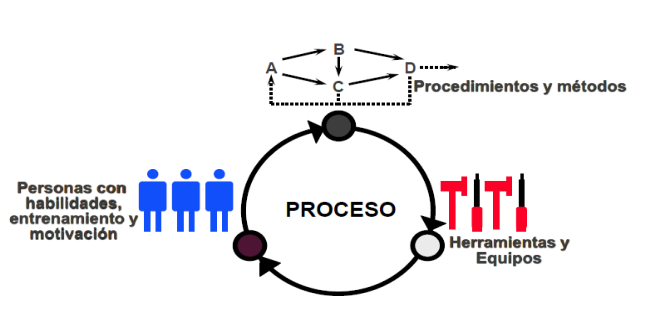
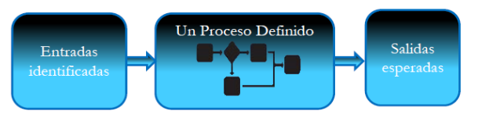
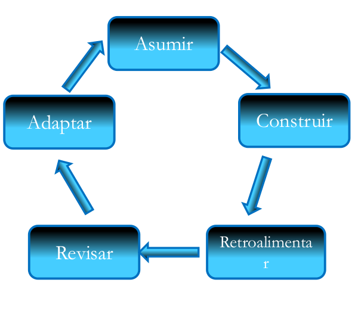

# 04 — Proceso de Software

> Págs. 5-9 del apunte + presentación 00. Cubre el concepto de proceso, las 3 determinantes, la diferencia entre procesos definidos y empíricos, los 3 pilares y el patrón de conocimiento.

## Concepto

> **Proceso** (IEEE): la secuencia de pasos ejecutados para un propósito dado.

> **Proceso de software** (Sw-CMM): un conjunto de **actividades, métodos, prácticas y transformaciones** que la gente utiliza para **desarrollar o mantener software** y sus productos asociados.

> Debe ser **explícitamente modelado** si va a ser administrado.

## Las 3 determinantes del proceso

En un proceso hay **3 factores determinantes**:

| Factor | Qué es | Por qué importa |
|---|---|---|
| **Procedimientos y métodos** | El conjunto de métodos, prácticas, normas o estándares que guían el trabajo. | Definen el "cómo se hacen las cosas". |
| **Personas capacitadas y motivadas** | El factor primordial para obtener calidad. | El software es una actividad humano-intensiva. Sin ellas, no se construye nada. |
| **Herramientas y equipos** | Recursos que soportan el desarrollo (IDE, Jira, servidores, etc.). | Automatizan tareas, aumentan productividad y reducen errores. |

> Las herramientas y los equipos **ayudan a automatizar**, pero no reemplazan a las personas.

---

## Procesos Definidos

> Son considerados **deterministas**: ante la misma entrada se pretende que se obtendrá la misma salida. Asumen que, si se aplican una y otra vez, se obtendrán siempre los mismos resultados, **a pesar de cambiar de equipo**.

### Características

- Están **inspirados en las líneas de producción**.
- La **repetición** y la **previsibilidad** son claves.
- Pueden usar cualquier ciclo de vida.
- Intentan ser **completos**: describen todo lo esperable y los artefactos a obtener en cada etapa (ej. el PUD).
- La administración y control del proceso, en muchos casos, **toman más importancia que el avance del software en sí** (termina siendo más importante la documentación que el avance del proyecto en sí mismo).

---

## Procesos Empíricos

> Se conforman en base a la **experiencia interna y externa** de las personas en un contexto particular. El empirismo = experiencia. Hay que aprender de manera constante de la experiencia del equipo → **generar conocimiento**.

> Como el factor diferencial es la experiencia sensible, en estos procesos se pueden obtener **diferentes resultados** según el contexto en el cual se apliquen.

### Características

- Trabajan bien con **problemas creativos y complejos**.
- Se basan en **ciclos cortos de inspección y adaptación** (retroalimentación).
- Se basan en **ciclos de entrega cortos** para generar retroalimentación.
- La administración y el control es por medio de **inspecciones frecuentes y adaptaciones** para lograr buenas prácticas.
- **No se pueden combinar con cualquier ciclo de vida**. Se suele recomendar el **iterativo-incremental** y se suele **prohibir el secuencial** (porque no es viable después de 2 años).
- **La experiencia no es extrapolable**: lo que aprendí con un equipo en una empresa X no es lo mismo que voy a aprender con otro equipo en una empresa Y.

---

## Los 3 pilares de los procesos empíricos

1. **Transparencia**: comunicación abierta y sin obstáculos. Es la base de la confianza y la colaboración. Transparencia en el proceso **y** en el producto.

2. **Inspección**: los equipos deben identificar las **desviaciones** mediante evaluaciones periódicas. Fomenta la mejora y mantiene la trayectoria hacia el éxito.

3. **Adaptación**: una vez que se inspecciona el producto y los procesos, se **adapta la estrategia** en función de los conocimientos adquiridos. A medida que descubrimos nueva información, corregimos el rumbo.

---

## Patrón de conocimiento en procesos empíricos

> Asumís algo (hipótesis), lo construís, obtenés **feedback** (retroalimentación), hacés una **revisar** (retrospectiva) y **adaptás** (cómo mejoro el proceso).

> Es posible que el gráfico no se entienda al 100%, pero básicamente: **asumir → construir → feedback → revisar → adaptar**, y vuelta a empezar.

---

## Procesos definidos vs. empíricos (resumen)

| Aspecto | Definido | Empírico |
|---|---|---|
| Inspiración | Líneas de producción | Experiencia del equipo |
| Repetibilidad | Misma entrada → misma salida | Resultados variables según contexto |
| Administración | Por documentación y predictibilidad | Por inspección y adaptación |
| Ciclo de vida | Cualquiera | Iterativo-incremental (obligatorio) |
| Cambio de equipo | Mismos resultados | Diferentes resultados |
| Aplicable a | Problemas conocidos y repetibles | Problemas creativos y complejos |
| Ejemplo | PUD, RUP, cascada | Scrum, XP, Kanban |

---

## Chivo para el oral

1. **Concepto**: proceso (IEEE) = secuencia de pasos; proceso de software (Sw-CMM) = actividades, métodos, prácticas, transformaciones.
2. **3 determinantes**: procedimientos, personas, herramientas. Las personas son **lo primordial** (es humano-intensivo).
3. **Definido**: determinista, inspirado en producción, repite resultados. Mismo proceso → mismo resultado. **Mismo proceso aunque cambie el equipo**.
4. **Empírico**: basado en experiencia, **ciclos cortos de inspección y adaptación**. La experiencia **no es extrapolable**.
5. **3 pilares**: transparencia, inspección, adaptación.
6. **Patrón**: Asumir → Construir → Retroalimentar → Revisar → Adaptar.
7. **Cerrá con la diferencia clave**: definido = predecible, repetible; empírico = adaptativo, basado en experiencia.

> **Si te preguntan "¿qué pasa si en un proceso empírico cambia el equipo?"** → la experiencia no es extrapolable, los resultados van a ser diferentes. Hay que volver a iterar inspección + adaptación con el nuevo equipo.
