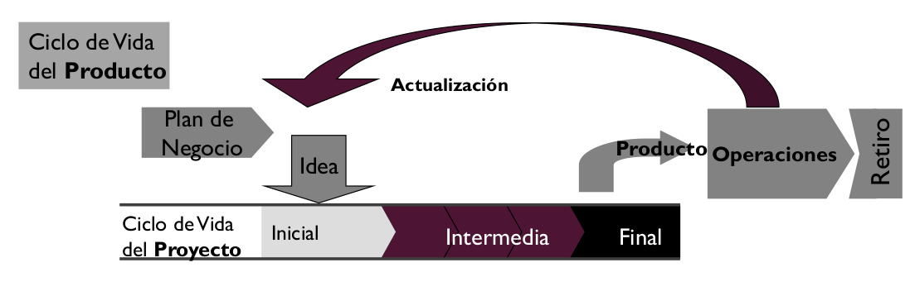
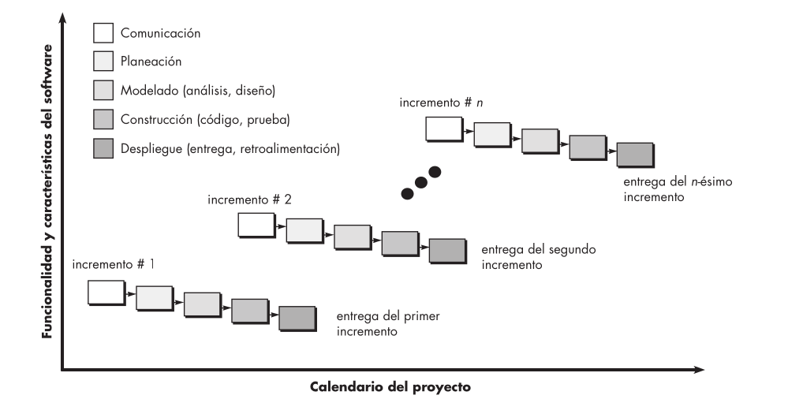

# 05 — Ciclos de Vida

> Págs. 9-15 del apunte + presentación 05. Cubre el concepto de ciclo de vida, la relación entre CV del proyecto y del producto, y los 3 tipos básicos de CV.

## Concepto

> **Ciclo de vida**: una serie de pasos a través de los cuales el producto o proyecto progresa. Los productos y los proyectos tienen su ciclo de vida.

> Un CV de proyecto de software es una **representación de un proceso** — grafica una descripción del proceso desde una perspectiva particular. Los modelos especifican **las fases de proceso** (ej. requerimientos, especificación, diseño) y **el orden en que se llevan a cabo**.

---

## Relación: CV del Proyecto vs. CV del Producto

> El **ciclo de vida del producto** siempre es **mayor** que el ciclo de vida del proyecto. El CV del proyecto dura lo que dura el desarrollo; el CV del producto dura hasta que el software se deja de usar (depende de la madurez en base a las necesidades del mercado).

> Es posible que un producto tenga **varios proyectos** en su CV, por constantes cambios y/o actualizaciones. Dentro del CV del producto se pueden desarrollar varios CV de proyectos.

**Etapas del CV del proyecto**:

- **Inicial** (idea + plan de negocio).
- **Intermedia** (desarrollo, iteraciones, releases).
- **Final** (operaciones, mantenimiento, retiro).

> Nosotros nos enfocamos en los CV del **proyecto** de software.

---

## Las 5 actividades genéricas del proceso (Pressman)

Según Pressman, el proceso de software tiene **5 actividades estructurales genéricas**:

1. **Comunicación**: antes de comenzar el trabajo técnico, comunicarse con el cliente para entender objetivos y reunir requerimientos.
2. **Planeación**: diseñar el plan del proyecto (tareas técnicas, riesgos, recursos, productos).
3. **Modelado**: crear un modelo (simplificación abstracta de la realidad) del producto, donde se visualiza arquitectónicamente y cómo se relacionan sus partes.
4. **Construcción**: generación de código y pruebas que descubren errores.
5. **Despliegue**: el software completo se entrega al consumidor, quien lo evalúa y da retroalimentación.

> El **orden y la relación** entre estas actividades está determinado por la elección del **ciclo de vida**.

---

## Los 3 tipos básicos de Ciclo de Vida

Hay **tres tipos básicos** de CV para un proyecto de desarrollo de software:

### 1. Secuencial (cascada)

> El proyecto progresa a través de una **secuencia ordenada de pasos** (fases). Una actividad no puede iniciar sin que la precedente haya sido finalizada.

- El avance entre fases se da tras una **revisión al final de cada una** (hito = punto de control que marca la finalización de una fase).
- Se usa cuando los **requerimientos se comprenden bien y son exhaustivos** (se congelan al finalizar la toma de requerimientos).
- Está **dirigido por documentos**: el trabajo principal es la documentación entre fases.
- El ejemplo por defecto es el **modelo en cascada**.

**Dificultades**:
- Los proyectos raramente siguen un flujo secuencial.
- Exige requerimientos explícitos desde el principio; no puede lidiar con la incertidumbre.
- El cliente obtiene una versión funcional en **etapas muy avanzadas**.
- Encontrar un defecto implica un **gran rediseño** (está todo hecho).
- **Dependencia entre equipos**: uno no puede empezar hasta que el otro termine.
- El desarrollo dirigido por plan puede generar **burocracia excesiva**.

> **Frase clave**: *"en el modelo secuencial, los errores técnicos se corrigen en pruebas, pero los errores en los requisitos son muy costosos de solucionar"*, porque el modelo no está pensado para cambios una vez que se congelan los requisitos.

### 2. Iterativo / Incremental

> Aplica **sucesivas iteraciones** en forma escalonada a medida que avanza el calendario. Cada iteración produce un **incremento** de software funcional potencialmente entregable.

- **Iteración**: repetición de un conjunto de actividades del proceso (análisis, diseño, codificación, pruebas) para refinar, mejorar o evolucionar el producto.
- **Incremento**: resultado de la iteración; una versión funcional cada vez más completa del software.
- Los primeros incrementos incluyen las **funciones básicas/críticas** que más requiere el cliente.
- Ejemplo: el **PUD** (Proceso Unificado de Desarrollo).

**Ventajas**:
- Se reduce el costo de adaptar requerimientos cambiantes (retrabajo menor, hay feedback por incremento).
- El **cliente es parte del proceso** (no espera al final para opinar).
- La **entrega es más rápida**: el cliente gana valor del software más temprano.

**Desventajas**:
- Se **invisibiliza el proceso** (menos documentación, cuesta que un externo entienda).
- La estructura del software tiende a **degradarse** con muchos incrementos.
- Alto costo de documentar cada incremento.
- Fricción con **organizaciones altamente burocráticas** que necesitan mucha documentación y pasos definidos.

### 3. Recursivo

> Utilizado para **gestionar los riesgos del desarrollo de sistemas complejos a gran escala**. Requiere intervención del cliente.

**Diferencia con iterativo-incremental**:
- El **iterativo-incremental** realiza el producto de a incrementos, **cada uno funcional** (ej. Microsoft Word: motor de texto, barra de tareas, etc.).
- El **recursivo** toma todo el alcance del producto y lo va refinando en cuanto a terminarlo, pero la **versión productiva no llega sino hasta el final**. No hay versiones intermedias; se va refinando el producto.
- Ejemplo: software para un **satélite** (sumamente crítico y complejo, gestión de riesgos clave).

**Desventajas administrativas**:
- Más costoso en tiempo y dinero adaptarlo a diferentes proyectos.
- La tecnología puede quedar obsoleta.
- Carecer de mantenimiento o documentación.
- Se genera versión productiva recién al final.

---

## Administración de proyectos según el CV

> La elección de un CV **afecta directamente a la administración** del proyecto. Cada modelo tiene características y enfoques distintos.

| Situación | CV recomendado |
|---|---|
| Requerimientos claros y exhaustivos, baja incertidumbre, cliente no necesita el producto rápido | **Secuencial** |
| Incertidumbre, volatilidad de requerimientos, posibilidad de entregas parciales, etapas tempranas del producto | **Iterativo-Incremental** |
| Disminuir riesgos en sistemas grandes y complejos | **Recursivo** |

---

## Chivo para el oral

1. **Concepto de CV**: serie de pasos a través de los cuales el producto o proyecto progresa. Es una **representación de un proceso**.
2. **Proyecto vs. producto**: el CV del producto es **mayor** que el del proyecto. Un producto puede tener varios proyectos a lo largo de su vida.
3. **5 actividades genéricas de Pressman**: comunicación, planeación, modelado, construcción, despliegue. El CV decide el orden.
4. **3 tipos de CV**:
   - **Secuencial** (cascada): lineal, dirigido por documentos, requiere congelar requerimientos al inicio. Problema: no maneja cambios.
   - **Iterativo-Incremental**: cada iteración entrega un incremento funcional. Reduce el costo del cambio. Ejemplo: PUD.
   - **Recursivo**: refina todo el producto, no hay versiones intermedias, la versión final llega al final. Para sistemas críticos.
5. **Cuándo usar cada uno**: lo podés unir a la tabla que muestra la cátedra.
6. **Cerrá con la idea**: la elección del CV define cómo se gestiona el proyecto (cada modelo tiene su propia forma de planificar, monitorear y controlar).

> **Si te preguntan "¿cuál es la diferencia entre iterativo y recursivo?"** → el iterativo entrega **incrementos funcionales** en cada iteración (el cliente ve valor temprano); el recursivo **refina todo el producto completo** y la versión productiva llega al final (no hay versiones intermedias). El iterativo es para incertidumbre con entregas parciales; el recursivo es para gestión de riesgo en sistemas grandes.
