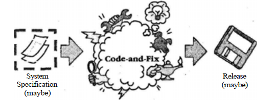
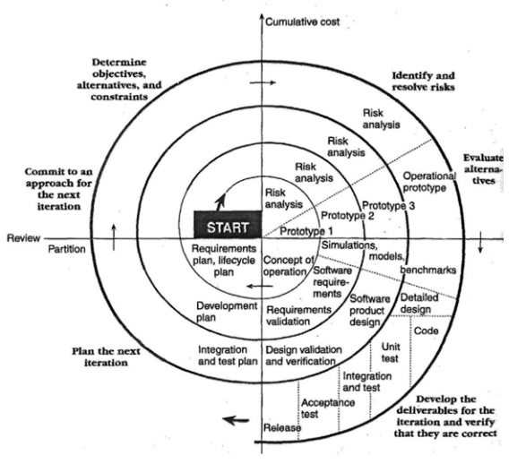
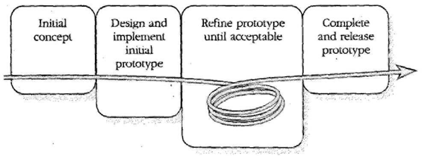

# 06 — Modelos de Proceso (Clásicos)

> Págs. 15-22 del apunte. Cubre los 4 modelos clásicos: Cascada puro, Code-and-Fix, Espiral, y Prototipado Evolutivo.

> Estos modelos han sido cortesía del libro **Pressman** y de **Rapid Development** (McConnell).

> **Nota**: los modelos de proceso serían como **implementaciones particulares** que se realizan a partir de un tipo de ciclo de vida. Es decir, un mismo CV (ej. secuencial) puede tener varios modelos (cascada puro, Sashimi, con subproyectos).

---

## 1. Modelo de Cascada Puro

> El modelo de la cascada, a veces llamado **ciclo de vida clásico**, sugiere un **enfoque sistemático y secuencial** que comienza con la especificación de requerimientos del cliente y avanza a través de planeación, modelado, construcción y despliegue, para concluir con el apoyo del software terminado.

> **En el modelo de cascada sí se puede volver atrás**, no es que esté prohibido; simplemente es **demasiado costoso y complejo**.

> *Ejemplo*: estás diseñando un auto y cuando lo estás construyendo el cliente te dice "cuando el auto hace marcha atrás quiero que las luces se prendan de color rojo". No es que tenemos que esperar a terminar el auto y hacer otro nuevamente; podemos ir para atrás, pero eso involucra una cantidad enorme de retrabajo.

### Variantes del modelo de cascada

#### Cascada con fases solapadas (Sashimi)

> Mientras que el modelo clásico sigue una secuencia estricta donde cada fase debe completarse antes de iniciar la siguiente, el modelo con fases solapadas permite que las fases se inicien **antes de que la fase anterior haya concluido por completo**.

**Desventaja**: al ser solapadas las fases, los **hitos son muy ambiguos**, es complicado trackear el progreso.

#### Cascada con subproyectos

> Uno de los problemas del modelo de cascada puro es que se supone que debes terminar **muy detalladamente el diseño** antes de pasar a la fase de codificación y debuggear.

> **Pregunta clave**: ¿por qué retrasar la implementación de áreas que son fáciles de diseñar solo porque estamos esperando al diseño de áreas difíciles?

> Se **divide el sistema en subsistemas lógicamente independientes**, de manera que cada uno puede diseñarse e implementarse a la vez.

> **Riesgo principal**: las **interdependencias no previstas** entre los subsistemas.

---

## 2. Code-and-Fix

> Este modelo es **comúnmente utilizado pero rara vez útil**. Es un modelo **informal**: se empieza con una idea general de lo que se quiere hacer (se pueden tener especificación como no), luego se va directo a un **diseño informal**, código, debug y testing.

### Ventajas

- **No cuenta con gastos iniciales**: no se gasta tiempo y plata en planificación, documentación, aseguramiento de calidad, etc. Permite saltar directo al código, generando **signos de avance inmediatos**.
- **Se requiere muy poco expertiz**: cualquiera que sepa hacer un simple programa ya está familiarizado con este modelo.

> **Es evidente que utilizar este modelo resulta peligroso**: no hay medida de progreso o calidad, identificación de riesgos, etc. Solamente se codea hasta que se termina.

---

## 3. Modelo en Espiral

> Si el modelo code-and-fix era la **simplicidad en su máxima expresión**, el espiral es la otra punta (**complejidad**).

> El modelo en espiral es un **modelo orientado al riesgo** que divide el proyecto en una serie de **miniproyectos**. Cada miniproyecto se ocupa de uno o más **riesgos importantes**.

### Concepto de riesgo

> El riesgo es algo muy amplio. Puede referirse a:

- **Requerimientos pobremente entendidos**.
- **Arquitectura pobremente entendida**.
- **Errores de rendimientos**.
- **Tecnología que no entendemos**.

### Iteración: 6 pasos

Sobre cada miniproyecto se producen iteraciones que consisten en **6 pasos**:

1. **Determinar objetivos, alternativas y restricciones**.
2. **Identificar y resolver riesgos**.
3. **Evaluar las alternativas**.
4. **Desarrollar entregables para cada iteración y verificar si son correctos**.
5. **Planear la próxima iteración** (testing, desarrollo, etc.).
6. **Comprometerse con un enfoque para la próxima iteración**.

### Características

- **Las iteraciones tempranas son las más baratas**. A medida que el modelo avanza, el costo aumenta pero el riesgo disminuye.
- Una vez que **todos los riesgos importantes han sido solucionados**, el modelo en espiral termina como si fuera un modelo en cascada.

> **La única desventaja**: que es **complicado**.

---

## 4. Prototipado Evolutivo

> El prototipado evolutivo es un modelo de CV en el que **se desarrolla el concepto del sistema a medida que se avanza en el proyecto**.

> Normalmente se empieza desarrollando los **aspectos más visibles** del sistema. Esto se presenta al cliente y luego se continúa desarrollando el prototipo en base al **feedback del cliente**.

> Va a llegar un momento en el que el cliente diga *"bueno, esto es suficiente"* y recién ahí podemos empezar a desarrollar el **producto final**.

### Cuándo es útil

- Los **requerimientos cambian rápido** y el cliente es reacio a comprometerse a una serie de requerimientos.

### Desventaja

- Es **imposible conocer al principio** cuánto tiempo va a tardar en crearse el producto.

---

## Comparación rápida

| Modelo | Cuándo usarlo | Riesgo principal |
|---|---|---|
| **Cascada puro** | Requerimientos claros, no se esperan cambios. | Costos enormes al volver atrás. |
| **Cascada con Sashimi** | Quiere acortar tiempos pero mantener estructura secuencial. | Hitos ambiguos, difícil trackear progreso. |
| **Cascada con subproyectos** | Sistema con subsistemas independientes. | Interdependencias no previstas. |
| **Code-and-Fix** | Proyectos chicos o experimentales, sin clientes serios. | Sin planificación, sin calidad, sin medida de progreso. |
| **Espiral** | Sistemas complejos con riesgos altos. | Complejidad del modelo. |
| **Prototipado evolutivo** | Requerimientos volátiles, cliente reacio a comprometerse. | Imposible estimar tiempos. |

---

## Chivo para el oral

1. **Contexto**: los modelos son implementaciones particulares de un CV. **Cortesía de Pressman y McConnell**.
2. **Cascada puro**: secuencial, sistemático. Sí se puede volver atrás pero es carísimo. Las variantes son Sashimi (fases solapadas, hitos ambiguos) y subproyectos (subsistemas independientes, riesgo de interdependencias).
3. **Code-and-Fix**: **comúnmente usado pero rara vez útil**. Sin gastos iniciales ni expertiz, pero **sin planificación, sin calidad, sin medida de progreso**. Peligroso.
4. **Espiral**: **orientado al riesgo**. Miniproyectos que atacan riesgos. **6 pasos por iteración**. Las iteraciones tempranas son las más baratas. Termina en cascada cuando se acaban los riesgos.
5. **Prototipado evolutivo**: se desarrolla el concepto mientras se avanza. Cliente da feedback hasta que dice "suficiente". Útil cuando los requerimientos cambian rápido.
6. **Cerrá con la idea**: cada modelo resuelve un problema distinto. No hay "el mejor modelo": depende del contexto (claridad de requerimientos, riesgo, complejidad, cultura).

> **Si te preguntan "¿cuándo usar el espiral?"** → cuando el sistema es complejo y los riesgos son altos (ej. software de satélite). El espiral te permite **atacar los riesgos más críticos en las primeras iteraciones**, que son las más baratas.
