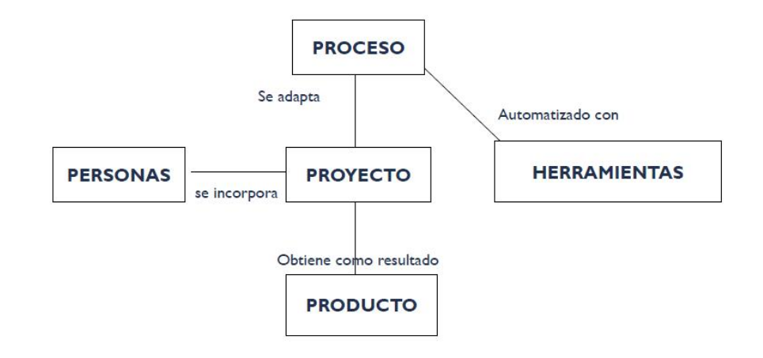

# 07 — Vínculo Proceso-Proyecto-Producto

> Págs. 23-25 del apunte + presentación 05. Cubre cómo se relacionan los 3 elementos centrales en la gestión de un proyecto de software.

## El vínculo

> Se dice que el **proceso**, automatizado con **herramientas**, se **adapta** al **proyecto**, al cual se incorporan **personas**, y de este se obtiene como resultado un **producto**.

### Lectura del gráfico

- **PROCESO** (plantilla abstracta) → se **adapta** → **PROYECTO** (instancia concreta).
- **PERSONAS** → se **incorporan** → **PROYECTO**.
- **PROYECTO** → obtiene como resultado → **PRODUCTO**.
- **PROCESO** → automatizado con → **HERRAMIENTAS**.

---

## Los 3 elementos y su rol

### Proceso

> Su definición ya está en [04-proceso-de-software.md](04-proceso-de-software.md). Acá agregamos: **el proceso es una plantilla**, una **descripción abstracta** que se **materializa al definir un proyecto**.

- Es la **guía** que se adapta al contexto.
- No es una prescripción rígida; es un enfoque adaptable.

### Proyecto

> Esfuerzo temporal que requiere del acuerdo de un conjunto de especialidades y recursos para la obtención de un determinado resultado.

- Es una **unidad organizativa** para adaptar el marco teórico del proceso, dependiendo de las personas y recursos con los que se cuente.
- Define el proceso y tareas que se van a realizar, el personal, y los mecanismos para valorar riesgos, controlar el cambio y evaluar la calidad.

> **Diferencia principal producto vs. proyecto**: el proyecto es **temporal** (empieza y termina); el producto **sobrevive al proyecto**.

### Producto

> Es lo que se crea gracias al proyecto.

- Es la **evidencia concreta** del trabajo.
- Persiste más allá del proyecto (puede mantenerse durante años, recibir actualizaciones, etc.).

### Personas

> Los principales autores de un proyecto de software son los **arquitectos, desarrolladores, ingenieros de prueba** y el **personal de gestión**.

> Sin personas no se puede construir ningún producto (el software es humano-intensivo).

### Herramientas

> Software que se utiliza para **automatizar** las actividades definidas en el proceso.

| Tipo | Herramientas |
|---|---|
| **Control de versiones** | GitHub, GitLab, Bitbucket. |
| **Gestión del proyecto** | Jira, Asana, Trello. |
| **Gestión de pruebas** | Selenium (pruebas automáticas web), JUnit, pytest. |
| **CI/CD** | Jenkins, GitHub Actions, GitLab CI. |
| **Calidad de código** | SonarQube, ESLint. |

> **SaaS** = Software as a Service. **SaaP** = Software as a Product.

---

## Diferencia proceso vs. proyecto vs. producto

| Concepto | ¿Qué es? | ¿Cuánto dura? |
|---|---|---|
| **Proceso** | Plantilla abstracta que guía el trabajo. | Es **estable**; se redefine cuando hay mejora de proceso. |
| **Proyecto** | Instancia del proceso con personas, recursos y alcance definidos. | **Temporal**: empieza y termina. |
| **Producto** | El resultado del proyecto. | **Persiste** más allá del proyecto (puede tener varios proyectos). |

---

## Chivo para el oral

1. **Vínculo fundamental**: el **proceso** se adapta al **proyecto**, se le incorporan **personas**, se automatiza con **herramientas**, y se obtiene un **producto**.
2. **Proceso = plantilla**; **proyecto = instancia**; **producto = resultado**.
3. **Diferencia clave**: el proyecto es temporal, el producto sobrevive al proyecto. Un producto puede tener varios proyectos a lo largo de su vida.
4. **Personas**: arquitectos, developers, testers, gestión. Sin personas no hay software.
5. **Herramientas**: dan soporte a la automatización del proceso (Git, Jira, Selenium, etc.).
6. **Cerrá con la idea**: el proceso es la guía, el proyecto es la ejecución, el producto es el resultado. Las personas y las herramientas son los recursos que materializan la guía.

> **Si te preguntan "¿qué es lo que se adapta al proyecto?"** → el **proceso**. Es la plantilla que se contextualiza según el proyecto concreto (personas, recursos, alcance, riesgos).
