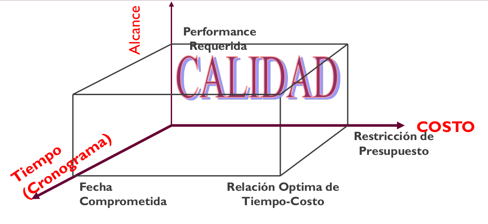

# 09 — Administración de Proyectos

> Págs. 24-29 del apunte + presentación 05. Cubre la administración de proyectos, la triple restricción, el rol del líder, el equipo, los stakeholders y las causas típicas de fracaso.

## Concepto

> **Administración de Proyectos** es la **aplicación de conocimientos, habilidades, herramientas y técnicas** a las actividades del proyecto para satisfacer los requerimientos del proyecto.

> Es una parte fundamental para que el proyecto sea **exitoso**: tener el trabajo hecho **en tiempo, con el presupuesto acordado y con los requerimientos satisfechos**.

> *"Planning is everything. Plans are nothing."* — Field Marshal Helmuth Graf von Moltke.

### Una buena gestión no garantiza el éxito

> Una buena gestión **no puede garantizar el éxito** del proyecto (pero sí el **fracaso** si el proyecto no es administrado).

> Un proyecto planificado también puede fracasar. Lo importante es que **planificaste**, no el resultado en sí. Importa que te sentaste y pensaste en objetivos, riesgos, alcances, estimaciones, etc.

### ¿Qué incluye?

- Identificar los requerimientos.
- Establecer objetivos claros y alcanzables.
- Adaptar las especificaciones, planes y el enfoque a los diferentes intereses de los involucrados (stakeholders).

---

## La Triple Restricción (The Triple Constraint)

> Los **objetivos**, el **tiempo** y el **costo** son las tres restricciones que se balancean en un proyecto. El balance de estos tres factores afecta directamente a la **calidad** del proyecto.

> *"Proyectos de alta calidad entregan el producto requerido, el servicio o resultado, satisfaciendo los objetivos en el tiempo estipulado y con el presupuesto planificado."*

| Restricción | Pregunta que responde |
|---|---|
| **Objetivos / Alcance** | ¿Qué está tratando de alcanzar el proyecto? |
| **Tiempo** | ¿Cuánto tiempo debería llevar completarlo? |
| **Costo** | ¿Cuánto debería costar? |
| **+ Calidad** | Resultado del balance de las 3 anteriores. |

> Es responsabilidad del **líder del proyecto** balancear estos tres objetivos, que a menudo **compiten entre ellos**.

> Si achicás el tiempo, normalmente sube el costo (más gente) o se reduce el alcance. Si achicás el costo, normalmente se estira el tiempo o se reduce el alcance. **No podés mover los 3 a la vez**.

---

## Roles en la administración

### Líder del proyecto (tradicional)

> En un enfoque tradicional, el líder de proyecto **define el alcance del producto** en primera instancia, y luego **ejerce la toma de decisiones en su totalidad** sin la inclusión de la opinión del equipo.

- El líder **asigna las tareas** que deben realizar los integrantes del equipo.
- Maneja todas las relaciones con los stakeholders del proyecto (clientes, gerencias, contratistas).
- Realiza **estimaciones, planificaciones y seguimiento**.
- Se encarga de la **identificación de riesgos** y la generación de reportes.
- Debe tener un **plan de proyecto** (mapa que guía durante todo el proyecto).

> En ágil, este rol se transforma: ya no es un jefe que asigna, sino un facilitador (Scrum Master) que remueve impedimentos.

### Equipo de proyecto

> Un equipo de proyecto es un **grupo de personas comprometidas** en alcanzar un conjunto de objetivos de los cuales se sienten **mutuamente responsables**.

- Informa cuando ya está terminado, cuánto se demoró, el porcentaje de avance.
- Si hay desviación respecto a los planes, informa al líder para que tome las correcciones.

**Características**:
- Diversos conocimientos y habilidades.
- Posibilidad de trabajar juntos efectivamente / desarrollar **sinergia**.
- Usualmente un grupo **pequeño**.
- Sentido de responsabilidad como una **unidad**.

### Stakeholders

> Son los **interesados** del proyecto. Incluye el equipo de proyecto, el equipo de dirección, el líder del proyecto y el **patrocinador** (sponsor).

---

## 3 factores top para el éxito de un proyecto

1. **Monitoreo y feedback**.
2. Tener una **misión/objetivo claro**.
3. **Comunicación**.

---

## Causas típicas de FRACASO en proyectos

> El CHAOS Report de Standish también lista las causas más comunes por las que los proyectos fallan:

- **Fallas al definir el problema**.
- **Planificar basado en datos insuficientes**.
- La planificación la hizo el **grupo de planificaciones** (sin el equipo que va a ejecutar).
- **No hay seguimiento del plan de proyecto**.
- **Plan de proyecto pobre en detalles**.
- **Planificación de recursos inadecuada**.
- Las **estimaciones se basaron en "supuestos"** sin consultar datos históricos.
- **Nadie estaba a cargo**.

---

## Chivo para el oral

1. **Concepto**: aplicación de conocimientos, habilidades, herramientas y técnicas para satisfacer requerimientos.
2. **Frase de Moltke**: *"Planning is everything. Plans are nothing."* Sirve para mostrar que planificar no es rigidity, sino preparación.
3. **Triple restricción**: objetivos, tiempo, costo. La **calidad** es el resultado de balancearlos. **El líder es responsable del balance**.
4. **Roles**: líder (asigna, planifica, controla), equipo (comprometido, responsable), stakeholders (interesados).
5. **3 factores de éxito**: monitoreo, objetivo claro, comunicación.
6. **Causas de fracaso**: enumerá 2-3 (falta de seguimiento, plan pobre, nadie a cargo). Conectá con Standish: los problemas son recurrentes (involucramiento del usuario, requerimientos incompletos).
7. **Cerrá con la idea**: una buena gestión **no garantiza éxito** pero **sí evita muchos fracasos**.

> **Si te preguntan "¿qué pasa si achico el tiempo?"** → normalmente sube el costo (más gente) o se reduce el alcance. La triple restricción es interdependiente: mover una variable **siempre** afecta a las otras.
