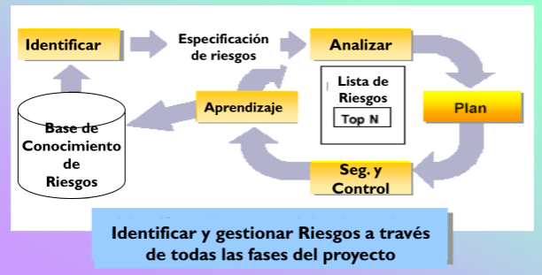

# 12 — Gestión de Riesgos

> Págs. 31-33 del apunte + presentación 05. Cubre el concepto de riesgo, las 2 variables (probabilidad e impacto), exposición, las 4 actividades y ejemplos típicos.

## Concepto

> **Riesgo**: un **problema esperando para poder suceder** y que podría **comprometer el éxito del proyecto**.

> También: un **evento que podría comprometer el éxito del proyecto**.

> En la gestión de riesgos, lo que tratamos de hacer es **bajar el número** que tienen estas 2 variables (probabilidad e impacto).

---

## Las 2 variables del riesgo

### 1. Probabilidad de ocurrencia

> ¿Qué tan probable es que el riesgo ocurra?

### 2. Impacto del riesgo

> ¿Qué le sucede a mi proyecto si este riesgo ocurre?

### Exposición al riesgo

> Entre estas 2 variables (que en esencia son números) se las **multiplica** y se obtiene un valor que se conoce como **exposición al riesgo**.

```
Exposición al riesgo = Probabilidad × Impacto
```

> La exposición **prioriza** los riesgos: a partir de la lista, se selecciona el que tenga **mayor exposición** y se gestiona primero.

---

## Estrategias para gestionar un riesgo

Una vez priorizado, se aplican **2 estrategias** (que se pueden combinar):

- **Mitigar**: evitar que el riesgo suceda. Reducir la probabilidad.
- **Elaborar un plan de contingencia**: acciones que vamos a tomar para **disminuir su impacto** si se materializa.

---

## Las 4 actividades de la gestión de riesgos



> El proceso de gestión de riesgos es **continuo** a lo largo de todas las fases del proyecto.

### 1. Identificación de riesgos

> Se identifican los riesgos que suponen una mayor **amenaza** al proceso de ingeniería de software, al software a desarrollar o a la organización que lo desarrolla (al recibir los requerimientos).

### 2. Análisis de riesgos

> Para cada riesgo identificado se realiza un juicio acerca de la **probabilidad** y del **impacto**. No existe una forma certera de realizar esto.

- Se utilizan **intervalos de probabilidad** y **clasificaciones de gravedad**.
- El criterio dependerá de la **experiencia** de quien realice el análisis.

### 3. Planeación del riesgo

> Para cada riesgo analizado, se definen **estrategias para manejarlos**.

- Acciones para **minimizar o evitar el impacto** sobre el proyecto.
- **Planes de contingencia** que definen cómo enfrentar la situación controversial.

### 4. Monitorización del riesgo y control

> Proceso que permite determinar que las **suposiciones** acerca de los riesgos de producto, proceso y organización **no han cambiado**.

- Permite **revaluar** el riesgo en términos de posibles variaciones de probabilidad e impacto.
- Se aplica en **todas las etapas del proyecto**.

### (Extra) Aprendizaje

> La gestión de riesgos genera una **base de conocimiento de riesgos** que se reutiliza en futuros proyectos. Los riesgos identificados y cómo se gestionaron son insumo para próximos proyectos.

---

## Ejemplos típicos de riesgos en un proyecto de software

- **Fallo en el script de despliegue** (corroborar CI/CD).
- **Alguna API puede fallar**.
- Requerimientos pobremente entendidos.
- Arquitectura pobremente entendida.
- Errores de rendimientos.
- Tecnología que no se entiende.
- Cambios en el equipo clave.
- Subestimación del alcance.
- Cambios Regulatorios/Legales.

---

## Ejemplo de cálculo de exposición

Supongamos 3 riesgos identificados:

| Riesgo | Probabilidad | Impacto | Exposición |
|---|---|---|---|
| A. Falla la API de pagos | 0,6 (alta) | 0,9 (alto) | **0,54** |
| B. Cambio de requerimiento clave | 0,4 (media) | 0,7 (alto) | **0,28** |
| C. Renuncia de un dev senior | 0,2 (baja) | 0,8 (alto) | **0,16** |

> **Orden de atención**: A → B → C.

---

## Chivo para el oral

1. **Concepto**: problema esperando para suceder. Tiene **probabilidad** e **impacto**.
2. **Exposición al riesgo = Probabilidad × Impacto**. Sirve para **priorizar**.
3. **2 estrategias**: **mitigar** (bajar probabilidad) y **plan de contingencia** (bajar impacto si ocurre).
4. **4 actividades**:
   - **Identificar** (listar los riesgos).
   - **Analizar** (probabilidad e impacto).
   - **Planear** (estrategias y planes de contingencia).
   - **Monitorizar y controlar** (a lo largo de todo el proyecto, revaluar).
5. **Ejemplo típico**: fallo en script de despliegue, API que falla, requerimiento mal entendido.
6. **Cerrá con la idea**: la gestión de riesgos **se hace durante todo el proyecto**, no solo al inicio. Las suposiciones pueden cambiar.

> **Si te preguntan "¿qué es la exposición al riesgo?"** → es el **producto entre la probabilidad de que ocurra y el impacto** que tendría. Es el número que usamos para **priorizar** qué riesgo atender primero.
