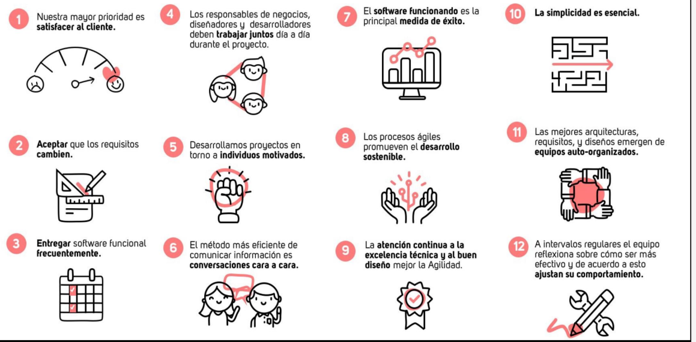
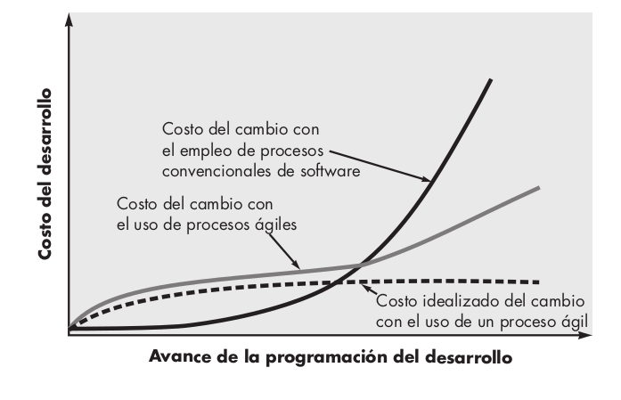

# 01 — Manifiesto y Filosofía Ágil

> Págs. 36-42 del apunte. Cubre el contexto histórico, la reunión de Snowbird, los 4 valores, los 12 principios, las características del agilismo y el costo del cambio.

## Contexto (años 90)

- El desarrollo de software estaba dominado por **métodos pesados** (*heavyweight*), como **CMMI, RUP o el modelo en cascada**.
- Estos métodos requerían **planificación exhaustiva** al inicio, **documentación muy detallada** y **fases secuenciales**, lo que dificulta adaptarse a los cambios.
- Los proyectos **fallaban con frecuencia** por ser muy largos y poco flexibles.

## La reunión de Snowbird (2001)

- **17 expertos** en desarrollo de software se reunieron en **febrero de 2001** en **Snowbird, Utah** (EE.UU.).
- Entre ellos: **Kent Beck** (creador de XP), **Martin Fowler**, **Robert C. Martin** (Uncle Bob), **Jeff Sutherland** (co-creador de Scrum), entre otros.
- Buscaban una alternativa a las metodologías tradicionales: algo **más ligero, flexible y centrado en las personas**.

## El resultado: el Manifiesto Ágil

> De esa reunión nació el *"Manifiesto por el Desarrollo Ágil de Software"*, que definió **4 valores** y **12 principios** que guían el desarrollo ágil.

> Es un **compromiso útil entre nada de proceso y demasiado de proceso**.

El Manifiesto se sustenta en los **procesos empíricos** (basados en la experiencia, saliendo del propio equipo) y por eso es importante tener **ciclos de realimentación cortos**: **empezamos con algo, lo construimos, lo mostramos, obtenemos feedback y mejoramos**.

### Los 4 valores

| # | Valor | Significado |
|---|---|---|
| 1 | **Individuos e interacciones** sobre procesos y herramientas. | Es preferible un equipo motivado con comunicación fluida y herramientas pobres, que un equipo desmotivado con las mejores herramientas. El software es humano-intensivo. |
| 2 | **Software funcionando** sobre documentación exhaustiva. | Priorizar el software asegura versiones estables e incrementales. Solo se documenta lo que **agrega valor** y está centrado en el cliente. No plantea "no documentar", sino documentar **cuándo sea necesario**. |
| 3 | **Colaboración con el cliente** sobre negociación contractual. | El cliente debe estar comprometido con cada entrega, especialmente al probarla y dar feedback. Las negociaciones contractuales a veces imponen restricciones que distancian al equipo. |
| 4 | **Respuesta ante el cambio** sobre seguir un plan. | En entornos inestables con cambios rápidos, la capacidad de respuesta es más valiosa que el seguimiento de planes preestablecidos. |

### Los 12 principios

1. **Satisfacer al cliente** con releases tempranos y frecuentes.
2. **Aceptar** que los requisitos cambien, incluso en etapas finales.
3. Entregar software funcional **frecuentemente** (semanas, no meses).
4. **Técnicos y no técnicos** trabajando juntos día a día.
5. Construir proyectos en torno a **individuos motivados**.
6. La forma más eficiente de comunicar es la **conversación cara a cara**.
7. **Software funcionando** es la principal medida de progreso.
8. Los procesos ágiles promueven el **desarrollo sostenible** (ritmo constante).
9. **Atención continua** a la excelencia técnica y al buen diseño.
10. La **simplicidad** es esencial.
11. Las mejores arquitecturas, diseños y requisitos emergen de **equipos autoorganizados**.
12. **Regularmente**, el equipo reflexiona sobre cómo ser más efectivo y ajusta su comportamiento.

> **Nota**: el principio 4 habla de **técnicos y no técnicos** trabajando juntos.

---

## Agilismo: Concepto

> El agilismo **no es una metodología ni un proceso**; es una **ideología** con un conjunto definido de **principios** que guían el desarrollo del producto.

- **Objetivo primordial**: entregar software de forma frecuente en un entorno cambiante.
- Usado en entornos con **gran variabilidad de requerimientos**, involucrando al cliente para conseguir una **rápida retroalimentación**.
- Adopta el **ciclo de vida iterativo-incremental**, donde el software se desarrolla como una serie de **incrementos**, cada uno con una nueva funcionalidad.

### Perspectivas de autores clave

- **Martin Fowler**: define al enfoque ágil como un **compromiso entre nada de proceso y demasiado proceso**.
- **Jacobson**: la **ubicuidad del cambio** es el motor principal de la agilidad. Los ingenieros de software deben ir rápido para adaptarse.

### Características de los métodos ágiles

- **Adaptables** en lugar de predictivos.
- **Orientados a la gente** en lugar de orientados al proceso.

---

## Costo del cambio: la clave del agilismo

> En el agilismo hay un **aplanamiento en la curva de costo del cambio**, lo que permite hacer cambios en fases tardías sin un efecto notable en el costo y el tiempo.

- Con procesos **convencionales** (cascada), el costo del cambio **crece exponencialmente** a medida que avanza el proyecto.
- Con procesos **ágiles**, el costo del cambio se mantiene **casi constante** (la curva se aplana).
- **Razón**: el software se entrega a incrementos, y el cambio se **controla mejor**.

---

## Ejemplos de frameworks ágiles

- **FDD** (*Feature-Driven Development*).
- **Crystal**.
- **XP** (*Extreme Programming*).
- **Scrum**.
- **ATDD** (*Acceptance Test Driven Development*).

## Valores de los equipos ágiles

- **Planificación continua, multi-nivel**.
- Equipos **facultados, autoorganizados y completos**.
- **Entregas frecuentes, iterativas y priorizadas**.
- **Prácticas de ingeniería disciplinadas**.
- **Integración continua**.
- **Testing concurrente**.

---

## Chivo para el oral

1. **Contexto**: en los 90 dominaban las metodologías pesadas (cascada, RUP, CMMI). Eran lentas y poco flexibles. **Reunión de Snowbird 2001** → 17 expertos → Manifiesto Ágil.
2. **4 valores**: personas > procesos, software funcionando > docs, cliente > contrato, cambio > plan. (El ">" no significa "ignorar lo de la derecha", significa "valorar más lo de la izquierda").
3. **12 principios**: memorizá los más preguntados: cara a cara (#6), software funcionando es medida de progreso (#7), autoorganizados (#11), simple (#10), sostenible (#8).
4. **Concepto**: el agilismo **no es metodología** (es ideología/filosofía). Martin Fowler: "compromiso entre nada de proceso y demasiado proceso".
5. **Característica clave**: adaptable (no predictivo), orientado a la gente.
6. **Costo del cambio**: la curva **se aplana** en ágil. Esa es la diferencia más importante con lo tradicional.
7. **Cerrá con la idea**: ágil se sustenta en **procesos empíricos** (experiencia del equipo) + **ciclos cortos de feedback**.

> **Si te preguntan "¿cuál es la diferencia entre ágil y cascada?"** → ágil se adapta al cambio con costo casi constante; cascada congela requisitos al inicio y el costo del cambio crece exponencialmente.
