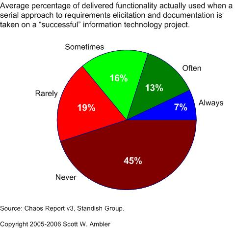
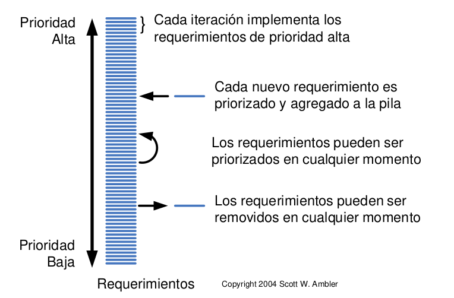
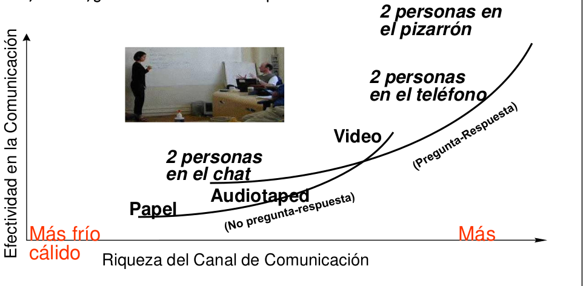
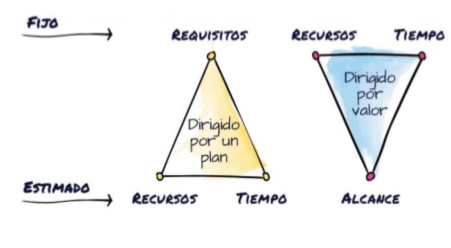

# 02 — Requerimientos Ágiles

> Págs. 41-48 del apunte. Cubre los tipos de requerimientos, el dominio del problema vs. la solución, Just In Time, la gestión ágil de requerimientos, el triángulo de hierro y la comunicación.

## Características de los requerimientos ágiles

- **Usan el valor para construir el producto correcto**. Como ingenieros en sistemas somos **profesionales de soporte**: ayudamos a otras profesiones a obtener valor del sistema.
  - El **valor** se asocia con la **utilidad, beneficio o satisfacción** que se le ofrece a los usuarios finales, por cada funcionalidad completa que se entrega. *(Pablo Lischinsky)*
- **Usan historias y modelos** para mostrar qué construir. Es importante ir construyendo en conjunto con el cliente, los stakeholders tienen una mirada interesante.
- **Técnicos y no técnicos trabajando juntos**.
- Determinar **qué es lo suficiente** → los requerimientos se van descubriendo de a poco. De acá la importancia del **MVP**.

---

## ¿Por qué cambiar del enfoque tradicional?

> **BRUF** = *Big Requirements Up front*. Cebarte desde el principio con muchos requerimientos. Esto es típico de modelos como cascada:

- Requisitos completos al inicio (todos los requisitos del sistema completamente definidos y documentados al inicio).
- Documentación exhaustiva (gran cantidad de documentación antes de escribir una sola línea de código).

> Es un error que le pasa hasta los productos exitosos: definen 800 mil requerimientos, pero solo un **7%** se usa siempre. Alrededor del **80%** no se utiliza nunca.

---

## Tipos de Requerimientos

> La clasificación de los requerimientos es fundamental para entender el **nivel de abstracción** y el **impacto** que tienen en el proyecto.

| Tipo | Definición | Ejemplo |
|---|---|---|
| **De negocio** | Expresan los **objetivos de alto nivel**, razones o metas estratégicas por las cuales se desarrolla el sistema. Responden al **¿por qué?**. | Disminuir un X% de tiempo invertido en procesos manuales de atención al cliente. |
| **De usuario** | Describen las **tareas que el usuario necesita realizar** o los problemas que debe resolver utilizando el sistema. Responden al **¿qué hace el usuario?**. | Realizar consultas en línea del estado de cuenta de los clientes. |
| **Funcional** | Definen las **funciones específicas, servicios o comportamientos** que el sistema debe proporcionar. Responden al **¿qué hace el sistema?**. | Generar reporte de saldos de cuenta. Recibir notificaciones por email. |
| **No funcional** | Especifican **restricciones, propiedades o atributos de calidad** del sistema (rendimiento, seguridad, usabilidad). Responden al **¿cómo debe comportarse el sistema?**. | Formato del reporte PDF. Cumplir con niveles de seguridad para credenciales según ley bancaria. |
| **De implementación** | Son **restricciones técnicas** sobre el entorno, plataforma o herramientas que se deben utilizar para el desarrollo o despliegue. | Servidores en la nube. |

### Análisis de los niveles (la pirámide de valor)

Para comprender la relación entre ellos, podemos verlos como una **jerarquía de valor**:

- **Requerimientos de Negocio**: son la **justificación económica y estratégica**. Sin ellos, el proyecto carece de propósito.
- **Requerimientos de Usuario**: **traducen las necesidades del negocio en acciones concretas** que el usuario ejecutará. Son el **puente entre la estrategia y la funcionalidad**.
- **Requerimientos Funcionales**: son la **especificación técnica de las acciones del usuario**. Es el **contrato** de lo que el sistema debe ser capaz de procesar.
- **Requerimientos No Funcionales**: definen la **"calidad"** del sistema. Un sistema puede tener todas las funciones, pero si es lento o inseguro, falla en sus requerimientos no funcionales.

> **Regla de oro**: el requerimiento de **negocio** otorga el **valor**, el de **usuario** describe la **experiencia** necesaria para obtener ese valor, y los **funcionales** y **no funcionales** definen la **capacidad técnica** del sistema para materializarlo.

---

## Dominio del problema vs. Dominio de la solución

| Dominio | Qué abarca | Requerimientos |
|---|---|---|
| **Problema** | El contexto en el cual surge la necesidad del software. Lo que el negocio y los usuarios necesitan. | De negocio y de usuario. |
| **Solución** | Decisiones sobre cómo se implementará el software para cumplir los requerimientos del problema. | Del software. |

> **¿Dónde estamos nosotros?**
> - Las **user stories** son esencialmente **requerimientos de usuario**, alineados a un requerimiento de negocio.
> - Las user stories **no sirven** para especificar requerimientos de software; eso lo hacemos con **casos de uso**.

---

## Just In Time (JIT)

> En el contexto de los requerimientos ágiles, **Just In Time (JIT)** se refiere a la práctica de **definir y detallar los requerimientos justo en el momento en que se necesitan** para su implementación.

- En lugar de capturar todos los detalles al inicio, se proporcionan detalles adicionales **a medida que el equipo se aproxima a la fase de implementación**.
- Al detallar los requerimientos solo cuando es necesario, se **evita el desperdicio** de tiempo y esfuerzo en especificar características que podrían cambiar o eliminarse.

---

## Gestión ágil de requerimientos

Principalmente se hace a través del **Product Backlog**.

> Listado **dinámico y priorizado** de todas las funcionalidades, características, mejoras, correcciones y demás elementos que el producto final debería tener para cumplir con las expectativas del cliente o usuario.

- El **Product Owner** es el encargado de crear y mantener el Product Backlog. Es quien representa los intereses del negocio.
- Cada ítem del Product Backlog se denomina **Product Backlog Item (PBI)**.
- En ágil, **el cliente** es el encargado de la priorización → lleva a construir el producto deseado.
- Compensa la falta de documentos de requerimientos formales escritos y detallados.

### Principios ágiles relacionados

1. Satisfacer al cliente (entregando software funcionando) a través de releases tempranos y frecuentes.
2. Recibir cambios de requerimientos, aún en etapas finales.
3. Técnicos y no técnicos trabajando juntos todo el proyecto.
4. El medio de comunicación por excelencia es el **cara a cara**.
5. Las mejores arquitecturas, diseños y requerimientos emergen de equipos autoorganizados.

---

## Momento y contenedor de los requerimientos

| Aspecto | Tradicional | Ágil |
|---|---|---|
| **Momento de captura** | Al inicio del proyecto. | **Continuamente** durante todo el proyecto. |
| **Contenedor** | ERS (Especificación de Requerimientos) persistente. | **Product Backlog** (transitorio). |

> En ágil, una vez implementados los requerimientos, se "persisten" en el **producto funcionando**. El detalle de valor queda en los **casos de prueba**.

---

## Comunicación: cara a cara es lo más efectivo

> *Lo cara a cara es lo más efectivo que se puede hacer, establecemos una conexión más cálida con la persona.*

La comunicación cara a cara es la **más cálida y efectiva**. A medida que agregamos tecnología, se vuelve más fría y menos efectiva.

---

## Triángulo de hierro: tradicional vs. ágil

### Tradicional: fijos los requisitos

- Fijos: **requisitos**.
- Estimados: **recursos** y **tiempo**.
- El proyecto está **dirigido por un plan**.

### Ágil: fijos tiempo y recursos

- Fijos: **recursos** y **tiempo** (Scrum lo llama sprint, dura como máximo un mes).
- Variable: el **alcance** → ¿cuánto puedo construir con este equipo y este tiempo?
- El proyecto está **dirigido por valor**.

---

## Tradicional vs. Ágil (resumen)

| Aspecto | Tradicional | Ágil |
|---|---|---|
| **Prioridad** | Cumplir el plan. | Entregar valor. |
| **Enfoque** | Ejecución (¿cómo?). | Estrategia (¿por qué y para qué?). |
| **Definición de req.** | Detallados y cerrados (al inicio). | Esbozados y evolutivos (descubrimiento progresivo). |
| **Equipo** | Jerarquía marcada, líder con roles bien definidos. | Multidisciplinario y autoorganizado. |
| **Herramientas** | Entrevistas, observación, formularios. | Principalmente prototipado. |
| **Documentación** | Alto nivel de detalle (matriz de rastreabilidad). | Historias de usuario, mapeo de historias. |
| **Producto** | Definidos en alcance. | Identificados progresivamente. |
| **Proceso** | Estable, adverso al cambio. | Incertidumbre, abierto al cambio. |

---

## Chivo para el oral

1. **Características de los requerimientos ágiles**: valor, historias/modelos, técnicos y no técnicos juntos, "lo suficiente" (MVP).
2. **BRUF**: lo que queremos evitar. **7% de features se usan siempre** (Chaos Report).
3. **Tipos de requerimientos**: negocio, usuario, funcional, no funcional, implementación. Cada uno responde a una pregunta distinta (¿por qué?, ¿qué hace el usuario?, ¿qué hace el sistema?, ¿cómo se comporta?, ¿con qué se implementa?).
4. **Dominio del problema vs. solución**: el problema tiene req. de negocio y usuario; la solución tiene req. de software. Las user stories son de **usuario**.
5. **Just In Time**: detallar los requerimientos **cuando se necesitan**, no al inicio. Evita desperdicio.
6. **Product Backlog**: contenedor dinámico y priorizado. **El PO prioriza**, no el equipo.
7. **Cara a cara**: la comunicación más efectiva. Es la base del agilismo.
8. **Triángulo de hierro**: tradicional = fijos requisitos; ágil = fijos tiempo y recursos, variable el alcance.
9. **Cerrá con la idea**: ágil entiende los requerimientos como **un descubrimiento progresivo**, no como una especificación upfront.

> **Si te preguntan "¿qué es BRUF?"** → *Big Requirements Up Front*: tratar de especificar todos los requerimientos al inicio. Es el anti-patrón del agilismo.
