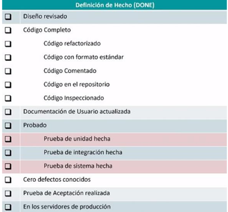

# 04 — User Stories: Calidad y Estado

> Págs. 54-58 del apunte. Cubre el modelo INVEST, Definition of Ready, Definition of Done, Spikes y Épicas.

## Modelo INVEST

> El **modelo INVEST** es un acrónimo utilizado en el contexto de las **historias de usuario** para guiar la creación y evaluación de **historias bien formadas y efectivas** dentro de metodologías ágiles.

| Letra | Característica | Significado |
|---|---|---|
| **I** | **Independent** (Independiente) | Una historia debe ser independiente de las otras. Las dependencias complican la planificación, priorización y estimación. |
| **N** | **Negotiable** (Negociable) | Debe ser flexible y negociable, no una especificación rígida. Sirve como punto de partida entre el PO y el equipo. |
| **V** | **Valuable** (Valiosa) | Cada historia debe **agregar valor** al usuario o al negocio. Si no tiene valor claro, no debería ser priorizada. |
| **E** | **Estimable** (Estimable) | Debe ser lo suficientemente clara y pequeña para que el equipo pueda **estimar el esfuerzo**. Si es muy grande o vaga, no se puede estimar. |
| **S** | **Small** (Pequeña) | Debe caber en un solo sprint o ciclo iterativo breve. |
| **T** | **Testable** (Testeable) | Debe poder ser probada para verificar si se cumplió correctamente. |

### Ejemplo de una historia que NO cumple INVEST

> *"Como usuario, quiero que la aplicación sea fácil de usar para que tenga una buena experiencia"*.

- **No es Valuable** en términos concretos (¿qué es "fácil"?).
- **No es Estimable** (no hay criterios).
- **No es Testable** (¿cómo se prueba "fácil"?).
- **No es Small** (es muy abstracta).

---

## Definition of Ready (DoR)

> Es una **medida de calidad** que determina si la User Story está **en condiciones de entrar a una iteración** de desarrollo.

- Para que la US pueda ser implementada, **mínimamente debe satisfacer el modelo INVEST**.
- Entre el equipo y el PO pueden definir **características o condiciones extras** al INVEST para considerar una US como lista para entrar a la iteración.

> **Ubicación en Scrum**: la DoR vive en el momento en que una historia pasa del **Product Backlog** al **Sprint Backlog**.

---

## Definition of Done (DoD)

> Define si la historia está **decentemente terminada** para poder presentarla al PO al final de la iteración, para que decida si pasa a producción o no.

- Es una **checklist** de ítems que la historia debe cumplir.

### Ejemplo de checklist de DoD

Una DoD típica incluye:

- Diseño revisado.
- Código completo (refactorizado, con formato estándar, comentado, en el repositorio, inspeccionado).
- Documentación de usuario actualizada.
- **Pruebas**: unidad, integración, sistema.
- Cero defectos conocidos.
- Prueba de aceptación realizada.
- En los servidores de producción.

> **Ubicación en Scrum**: la DoD se valida en la **Sprint Review**, cuando se presenta el incremento. Si un ítem no cumple la DoD, no puede liberarse ni presentarse en la review; vuelve al Product Backlog.

### Diferencia clave

| Definición | Cuándo se valida |
|---|---|
| **DoR** (Ready) | Antes de empezar a trabajar la historia. |
| **DoD** (Done) | Al terminar de trabajar la historia. |

---

## Spikes

> Son un **tipo especial de US** que se producen por la **incertidumbre** que la misma presenta, la cual imposibilita que pueda ser estimada y por lo tanto **no cumple con la definición de listo**.

- Una vez resuelta la incertidumbre, la Spike se **convierte en una o más US**.
- Es una característica más del producto a la cual el equipo le tiene que dedicar tiempo.

### Clasificación

- **Spike técnica**: utilizada para evaluar diferentes enfoques técnicos y tecnológicos en el dominio de la solución. Depende de los técnicos (nosotros).
  - *Ejemplo*: evaluar una nueva tecnología, una librería, o el rendimiento de un patrón arquitectónico.
- **Spike funcional**: utilizada cuando hay incertidumbre respecto de cómo el usuario interactúa con el sistema. Mejor evaluada con prototipos para obtener feedback. Depende del PO.

### Usos típicos

- Inversión básica para familiarizar al equipo con una nueva tecnología o dominio.
- Analizar el comportamiento de una historia compleja para dividirla en piezas manejables.
- Ganar confianza frente a riesgos tecnológicos (investigando o prototipando).
- Frente a riesgos funcionales, donde no está claro cómo el sistema debe resolver la interacción.

### Lineamientos

- **Estimables, demostrables y aceptables**.
- **La excepción, no la regla**: toda historia tiene incertidumbre; los spikes se reservan para **incógnitas críticas y grandes**.
- **Utilizar como última opción**.
- **En general, se recomienda implementar la spike en una iteración separada** de las historias resultantes.

---

## Épicas

> Una **Épica** es un **conjunto grande de funcionalidades o historias de usuario** que están relacionadas entre sí y que, en conjunto, **aportan un valor significativo** al producto.

- Es una **historia de usuario grande** que necesita descomponerse en varias historias más pequeñas para poder ser estimada e implementada.
- Se mantienen en el Product Backlog hasta que están listas para descomponerse.

---

## Chivo para el oral

1. **INVEST**: Independent, Negotiable, Valuable, Estimable, Small, Testable. Es la checklist de calidad de una user story.
2. **DoR**: la historia está **lista para empezar**. Mínimo debe cumplir INVEST.
3. **DoD**: la historia está **terminada**. Checklist completa (código, tests, deploy).
4. **Diferencia DoR vs DoD**: una es al **empezar** (¿podemos trabajarla?), la otra al **terminar** (¿está terminada?).
5. **Spikes**: historias de **investigación** para reducir incertidumbre. Son la excepción, no la regla. Técnicas (los devs) o funcionales (el PO).
6. **Épicas**: historias grandes que se descomponen en muchas pequeñas. Viven en el Product Backlog hasta que es momento de dividirlas.
7. **Cerrá con la idea**: INVEST es la calidad de la historia; DoR y DoD son las puertas de entrada y salida del sprint.

> **Si te preguntan "¿qué pasa si un ítem no cumple la DoD?"** → no se puede liberar, no se puede presentar en la Sprint Review, y vuelve al Product Backlog para iteraciones futuras.
