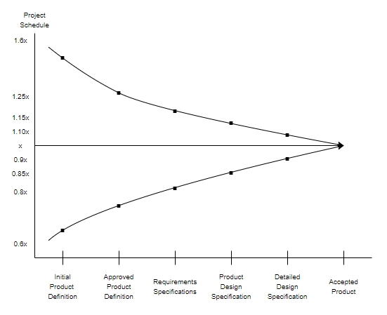
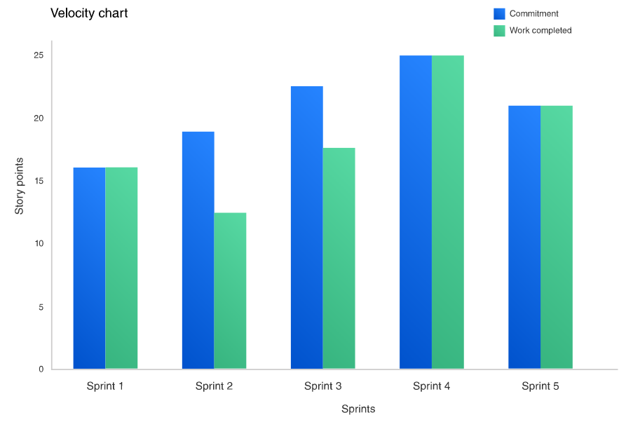

# 05 — Estimaciones de Software

> Págs. 59-75 del apunte. Cubre el cono de incertidumbre, los métodos tradicionales de estimación, Story Points, Planning Poker y Velocidad.

## Concepto

> **Estimar** es básicamente un **proceso probabilístico**, que consiste en predecir el valor que va a asumir algún aspecto del proyecto (trabajo, esfuerzo, tiempo, etc.) que será necesario realizar, evidentemente con un **cierto grado de incertidumbre**.

### Consideraciones importantes

- Por definición, una **estimación no es precisa**.
- Estimar **no es planear**, así como planear no es estimar.
- Las estimaciones son la base de los planes, pero los **planes pueden diferir de las estimaciones**.
- A mayor diferencia entre lo estimado y lo planeado, **mayor riesgo**.
- Las estimaciones **no son compromisos**.

---

## El cono de la incertidumbre

> El cono de la incertidumbre es una forma gráfica de expresar que, a medida que un proyecto avanza, **la precisión de nuestras estimaciones aumenta**.

- Al arrancar, la variabilidad de las estimaciones siempre será alta.
- Aún invirtiendo mucho esfuerzo en estimar, la precisión inicial es baja.
- A medida que avanzamos y obtenemos más información (ej. aprendiendo en cada Sprint), acotamos la variabilidad.

### Datos clave

- Al comienzo de un proyecto, la estimación típicamente varía entre un **60% y un 160%**.
- Un proyecto estimado en 20 semanas puede tardar entre **12 y 32 semanas**.
- **De cualquier forma → es mejor estimar que no estimar**.

---

## ¿De dónde vienen los errores de estimación?

- **Actividades omitidas**: solemos estimar solo el tiempo de **programación** (30-35% del total) y no otras actividades.
  - Requerimientos faltantes.
  - Actividades de desarrollo faltantes (docs técnicas, revisiones, datos para testing, mantenimiento).
  - Actividades generales (días de enfermedad, licencias, cursos, reuniones).
- **El proceso mismo de estimación** tiene un sesgo.
- **No tenemos claro el proceso a utilizar**: un nivel de madurez CMMI bajo = estimaciones poco confiables.
- **Falta información**: estimamos asumiendo cosas que no sabemos.

---

## Métodos tradicionales de estimación

### Basados en la experiencia

- **Datos históricos**: recolectar datos de otros proyectos para ir generando una base de conocimiento transferible a la organización. La precisión mejora, pero **va en contra de lo que dice el agilismo** (la experiencia no es extrapolable).
- **Juicio experto (puro)**: un experto estudia las especificaciones y hace su estimación. Es el enfoque más usado en la práctica (~75% de las organizaciones).
  - Estructura recomendada: tareas de granularidad aceptable, fórmula de optimista-pesimista-habitual `(O + 4H + P) / 6`, checklist definido.
- **Juicio experto (Delphi)**: similar al puro, pero en grupo. Iterativo, anónimo. "4 ojos ven más que 2".
- **Analogía**: ajustar datos históricos a un proyecto nuevo. Se seleccionan los proyectos similares de la base (mismo backend, misma cantidad de devs, etc.).

### Otros métodos tradicionales

- Basados **exclusivamente en recursos**.
- Basados **exclusivamente en el mercado**.
- Basados en los **componentes del producto o en el proceso de desarrollo**.
- **Métodos algorítmicos** (ej. COCOMO).

---

## Estimaciones en ambientes ágiles

### No Estimate

> En ágil, el **No Estimate** propone **no estimar en absoluto**, sino basarse en datos históricos del equipo.

- Usa los **datos del pasado** (cuánto tardó el equipo en anteriores sprints).
- No es absoluto: hay un mínimo de story points que dan una idea de la velocidad.

### Tamaño vs. Esfuerzo

- **Tamaño**: qué tan grande es la historia en términos de **complejidad, incertidumbre y repetición** (escala de Fibonacci).
- **Esfuerzo**: horas lineales reales necesarias. **Depende de la persona** que lo realiza.

> Las **estimaciones en ágil son relativas**, no absolutas.

---

## Story Points

> **Story Point** es una **unidad de estimación** que especifica la **complejidad, esfuerzo e incertidumbre** propio del equipo respecto a una user story, en **términos relativos** respecto a otra user story.

- Es una unidad **abstracta** que mide el "peso" de cada story.
- La complejidad de una feature/story **tiende a incrementarse exponencialmente** (de ahí la escala de Fibonacci).

### Las 3 dimensiones

| Dimensión | Qué considera |
|---|---|
| **Complejidad** | Qué tan compleja es implementar la US. Cantidad de partes y relaciones. |
| **Esfuerzo** | Horas lineales requeridas. **Depende de la persona** que va a trabajar. |
| **Incertidumbre** | Cuánta información nos falta. Grado de entendimiento de la user. |

---

## Velocidad

> La **velocidad** es una **métrica** del progreso de un equipo. Mide cuánto trabajo se completa en un sprint.

- Es una de las métricas más importantes del agilismo.
- Recuerda: uno de los principios ágiles dice que la mejor métrica de progreso es que el producto esté **funcionando**.

### Reglas

- Para entrar en el cálculo, la historia debe cumplir la **DoD** y ser **aceptada por el PO**.
- Se cuentan los story points de las US **completas**, no parcialmente completas.
- **No se estima, se calcula al final del sprint**.

### ¿Por qué es importante la velocidad?

- Corrige los **errores de estimación**.
- Permite ver si se logra el **desarrollo sostenible** (velocidad constante a lo largo de los sprints).

### Cálculo de la duración de un proyecto

1. Estimar como equipo **todos** los story points del proyecto.
2. Calcular la métrica de **velocidad** del equipo (de sprints anteriores).
3. **Sumar todos los story points** y dividir por la velocidad para obtener el número de sprints.

> *Ejemplo*: proyecto de 120 story points, velocidad 30 sp/sprint → 120 / 30 = **4 sprints**.

4. Multiplicar la cantidad de sprints por la duración de cada uno.

> *Ejemplo*: 4 sprints × 1 mes = **4 meses**.

---

## Planning Poker (Poker Estimation)

> Técnica de estimación en ambientes ágiles publicada por **Mike Cohn**. Resulta de la conjunción de **juicio experto, analogía y desagregación**, basado en que *"4 ojos ven más que 2"*.

- **El equipo estima su propio trabajo**. En esto se diferencia del juicio experto tradicional.
- El Product Owner participa en la planificación (puede ser moderador), pero **no realiza estimaciones**.

### Prerrequisitos

- Lista de features/stories a estimar.
- Cada estimador tiene un mazo de cartas.

### Escalas posibles

- Tamaño por números: 1 a 10.
- Talles de remeras: S, L, M.
- Serie 2n: 1, 2, 4, 8, 16.
- **Fibonacci: 0, 1, 1, 2, 3, 5, 8, 13, 21** (la más usada, refleja el crecimiento exponencial).

### Pasos

1. **Determinar la base story** (la canónica) que será usada para comparar. Suele ser una US de story point 1, baja complejidad.
   - **Nunca elegir transacciones como canónicas**; suelen ser registros de entidades de negocio muy pequeñas.
2. **Se lee la story a todo el equipo**.
3. Los estimadores **discuten** la story, haciendo preguntas al PO cuando lo necesiten.
4. Cada estimador selecciona una **carta** y la pone **boca abajo** en la mesa.
5. Cuando todos pusieron, las cartas se exponen **al mismo tiempo**.
6. Si todos coinciden → ese es el estimado. Si no, los estimadores discuten (especialmente los más altos y los más bajos). Volver al paso 3.
7. Repetir hasta converger. Luego pasar a la siguiente story.

### Decodificar las estimaciones (Fibonacci)

| Valor | Significado |
|---|---|
| 0 | Muy probable que no tengas idea del producto o funcionalidad. |
| 1 / 2 / 1 | Funcionalidad pequeña (usualmente cosmética). |
| 2-3 | Funcionalidad **pequeña a mediana**. **Es lo que queremos**. |
| 5 | Funcionalidad **media**. Es lo que queremos. |
| 8 | Funcionalidad grande. Se puede hacer, pero preguntarse si se puede dividir. |
| 13 | ¿Alguien puede explicar por qué no lo podemos dividir? |
| 20 | ¿Cuál es la razón de negocio para semejante story? Y más fuerte aún, ¿por qué no se puede dividir? |
| 40 | No hay forma de hacer esto en un sprint. |
| 100 | Hay algo que está muy mal. Mejor ni arranquemos. |

> **Regla empírica**: las historias de **2, 3 y 5 puntos** son las ideales.

---

## Chivo para el oral

1. **Concepto**: estimar es predecir con incertidumbre. No es un compromiso, no es planificar.
2. **Cono de la incertidumbre**: al inicio ±60% de variabilidad, se va acotando con el tiempo. **Mejor estimar que no estimar**.
3. **Errores típicos**: omitir actividades no-code (30-35% del total son código, el resto es otra cosa), falta de información.
4. **Tradicional**: juicio experto (puro o Delphi), analogía, datos históricos.
5. **Story Points**: unidad relativa que combina **complejidad + esfuerzo + incertidumbre**. Escala de **Fibonacci**.
6. **Planning Poker**: técnica de Mike Cohn. Equipo estima, cartas boca abajo, discusión si hay desacuerdos.
7. **Velocidad**: **se calcula** (no se estima). Story points completados por sprint. Permite calcular la duración del proyecto.
8. **Cerrá con la idea**: en ágil se estima en **relativo** (entre historias) y se mide en **absoluto** (velocidad real).

> **Si te preguntan "¿por qué Fibonacci?"** → porque la **complejidad crece exponencialmente**, no linealmente. La escala de Fibonacci (1, 2, 3, 5, 8, 13...) refleja eso: entre 2 y 5 hay mucho más salto proporcional que entre 1 y 2.
