# 06 — Producto, Lean Startup y MVP

> Págs. 76-86 del apunte + págs. 85-91 del resumen de Alex + presentación "Explicando MVPs, MVFs, MMFs con el Dinosaurio Lean/Agile" (diapositivas 6-19). Cubre el concepto de producto, Lean Startup, MVP, MVF, MMF, MMP, MMR, el dinosaurio carpaccio (con toda su evolución), Design Thinking y Lean UX.

> **Aclaración importante**: los conceptos que siguen provienen de **Lean Startup** (no es lo mismo que **Lean**, que se ve más adelante).

> **Lean Startup** es una adaptación de los principios y la filosofía de **Lean** diseñada para ayudar a emprendedores y empresas a desarrollar productos y servicios de manera más eficiente, especialmente en entornos de **alta incertidumbre**.

> Fue introducida por **Eric Ries** en su libro *The Lean Startup* (2011). El enfoque principal es **acortar los ciclos de desarrollo**, **validar hipótesis de negocio rápidamente** y **aprender de manera continua y sistemática**.

---

## Idea Central

> Lean Startup busca desarrollar productos en **entornos de incertidumbre**. Su foco es **acortar tiempos**, **aprender sistemáticamente** y **validar** si lo que hacemos tiene sentido antes de gastar dinero.

---

## 1. El Problema del Software

Cuando creamos un producto, debemos enfocarnos solo en lo que **genera valor**.

- Solo el **7%** de las características del software son siempre usadas.
- Alrededor del **80%** no se utilizan nunca.
- **El desafío**: encontrar ese 7% construyendo lo correcto (**valor**) y evitando hacer cosas inútiles (**desperdicio**).

---

## 2. Concepto de Producto de Software

> Un producto de software es un **artefacto que se construye para satisfacer una necesidad específica** en base a ciertos requerimientos.

### ¿Cómo evolucionan los productos?

1. **Funcional**: que haga lo que tiene que hacer.
2. **Confiable**: los usuarios no corren peligro y los resultados son confiables.
3. **Usable** (UX/UI): el usuario logra sus objetivos productivamente.
4. **Útil vs. Productivo**: la **usabilidad** tiene que ver con la productividad (no es lo mismo que utilidad). Si tardo 12 horas donde antes tardaba 4, no es productivo.
5. **Conveniente** (por encima de la línea): la mayoría de los productos no llegan a este nivel. Que el producto **nos haga sentir que lo necesitamos** porque nos facilita un objetivo.

> La mayoría de los productos están por debajo de la línea de la conveniencia.

---

## 3. Propuesta de Valor Única (UVP)

> Todo empieza con la **UVP**: la hipótesis de por qué tu producto es mejor que el resto. Es una **declaración clara y concisa** que explica por qué un producto o servicio es **diferente y mejor** que el de la competencia.

- Es el factor que hace que los clientes elijan tu producto sobre otros.
- Para validarla, usamos las herramientas que se describen abajo.

| Imagen | Explicación |
|---|---|
| 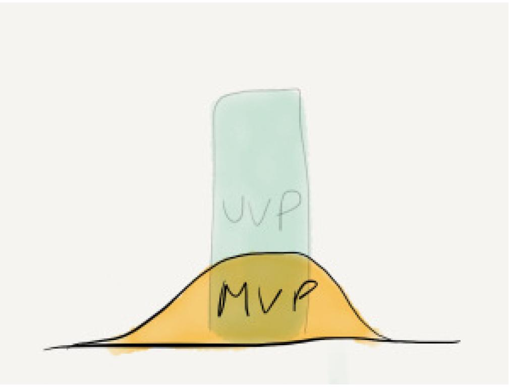 | **El "monolito" celeste** representa la **UVP**: la hipótesis de por qué nuestro producto es único. Es lo que **tenemos que validar**. Si la UVP es falsa, no importa cuántas features construyamos: el producto no va a tener mercado. Por eso, **toda la estrategia de MVPs / MMFs / MVFs arranca acá**. |

---

## 4. El "Diccionario Anti-Mareos" (las siglas)

> La "sopa de letras" de siglas (MVP, MMF, MMP, MMR, MVF) es donde todo el mundo se marea. Para simplificarlo, la mejor estrategia es **dividir los conceptos en dos grandes grupos**: los que sirven para **aprender/validar** y los que sirven para **vender/comercializar**.

### GRUPO A — Herramientas para **APRENDER** (validar hipótesis)

> Su objetivo no es ganar dinero, sino **evitar fracasos** descubriendo qué quiere el cliente.

| Sigla | Significado | Definición |
|---|---|---|
| **MVP** | Minimum Viable Product | Versión del producto que requiere el **menor esfuerzo** para obtener el **máximo aprendizaje validado**. No importa si está "roto" o le faltan cosas, importa **si la gente lo quiere**. |
| **MVF** | Minimum Viable Feature | Igual que el MVP, pero aplicado a una **sola característica**. Es una versión miniatura de una funcionalidad para ver si es útil **antes de programarla completa**. |

#### MVP en detalle

> **Eric Ries**: *"Es una versión del producto que permite a un equipo **recopilar la cantidad máxima de aprendizaje validado** sobre clientes con el **menor esfuerzo**"*.

- Concepto central de **Lean Startup**: enfatiza el **impacto del aprendizaje** en el desarrollo de nuevos productos.
- **Dirigido a un subconjunto de clientes potenciales**.
- Utilizado para obtener **aprendizaje validado**.
- Más cercano a los **prototipos** que a una versión real del producto.
- Tiene el **valor suficiente** para que las personas estén dispuestas a usarlo o comprarlo inicialmente.
- Demuestra **beneficio futuro** para retener a los primeros usuarios.
- Proporciona un **ciclo de retroalimentación** para guiar el desarrollo futuro.
- **Una premisa clave**: producir un producto real que se ofrece a los clientes para **observar su comportamiento real** (no preguntarles qué harían, **ver lo que hacen**).
- *"Ver lo que la gente realmente hace con respecto a un producto es mucho más confiable que preguntarle a la gente qué harían"*.

> **Justamente una de las cosas que queremos con el MVP es validar la hipótesis** de la UVP.

#### Ejemplos de MVP

- Un **prototipo dibujado** en papel.
- Un **"Smoke Test"** o anuncio falso para ver si la gente hace clic.
- Un **video explicativo** del producto.
- Una **landing page** con un botón "comprar" para medir interés.
- Una versión con **solo la feature más importante**, sin pulir.
- Funciones de **"Table stakes"**: un poco de funciones básicas solo para que sea "viable" como producto.

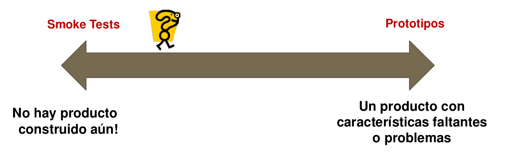

> Un MVP varía en complejidad desde pruebas de humo (smoke tests) extremadamente simples (poco más que un anuncio) hasta prototipos tempranos.

#### MVF en detalle

- Es una **versión mini del MVP** aplicada a una sola característica.
- Característica a pequeña escala que se puede construir e implementar rápidamente, con recursos mínimos, para una población objetivo, para probar la **utilidad y adopción** de la característica.
- Permite **validar** si la nueva funcionalidad es útil antes de invertir más en su desarrollo.
- El grupo de usuarios para un MVF son los **primeros en adoptar**: clientes leales, miembros de una junta asesora, usuarios flexibles y tolerantes.
- Los resultados ayudan a tomar **decisiones estratégicas** sobre productos.
- Si el MVF resulta exitoso, se puede desarrollar más MMF en esa área.
- Debe proporcionar **un valor claro a los usuarios** y ser **fácil de usar**.

> **Cuándo usar MVF**: cuando tenés un área con **alto potencial pero alta incertidumbre**. Si en lugar de esperar a ver si el MMF "apestaba", querés validar antes, el MVF es tu herramienta.

### GRUPO B — Herramientas para **VENDER** (comercializar)

> Una vez que el MVP nos enseñó qué quiere la gente, pasamos a construir algo **con calidad para vender**.

| Sigla | Significado | Definición |
|---|---|---|
| **MMF** | Minimum Marketable Feature | Pieza más pequeña de funcionalidad que le aporta **tanto valor al cliente** que **justifica ser vendida o promocionada**. |
| **MMP** | Minimum Marketable Product | Tu MVP evolucionado y listo para salir al mercado real para tus **primeros usuarios (early adopters)**. Compuesto por la **suma de varias MMFs**. |
| **MMR** | Minimum Marketable Release | **Paquete de entrega**: el conjunto más pequeño de características (MMFs) que podés **liberar en una actualización** para dar valor nuevo. |

#### Fórmulas clave

> **Fórmula evolutiva**: hago un MVP → aprendo → construyo MMFs → las agrupo en un MMP → lo lanzo como mi primer **MMR1** → sigo con **MMR2, MMR3, ... MMR N**.

> **MMP = MMR1**: el primer release de tu producto es tu MMP.

#### MMF en detalle

- Es la **pieza más pequeña de funcionalidad que puede ser liberada** a los clientes.
- Tiene valor tanto para los **usuarios** como para los **clientes** (la organización).
- Es parte de un **MMR** o un **MMP**.
- El objetivo del MMF es **aportar valor**, no aprender.
- Supone una **alta certeza** de que existe valor en esa área.
- La razón para dividir una característica grande en MMFs más pequeños es principalmente el **time to market** y la capacidad de aportar valor en muchas áreas.
- **Indicador de que estás trabajando bien con MMFs**: cuando al liberarse uno te sentís cómodo trabajando en el próximo MMF en esa área.

#### MMP en detalle

- Versión del producto lo **suficientemente completa** para ser lanzada al mercado y satisfacer a los **primeros usuarios** (early adopters).
- Incluye todas las funcionalidades necesarias para que el producto sea **comercializable y competitivo**, aunque no necesariamente todas las finales.
- Focalizado en **características clave** que satisfarán a este grupo clave.
- **Está compuesto por varias MMF**.

#### MMR en detalle

- Release de un producto que tiene el **conjunto de características lo más pequeño posible**.
- Un incremento más pequeño que ofrece **valor nuevo** a los usuarios y satisface sus necesidades actuales.
- **MMP = MMR1** (el primer release del producto comercializable es el primer release mínimo).

---

## 5. La Cadena Evolutiva

> **MVP → aprendo → construyo MMFs → las agrupo en un MMP → lo lanzo como mi primer MMR1 → sigo agregando MMFs en MMR2, MMR3, ... hasta el producto completo (MMR N)**.

### Relación entre MVP, MMF, MMP, MMR

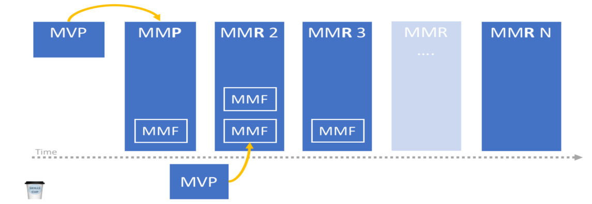

| Etapa | Qué es | Para qué sirve |
|---|---|---|
| **MVP** | Producto mínimo | **Aprender**, validar hipótesis |
| **MMF** | Feature mínima comercializable | **Vender** valor puntual |
| **MMP** | Producto mínimo comercializable | Primer release de mercado |
| **MMR1 = MMP** | Release mínimo | Salir al mercado |
| **MMR2, 3, ... N** | Releases incrementales | Seguir entregando valor nuevo |

---

## 6. El Dinosaurio Carpaccio: la evolución paso a paso

> El **"dinosaurio Lean/Agile"** (también llamado **dinosaurio carpaccio**) es la **metáfora visual** de las diapositivas de la cátedra para entender cómo se cultivan los productos en mercados inciertos, combinando MVP, MVF, MMF y luego "rebanando" todo en historias pequeñas. La idea central es que **ningún producto se entrega entero de una**: se lo va **cortando en rodajas** (carpaccio) para reducir el riesgo de implementación y obtener feedback temprano.

### 6.1. Construimos el MVP inicial

> El primer paso es **crear un producto mínimo viable (MVP)** para probar la hipótesis. Esto se centra en la **propuesta de valor única (UVP)**, pero normalmente también proporciona un poco de funciones de **"Table stakes"** solo para asegurarse de que sea **"viable"** como producto.

| Imagen | Explicación |
|---|---|
|  | **El "monolito" celeste** es la **UVP** (la hipótesis de valor único). La **colina amarilla** que aparece debajo es el **MVP** (Producto Mínimo Viable): la primera versión que tiene lo justo y necesario para ser lanzada y empezar a aprender del mercado. |

### 6.2. Llevamos el MVP al mercado y observamos

> **El MVP también es una hipótesis**. Podría ser lo suficientemente bueno para encontrar un mercado, o no. Lo lanzamos y vemos qué pasa.

| Imagen | Explicación |
|---|---|
| 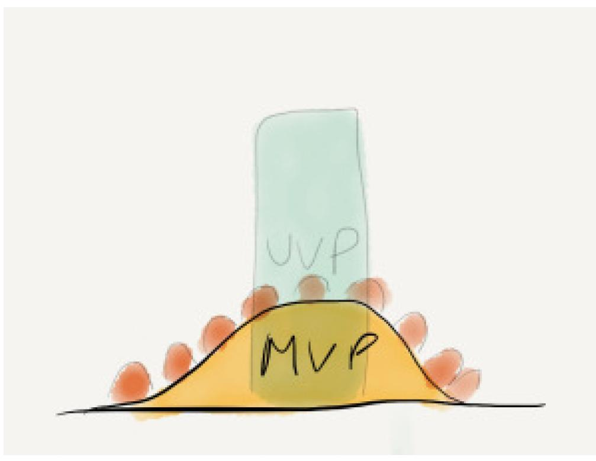 | Los **"puntitos naranjas"** alrededor del MVP representan a los **clientes potenciales** interactuando con el producto. En este caso, cada cliente te dice **"esto es genial, pero para poder usarlo necesito X"** — y **X es diferente para cada uno**. **Esto muestra que aún no se encuentra un mercado para el producto**: la UVP no está resonando con un segmento claro. |

### 6.3. Detectamos un patrón y validamos (o no) la hipótesis

> Si los clientes te devuelven **"necesito X"** con **X diferentes**, el producto no tiene mercado. Pero **si las respuestas empiezan a apuntar al mismo X**, entonces **tiene sentido revisar la hipótesis de Cliente/Problema/Solución**.

| Imagen | Explicación |
|---|---|
| 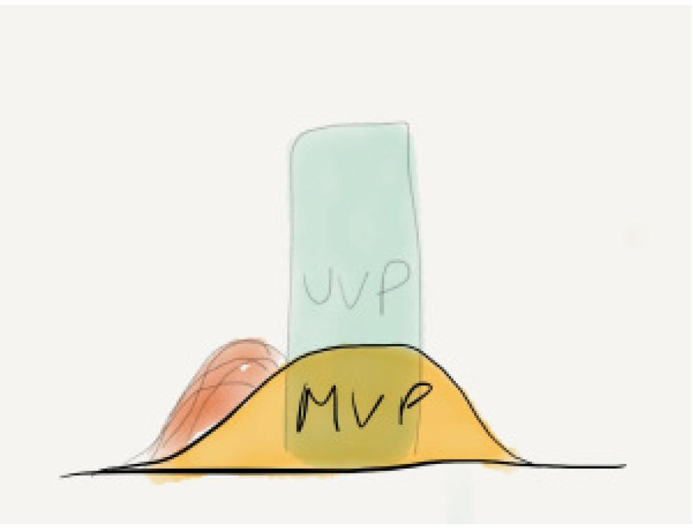 | La **"mancha rosa/naranja"** en el costado del MVP representa las **respuestas convergentes** de los clientes: **todos están pidiendo lo mismo**. Esto es señal de que la hipótesis de problema está validada, pero **la solución actual no resuelve bien el problema**. Es momento de iterar. |

### 6.4. Ejecutamos un pivot: construimos MVP2

> Básicamente, **estás ejecutando un pivot**. Construís **MVP2** centrado en la **nueva hipótesis** basada en el aprendizaje reciente de Desarrollo de clientes generado por el anterior MVP.

| Imagen | Explicación |
|---|---|
| 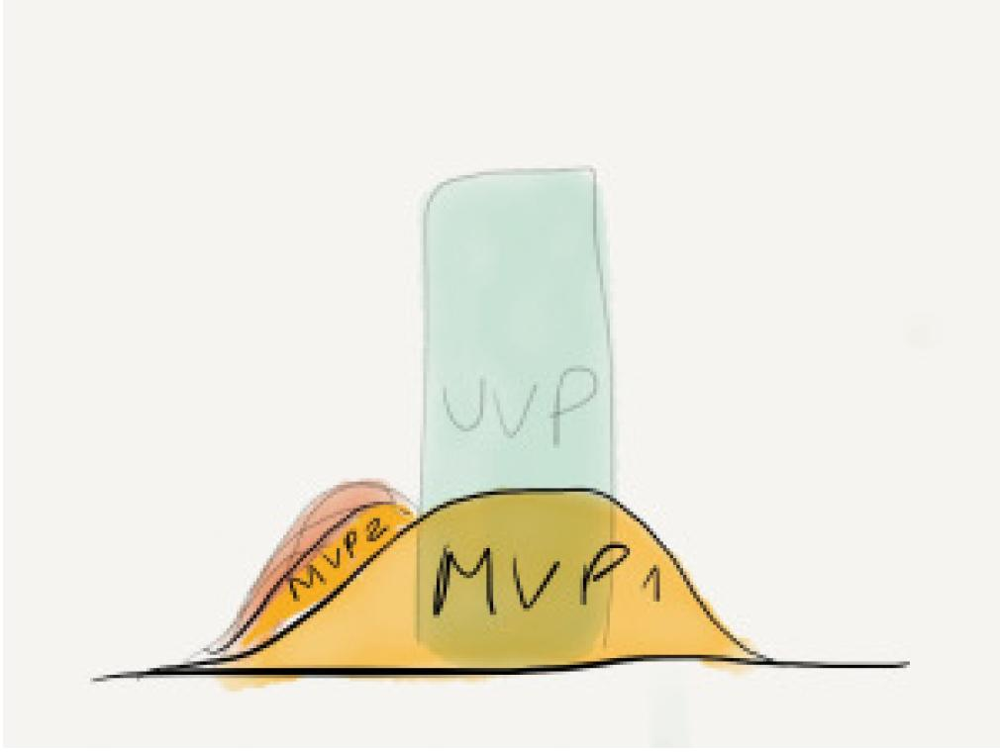 | **MVP1** (la colina grande amarilla original) **no funcionó** como esperábamos. Construimos **MVP2** (la colina rosa más chica al costado), una nueva versión centrada en la hipótesis revisada. **El MVP2 está vivo en paralelo, conviviendo con el MVP1** mientras se valida. |

### 6.5. MVP2 tiene tracción y queremos crecer

> Supongamos que **MVP2 es exitoso** y está viendo una **tracción real de los primeros usuarios**. Si deseás aumentar el crecimiento y buscar una penetración más profunda de tus primeros usuarios, además de atraer nuevos clientes, algunos de ellos más allá de la multitud de usuarios pioneros... **algunos de ellos quieren ampliar la propuesta de valor única** y algunos hacen que tu producto actual sea más robusto.

| Imagen | Explicación |
|---|---|
| 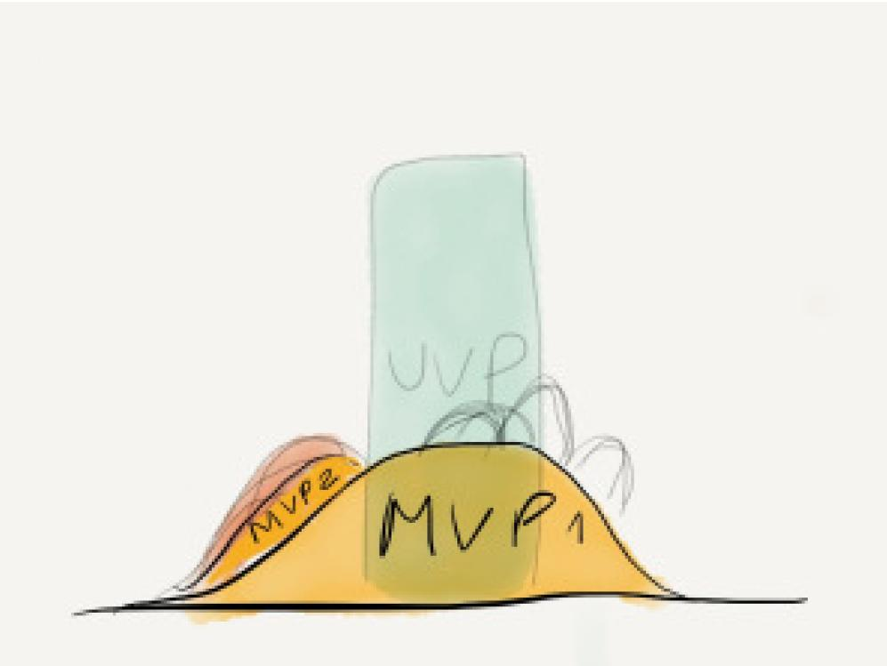 | **MVP2** está funcionando y tiene tracción. Las **flechas grises** que salen de los productos representan las **nuevas áreas de crecimiento** detectadas a partir del feedback. Ahora hay **pares de áreas que potencialmente pueden traer este crecimiento** y que requieren nuevas features. |

### 6.6. Construimos MMFs en las áreas de valor

> En el caso de áreas con una **fuerte indicación de valor**, puede directamente definir un **MMF (Características Mínimas Comercializables)**. Para encontrar la pieza mínima que pueda empezar a traer crecimiento. El objetivo del MMF es **aportar valor**. Supone una **alta certeza** de que existe valor en esta área y que sabemos cuál debe ser el producto para proporcionar este valor.

> La razón para dividir una característica grande en MMFs más pequeños es principalmente el **tiempo de comercialización (Time to market)** y la capacidad de aportar valor en muchas áreas.

> **Una indicación de que está trabajando en MMFs es que cuando al liberarse uno se siente cómodo trabajando en el próximo MMF en esa área**.

| Imagen | Explicación |
|---|---|
| 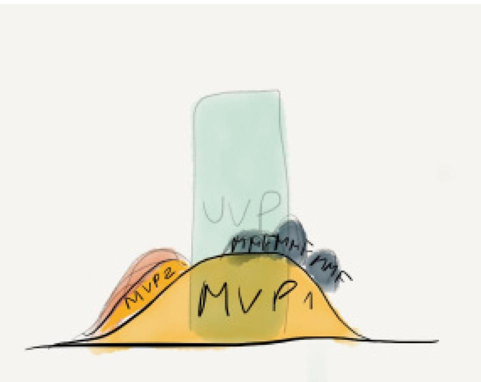 | Los **MMF1, MMF2 y MMF3** (las "piedritas" grises que aparecen sobre la colina de MVP1) son las **Características Mínimas Comercializables** que identificamos a partir del feedback. Cada una es una **feature vendible** por sí sola. **MVP2** sigue como producto pivoteado en paralelo. |

### 6.7. Combinamos MMF y MVF según incertidumbre

> Si se desea **esperar para ver si el primer MMF apesta**... entonces está de vuelta en la tierra de la hipótesis. Ahora tu hipótesis se centra en una característica en lugar del producto. Tienes un **área con alto potencial pero también alta incertidumbre**.

| Imagen | Explicación |
|---|---|
| 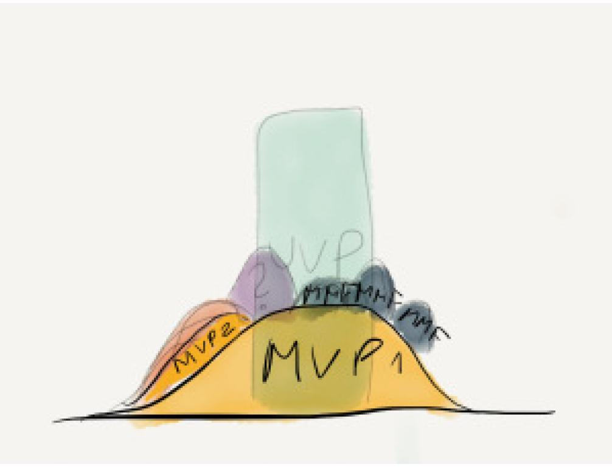 | Aparece un nuevo elemento: la **"piedra violeta"** (MVF). Esto pasa cuando **un área tiene alto potencial pero también alta incertidumbre** — no querés esperar a ver si el MMF apesta, así que primero lanzás un **MVF (Característica Mínima Viable)** como "pionera" para validar antes de invertir más. La estrategia es: **combinar MMF y MVF según el nivel de incertidumbre del negocio/requisitos en cada área**. |

### 6.8. El MVF es la "función pionera"

> La forma de afrontarlo es crear una **función "pionera": MVF (Característica Mínima Viable)**. La característica mínima que aún puede ser viable para **uso real y aprendizaje de los usuarios reales**.

> Si el MVF resulta exitoso (**hit gold**), puede desarrollar más MMF en esa área para tomar ventaja (si eso tiene sentido). Si no es así, puede **cambiar a otro enfoque** hacia esa área de características, o en algún momento buscar una **ruta de crecimiento alternativa**. Esencialmente, el MVF es una versión mini del MVP.

| Imagen | Explicación |
|---|---|
| 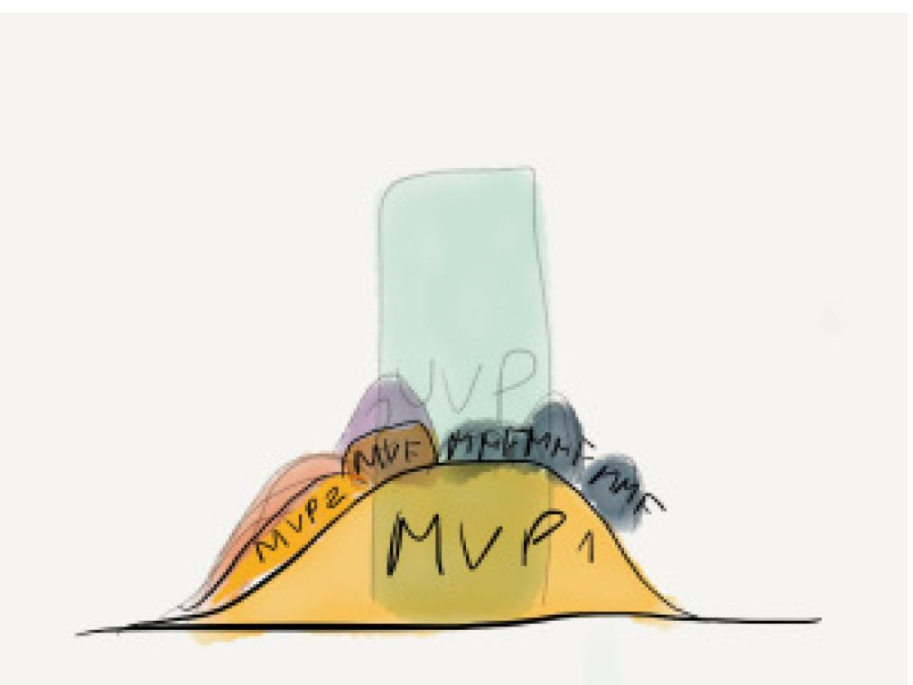 | La **"piedra violeta" (MVF)** está en posición de "pionera" — se lanza primero para validar la característica. Los **MMF1, MMF2, MMF3** están esperando el resultado. **Si el MVF hace "hit gold"**, se desarrollan más MMFs en esa área; **si no**, se cambia el enfoque o se busca otra ruta. |

### 6.9. El modelo completo

> El **modelo completo** del dinosaurio carpaccio integra todo: MVP1, MVP2, MVF, MMFs, UVP, y la metáfora de las **"rebanadas de carpaccio"** (las historias de usuario en las que se cortan todos estos productos para reducir el riesgo de implementación).

| Imagen | Explicación |
|---|---|
| 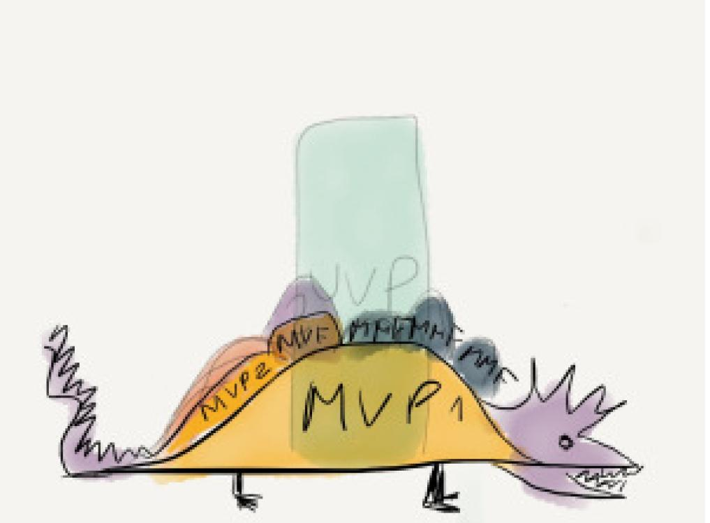 | **El cuerpo del "dinosaurio"** es el **MVP1** (la pieza más grande). Las **"jorobas"** son los **MVFs, MMFs y MVP2** que se van agregando. La **"cabeza" del dinosaurio** (con la cresta puntiaguda) representa las **User Stories** en las que se corta todo. **El dinosaurio carpaccio se obtiene cortando cada una de esas piezas en pequeñas porciones** destinadas a reducir el riesgo de ejecución / tecnología (normalmente se denominan User Stories). Esas porciones más pequeñas **pueden tener un valor comercial tangible o no**. Para otros puede ser importante **proporcionar una temprana retroalimentación de decisiones a lo largo del camino**. |

### Resumen de la evolución

| Paso | Qué pasa | Imagen |
|---|---|---|
| 1 | Construimos el **MVP** para probar la **UVP** (con un poco de "table stakes"). | `dino_01` |
| 2 | Llevamos el MVP al mercado y **observamos qué dicen los clientes**. | `dino_02` |
| 3 | Si las respuestas **convergen al mismo pedido**, validamos la hipótesis de problema. | `dino_03` |
| 4 | Si la solución no resuelve, **ejecutamos un pivot** y construimos **MVP2**. | `dino_04` |
| 5 | MVP2 tiene **tracción** y aparecen nuevas **áreas de crecimiento**. | `dino_05` |
| 6 | En áreas de **alto valor cierto**, construimos **MMFs** (features vendibles). | `dino_06` |
| 7 | En áreas de **alto potencial pero alta incertidumbre**, primero lanzamos un **MVF** "pionero". | `dino_07` |
| 8 | Si el **MVF hace "hit gold"**, desarrollamos más MMFs; si no, cambiamos el enfoque. | `dino_08` |
| 9 | **Todo el "dinosaurio" se rebana en carpaccio** (User Stories) para reducir el riesgo de implementación. | `dino_09` |

### Características del dinosaurio carpaccio

- **Corta en rodajas** un MVP/MMF/MVF en porciones pequeñas.
- Las porciones pequeñas se denominan normalmente **User Stories**.
- Esas porciones **pueden o no tener valor comercial tangible**.
- Permite **reducir el riesgo de ejecución/tecnología** al enfrentarlo en pedazos chicos.
- Proporciona **retroalimentación temprana** de decisiones a lo largo del camino.
- Es el **puente entre la visión de producto** (MVP/MMF) y la **implementación** (User Stories en sprints).

### Ejemplo práctico

> Imaginá que tu MVP es una **app de delivery**. El MVP completo es el dinosaurio. Las "rebanadas" podrían ser: **registro de usuarios, búsqueda de restaurantes, carrito, pago, tracking, etc.** Cada rebanada es una **User Story** que se valida, implementa y entrega de a una por sprint, en lugar de intentar hacer todo de una.

---

## 7. Resumen visual: Productos Mínimos para la Gestión de Productos

> Las 4 herramientas mínimas que se usan en la gestión de productos:
> 1. **MVP** — Producto Mínimo Viable (responde a hipótesis).
> 2. **MVF** — Característica Mínima Viable (versión mini del MVP).
> 3. **MRF** — Características Mínimas del Release (lo mínimo que debe tener un producto para salir al mercado).
> 4. **MMF** — Característica Mínima Comerciable.

> **Nota**: en el PDF de Alex aparece **MRF** (Minimum Releaseable Feature) en lugar de **MMR** (Minimum Marketable Release). Son variantes del mismo concepto: el **conjunto de características mínimas que se libera al mercado**. En la cátedra se usa más **MMR**.

---

## 8. Errores comunes con el MVP

- **Enfatizar la parte "mínimo"** con exclusión de la parte "viable**. El producto entregado no es de calidad suficiente para evaluar si los clientes lo usarán.
- Entregar lo que consideran un MVP y **luego no hacer más cambios**, independientemente de los comentarios.
- **Confundir** un MVP (enfocado en el aprendizaje) con un MMF o un MMP (enfocados en ganar).
- **Lanzarlo y olvidarse**: no iterar nunca en base al feedback.
- **No salir al mercado por miedo a equivocarse** (dilema de la audacia cero).

---

## 9. Valor vs. Desperdicio

> ¿Cuáles de nuestros esfuerzos crean valor y cuáles son desperdicio?

- **Lean Thinking** define la creación de valor como **proveer beneficios a los clientes**. Cualquier otra cosa será desperdicio.
- La productividad de un Startup no puede medirse en términos de cuánto se construye cada día, sino de **construir lo correcto** cada día. **Lo correcto es aquello que agrega valor**.
- **Si no construimos valor, estamos invirtiendo esfuerzo en desperdicio**.

---

## 10. ¿Cómo ideamos y trabajamos?

Para construir esos productos usamos dos marcos de trabajo modernos:

### Design Thinking (pensar en el humano)

> Metodología de **innovación centrada en las personas** que busca resolver problemas complejos de forma creativa. Se basa en un proceso **iterativo**.

- **Ponerse en la piel del usuario** que va a consumir el producto.
- Esquema de pensamiento **divergente** (muchas soluciones) y **convergente** (elegir la mejor).
- Mnemotecnia: **EDIPO** (EDIPP).

#### 5 pasos (iterativos)

1. **Empatizar**: comprender las necesidades del cliente mediante razonamiento intuitivo.
2. **Definir**: determinar lo valioso para el cliente a partir de lo recopilado.
3. **Idear**: articular muchas soluciones posibles (equipos multifuncionales, distintas miradas).
4. **Prototipar**: materializar las ideas (transformarlas en prototipos que permitan visualizar la solución).
5. **Probar**: validar los prototipos con los usuarios, obtener retroalimentación, iterar.

> *Ejemplo*: empresa de alquiler de herramientas. Se **alquila** por día, no se vende. Empatiza con que la gente no quiere comprar un taladro para usarlo una vez.

### Lean UX (trabajo colaborativo)

> **Lean UX** es un **marco o enfoque de trabajo colaborativo** que se enfoca en diseñar **productos digitales** de forma iterativa, validando hipótesis y aprendiendo rápidamente del usuario.

#### 3 pilares

1. **Design Thinking** (ya explicado): para entender al usuario.
2. **Desarrollo de software con metodologías ágiles**: hereda los valores del agilismo (individuos > procesos, software funcionando > docs, cliente > contrato, cambio > plan).
3. **Lean Startup** (Eric Ries): proceso de **Build, Measure, Learn**.

#### Build, Measure, Learn

- **Build**: crear un MVP para validar la hipótesis y lanzarlo al mercado. No nos interesa que funcione perfectamente, es para aprendizaje y feedback real.
- **Measure**: recoger datos reales de los usuarios para generar métricas. ¿Cuánta gente usa esta funcionalidad? ¿Cuánto tiempo pasa dentro de la app?
- **Learn**: analizar los resultados para determinar si la hipótesis fue validada. El aprendizaje sirve para la **próxima iteración**.

---

## 11. El Dilema de la Audacia Cero

> El **"dilema de la audacia cero"** es la paradoja que enfrentan organizaciones o individuos cuando, al intentar evitar cualquier tipo de riesgo o fracaso, se vuelven **tan cautelosos** que terminan estancándose o siendo incapaces de innovar.

Si posponés la experimentación con el MVP, surgen problemas:

- La cantidad de trabajo **desperdiciado aumenta**.
- Se perderán los comentarios esenciales.
- El riesgo de construir algo que **nadie quiere** aumenta.

### Compensaciones

- ¿Preferirías **atraer capital de riesgo y potencialmente derrocharlo**?
- ¿O **atraerlo y utilizarlo sabiamente**?

> **Usá un MVP para experimentar** (inicialmente, en silencio) con los primeros usuarios. Verificá tu concepto probando **todos sus elementos, comenzando por los más riesgosos**.

---

## Chivo para el oral

1. **Idea central**: en entornos de incertidumbre, **validar antes de gastar**. Solo el **7%** de las features se usan siempre.
2. **UVP**: la hipótesis de por qué tu producto es mejor que el resto. **Todo empieza acá**. Es el "monolito" celeste del dinosaurio.
3. **Aprender vs. Vender** (la clave para no marearse):
   - **Aprender**: **MVP** (producto) y **MVF** (feature). Sirven para validar hipótesis.
   - **Vender**: **MMF** (feature), **MMP** (producto), **MMR** (release). Sirven para salir al mercado.
4. **MVP**: *Maximum learning with minimum effort*. Es un **experimento**, no un producto final. Puede ser un prototipo, un smoke test, un video, una landing page. "Ver lo que la gente hace es más confiable que preguntarles qué harían".
5. **MVF**: versión mini del MVP aplicada a una sola feature. Se usa cuando hay **alto potencial pero alta incertidumbre**. Es la "función pionera".
6. **MMF**: feature mínima que **se vende**. Tiene valor comercial. Supone alta certeza de que hay valor.
7. **MMP**: producto mínimo comercializable para early adopters. **= MMR1**.
8. **MMR**: cada release posterior con valor nuevo (MMR2, MMR3, ... MMR N).
9. **Cadena evolutiva**: MVP → aprendo → MMFs → agrupo en MMP → lanzo como MMR1 → sigo.
10. **Dinosaurio carpaccio** (la metáfora visual completa):
    - El **cuerpo** es el MVP.
    - Las **"jorobas"** son MVFs, MMFs y MVP2.
    - Las **rebanadas** son las User Stories.
    - **Empezamos con la UVP** (piedra azul), construimos el **MVP** (colina amarilla), lo **llevamos al mercado**, **vemos las respuestas de los clientes**:
      - Si convergen al mismo pedido → **validamos la hipótesis de problema**.
      - Si no → **pivotamos** (MVP2).
    - **Si MVP2 tiene tracción** → identificamos **áreas de crecimiento**.
      - **Alto valor cierto** → construimos **MMFs**.
      - **Alto potencial + alta incertidumbre** → primero un **MVF pionero** → si hace "hit gold" → más MMFs.
    - **Todo el dinosaurio se rebana en carpaccio** (User Stories) para reducir riesgo de implementación.
11. **Design Thinking**: **EDIPO** (Empatizar, Definir, Idear, Prototipar, Probar). Proceso iterativo.
12. **Lean UX**: 3 pilares (**Design Thinking** + **Ágil** + **Lean Startup**) con ciclo **Build-Measure-Learn**.
13. **Audacia cero**: no animarse a experimentar = más desperdicio. **El MVP es para experimentar en silencio**.
14. **Cerrá con la idea**: la clave es **validar hipótesis rápido** con el menor esfuerzo posible. **No construir lo que el cliente no quiere**. Y cuando ya validamos, **rebanar en pedazos chicos** (carpaccio) para reducir riesgo de implementación.

> **Si te preguntan "¿cuál es la diferencia entre MVP y MMF?"** → el **MVP** es un **producto** completo mínimo para **aprender**; el **MMF** es una **característica** mínima para **vender**. El MVP valida hipótesis; el MMF entrega valor comercial.

> **Si te preguntan "¿cuándo uso MVF y cuándo MMF?"** → **MVF** cuando hay **alto potencial pero alta incertidumbre** (querés validar antes de invertir mucho con un "pionero"). **MMF** cuando ya tenés **alta certeza** de que hay valor en esa área y querés salir a vender rápido.

> **Si te preguntan "¿qué es el dinosaurio carpaccio?"** → una metáfora visual de la cátedra. **El cuerpo del dinosaurio es el MVP**, las **"jorobas"** son los MVFs/MMFs que se van agregando, y **las rebanadas (carpaccio) son las User Stories** en las que se corta todo para reducir el riesgo técnico. La historia que cuenta es: arrancás con la UVP, hacés un MVP, lo llevás al mercado, **si los clientes te dicen cosas distintas → pivotás (MVP2)**, si te dicen lo mismo → **validás y crecés con MMFs (y MVFs en zonas inciertas)**, y a todo lo "rebanás" en historias chicas.

> **Si te preguntan "¿qué es un pivot?"** → cuando después de probar un MVP los clientes te devuelven cosas distintas o la solución no resuelve el problema, **cambiás la hipótesis** y construís un **MVP2** centrado en la nueva hipótesis. Es iterar sobre la hipótesis de Cliente/Problema/Solución.
