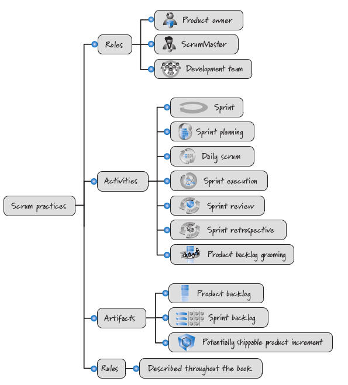
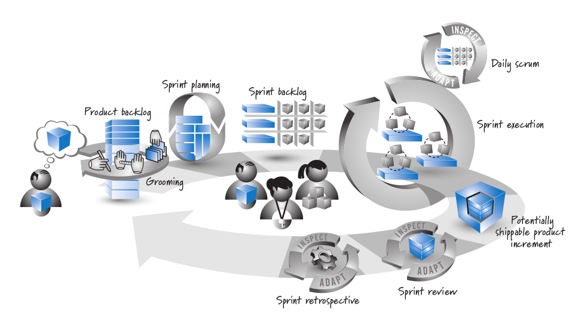
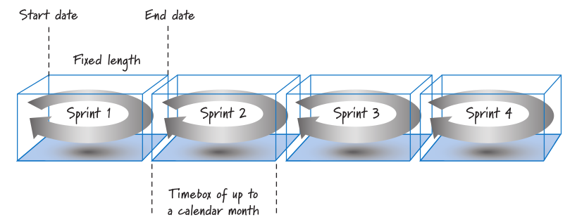
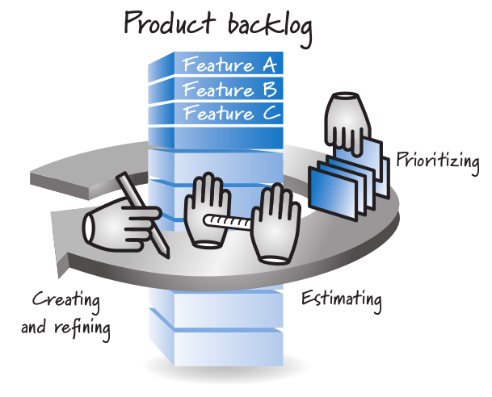

# 07 — Scrum: Fundamentos

> Págs. 86-101 del apunte. Cubre la teoría, los valores, los roles, los eventos y los artefactos de Scrum (basado en la Scrum Guide 2020).

## Concepto

> **Scrum** es un **marco ligero** que ayuda a las personas, equipos y organizaciones a **generar valor** a través de **soluciones adaptables** para problemas complejos.

Scrum requiere de un **Scrum Master** para fomentar un entorno donde:

1. Un **Product Owner** ordena el trabajo de un problema complejo en un **Product Backlog**.
2. El **Scrum Team** convierte una selección del trabajo en un **incremento de valor** durante un Sprint.
3. El Scrum Team y sus stakeholders **inspeccionan los resultados** y realizan ajustes para el próximo Sprint.
4. Repetir.

> El marco de Scrum es **deliberadamente incompleto**: solo define las partes necesarias para implementar la **teoría de Scrum**. Scrum se basa en la **inteligencia colectiva** de las personas que lo utilizan. Las reglas guían relaciones e interacciones.

---

## Los 3 pilares de Scrum

Scrum utiliza **procesos empíricos**, por lo que se basa en los 3 pilares:

- **Transparencia**: comunicación abierta y sin obstáculos. Base de confianza y colaboración. Transparencia en el **proceso** y en el **producto**.
- **Inspección**: los equipos identifican desviaciones mediante evaluaciones periódicas.
- **Adaptación**: una vez inspeccionado el producto y los procesos, se adapta la estrategia.

---

## Los 5 valores de Scrum

El uso exitoso de Scrum depende de que las personas vivan estos **5 valores**:

1. **Compromiso**.
2. **Enfoque**.
3. **Apertura**.
4. **Respeto**.
5. **Coraje**.

---

## Visión general de Scrum

| Categoría | Elementos |
|---|---|
| **Roles** | Product Owner, Scrum Master, Development Team. |
| **Actividades** | Sprint, Sprint Planning, Daily Scrum, Sprint Execution, Sprint Review, Sprint Retrospective, Product Backlog Grooming. |
| **Artefactos** | Product Backlog, Sprint Backlog, Potentially Shippable Product Increment. |
| **Reglas** | Descritas a lo largo del libro. |

---

## Roles

### 1. Scrum Master (SM)

> El SM es **responsable de establecer Scrum** tal como se define en la Guía. Lo consigue ayudando a todos a comprender la teoría y la práctica de Scrum, tanto dentro del equipo como en toda la organización.

**Sirve al equipo**:
- Es responsable de su **efectividad**.
- Promueve la mejora continua.
- Capacita a los miembros en autogestión y multifuncionalidad.
- Ayuda al equipo a centrarse en la creación de **incrementos de alto valor**.
- Asegura que los sprints o incrementos sean llevados a cabo dentro de un timebox y sean productivos.

**Sirve al Product Owner**:
- Ayuda a encontrar técnicas para definir objetivos del producto y gestionar el backlog.
- Ayuda a establecer la planificación de productos para entornos complejos.
- Facilita la colaboración de stakeholders.

### 2. Product Owner (PO)

> El PO es responsable de **maximizar el valor** del producto resultante del trabajo del Scrum Team. Es el encargado de la **gestión eficaz** del Product Backlog.

- Definición del producto.
- Creación de elementos de trabajo.
- Asegurarse de que el backlog sea **transparente, visible y comprendido**.

> El PO puede hacer el trabajo o **delegar la responsabilidad** a otros, pero **sigue siendo responsable**. Para que el PO tenga éxito, **toda la organización debe respetar sus decisiones**.

### 3. Scrum Team (Development Team)

> La **unidad fundamental** de Scrum es un pequeño equipo. Consta de un SM, un PO y **developers**. No hay subequipos ni jerarquías. Es una unidad cohesionada de profesionales enfocada en un objetivo a la vez, el **objetivo del Producto**.

- En el Scrum Team, las personas **no se etiquetan** con roles súper definidos. Acá tenemos básicamente a los **developers** que engloban a analistas, desarrolladores, testers, QA, etc.
- Son **multifuncionales** (todas las habilidades para crear valor en cada Sprint).
- Son **autogestionados** (deciden internamente quién hace qué, cuándo y cómo).
- Tamaño: **10 personas o menos** (suficientemente pequeño para ágil, suficientemente grande para trabajo significativo).

---

## Eventos (actividades ceremoniales)

### El Sprint

> Los sprints son el **latido del corazón de Scrum**, donde las ideas se convierten en valor. Son eventos de **longitud fija de un mes o menos** para crear consistencia. Un nuevo Sprint comienza **inmediatamente después** de la conclusión del Sprint anterior.

**Reglas del Sprint**:
- No se hacen cambios que **pongan en peligro el objetivo del Sprint** (triángulo de hierro).
- La **calidad no disminuye**.
- El **alcance se puede clarificar y renegociar** con el PO a medida que aprendemos más.
- Solo el **PO tiene la autoridad para cancelar** un Sprint (si el objetivo se vuelve obsoleto).
- Los Sprints están en un **timebox** (fecha de inicio y fin fija, duración similar).

### Sprint Planning

> Inicia el Sprint **estableciendo el trabajo** que se realizará. Este plan es creado por el **trabajo colaborativo de todo el Scrum Team**.

Se abordan **3 temas**:

1. **¿Por qué el Sprint es valioso?** El PO propone cómo el producto podría aumentar su valor. Se define un **objetivo del Sprint** (Sprint Goal).
2. **¿Qué se puede hacer en este Sprint?** A través del debate con el PO, los developers **seleccionan los elementos del Product Backlog** para incluir en el Sprint actual. Pueden **refinar** estos elementos.
3. **¿Cómo se realizará el trabajo?** Para cada PBI seleccionado, los developers **planifican el trabajo** necesario para crear un incremento que cumpla la DoD. Se hace una **descomposición** en elementos más pequeños (pocos días).

> **Sprint Backlog** = Objetivo del Sprint + elementos seleccionados + plan para entregarlos.

- Duración máxima: **8 horas** para un Sprint de un mes.

### Daily Scrum

> Inspecciona el **progreso hacia el Objetivo del Sprint** y adapta el Sprint Backlog. **15 minutos máximo**, para los developers, todos los días laborables, mismo lugar y hora.

También llamado **daily stand-up** (muchos se levantan para que sea más breve).

**3 preguntas** (Scrum Master como facilitador):
1. ¿Qué es lo que he realizado desde el último daily scrum?
2. ¿En qué estoy pensando trabajar en el próximo daily scrum?
3. ¿Cuáles son los **obstáculos** que me impiden lograr un mayor progreso?

> **Pigs vs. chickens**: opiniones divididas sobre quién participa. El autor del libro señala que en realidad es más útil que **todos sean pigs** (que hagan algo).

### Sprint Review

> Inspecciona el **resultado del Sprint** y determina **futuras adaptaciones**. El Scrum Team presenta los resultados a las **partes interesadas clave**. Se discuten los incrementos, se recibe feedback.

- **Acá es donde se calcula la velocidad** del sprint.
- Las user stories que cumplen con la DoD son presentadas al PO para inspección y adaptación.
- Duración máxima: **4 horas** para un Sprint de un mes.
- Es el **penúltimo** evento del Sprint.

### Sprint Retrospective

> Mientras que la Sprint Review inspecciona el **producto**, la Retrospectiva es el momento de **inspección y adaptación del proceso**.

- El equipo inspecciona cómo fue el último Sprint respecto a individuos, interacciones, procesos, herramientas y su DoD.
- Se analizan **3 cosas**:
  1. ¿Qué es lo que **salió bien**?
  2. ¿Qué es lo que **salió mal**?
  3. ¿Qué es lo que **pudo haberse mejorado**?
- Duración máxima: **3 horas** para un Sprint de un mes.
- **Concluye** el Sprint.

### Metodología de la retrospectiva

1. Se prepara el escenario.
2. Se reúnen los datos (vista hacia el pasado, como espejo retrovisor).
3. Se generan ideas.
4. Se decide qué hacer.
5. Se cierra la retrospectiva.

---

## Artefactos de Scrum

> Los artefactos representan **trabajo o valor**. Están diseñados para maximizar la **transparencia**. Cada artefacto contiene un **compromiso** que refuerza el empirismo.

### Product Backlog (PT)

> Lista **emergente y ordenada** de lo que se necesita para mejorar el producto. Es la **única fuente de trabajo** emprendida por el Scrum Team.

- La actividad de crear, refinar, estimar y priorizar se conoce como **grooming**.
- Scrum no dicta una medida específica; en la práctica se usan **medidas relativas** (story points o días ideales).
- Cada elemento debe acercar al equipo cada vez más al **objetivo del producto**.

**Compromiso: Product Goal (Objetivo del Producto)**.

> El Product Goal describe un **estado futuro del producto** que puede servir como objetivo para el equipo Scrum contra el cual planificar. Deben cumplir (o abandonar) un objetivo antes de asumir el siguiente.

### Sprint Backlog (SBT)

> Compuesto por el **objetivo del Sprint** (por qué), el conjunto de **PBIs seleccionados** (qué), y un **plan accionable** (cómo) para entregar el incremento.

- Imagen **visible y en tiempo real** del trabajo que los developers planean realizar durante el Sprint.
- Se actualiza a medida que se aprende más.

**Compromiso: Sprint Goal** (el único objetivo para el Sprint).

> Si el trabajo resulta diferente de lo esperado, los developers colaboran con el PO para **negociar el alcance** del Sprint Backlog **sin afectar el Sprint Goal**.

### Incremento

> Un **Incremento** es un paso de **concreto** hacia el Objetivo del Producto.

- Se pueden crear varios incrementos dentro de un Sprint.
- La suma de los incrementos se presenta en la Sprint Review.
- Un incremento puede entregarse **antes** del final del Sprint.
- **El trabajo no se puede considerar parte de un incremento a menos que cumpla con la DoD**.

**Compromiso: Definition of Done (DoD)**.

> La DoD es una **descripción formal del estado del Incremento** cuando cumple con las medidas de calidad requeridas.

- Si un PBI **no cumple** la DoD, no se puede liberar ni presentar en la review. Vuelve al Product Backlog.

---

## Ubicación de DoR y DoD en Scrum

- **DoR**: la historia pasa del **Product Backlog** al **Sprint Backlog**.
- **DoD**: la historia se valida en la **Sprint Review** y, si cumple, va a producción.

---

## Chivo para el oral

1. **Concepto**: Scrum es un marco ligero para problemas complejos. **Deliberadamente incompleto**, se basa en la inteligencia colectiva.
2. **3 pilares**: transparencia, inspección, adaptación. Es **empírico**.
3. **5 valores**: compromiso, enfoque, apertura, respeto, coraje.
4. **3 roles**: PO (maximiza valor), SM (facilita Scrum), Developers (construyen, ≤10 personas, multifuncionales y autoorganizados).
5. **5 eventos** (en orden): Sprint (timebox) → Sprint Planning (8h) → Daily Scrum (15 min, 3 preguntas) → Sprint Review (4h, calcula velocidad) → Sprint Retrospective (3h, ¿qué salió bien/mal/mejorable?).
6. **3 artefactos**: Product Backlog (emergente, priorizado) → Sprint Backlog (objetivo + PBI + plan) → Incremento (cumple DoD).
7. **Compromisos**: Product Goal, Sprint Goal, DoD.
8. **Cerrá con la idea**: Scrum es un **marco empírico e iterativo** con roles, eventos y artefactos definidos. Lo importante es el **loop inspección-adaptación** en cada Sprint.

> **Si te preguntan "¿cuánto dura un Sprint?"** → **1 mes o menos**, duración fija y constante.
> **Si te preguntan "¿quién puede cancelar un Sprint?"** → **solo el Product Owner** (cuando el objetivo se vuelve obsoleto).
