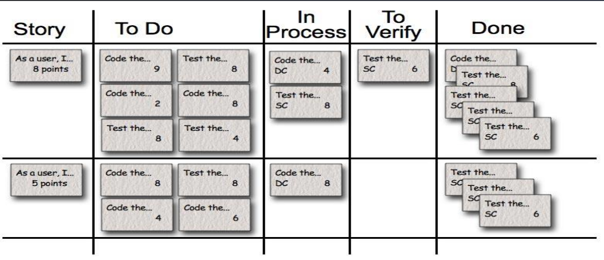
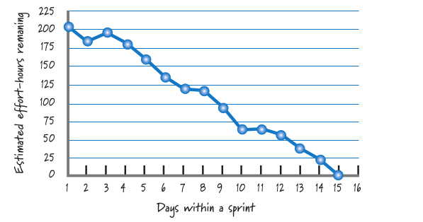
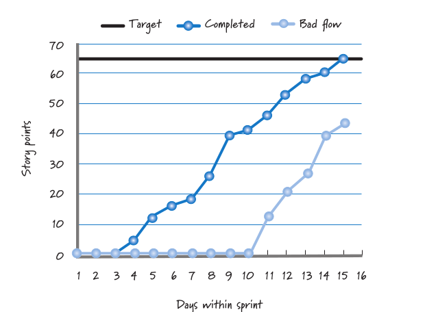
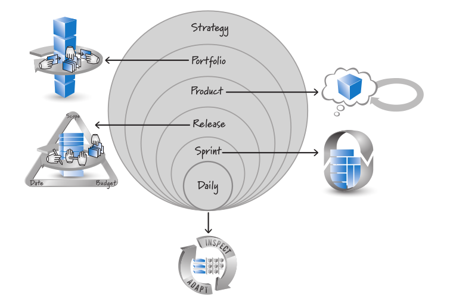
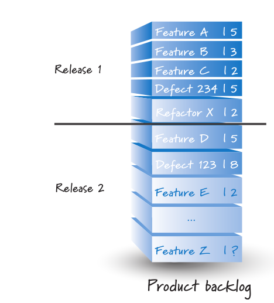

# 08 — Scrum: Herramientas y Planificación Multinivel

> Págs. 101-112 del apunte. Cubre el Taskboard, los gráficos de burndown/burnup y los 6 niveles de planificación.

## Herramientas de Scrum

> Uno de los beneficios de trabajar en cortos timeboxes con pequeños equipos es que **no necesitás gráficos complejos ni reportes** para comunicar el progreso.

---

### Taskboard (Tablero de Tareas)

> Artefacto **visual** que permite **visualizar el flujo de trabajo** de un Sprint Backlog.

- **Story**: las historias que han salido del Product Backlog y han entrado al Sprint Backlog.
- A menudo resulta útil **descomponer** el trabajo de una US en varias **actividades**, asignando **horas ideales** a cada una.

#### Granularidad

- Tablero con **pocas tareas, tareas gordas** con mucho contenido → **granularidad mala**.
- Lo que queremos es el taskboard **lleno de actividades** (granularidad fina).
- Tanto **Ágil como Lean** apuntan a una **gestión binaria**: las cosas están **terminadas o no**, no hay punto medio.

### Columnas típicas de un Taskboard

`Story` → `To Do` → `In Process` → `To Verify` → `Done`

---

### Sprint Burndown Chart

> Gráfico que muestra la **evolución del trabajo restante** a lo largo del Sprint.

- Eje **Y**: story points restantes.
- Eje **X**: días del sprint.
- Empezamos con un **compromiso** y el gráfico va **descendiendo** a medida que se completan actividades.
- Se actualiza en las **daily scrums** (donde se anuncia el progreso).

### Sprint Burnup Chart

> Es **al revés**: vamos **sumando** story points a medida que las stories se van completando.

- Útil cuando se quiere ver tanto el **trabajo completado** como el **alcance total** (que puede cambiar durante el sprint).

### Comparación

| Gráfico | Lo que muestra | Cuándo se usa |
|---|---|---|
| **Burndown** | Story points restantes bajan con el tiempo. | Para visualizar el **ritmo de consumo**. |
| **Burnup** | Story points completados suben con el tiempo. | Para visualizar el **trabajo terminado** y los cambios de alcance. |

---

## Múltiples niveles de planificación

> Distintos niveles de **granularidad** con los que trabajamos en Scrum, y con qué artefacto se representa cada nivel.

### 1. Estrategia

- **Visión general del negocio**.
- **Objetivos estratégicos de largo plazo**.
- *Ejemplo*: "Creación de productos digitales que permitan el crecimiento económico de las compañías".

### 2. Planificación del Portfolio

> Actividad que sirve para determinar **qué productos** vamos a trabajar, **en qué orden** y **por cuánto tiempo**.

- Pasa por un **filtro económico** que dice si es **redituable** a nivel económico.
- **No es objetivo** del curso entrar en detalle sobre portfolio, pero la idea es: define **qué productos** son viables.

### 3. Envisioning (Visión del Producto)

- **Visión general del producto**.
- Describe la **intención** y dirección a largo plazo del producto.
- **Output**: la **Visión del Producto** y el **Roadmap** de alto nivel.

### 4. Product Roadmap (Roadmap del Producto)

- Características del producto que se tendrán en el año (high level).
- Sirve para los **inversores** y stakeholders.
- Cada feature tiene un **story point estimado**.

### 5. Release Planning

> El **Release Planning** es la planificación para una **versión específica** del producto. Define **qué features** entrarán en el release y **cuándo**.

- Marca un **punto de corte** en el Product Backlog: lo de arriba es el **Release 1**, lo de abajo es el **Release 2**.
- Permite estimar la **fecha de release** basándose en la **velocidad** del equipo.

### 6. Sprint Planning

> Ya lo vimos en el archivo anterior. Es la planificación **al más bajo nivel**: qué se hace en los próximos días (siguiente sprint).

### Niveles en los Daily

> **Daily**: nivel táctico más bajo. Reuniones diarias de 15 minutos para sincronizar al equipo.

---

## ¿Cómo se relacionan todos estos elementos?

> La estrategia define el portfolio. El portfolio define los productos. Cada producto tiene un roadmap. El roadmap define los releases. Cada release se divide en sprints. Cada sprint tiene dailies.

---

## Escalando Scrum: Nexus y LeSS

A partir de **2 equipos Scrum** trabajando sobre el mismo producto, hay que **escalar Scrum**. Esto se cubre en el siguiente archivo.

---

## Portfolio: tallas de remera

Una forma visual de **priorizar** features en el portfolio planning:

- **XL** (extra large): features grandes, requieren mucho tiempo.
- **L** (large): features medianas.
- **M** (medium): features pequeñas.
- **S** (small): features muy pequeñas.

> Es una analogía de **tamaño relativo**, similar a los Story Points pero más simple (sin números).

---

## Chivo para el oral

1. **Taskboard**: artefacto visual del Sprint Backlog. Columnas: To Do → In Process → To Verify → Done. **Gestión binaria** (terminado o no).
2. **Burndown vs. Burnup**:
   - **Burndown**: story points restantes bajan.
   - **Burnup**: story points completados suben.
3. **Niveles de planificación** (de mayor a menor granularidad):
   - **Estrategia** → objetivos de negocio.
   - **Portfolio** → qué productos.
   - **Envisioning** → visión y roadmap.
   - **Roadmap** → features del año.
   - **Release** → qué entra en cada release.
   - **Sprint** → trabajo de los próximos días.
   - **Daily** → sincronización diaria.
4. **Tallas de remera**: forma simple de **priorizar por tamaño** (XL, L, M, S) en portfolio.
5. **Cerrá con la idea**: Scrum no es solo el Sprint, es todo un sistema multinivel que va desde la estrategia del negocio hasta la daily de 15 minutos.

> **Si te preguntan "¿cuántos niveles hay?"** → **6 niveles** principales: Estrategia, Portfolio, Envisioning, Roadmap, Release, Sprint (y dentro, Daily).
