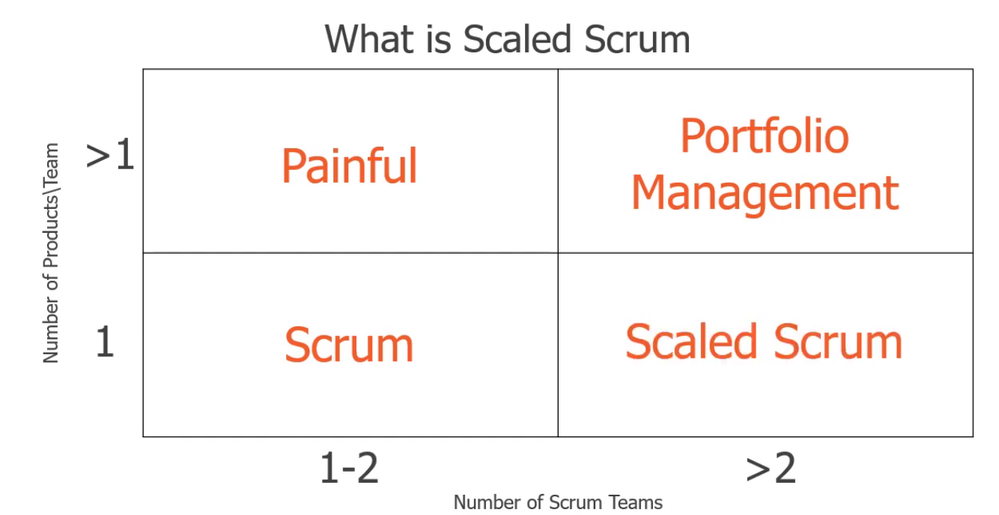

# 09 — Scrum Escalado (Nexus y LeSS)

> Págs. 113-123 del apunte. Cubre los frameworks para escalar Scrum a múltiples equipos y cómo lidiar con las dependencias.

---

## ¿Cuándo escalar Scrum?

> Se escala cuando tenés **más de un equipo de Scrum trabajando sobre el mismo producto**.

| Equipos | 1 producto | Múltiples productos |
|---|---|---|
| **1-2 equipos** | **Scrum** clásico. | **Portfolio Management**. |
| **>2 equipos** | **Scaled Scrum** (Nexus, LeSS). | Portfolio Management. |

- **1 Equipo + 1 Producto** → Scrum clásico.
- **Múltiples Equipos + Múltiples Productos** → Portfolio Management (Gestión de Portafolio).
- **Múltiples Equipos + 1 Producto** → **Scrum Escalado** (Nexus, LeSS).

> **La zona de peligro ("El Dolor")**: tener múltiples equipos trabajando en el mismo código sin un marco de coordinación. Esto genera **cuellos de botella, código roto e integraciones desastrosas**.

---

## 1. Nexus (el "exoesqueleto" de Scrum)

> Creado por **Ken Schwaber** (co-creador de Scrum), Nexus funciona como un **"exoesqueleto"** que se superpone al Scrum tradicional. Está diseñado para coordinar el trabajo de **3 a 9 Equipos Scrum** (aprox. 30 a 90 personas) que construyen un único producto.

> **Concepto central**: gestión y minimización de **dependencias** (técnicas y de negocio).

### Nexus Integration Team (NIT)

> Es el **corazón de Nexus**. Es un equipo focalizado compuesto por el **Product Owner**, un **Scrum Master** y **representantes de los equipos de desarrollo**.

> **Atención**: su objetivo **no es hacer todo el trabajo de integración** por los demás, sino **actuar como entrenadores de integración**. Aseguran que la integración suceda, coordinan estándares y mantienen la transparencia.

**Ejemplo de intervención del NIT**:

- El Equipo X usa un formato de logs distinto al Equipo Y.
- El Equipo Z no documenta los endpoints del API.
- El Equipo W no realiza pruebas de rendimiento en sus entregas.
- El NIT **interviene**, organiza un **taller** y unifica la **Definition of Ready (DoR)** o **Definition of Done (DoD)**.

### Eventos de Nexus (extienden a Scrum)

| Evento | Qué es |
|---|---|
| **Nexus Sprint** | Un **único Sprint** que engloba a todos los equipos para producir un solo **Incremento Integrado**. |
| **Nexus Sprint Planning** | Coordina las actividades globales. Genera un **Objetivo del Nexus Sprint** (general) y objetivos individuales para cada equipo. |
| **Nexus Daily Scrum** | Asisten **representantes** de cada equipo. Se discuten **exclusivamente** problemas de integración y dependencias cruzadas. |
| **Refinamiento Multi-equipo** | Fundamental para identificar qué equipo hará qué cosa y **eliminar dependencias** antes de que empiece el Sprint. |
| **Nexus Sprint Review** | Reemplaza o complementa las individuales para evaluar el **producto completo**. |
| **Nexus Sprint Retrospective** | Mejora el **proceso conjunto** entre todos los equipos. |

### Artefactos de Nexus

- **Único Product Backlog**: para todo el Nexus.
- **Nexus Sprint Backlog**: muestra el trabajo de todos los equipos, pero **resaltando visualmente las dependencias**.
- **Integrated Increment**: la suma del trabajo de todos los equipos, **funcional y probado bajo una única DoD**.

---

## 2. LeSS (Large-Scale Scrum)

> **LeSS** aplica los principios de Scrum a gran escala (de **2 a 8 equipos**) bajo una filosofía minimalista: **"Más con menos"** (*More with LeSS*). Busca **reducir la burocracia, los mandos medios y los roles innecesarios**.

> **Regla de oro**: Scrum a gran escala es simplemente Scrum. **No inventa nuevos procesos**, sino que escala los existentes.

### Principios de LeSS

- **Scrum a gran escala es Scrum**: aplicar Scrum existente a escala, no inventar uno nuevo.
- **Enfoque integral**: un solo Product Owner, un solo Product Backlog, un solo Sprint y un solo Incremento Entregable, sin importar si son 2 u 8 equipos.
- **Más con menos**:
  - **No agregar roles**: más roles diluyen la responsabilidad.
  - **No agregar artefactos**: crean distancia entre los desarrolladores y el cliente.
- **Centrado en el cliente**.
- **Mejorar hasta lograr la perfección**.
- **Transparencia**: basada en tareas "realizadas" tangibles, ciclos cortos, trabajo en equipo, definiciones comunes y eliminación del miedo.
- **Teoría de colas**: gestión eficiente de los flujos de trabajo (WIP), reduciendo la multitarea.

### Feature Teams (Equipos de Funcionalidad)

> **Feature teams**: equipos multifuncionales **"full-stack"**. Un equipo desarrolla una **funcionalidad completa** (front, back, BD) en lugar de tener "equipos de componentes" aislados.

- Fomentan la **colaboración entre componentes**.
- Evitan la formación de **silos** organizacionales.
- Permiten reducir dependencias técnicas.

### Eventos Específicos

| Evento | Qué es |
|---|---|
| **LeSS Sprint** | **Un único Sprint** a nivel producto, no uno por equipo. **Todos comienzan y terminan juntos**. |
| **Sprint Planning One (Qué)** | El PO y representantes de los equipos seleccionan **tentativamente** los ítems. Buscan **oportunidades para colaborar**. |
| **Sprint Planning Two (Cómo)** | Los equipos planifican internamente el **diseño técnico** y cómo harán el trabajo. |
| **Daily Scrum** | Cada equipo tiene la suya (15 min, 3 preguntas). |
| **Sprint Review** | Presentación de resultados a stakeholders. |
| **Sprint Retrospective** | Cada equipo individualmente hace la suya. |
| **Overall Retrospective** | Además de la retrospectiva individual, se hace una **global** (PO, Scrum Masters y representantes) para evaluar: **¿qué tan bien trabajamos juntos entre equipos?**, ¿qué aprendimos juntos?, ¿hay algo que hizo un equipo que debería compartirse? |
| **Product Backlog Refinement (PBR) Multi-equipo** | **El evento más importante en LeSS**. Múltiples equipos en una sala debaten y **refinan requisitos juntos** para alinearse profundamente. Los ítems **no están pre-asignados** a los equipos. |

### Artefactos de LeSS

- **Un solo Product Backlog** (los ítems no están pre-asignados a los equipos).
- **Sprint Backlog** por cada equipo.
- **Incremento del producto potencialmente entregable** (la salida de cada Sprint).

### DoD en LeSS

- Existe una **DoD común a todos los equipos**.
- Cada equipo puede tener su DoD **más detallada**, pero **siempre expandiendo** de la común.
- El objetivo es **mejorar la DoD** para que resulte en el envío del producto en cada Sprint (o incluso más seguido).

---

## 3. LeSS Huge

> Es la **versión extendida de LeSS** para **productos masivos** (Sistemas operativos, ERPs, Core Bancario) que requieren **más de 8 equipos** (cientos o miles de desarrolladores).

### El problema

> Un solo PO **colapsaría** gestionando el Backlog de 50 equipos.

### La solución: delegación

> El Product Backlog gigante se divide lógicamente en **Áreas de Requerimientos** (ej. "Gestión de Pagos", "Logística").

- **Vistas**: cada vista es una descomposición más detallada del PB para el área que corresponda.
- **Roles**:
  - Existe un **Product Owner Principal**.
  - Este **delega el día a día** a los **Area Product Owners (APOs)**.
  - Los APOs gestionan directamente entre **4 a 8 equipos** dentro de su área específica.

---

## 4. Comparativa: Nexus vs. LeSS vs. LeSS Huge

| Característica | Nexus | LeSS (Pequeño) | LeSS Huge |
|---|---|---|---|
| **Tamaño ideal** | 3 a 9 equipos. | 2 a 8 equipos. | 9+ equipos (masivo). |
| **Product Owner** | 1 PO único. | 1 PO único. | 1 PO Principal + Varios APOs. |
| **Scrum Master** | 1 en el NIT + en los equipos. | 1 cada 1-3 equipos. | 1 cada 1-3 equipos. |
| **Estructura clave** | Creación del **NIT** (Equipo de integración). | Coordinación directa (sin equipo intermediario). | División por **Áreas de Requerimientos**. |
| **Manejo de dependencias** | El NIT las **monitorea y resuelve activamente**. | Se **reducen previamente** mediante el PBR Multi-equipo y Feature Teams. | Se gestionan por **Área** (cada APO alinea a sus equipos). |
| **Filosofía** | Mantener Scrum + integrar. | Scrum a gran escala "más con menos". | Scrum masivo con delegación. |
| **¿Cuándo conviene?** | Muchas dependencias técnicas complejas que rompen la integración y se busca un cambio **menos disruptivo**. | La organización está dispuesta a **cambiar su estructura a fondo** (eliminar silos) y la arquitectura es limpia. | Mega-productos donde es imposible que una sola persona entienda o gestione todo el Backlog. |

---

## 5. Puntos en común

> Sin importar el framework, **siempre hay**:

- **Un solo Producto**.
- **Un solo Incremento Integrado** al final del Sprint.
- **Una única Definition of Done (DoD) general**.

---

## 6. Resumen visual

> La matriz resume cuándo aplicar cada cosa:
> - **Scrum clásico**: 1 equipo, 1 producto.
> - **Scaled Scrum** (Nexus o LeSS): varios equipos, 1 producto.
> - **Portfolio Management**: varios equipos, varios productos.
> - **Painful** (zona a evitar): varios equipos, sin coordinación.

---

## Chivo para el oral

1. **¿Cuándo escalar?** Cuando tenés **más de un equipo trabajando en el mismo producto**. Si es un solo equipo, es **Scrum clásico**. Si son varios equipos y varios productos, es **Portfolio Management**.

2. **Nexus (el exoesqueleto)**: de **3 a 9 equipos**. Su estrella es el **NIT (Nexus Integration Team)**, que actúa como **entrenador** para gestionar dependencias y asegurar que la integración no explote. Produce un **Incremento Integrado**.

3. **LeSS (más con menos)**: de **2 a 8 equipos**. Filosofía minimalista: **no agrega roles ni burocracia**. Tiene **un solo PO, un solo Sprint** y fomenta la coordinación directa mediante el **Refinamiento Multi-equipo (PBR)** y el uso de **Feature Teams** (equipos full-stack).

4. **LeSS Huge**: para escenarios masivos (**+9 equipos**). El Backlog se vuelve tan grande que se divide en **Áreas de Requerimientos**, y el PO principal **delega en Area Product Owners (APOs)**.

5. **Puntos en común**: siempre hay un solo producto, un solo Incremento Integrado y una DoD general.

6. **Cerrá con esta frase**: *"Escalar Scrum consiste en agregar equipos, no agregar burocracia ni roles desconectados. El objetivo final siempre es entregar un único incremento integrado que aporte valor continuo al cliente."*

> **Si te preguntan "¿cuál es la diferencia entre Nexus y LeSS?"** → Ambos escalan Scrum a varios equipos sobre el mismo producto. **Nexus** (3-9 equipos) crea un **NIT** que activamente gestiona las dependencias. **LeSS** (2-8 equipos) prefiere no agregar estructura: usa **PBR multi-equipo y Feature Teams** para **reducir las dependencias antes** de que ocurran. Nexus es menos disruptivo; LeSS requiere un cambio más profundo (eliminar silos).

> **Si te preguntan "¿qué es el NIT?"** → el **Nexus Integration Team**. Un equipo pequeño de representantes cuyo rol es **actuar como entrenador de integración**: coordina estándares, organiza talleres, alinea la DoR/DoD. **No hace el trabajo de integración por los demás**, solo se asegura de que la integración sea posible.

> **Si te preguntan "¿qué son los Feature Teams?"** → equipos **multifuncionales full-stack** que desarrollan **funcionalidades completas** (front, back, BD) en lugar de estar atados a un componente. Permiten **reducir dependencias** porque un equipo puede entregar una historia de extremo a extremo sin esperar a otros.

> **Si te preguntan "¿qué pasa con más de 8 equipos?"** → **LeSS Huge**. El PB se divide por **Áreas de Requerimientos** y hay un **PO por área (APO)** que gestiona entre 4 y 8 equipos. El PO principal delega y mantiene la visión global.
