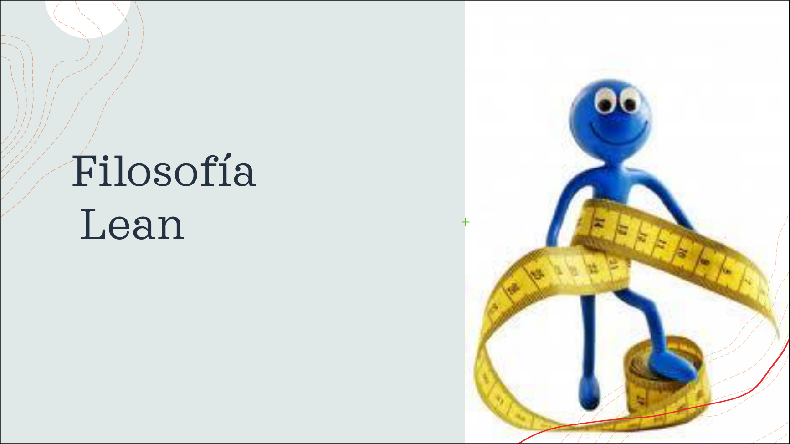
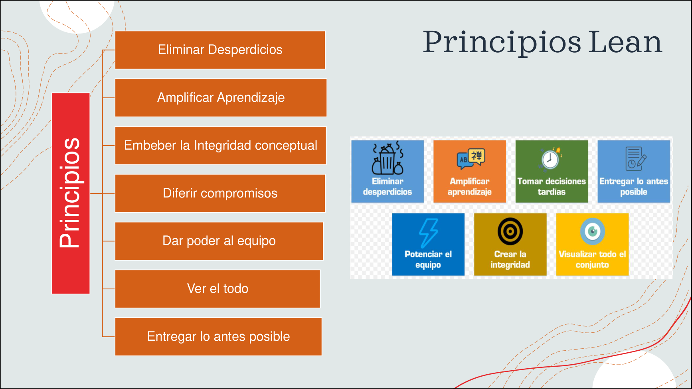
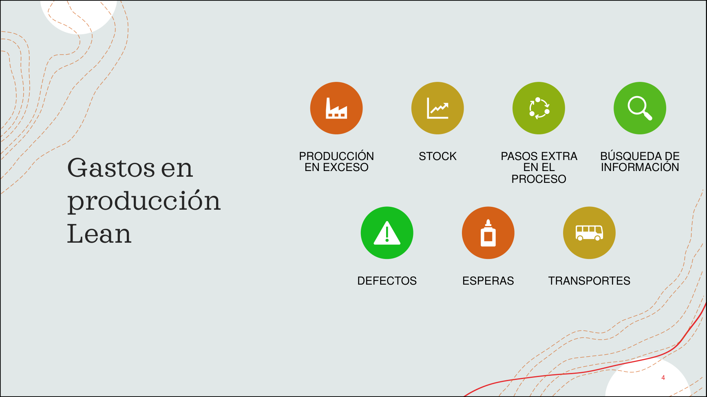
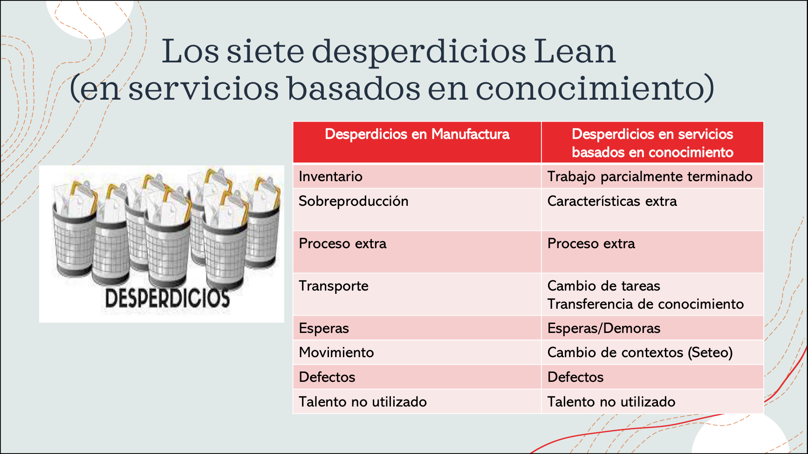

# 10 — Lean

> Págs. 124-131 del apunte. Cubre el origen Toyota, los principios de la filosofía Lean y los desperdicios en software.

## Concepto

> **LEAN** es una **filosofía y un conjunto de prácticas de gestión y producción** que se originó en el **sistema de producción de Toyota**, conocido como **Lean Manufacturing**. Ha sido adaptada a muchos campos, incluidos el **desarrollo de software** y la gestión empresarial.

- **Enfoque principal**: **maximizar el valor entregado al cliente** mediante la **eliminación de desperdicios** en los procesos.
- La idea es **hacer más con menos**: menos tiempo, menos recursos y menos esfuerzo.

> La imagen del muñequito con la cinta métrica representa la esencia de **Lean**: **medir** lo que hacemos para **maximizar el valor** y **minimizar el desperdicio**.

---

## 6 principios de la filosofía Lean

> La presentación de la cátedra muestra los **7 principios** con sus íconos característicos: **Eliminar desperdicios**, **Amplificar aprendizaje**, **Tomar decisiones tardías** (diferir compromisos), **Entregar lo antes posible**, **Potenciar el equipo**, **Crear la integridad** y **Visualizar todo el conjunto**.

### 1. Eliminar desperdicios

> **Desperdicio** es cualquier cosa que interfiera con darle al cliente lo que él valora, en el tiempo y lugar donde le provea más valor.

- **En manufactura**: el desperdicio es el **inventario**.
- **En software**: el desperdicio es el **trabajo parcialmente hecho** y las **características extra**.

> **El 20% del software que entregamos contiene el 80% de valor**.

- Se relaciona con los principios ágiles:
  - **#3**: Entregar software frecuentemente.
  - **#7**: El software funcionando es la principal medida de desempeño.
  - **#10**: La simplicidad (las funcionalidades parcialmente hechas son desperdicio).

### 2. Amplificar el aprendizaje

- Crear y mantener una **cultura de mejoramiento continuo** y solución de problemas.
- Un proceso focalizado en crear conocimiento esperará que el **diseño evolucione** durante la codificación.
- Esta cultura debe permitir a los individuos **intercambiar experiencias y conocimientos** para contribuir al aprendizaje colectivo.
- Se relaciona con:
  - El principio de **transparencia** del empirismo ágil.
  - El principio ágil **#6**: la mejor forma de transmitir información es mediante el **cara a cara**.
  - **Lean UX** genera conocimiento.

### 3. Integridad conceptual

> **Encastrar todas las partes del producto o servicio** para que tenga **coherencia y consistencia** (relacionado con los requerimientos no funcionales).

- **Coherencia**: las partes siguen las mismas normas, principios o reglas. *Ejemplo*: todos los botones tienen el mismo estilo.
- **Consistencia**: el producto se comporta de manera predecible en distintos contextos. *Ejemplo*: si el registro en mobile tiene 3 pasos, en web no debería tener 5.
- El objetivo es **construir con calidad desde el principio, no probar después** → la calidad debe ser **embebida**.
- **No inspecciones después** de los defectos, sino **antes** para evitar que aparezcan.
- Las **DoD / DoR** son ejemplos de cómo ágil adopta este principio.
- Consistencia y coherencia se pueden lograr con **CI** y **TDD**.
- Se relaciona con el principio de **desarrollo sostenible**.

### 4. Diferir compromisos (decidir en el último momento responsable)

> Postergar la toma de decisiones lo suficiente para tener la **mayor información necesaria** para tomar esa decisión, pero **antes de que sea muy tarde** (diferir la decisión irreversible).

- **Tomar las decisiones en el momento justo**.
- Se refleja en ágil con el **Product Backlog**: nunca se tiene el 100% de los requerimientos, se va completando a medida que hay más información.
- Se relaciona con el concepto de **Just In Time** de los requerimientos ágiles.

### 5. Dar poder al equipo

> Otorga **libertad de acciones y poder de decisión al equipo**. Para ello, el equipo debe ser **multifuncional y autogestionado**, y sus miembros deben estar **capacitados y motivados**.

- No subordinar a los empleados (anula las capacidades intelectuales).
- Entrenar líderes, delegar decisiones, fomentar buena ética laboral.
- **Es un talón de Aquiles** de las filosofías Agile y Lean: pocas veces se logran reunir todas estas características.
- Se relaciona con los principios ágiles:
  - **#5**: Individuos motivados.
  - **#11**: Individuos autoorganizados.

### 6. Ver el todo

> En Lean se busca tener una **visión holística** que permita asociar y comprender el todo: el producto, el valor agregado, el servicio, **más allá de los objetivos particulares por áreas o gerencias**.

- La idea es que los objetivos particulares de las partes estén **alineados** con los objetivos generales.
- Optimizar el **todo**, no las partes individuales (suboptimización local).

---

## Los 7 gastos en producción (clásicos de Toyota)

> Los **7 gastos en producción** clásicos de la filosofía Lean de manufactura:

| Gasto | Significado |
|---|---|
| **Producción en exceso** | Hacer más de lo que se necesita. |
| **Stock** | Inventario acumulado. |
| **Pasos extra en el proceso** | Burocracia innecesaria. |
| **Búsqueda de información** | Tiempo perdido buscando datos. |
| **Defectos** | Productos con fallos. |
| **Esperas** | Tiempo ocioso entre actividades. |
| **Transportes** | Movimiento innecesario de materiales. |

> En la manufactura, todos estos se ven como **físicos**. En software, los **mismos conceptos se traducen** a trabajo intangible (esperas = bloqueos, stock = trabajo parcialmente hecho, etc.).

---

## Los 8 desperdicios en software (DOWNTIME)

> La imagen muestra la **tabla comparativa** entre los desperdicios de **manufactura** y los de **servicios basados en conocimiento** (como el software). El inventario y la sobreproducción de fábrica se traducen a **trabajo parcialmente terminado** y **características extra** en software.

| # | Desperdicio | Descripción | Ejemplos en software |
|---|---|---|---|
| 1 | **Defectos** | Errores o fallos en el software. | Bugs que requieren retrabajo, fallos en producción. |
| 2 | **Overproduction** (Sobreproducción) | Producir más de lo necesario o antes de tiempo. | Construir features que nadie pidió, trabajo que se descarta. |
| 3 | **Waiting** (Esperas) | Tiempo perdido por bloqueos. | Esperando aprobaciones, esperando a otro equipo, esperando a testing. |
| 4 | **Non-utilized talent** (Talento no utilizado) | No aprovechar las habilidades del equipo. | Devs que solo siguen órdenes, no participan en decisiones. |
| 5 | **Transportation** (Transporte) | Transferencia innecesaria de información o entregables. | Pasar información entre muchos equipos, pérdida de contexto. |
| 6 | **Inventory** (Inventario) | Trabajo parcialmente hecho, features sin terminar. | Código no desplegado, funcionalidades a medias, documentación sin finalizar. |
| 7 | **Motion** (Movimiento) | Esfuerzo innecesario para acceder a información, herramientas o recursos. | Cambiar entre muchas herramientas, buscar info en muchos lados. |
| 8 | **Extra processing** (Proceso extra) | Pasos adicionales o innecesarios. | Documentación detallada que nadie lee, revisiones formales innecesarias, reuniones que no aportan. |

### En manufactura vs. en software

| En manufactura | En software |
|---|---|
| Inventario | Trabajo parcialmente hecho. |
| Sobreproducción | Características extra (que no se usan). |
| Transporte | Transferencia innecesaria de información. |
| Proceso extra | Burocracia, pasos innecesarios. |
| Espera | Bloqueos, esperas de aprobaciones. |
| Movimiento | Cambiar de herramientas/ambientes. |
| Defectos | Bugs, fallos. |
| Talento no utilizado | Skills subutilizados. |

> **Los procesos definidos sobrecargaron a las personas** de tareas que no aportan valor. Como resistencia, surgieron los procesos empíricos, que buscan **eliminar** todos los pasos en los procesos que no aportan valor al desarrollo del producto.

---

## Chivo para el oral

1. **Origen**: Toyota (Lean Manufacturing), adaptado al software.
2. **Idea central**: **maximizar valor, eliminar desperdicio**, hacer más con menos.
3. **6 principios**:
   - **Eliminar desperdicios** (20% del software = 80% del valor).
   - **Amplificar aprendizaje** (cultura de mejora continua).
   - **Integridad conceptual** (coherencia + consistencia, calidad embebida).
   - **Diferir compromisos** (decidir en el último momento responsable, Just In Time).
   - **Empoderar al equipo** (multifuncional, autogestionado, motivado).
   - **Ver el todo** (visión holística, optimizar el todo, no las partes).
4. **8 desperdicios DOWNTIME**: Defectos, Overproduction, Waiting, Non-utilized talent, Transportation, Inventory, Motion, Extra processing.
5. **En software**: el desperdicio principal es el **trabajo parcialmente hecho** y las **características extra**.
6. **Cerrá con la idea**: Lean es la **base filosófica** de muchas prácticas ágiles. **Eliminar lo que no aporta valor** y **maximizar lo que sí**.

> **Si te preguntan "¿cuál es el desperdicio más importante en software?"** → **trabajo parcialmente hecho** (código escrito pero no desplegado, features a medio terminar). Es la traducción del "inventario" de manufactura.
