# 11 — Kanban

> Págs. 131-138 del apunte. Cubre el concepto de Kanban, las políticas, el WIP, las clases de servicio y las métricas básicas.

## Concepto

> **Kanban** (看板) significa **"tarjeta" o "letrero visual"** en japonés. Es un **sistema de gestión visual** del trabajo, originario del sistema de producción de Toyota, que busca **optimizar el flujo** de tareas a través de un proceso.

> **No prescribe** un proceso específico ni un conjunto de roles: **se aplica sobre el proceso existente** del equipo.

---

## Kanban en pocas palabras

> **Kanban** (en japonés: 看板) literalmente significa **"tarjeta señal"** o **"letrero visual"**. Es un sistema de **señalización** que se originó en los supermercados y que Toyota adaptó a su producción.

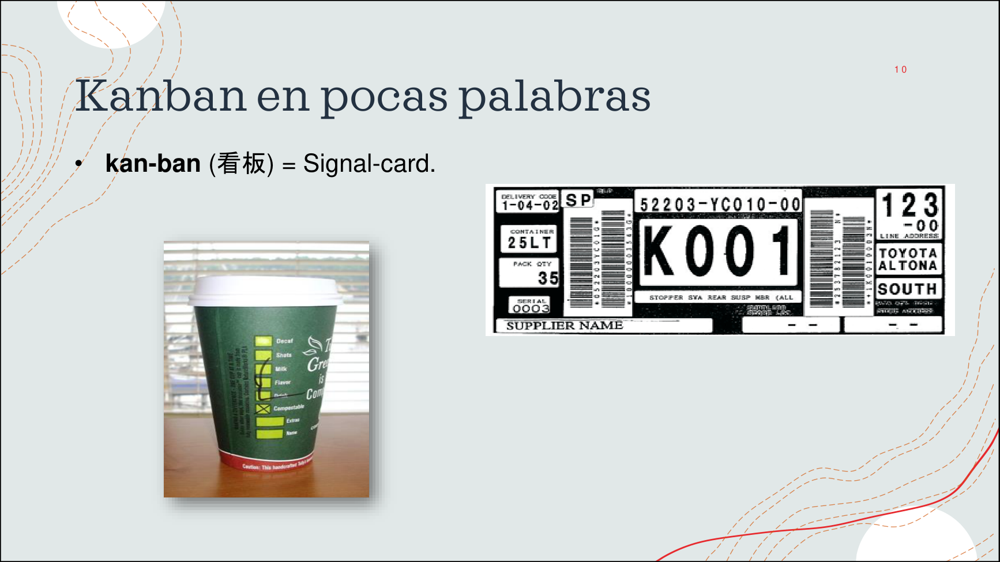

> La imagen muestra los **dos orígenes visuales** del término: el **vaso de Starbucks** (con stickers que indican las opciones del cliente, similar a una "señal" visual) y la **etiqueta de Toyota** (que viajaba con las piezas entre las estaciones de producción para indicar qué se necesitaba reponer). En ambos casos, la idea es la misma: **una señal visual** que dispara una acción.

### ¿Qué es Kanban como método?

> Es un **método para definir, gestionar y mejorar servicios** que entregan trabajo del conocimiento, tales como servicios profesionales, trabajos o actividades en las que interviene la **creatividad y el diseño** tanto de productos de software como físicos.

### Origen: Toyota y Just in Time

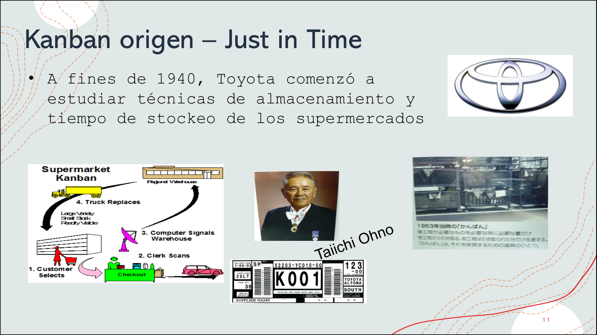

> **A fines de 1940, Toyota** comenzó a estudiar las técnicas de almacenamiento y tiempo de stockeo de los **supermercados**. **Taiichi Ohno** (considerado el padre del Sistema de Producción Toyota) implementó el sistema Kanban como la señal que viaja entre el cliente y el proveedor para **reponer lo que se necesita, en el momento justo** (Just in Time).

> La tarjeta Kanban era la **señal física** que se movía entre estaciones: cuando una estación consumía una pieza, su tarjeta Kanban "viajaba" hacia la estación anterior para que produjera un **repuesto**. Esto permitía producir **solo lo necesario, cuando se necesita**.

---

## ¿Por qué usar Kanban?

> Los equipos que pasan a Kanban suelen estar **saturados** y sufriendo de **muchas interrupciones**.

- **Foco en el cliente**: entregar valor de forma continua.
- **Foco en el flujo**: visualizar y gestionar el trabajo para que fluya sin bloqueos.
- **Foco en la mejora continua**: optimizar el sistema de forma incremental.

> **Limitar el WIP promueve la conversación y la mejora**. Si alguien termina una tarea y no puede tomar otra, se ve obligado a ayudar a quien está saturado o a mejorar el proceso.

---

## Valores de Kanban

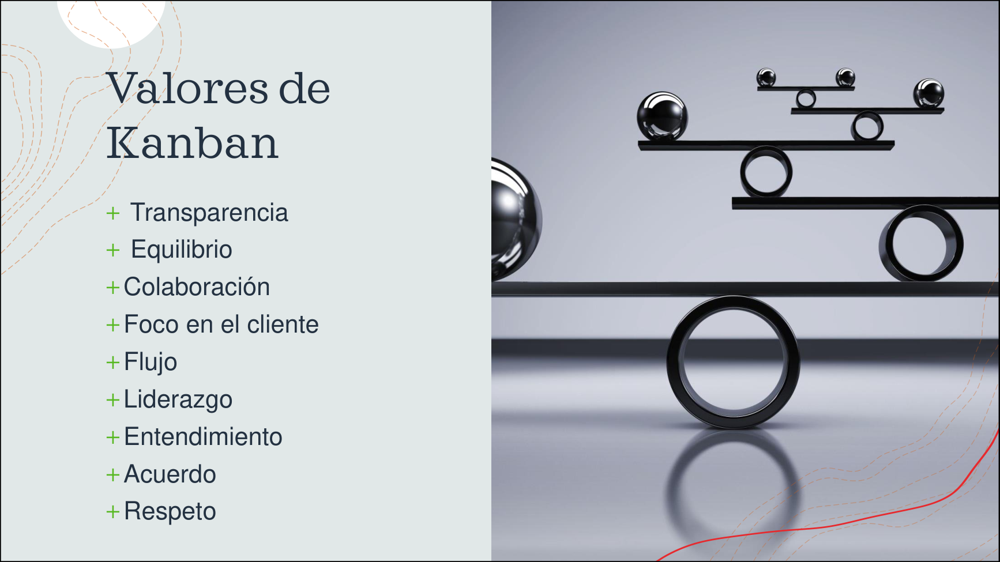

> Los **valores** de Kanban son el fundamento filosófico del método. La presentación de la cátedra los resume así:

- **Transparencia**: visualizar el trabajo y sus problemas.
- **Equilibrio**: en la carga de trabajo, en los distintos aspectos.
- **Colaboración**: trabajar juntos en pos del flujo.
- **Foco en el cliente**: la razón de ser del sistema.
- **Flujo**: el movimiento continuo del trabajo.
- **Liderazgo**: en todos los niveles de la organización.
- **Entendimiento**: del sistema y sus dinámicas.
- **Acuerdo**: sobre las políticas y reglas.
- **Respeto**: entre los miembros del equipo y los stakeholders.

---

## Principios del método Kanban

1. **Empezar con lo que haces ahora**.
2. **Buscar el acuerdo en cambios incrementales y evolutivos**.
3. **Respetar el proceso actual**, los roles y responsabilidades.
4. **Fomentar el liderazgo en todos los niveles**.

---

## Las 6 prácticas centrales

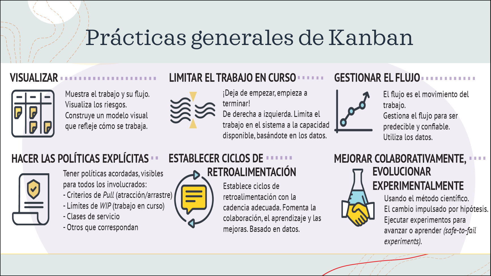

> La presentación de la cátedra muestra las **6 prácticas generales de Kanban** con sus íconos característicos:

| # | Práctica | Qué implica |
|---|---|---|
| 1 | **Visualizar** | Mostrar el trabajo y su flujo. Visualizar los **riesgos**. Construir un modelo visual que refleje cómo se trabaja. |
| 2 | **Limitar el WIP** | **¡Deja de empezar, empieza a terminar!**. De derecha a izquierda. Limitá el trabajo en el sistema a la **capacidad disponible**, basándote en datos. |
| 3 | **Gestionar el flujo** | El flujo es el **movimiento del trabajo**. Gestioná el flujo para que sea **predecible y confiable**. Usá datos. |
| 4 | **Hacer las políticas explícitas** | Tener políticas acordadas, **visibles** para todos los involucrados: criterios de pull, límites de WIP, clases de servicio, etc. |
| 5 | **Establecer ciclos de retroalimentación** | Cadencia adecuada. Fomentá la **colaboración, el aprendizaje y las mejoras**. **Basado en datos**. |
| 6 | **Mejorar colaborativamente, evolucionar experimentalmente** | **Usando el método científico**. Cambio impulsado por hipótesis. **Ejecutar experimentos** para avanzar o aprender (*safe-to-fail experiments*). |

---

## La práctica de Visualizar

> **Visualizar** el trabajo es la **primera práctica** y la más visible. Permite absorber y procesar una gran cantidad de información en un corto intervalo de tiempo, habilita la cooperación (todos tienen la misma imagen) y permite tomar decisiones de forma más rápida y colaborativa.

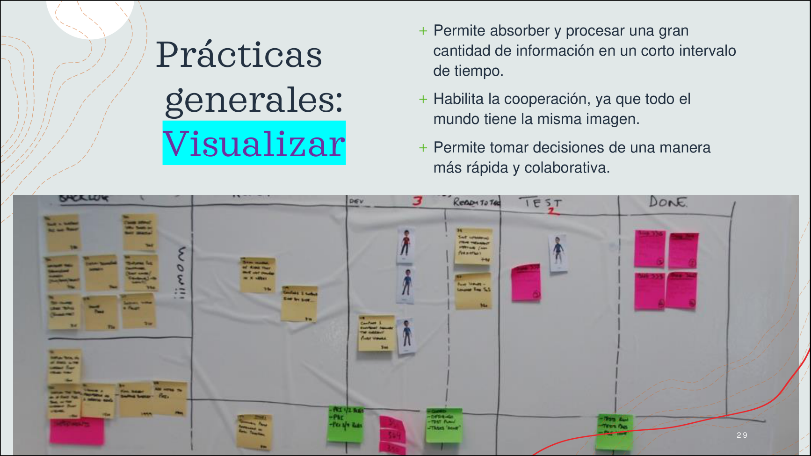

> Ejemplo de un **tablero Kanban real** (de un equipo de la cátedra): columnas **BACKLOG → DEV → TEST → DONE**, post-its amarillos con historias, **muñequitos** marcando los que están en progreso (WIP visual) y post-its rosas para indicar bloqueos. Notá cómo las **filas** permiten ver una historia moviéndose de izquierda a derecha.

### Cómo visualizar: dividir el trabajo en piezas

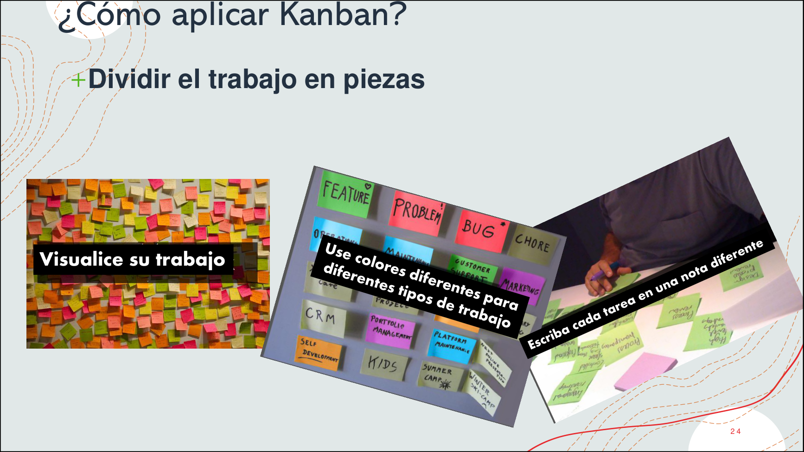

> La imagen muestra los **3 pasos para visualizar bien el trabajo**:
> 1. **Visualice su trabajo** → armá un tablero físico con post-its.
> 2. **Use colores diferentes para diferentes tipos de trabajo** → para distinguir features, bugs, mantenimiento, etc.
> 3. **Escriba cada tarea en una nota diferente** → un post-it por ítem (no mezclar varios en uno).

---

## Tipos de trabajo (clases de servicio)

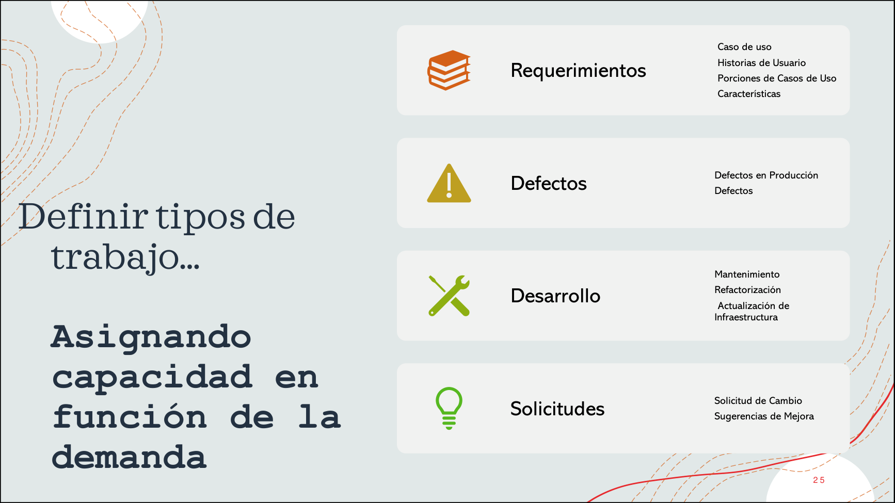

> La imagen muestra los **4 tipos de trabajo** que típicamente se ven en un tablero Kanban, con su ícono característico:

| Tipo de trabajo | Ejemplos | Color sugerido |
|---|---|---|
| **Requerimientos** | Casos de uso, Historias de Usuario, Porciones de Casos de Uso, Características. | Naranja (book) |
| **Defectos** | Defectos en Producción, Defectos. | Amarillo (warning) |
| **Desarrollo** | Mantenimiento, Refactorización, Actualización de Infraestructura. | Verde (tools) |
| **Solicitudes** | Solicitud de Cambio, Sugerencias de Mejora. | Amarillo (bulb) |

> En el tablero, cada tipo de trabajo se puede **asignar capacidad en función de la demanda** (ej. 60% features, 30% mantenimiento, 10% defectos).

---

## Clases de servicio

> En Kanban, las **clases de servicio** definen **diferentes niveles de atención** para distintos tipos de trabajo. Permiten que el equipo atienda primero lo más urgente, según la **urgencia y el valor** del ítem.

| Clase | Cuándo se usa | Color de tarjeta (ejemplo) |
|---|---|---|
| **Expreso** (Expedite) | Trabajos urgentes que rompen el flujo (ej. un fix de seguridad crítico). **WIP = 1**. | **Blanco** |
| **Fecha fija** | Entregas con **fecha comprometida** (ej. release a un cliente). | (color distintivo) |
| **Estándar** | Trabajo normal. La mayoría de los ítems entran acá. | **Amarillo** |
| **Íntiles** | Trabajo que puede esperar (ej. mejora de UX no prioritaria). | (color distintivo) |

> Es básicamente una forma de **priorizar** el trabajo en el tablero.

### Ejemplo: políticas para clase de servicio "Expreso"

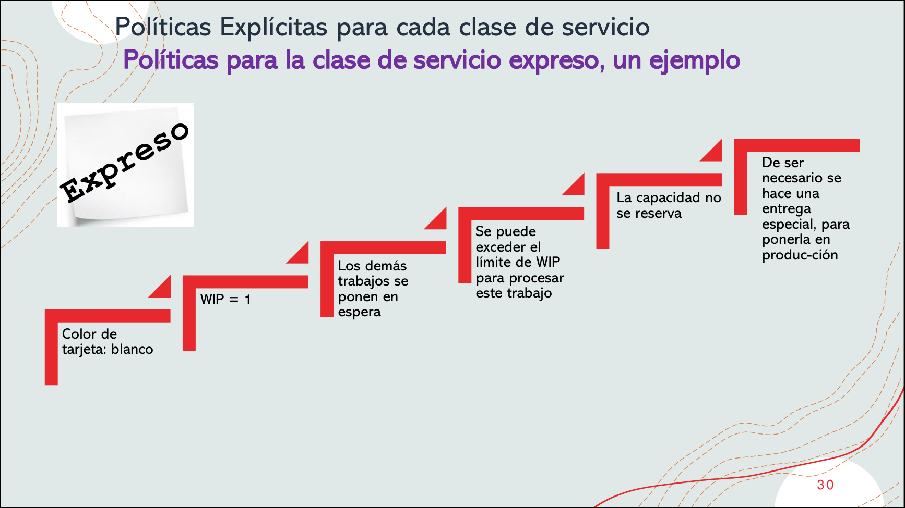

> Las **políticas** de la clase Expreso (color de tarjeta blanco) son:
> - **WIP = 1** (solo 1 ítem expreso a la vez).
> - Los demás trabajos se ponen en **espera**.
> - Se puede **exceder el WIP** para procesar este trabajo.
> - La capacidad **no se reserva** por adelantado.
> - De ser necesario, se hace una **entrega especial** para ponerlo en producción.

### Ejemplo: políticas para clase de servicio "Estándar"

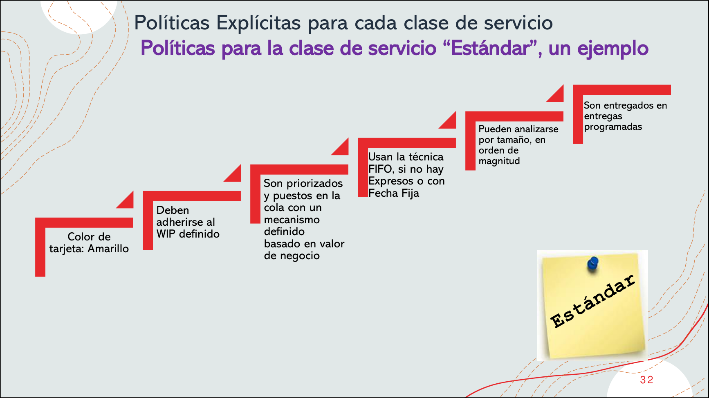

> Las **políticas** de la clase Estándar (color de tarjeta amarillo) son:
> - **Deben adherirse al WIP definido**.
> - Son **priorizados y puestos en la cola** con un mecanismo definido basado en **valor de negocio**.
> - Usan la técnica **FIFO** (First In, First Out), si no hay Expresos o con Fecha Fija.
> - Pueden **analizarse por tamaño**, en orden de magnitud.
> - Son entregados en **entregas programadas**.

---

## Políticas explícitas

> Las **políticas** en Kanban son básicamente una serie de **reglas que el equipo define** explícitamente para que el sistema funcione. **No introduces cambios grandes**, solo acordás las reglas que el equipo seguirá.

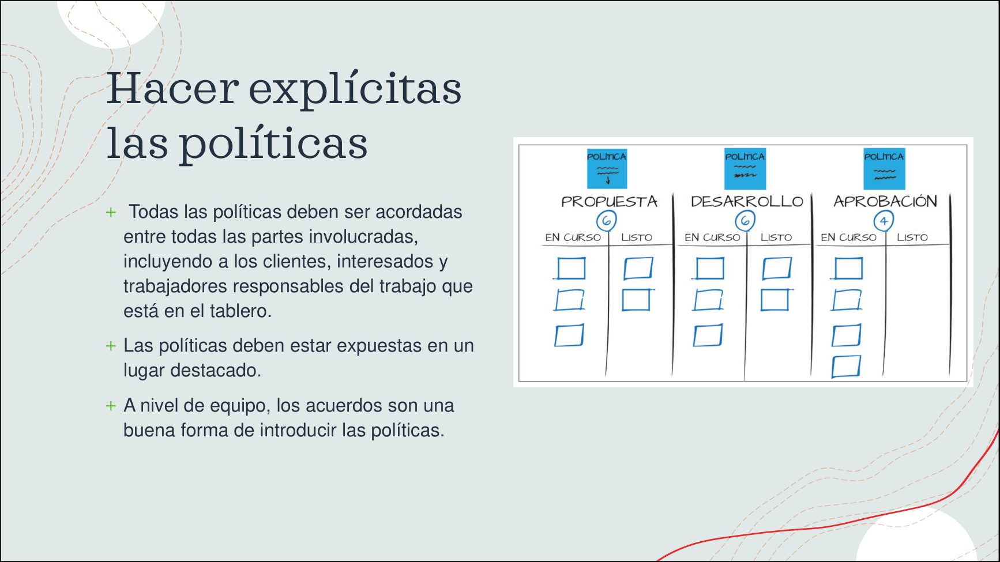

> La imagen muestra un tablero con **3 políticas escritas** en post-its azules (arriba de cada conjunto de columnas): **PROPUESTA**, **DESARROLLO** y **APROBACIÓN**. Cada política tiene su **WIP (6)** y columnas **En curso / Listo**.

- **Todas las políticas deben ser acordadas** entre todas las partes involucradas, incluyendo a los clientes, interesados y trabajadores responsables del trabajo que está en el tablero.
- Las políticas **deben estar expuestas en un lugar destacado** (a la vista de todos).
- A nivel de equipo, los **acuerdos** son una buena forma de introducir las políticas.

### Ejemplos de políticas

- **Criterios de entrada**: cuándo un ítem puede entrar al tablero (ej. debe tener criterios de aceptación).
- **Criterios de avance**: cuándo un ítem puede pasar de una columna a la siguiente (ej. tests unitarios pasando).
- **Criterios de salida (DoD)**: cuándo un ítem se considera terminado.
- **Límites de WIP**: cuántos ítems pueden estar en cada columna simultáneamente.
- **Frecuencia de revisión**: cuándo se reúne el equipo para revisar el tablero.

> **Kanban propone una cultura de mejora continua**, donde **no introduce nuevos roles ni procesos**; el equipo **se autorregula**.

---

## WIP (Work In Progress)

> Es la cantidad de trabajo **en curso** (no terminado) en un momento dado. Es el **concepto central** de Kanban.

### ¿Por qué limitar el WIP?

- **Reduce el tiempo de entrega** (*lead time*).
- **Reduce los bloqueos** (el equipo no se satura).
- **Mejora la calidad** (se termina lo que se empieza, no se abandona).
- **Hace visibles los problemas** del flujo.

### ¿Qué pasa si limito el WIP?

- El equipo **se ve obligado a terminar lo que empezó** antes de tomar trabajo nuevo.
- Esto **expone cuellos de botella** (la columna que se llena).
- Fomenta la **colaboración** (el equipo ayuda donde hay atasco).

### Visualización del WIP

> Un **atraso** se acumula en la **última columna antes del cuello de botella**, no en el cuello mismo.

> *Ejemplo*: en una cocina, si el horno es lento, los platos se acumulan esperando para entrar al horno, no dentro del horno.

---

## El tablero Kanban


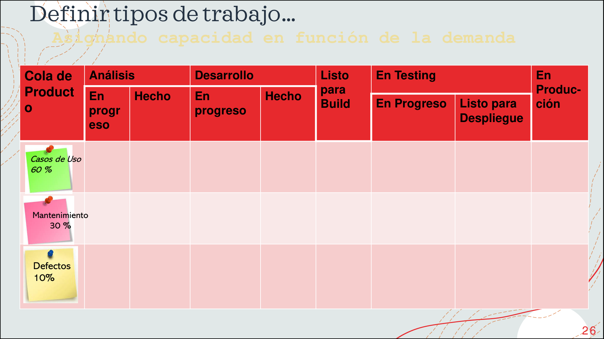

> Ejemplo de un **tablero Kanban con clases de servicio** diferenciado por **color de post-it**:
> - **Verde** → Casos de Uso (60% de la capacidad).
> - **Rosa** → Mantenimiento (30%).
> - **Amarillo** → Defectos (10%).
>
> Las columnas siguen el flujo: **Cola de Producto → Análisis (En progreso / Hecho) → Desarrollo (En progreso / Hecho) → Listo para Build → En Testing (En Progreso / Listo para Despliegue) → En Producción**.

> Cada columna tiene un **WIP máximo** definido. Los ítems deben **adherirse al WIP definido** en cada columna.

### Estructura típica

```
| Cola de Producto | Análisis (En progreso / Hecho) | Desarrollo (En progreso / Hecho) | Listo para Build | En Testing (En progreso / Listo para Despliegue) | En Producción |
|------------------|----------------------------------|----------------------------------|------------------|------------------------------------------------|---------------|
| Casos de Uso     |                                  |                                  |                  |                                                |               |
| Mantenimiento    |                                  |                                  |                  |                                                |               |
| Defectos         |                                  |                                  |                  |                                                |               |
```

### Tipos de ítems en el tablero

- **Casos de uso** (nuevas features).
- **Mantenimiento** (cambios a features existentes).
- **Defectos** (bugs).

> El **mix de ítems** en la cola de producto refleja la **estrategia** del equipo.

### ¿Qué pasa si el WIP está lleno?


- **No tomás trabajo nuevo** hasta que alguien libere una posición.
- Esto te obliga a **ayudar** a quien está saturado o a **mejorar el proceso** para que el cuello de botella se destrabe.
- Si el equipo ignora el WIP, el sistema **se rompe**: se acumulan ítems, se degradan las prioridades, se mezclan los tipos de trabajo.

---

## Cartel de saturación (humor)


> Cuando los equipos están saturados, lo que se escucha es: *"estoy bloqueado, estoy saturado, tengo disponibilidad, hagamos algo acerca de esto"*. El WIP limit **obliga** a tomar acción.

---

## Métricas de Kanban

### Resumen: ¿Cómo aplicar Kanban?

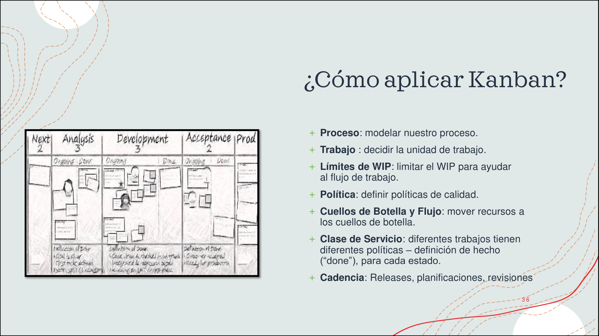

> Resumen visual de la presentación de la cátedra: para **aplicar Kanban** hay que trabajar sobre **6 dimensiones**:

| Dimensión | Qué implica |
|---|---|
| **Proceso** | Modelar nuestro proceso. |
| **Trabajo** | Decidir la **unidad de trabajo** (item, historia, ticket). |
| **Límites de WIP** | Limitar el WIP para ayudar al **flujo de trabajo**. |
| **Política** | Definir **políticas de calidad** explícitas. |
| **Cuellos de Botella y Flujo** | Mover recursos a los cuellos de botella. |
| **Clase de Servicio** | Diferentes trabajos tienen **diferentes políticas** → definición de "done" para cada estado. |
| **Cadencia** | Releases, planificaciones, revisiones. |

### Cycle Time y Lead Time (métricas de proceso)


> La imagen muestra un **tablero real** con las dos métricas principales visualizadas con flechas:
> - **Lead Time = Vista del Cliente**: desde el **BACKLOG** hasta **COMPLETE**. Es lo que el cliente "ve" como tiempo de espera.
> - **Cycle Time = Vista Interna**: desde que el equipo **arranca a trabajar** (DEV) hasta **COMPLETE**. Es lo que el equipo controla.

> **Cycle Time** = tiempo desde que el equipo **empieza a trabajar** en un ítem hasta que lo **termina**.

> **Lead Time** = tiempo desde que el ítem **entra al sistema** (se pide) hasta que se **entrega al cliente**.

- **Lead Time ≥ Cycle Time** (lead time incluye el tiempo de espera en cola).
- **Cycle Time** es una métrica del equipo.
- **Lead Time** es una métrica del cliente (lo que él "ve").

### Touch Time y Eficiencia del ciclo de proceso


> **Touch Time** (Tiempo de Tocado): el tiempo en el cual un ítem fue **realmente trabajado** (o "tocado") por el equipo. Es decir, **cuántos días hábiles pasó este ítem en columnas de "trabajo en curso"**, en oposición con columnas de cola/buffer y estado.

> La fórmula clave: **Touch Time ≤ Cycle Time ≤ Lead Time**.

> **% Eficiencia ciclo proceso = Touch Time / Elapsed Time**.

- **Touch Time**: tiempo en el cual un ítem fue realmente trabajado (no en cola).
- Sirve para detectar cuánto del tiempo del ítem es **trabajo real** vs. **espera**.

---

## Mejorar colaborativamente

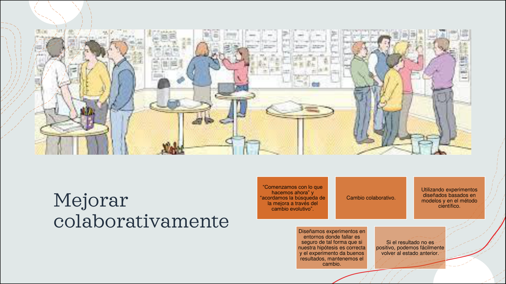

> La **sexta práctica** de Kanban es **mejorar colaborativamente, evolucionar experimentalmente**. La idea es:
> - **Comenzamos con lo que hacemos ahora** y acordamos la búsqueda de la mejora a través del **cambio evolutivo**.
> - **Cambio colaborativo**.
> - Usando **experimentos diseñados basados en modelos y en el método científico**.
> - **Diseñamos experimentos en entornos donde fallar es seguro** de tal forma que si nuestra hipótesis es correcta y el experimento da buenos resultados, mantenemos el cambio.
> - Si el resultado **no es positivo**, podemos **fácilmente volver al estado anterior**.

---

## Kanban vs. Scrum

| Aspecto | Scrum | Kanban |
|---|---|---|
| **Roles** | Define roles (PO, SM, Devs). | No prescribe roles. |
| **Sprints** | Sprints de duración fija. | Flujo continuo, sin sprints. |
| **Cambios** | No se puede cambiar el alcance del Sprint en curso. | Se puede cambiar el WIP en cualquier momento. |
| **Métricas** | Velocity, burndown. | Cycle Time, Lead Time. |
| **WIP** | Limitado por el tamaño del Sprint. | Explícitamente limitado. |
| **Tablero** | Se resetea en cada Sprint. | Persistente, el ítem fluye a través del tablero. |

---

## Chivo para el oral

1. **Concepto**: Kanban = "tarjeta visual". Es un sistema para **gestionar el flujo** de trabajo, no prescribe roles ni sprints.
2. **Origen**: Toyota. Optimizar el flujo de tareas.
3. **4 principios**: empezar con lo que haces, cambios incrementales, respetar el proceso, liderazgo en todos los niveles.
4. **6 prácticas**: visualizar, limitar WIP, gestionar flujo, hacer explícitas las políticas, ciclos de feedback, mejora colaborativa.
5. **WIP (Work In Progress)**: **concepto central**. Limitar el WIP **expone cuellos de botella** y **fuerza la colaboración**.
6. **Clases de servicio**: A (expedite), B (fecha fija), C (estándar), D (íntiles).
7. **Políticas explícitas**: reglas acordadas por el equipo, no por el framework.
8. **Métricas**: **Cycle Time** (empieza a trabajar → termina) y **Lead Time** (entra al sistema → cliente). **Lead Time ≥ Cycle Time**.
9. **Cerrá con la idea**: Kanban es **visualizar + limitar + mejorar**. El WIP es lo que fuerza al equipo a **terminar antes de empezar más cosas**.

> **Si te preguntan "¿qué pasa si el WIP está lleno?"** → no se toma trabajo nuevo. Esto fuerza al equipo a **ayudar a quien está saturado** o a **mejorar el proceso**. La saturación se vuelve **visible**.
