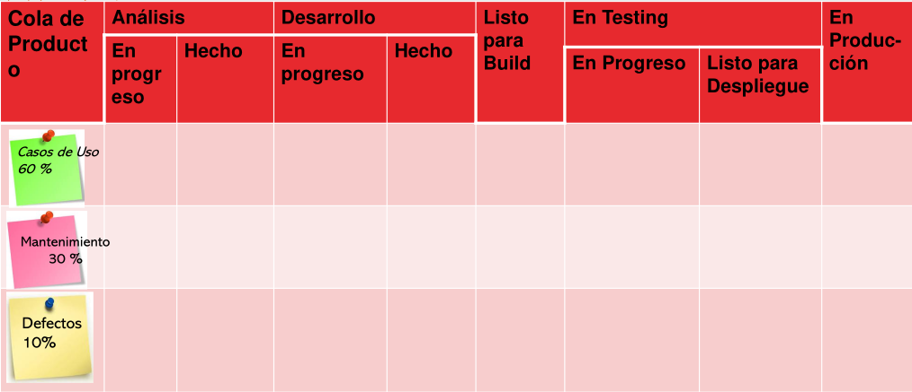
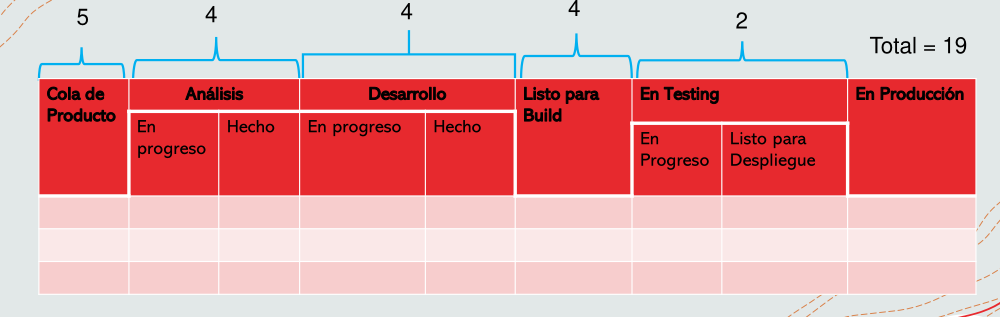
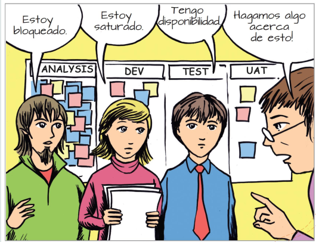

# 11 — Kanban

> Págs. 131-138 del apunte. Cubre el concepto de Kanban, las políticas, el WIP, las clases de servicio y las métricas básicas.

## Concepto

> **Kanban** (看板) significa **"tarjeta" o "letrero visual"** en japonés. Es un **sistema de gestión visual** del trabajo, originario del sistema de producción de Toyota, que busca **optimizar el flujo** de tareas a través de un proceso.

> **No prescribe** un proceso específico ni un conjunto de roles: **se aplica sobre el proceso existente** del equipo.

---

## ¿Por qué usar Kanban?

> Los equipos que pasan a Kanban suelen estar **saturados** y sufriendo de **muchas interrupciones**.

- **Foco en el cliente**: entregar valor de forma continua.
- **Foco en el flujo**: visualizar y gestionar el trabajo para que fluya sin bloqueos.
- **Foco en la mejora continua**: optimizar el sistema de forma incremental.

> **Limitar el WIP promueve la conversación y la mejora**. Si alguien termina una tarea y no puede tomar otra, se ve obligado a ayudar a quien está saturado o a mejorar el proceso.

---

## Principios del método Kanban

1. **Empezar con lo que haces ahora**.
2. **Buscar el acuerdo en cambios incrementales y evolutivos**.
3. **Respetar el proceso actual**, los roles y responsabilidades.
4. **Fomentar el liderazgo en todos los niveles**.

---

## Las 6 prácticas centrales

1. **Visualizar el flujo de trabajo** (tablero).
2. **Limitar el WIP** (*Work In Progress*).
3. **Gestionar el flujo** (medir, supervisar, optimizar).
4. **Hacer explícitas las políticas** (reglas del proceso).
5. **Implementar ciclos de feedback** (reuniones, reviews).
6. **Mejorar colaborativamente** (experimentar, evolucionar).

---

## Clases de servicio

> En Kanban, las **clases de servicio** definen **diferentes niveles de atención** para distintos tipos de trabajo. Permiten que el equipo atienda primero lo más urgente, según la **urgencia y el valor** del ítem.

| Clase | Cuándo se usa |
|---|---|
| **Clase A — Expedite** | Trabajos urgentes que rompen el flujo (ej. un fix de seguridad crítico). |
| **Clase B — Fecha fija** | Entregas con **fecha comprometida** (ej. release a un cliente). |
| **Clase C — Estándar** | Trabajo normal. La mayoría de los ítems entran acá. |
| **Clase D — Íntiles** | Trabajo que puede esperar (ej. mejora de UX no prioritaria). |

> Es básicamente una forma de **priorizar** el trabajo en el tablero.

---

## Políticas explícitas

> Las **políticas** en Kanban son básicamente una serie de **reglas que el equipo define** explícitamente para que el sistema funcione. **No introduces cambios grandes**, solo acordás las reglas que el equipo seguirá.

### Ejemplos de políticas

- **Criterios de entrada**: cuándo un ítem puede entrar al tablero (ej. debe tener criterios de aceptación).
- **Criterios de avance**: cuándo un ítem puede pasar de una columna a la siguiente (ej. tests unitarios pasando).
- **Criterios de salida (DoD)**: cuándo un ítem se considera terminado.
- **Límites de WIP**: cuántos ítems pueden estar en cada columna simultáneamente.
- **Frecuencia de revisión**: cuándo se reúne el equipo para revisar el tablero.

> **Kanban propone una cultura de mejora continua**, donde **no introduce nuevos roles ni procesos**; el equipo **se autorregula**.

---

## WIP (Work In Progress)

> Es la cantidad de trabajo **en curso** (no terminado) en un momento dado. Es el **concepto central** de Kanban.

### ¿Por qué limitar el WIP?

- **Reduce el tiempo de entrega** (*lead time*).
- **Reduce los bloqueos** (el equipo no se satura).
- **Mejora la calidad** (se termina lo que se empieza, no se abandona).
- **Hace visibles los problemas** del flujo.

### ¿Qué pasa si limito el WIP?

- El equipo **se ve obligado a terminar lo que empezó** antes de tomar trabajo nuevo.
- Esto **expone cuellos de botella** (la columna que se llena).
- Fomenta la **colaboración** (el equipo ayuda donde hay atasco).

### Visualización del WIP

> Un **atraso** se acumula en la **última columna antes del cuello de botella**, no en el cuello mismo.

> *Ejemplo*: en una cocina, si el horno es lento, los platos se acumulan esperando para entrar al horno, no dentro del horno.

---

## El tablero Kanban



> Cada columna tiene un **WIP máximo** definido. Los ítems deben **adherirse al WIP definido** en cada columna.

### Estructura típica

```
| Cola de Producto | Análisis (En progreso / Hecho) | Desarrollo (En progreso / Hecho) | Listo para Build | En Testing (En progreso / Listo para Despliegue) | En Producción |
|------------------|----------------------------------|----------------------------------|------------------|------------------------------------------------|---------------|
| Casos de Uso     |                                  |                                  |                  |                                                |               |
| Mantenimiento    |                                  |                                  |                  |                                                |               |
| Defectos         |                                  |                                  |                  |                                                |               |
```

### Tipos de ítems en el tablero

- **Casos de uso** (nuevas features).
- **Mantenimiento** (cambios a features existentes).
- **Defectos** (bugs).

> El **mix de ítems** en la cola de producto refleja la **estrategia** del equipo.

### ¿Qué pasa si el WIP está lleno?



- **No tomás trabajo nuevo** hasta que alguien libere una posición.
- Esto te obliga a **ayudar** a quien está saturado o a **mejorar el proceso** para que el cuello de botella se destrabe.
- Si el equipo ignora el WIP, el sistema **se rompe**: se acumulan ítems, se degradan las prioridades, se mezclan los tipos de trabajo.

---

## Cartel de saturación (humor)



> Cuando los equipos están saturados, lo que se escucha es: *"estoy bloqueado, estoy saturado, tengo disponibilidad, hagamos algo acerca de esto"*. El WIP limit **obliga** a tomar acción.

---

## Métricas de Kanban

### Cycle Time y Lead Time (métricas de proceso)

> **Cycle Time** = tiempo desde que el equipo **empieza a trabajar** en un ítem hasta que lo **termina**.

> **Lead Time** = tiempo desde que el ítem **entra al sistema** (se pide) hasta que se **entrega al cliente**.

- **Lead Time ≥ Cycle Time** (lead time incluye el tiempo de espera en cola).
- **Cycle Time** es una métrica del equipo.
- **Lead Time** es una métrica del cliente (lo que él "ve").

### Eficiencia del ciclo de proceso

> **% Eficiencia = Touch Time / Elapsed Time**.

- **Touch Time**: tiempo en el cual un ítem fue realmente trabajado (no en cola).
- Sirve para detectar cuánto del tiempo del ítem es **trabajo real** vs. **espera**.

---

## Kanban vs. Scrum

| Aspecto | Scrum | Kanban |
|---|---|---|
| **Roles** | Define roles (PO, SM, Devs). | No prescribe roles. |
| **Sprints** | Sprints de duración fija. | Flujo continuo, sin sprints. |
| **Cambios** | No se puede cambiar el alcance del Sprint en curso. | Se puede cambiar el WIP en cualquier momento. |
| **Métricas** | Velocity, burndown. | Cycle Time, Lead Time. |
| **WIP** | Limitado por el tamaño del Sprint. | Explícitamente limitado. |
| **Tablero** | Se resetea en cada Sprint. | Persistente, el ítem fluye a través del tablero. |

---

## Chivo para el oral

1. **Concepto**: Kanban = "tarjeta visual". Es un sistema para **gestionar el flujo** de trabajo, no prescribe roles ni sprints.
2. **Origen**: Toyota. Optimizar el flujo de tareas.
3. **4 principios**: empezar con lo que haces, cambios incrementales, respetar el proceso, liderazgo en todos los niveles.
4. **6 prácticas**: visualizar, limitar WIP, gestionar flujo, hacer explícitas las políticas, ciclos de feedback, mejora colaborativa.
5. **WIP (Work In Progress)**: **concepto central**. Limitar el WIP **expone cuellos de botella** y **fuerza la colaboración**.
6. **Clases de servicio**: A (expedite), B (fecha fija), C (estándar), D (íntiles).
7. **Políticas explícitas**: reglas acordadas por el equipo, no por el framework.
8. **Métricas**: **Cycle Time** (empieza a trabajar → termina) y **Lead Time** (entra al sistema → cliente). **Lead Time ≥ Cycle Time**.
9. **Cerrá con la idea**: Kanban es **visualizar + limitar + mejorar**. El WIP es lo que fuerza al equipo a **terminar antes de empezar más cosas**.

> **Si te preguntan "¿qué pasa si el WIP está lleno?"** → no se toma trabajo nuevo. Esto fuerza al equipo a **ayudar a quien está saturado** o a **mejorar el proceso**. La saturación se vuelve **visible**.
