# 12 — Métricas de Software

> Págs. 138-148 del apunte + presentación de clase "Métricas de Software en los Diferentes Enfoques" + resumen de Facu. Es **el tema del examen final**, así que está tratado con mayor profundidad y ejemplos.

---

## 1. ¿Por qué medir? La importancia de las métricas

> *"No se puede controlar, gestionar ni mejorar lo que no se mide."* — Lord Kelvin

> *"Cuando podemos medir aquello de lo que hablamos y expresarlo en números, realmente sabemos algo acerca de ello."*

- **Una métrica es, por definición, un número**: un valor **cuantitativo y objetivo** que nos permite determinar la presencia de algo que queremos medir.
- **Uno mide para tener visibilidad** sobre cierta situación, porque quiere **aumentar su nivel de conocimiento** sobre algún aspecto, y desde las métricas se construyen **indicadores** para ayudarnos a **tomar decisiones**.
- **Tomar decisiones informadas es una aspiración que cualquier persona tiene. Si uno tiene información para decidir, decide mejor.**

### Definición formal (IEEE, citada por Pressman)

> **Métrica**: medida cuantitativa del grado en el que un sistema, componente o proceso posee un atributo determinado.

### Las 3 reglas de oro de las métricas

1. **Objetiva**: tiene que ser un número, no una opinión.
2. **Simple e intuitiva**: si nadie la entiende, no se usa.
3. **Costo razonable**: el costo de recolectarla no puede superar al beneficio de usarla.

> **Ejemplo propio (trampa de medir lo inmedible)**: en clase se mencionó el caso de una empresa que quiso medir la *"cantidad de requerimientos identificados en función de los que deberíamos haber identificado"*. Esto es **imposible de medir objetivamente**, porque no podemos contabilizar aquello que **ni siquiera sabemos que ignoramos**. Es un desperdicio (Lean lo llama desperdicio puro) dedicar esfuerzo a recolectar un número que no existe.

### 1.1. Métrica vs. Indicador

> Es importante **no confundir** estos dos términos. Aunque suelen usarse como sinónimos en el lenguaje cotidiano, tienen **roles distintos** en la gestión.

| Concepto | Qué es | Características | Ejemplo |
|---|---|---|---|
| **Métrica** | Es el **número crudo** que se mide directamente. | **Objetiva, cuantificable, única**. Es el dato base. | "30 defectos graves en producción". |
| **Indicador** | Es una **métrica compuesta o comparada** que **aporta contexto** para tomar decisiones. | **Relativo, comparativo, derivado**. Es la señal accionable. | "30 defectos graves vs. 10 esperados = desvío del 200% → ROJO". |

> **Relación**: la métrica es el **dato base**; el indicador es la **señal accionable** que se construye **a partir de la métrica** aplicando una comparación, un umbral o un ratio. **El indicador da información para decidir**.

> **Analogía (medicina)**: la **métrica** es la presión arterial (120/80 mmHg), y el **indicador** es saber si eso es **normal o alto** comparado con los valores de referencia. El número solo no dice nada; necesita contexto.

#### Ejemplo propio (métrica vs. indicador en software)

> - **Métrica**: "El sistema tuvo **45 defectos** en el último release".
> - **Indicador 1 (comparación con plan)**: "45 defectos vs. 15 esperados → desvío del **200%** → **ROJO**, hay que investigar la causa raíz".
> - **Indicador 2 (ratio)**: "Densidad de defectos = 45 / 15 KLOC = **3 defectos por KLOC** → comparable con el estándar de la industria (1-5/KLOC)".
> - **Indicador 3 (tendencia)**: "45 defectos hoy, pero la tendencia de los últimos 5 releases es 60 → 50 → 40 → 42 → 45 → **mejorando**".

> **Cómo memorizarlo**: la **métrica** es el **dato** (el número). El **indicador** es la **alarma** (el número con un significado, contexto y acción asociada).

#### ¿Cómo se construye un indicador?

Un buen indicador surge de **combinar la métrica con**:
- Un **umbral** o valor de referencia (ej. "menos de 10 defectos es aceptable").
- Una **comparación temporal** (tendencia, comparando con releases anteriores).
- Una **comparación con el plan** (desvío vs. lo esperado).
- Un **ratio** (defectos por KLOC, defectos por hora de desarrollo, etc.).

> **Conexión con la unidad 1**: este concepto se introduce brevemente en `Apuntes-MD/unidad-1/13-metricas-de-software.md`. Acá lo tratamos en profundidad con ejemplos.

### 1.2. Estimación vs. Métrica (se mira lo mismo, pero en momentos distintos)

> Es común preguntarse: *"¿por qué se estima lo mismo que se mide? ¿tamaño, esfuerzo, calendario?"*. **Sí, se mira lo mismo**, pero en **momentos distintos** y con **propósitos distintos**. **No es lo mismo**.

| | **Estimación** | **Métrica** |
|---|---|---|
| **Cuándo se hace** | **Antes** de hacer el trabajo (mirando hacia adelante). | **Después** de hacer el trabajo (mirando hacia atrás). |
| **Propósito** | Predecir cuánto va a llevar. | Medir cuánto llevó realmente. |
| **Base** | Suposiciones, experiencia, analogía, datos históricos. | Datos reales del proyecto. |
| **Naturaleza** | **Subjetiva**, aproximada, con incertidumbre. | **Objetiva**, cuantificable. |
| **Resultado** | "Estimamos que el proyecto va a llevar **200 horas**". | "El proyecto llevó **250 horas**". |
| **Símil** | Pronóstico del tiempo. | Lo que terminó lloviendo. |

> **Cómo se conectan**: con el tiempo, las **métricas alimentan las próximas estimaciones**. Si en 5 proyectos mediste que tu equipo tarda **25% más** de lo estimado, el próximo proyecto vas a estimar con un colchón del 25%. **Sin métricas, tus estimaciones no mejoran**.

#### Ejemplo propio (estimación vs. métrica en un sprint)

> **Antes del sprint (estimación)**:
> - Estimamos que la **capacidad** del equipo es **140 horas** (mirando el calendario y las horas por día de cada persona).
> - Estimamos que la **velocidad** del equipo va a ser **40 puntos** (mirando sprints anteriores).
> - Estimamos que el equipo va a poder comprometerse a **40 story points**.

> **Durante el sprint (ejecución)**:
> - Vamos midiendo **burndown** (cuántos puntos quedan).
> - Vamos viendo cuántos puntos va completando el equipo.

> **Después del sprint (métrica real)**:
> - El equipo **trabajó 130 horas reales** (métrica de esfuerzo).
> - El PO **aceptó 43 story points** (métrica de velocidad).
> - El desvío fue: capacidad estimada = 140h, real = 130h → **subutilización del 7%** (indicador: amarillo, casi en el plan).

> **Para el próximo sprint (alimentación)**:
> - Como el equipo entregó más puntos (43) de los estimados (40), la **estimación del próximo sprint** puede ajustarse a 43 o 45 puntos, **alimentada por la métrica** del sprint anterior.

#### Donde se encuentran: el **desvío**

> El **desvío** es donde **estimación y métrica se dan la mano**:

```
Desvío = (Real - Planificado) / Planificado × 100
```

- El **"Planificado"** es **estimación** (lo que predijiste).
- El **"Real"** es **métrica** (lo que mediste).
- El **"Desvío"** en sí es un **indicador** (métrica compuesta con contexto).

> **Cómo memorizarlo**: 
> - **Estimación = pronóstico del tiempo** ("va a llover 20mm"). 
> - **Métrica = lo que realmente llovió** ("llovió 35mm"). 
> - **Indicador = desvío** ("llovió 75% más de lo pronosticado → alerta"). 
> - Las métricas **mejoran las próximas estimaciones**: si siempre llueve más de lo pronosticado, ajustás tu termómetro.

#### Conexión con Brooks

> *"Los proyectos se retrasan de a un día por vez"*.

Esto aplica a **las dos cosas**:
- A la **estimación**: cada día subestimás 1 hora → en 100 días son **100 horas extra acumuladas**.
- A la **métrica**: los pequeños desvíos diarios se acumulan hasta hacer **explotar el plan**.

> **La métrica te sirve para corregir la próxima estimación** (y así no seguir acumulando desvíos). **Sin métricas, seguís subestimando siempre lo mismo**.

> **Conexión con la unidad 1**: en `Apuntes-MD/unidad-1/13-metricas-de-software.md` se introduce este concepto de forma breve. Acá lo tratamos en profundidad con el ejemplo del sprint.

---

---

## 2. Los dominios de las métricas

> Las métricas de software **no son un bloque único**, sino que se dividen en **3 dominios clásicos** (proceso, proyecto, producto) más un **cuarto dominio que se agrega en clase**: **las personas**. La introducción al tema está en `Apuntes-MD/unidad-1/13-metricas-de-software.md`.

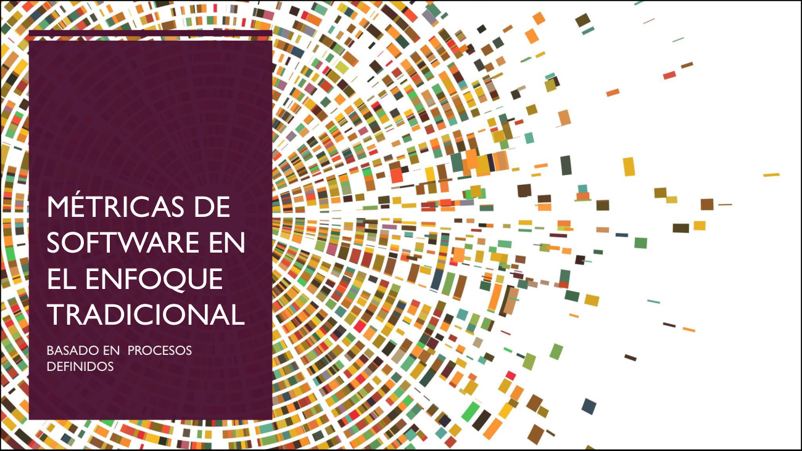

> Portada de la sección de la cátedra: **"Métricas de Software en el Enfoque Tradicional — Basado en procesos definidos"**.

### 2.1. Métricas de Proceso (estratégicas, largo plazo)

- **Propósito**: estratégico. Impacto a **largo plazo**.
- Las métricas de proyecto se **consolidan y despersonalizan** para crear métricas de proceso **públicas para toda la organización**.
- **Objetivo**: conducir a **mejorar el proceso** de desarrollo a largo plazo, evaluando la eficacia del mismo.
- Son las que usan las organizaciones con **modelos de calidad altos (CMMI, ISO)**.

### 2.2. Métricas de Proyecto (tácticas, corto plazo)

- **Propósito**: táctico.
- Usadas por el **gerente de proyecto y el equipo** para **valorar el estado** de un proyecto en marcha, adaptar el flujo de trabajo, rastrear riesgos y evaluar si se cumplen calendarios y presupuestos.
- Se relacionan con la **triple restricción**: **recursos, tiempo, alcance**.

### 2.3. Métricas de Producto (el software en sí)

- Evalúan las **características internas del software** (LOC, complejidad ciclomática) para **predecir y controlar atributos de calidad externos** (mantenibilidad, fiabilidad).
- Nos indican la **"aptitud para el uso"** de lo que estamos construyendo.

### 2.4. Personas (cuarto dominio, agregado en clase)

> El software lo hacen **personas**, así que también se miden cosas como:
- Satisfacción del equipo.
- Rotación.
- Carga de trabajo.
- Habilidades y capacitación.

> **Nota**: en la unidad 1 se cubren los **3 dominios clásicos**. Este cuarto (Personas) se agrega en clase para recordar que el software es una actividad humana.

### Ejemplo propio (despersonalización proceso vs. proyecto)

> Imaginá dos escenarios sobre la misma organización:
> - *"Mi producto X tuvo 5 defectos graves en su release 1.0"* → **métrica de producto** (atribuida a un producto específico).
> - *"Mi organización proyecta 3 defectos por millón de líneas de código en sus productos"* → **métrica de proceso** (despersonalizada, sumada de muchos proyectos, pública para toda la org).
>
> **Estoy midiendo lo mismo, pero el foco de medición es diferente**.

### GQM (Goal-Question-Metric)

> **GQM** = técnica que ayuda a **derivar las métricas a partir del objetivo de negocio** (Goal). Para llegar al objetivo, **formulamos preguntas** que podamos responder y cuya respuesta ayude a ver si nos estamos acercando al objetivo o no. De esas preguntas **derivamos las métricas**. Así nos aseguramos de que la organización tenga un enfoque de métricas **alineado con sus necesidades**.

**Ejemplo propio**:
- **Goal (G)**: "Reducir la cantidad de defectos graves en producción".
- **Question (Q)**: "¿Cuántos defectos graves llegaron a producción en el último release?".
- **Metric (M)**: "Cantidad de defectos graves detectados en producción, clasificados por severidad".

> Si la métrica no se conecta con un goal, no sirve.

---

## 3. Métricas básicas para un proyecto de software

> Las **4 métricas básicas** son las mismas que se introducen en la unidad 1 (`Apuntes-MD/unidad-1/13-metricas-de-software.md`). Acá las tratamos con más profundidad.

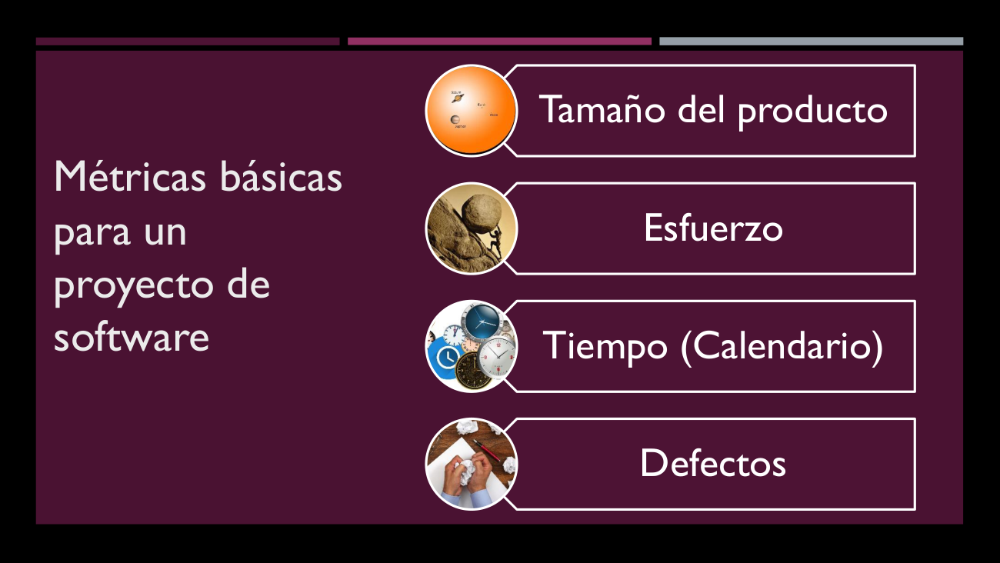

> La diapositiva de la cátedra muestra las **4 métricas básicas** con sus íconos: **Tamaño del producto**, **Esfuerzo**, **Tiempo (Calendario)** y **Defectos**.

| Métrica | Pertenece a | Dominio |
|---|---|---|
| **Tamaño del producto** | Producto. | Producto. |
| **Esfuerzo** | Proyecto. | Proyecto. |
| **Tiempo (calendario)** | Proyecto. | Proyecto. |
| **Defecto** | Producto. | Producto. |

### 3.1. Tamaño del producto

> **¿Cuánto tengo que construir?**

- **LOC** (Líneas de código): **no sirve bien**, es difícil de estimar antes de codificar.
- **Requerimientos** (contar funcionalidades, casos de uso con su complejidad, opciones de menú).
- En el enfoque ágil: **Puntos de Historia** o **Features**.

### 3.2. Esfuerzo

> **¿Cuánto trabajo necesito?** Medido en **horas-persona**.

- **Horas-persona lineales**: asume que es una persona haciendo un solo trabajo por vez.
- Si tengo 3 personas a 8 horas por día durante 5 días: **3 × 8 × 5 = 120 horas-persona**.

### 3.3. Tiempo (Calendario)

> **¿Cuándo lo entrego?**

Se calcula a partir del esfuerzo, pero entran en juego **otras variables**:
- ¿Cuántas horas trabajar por día?
- ¿Cuántos días por semana?
- ¿Índice de dependencia entre actividades (paralelizables o no)?
- ¿Cuánta gente va a trabajar?

> *"Para tal fecha yo estaría entregando tal producto."*

> **Cómo se calcula el desvío** (de la unidad 1): `(T.real - T.planificado) / T.planificado × 100`. Esto sirve para saber si el proyecto está en línea con lo planificado.

### 3.4. Defectos

> **¿Qué tan bien lo estoy haciendo?** Medir **qué cosas se detectaron que no son consecuentes con lo que se espera** del producto.

- Si contamos defectos sin tener en cuenta la **severidad**, no tiene mucho sentido.
- Las métricas se construyen apuntando a **cantidad de defectos por severidad**, **densidad de defectos**.
- No es lo mismo un **error bloqueante** que un **error de cosmética**.

### Severidad de defectos (recordatorio)

| Severidad | Descripción | Ejemplo |
|---|---|---|
| **Bloqueante** | Impide usar el sistema. | Login no funciona. |
| **Grave / Mayor** | Falla operacional importante. | Reporte no se puede generar. |
| **Menor** | Incomoda pero no impide usar. | Etiqueta mal escrita. |
| **Cosmético** | No afecta funcionalidad. | Color de un botón. |

---

## 4. "El sueño del pibe" — métricas por nivel

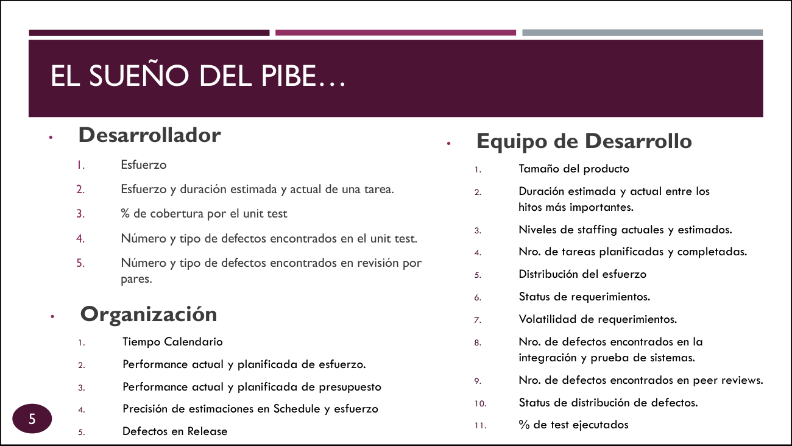

> La diapositiva de la cátedra muestra **qué métricas le importan a cada nivel** de la organización:

| Nivel | Métricas típicas |
|---|---|
| **Desarrollador** | Esfuerzo. Esfuerzo y duración estimada vs. actual de una tarea. % de cobertura de unit test. Número y tipo de defectos en unit test. Número y tipo de defectos encontrados en revisión por pares. |
| **Equipo de Desarrollo** | Tamaño del producto. Duración estimada vs. actual entre hitos importantes. Niveles de staffing actuales y estimados. Nro. de tareas planificadas y completadas. Distribución del esfuerzo. Status de requerimientos. **Volatilidad de requerimientos**. Nro. de defectos en integración y prueba de sistemas. Nro. de defectos en peer reviews. Status de distribución de defectos. % de tests ejecutados. |
| **Organización** | Tiempo calendario. Performance actual y planificada de **esfuerzo**. Performance actual y planificada de **presupuesto**. Precisión de estimaciones en Schedule y esfuerzo. **Defectos en release**. |

### Ejemplo propio (volatilidad de requerimientos)

> La **volatilidad de requerimientos** = (cantidad de requerimientos cambiados / total de requerimientos) × 100.
> Si en un sprint de 20 historias, 5 cambiaron: volatilidad = 25%.
> Una volatilidad alta significa que el equipo está **retrabajando** mucho y el plan no es estable.

### Ejemplo propio (defectos en release)

> La **performance actual vs. planificada de defectos en release**: si en el release 1.0 planificamos 10 defectos y tuvimos 35, la performance fue 350% (mal). Si tuvimos 8, fue 80% (mejor de lo esperado).

> **Cómo memorizar el "sueño del pibe"** (este punto también está en la unidad 1):
> - **Desarrollador** mira **su** trabajo (esfuerzo, unit tests).
> - **Equipo** mira **el proyecto** (tareas, staffing, defectos internos).
> - **Organización** mira **el proceso** (presupuesto, schedule, defectos en release).

---

## 5. Métricas en el enfoque tradicional

> Basado en **procesos definidos**. Busca la **repetibilidad**. Las variables robustas que medimos son:
- **Esfuerzo, Tiempo (Calendario), Costos, Defectos** (por severidad o etapa).
- **Tamaño del producto** en **Líneas de Código (LOC)** o **Puntos de Función (PF)**.

### Puntos de Función (PF)

> **Puntos de Función (Function Points)**: miden el **tamaño funcional** del software desde el punto de vista del usuario, contando las funciones que el sistema provee (entradas, salidas, consultas, archivos, interfaces).

- **Ventaja sobre LOC**: se puede estimar **antes** de codificar.
- Un PF es **agnóstico al lenguaje** (no importa si es Java, Python, etc.).

### Ejemplo propio (PF vs. LOC)

> Un sistema de gestión de clientes tiene 50 entradas, 30 salidas, 80 consultas, 15 archivos lógicos. Sus **PF ajustados = 175**.
> Si lo desarrollo en Java, pueden ser 50.000 LOC. Si lo desarrollo en Python, pueden ser 20.000 LOC. **Los PF son los mismos** → es la forma "lenguaje-agnóstica" de medir tamaño.

---

## 6. Métricas en el enfoque ágil

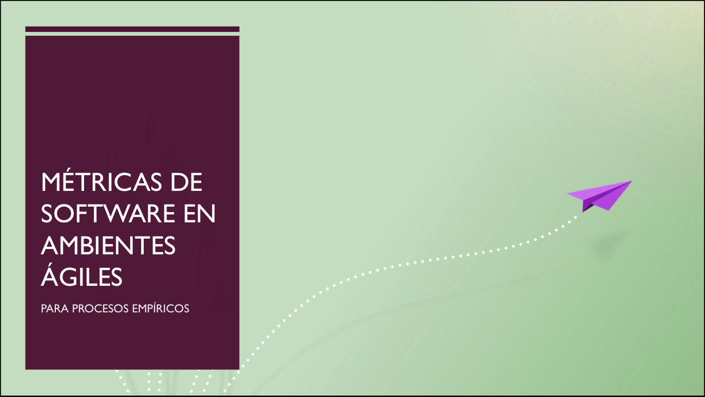

> Portada de la sección ágil: *"Métricas de Software en Ambientes Ágiles — Para procesos empíricos"*.

> **Regla de oro del agilismo**: la medición es una **salida**, no una actividad en sí misma. La filosofía es **minimalista**: medir lo necesario y nada más.

> **Dos principios ágiles** que guían la elección de métricas:
> - *"Nuestra mayor prioridad es satisfacer al cliente por medio de entregas tempranas y continuas de software valioso, funcionando."*
> - *"El software funcionando es la principal medida de progreso."*

> **Importante (de clase)**: la experiencia se construye en el equipo, **pero no es extrapolable**. La experiencia de un equipo no puede servir de base a otro equipo, e incluso a veces **la experiencia de un equipo no le sirve para el próximo sprint del mismo equipo**.

### Las 3 métricas ágiles estrella

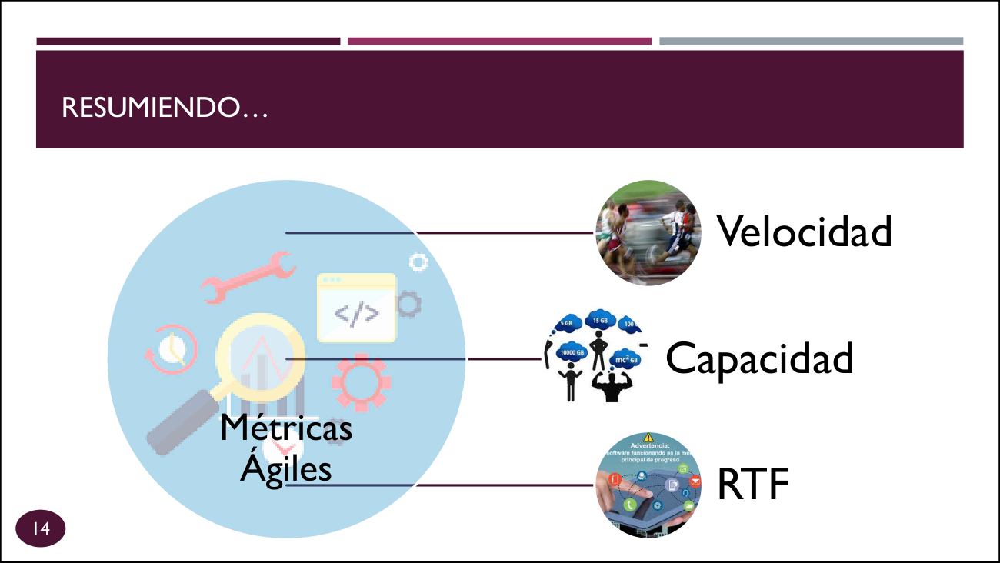

> La diapositiva resume las 3 métricas ágiles: **Velocidad**, **Capacidad** y **RTF** (Running Tested Features).

### 6.1. Velocidad

> **Velocidad**: cantidad de **puntos de historia aceptados** por el PO en un sprint. **Se mide en puntos de historia. Medimos PRODUCTO**.

- **La velocidad NO se estima, se calcula** al final del sprint con la cantidad de puntos de historia que el PO **me aceptó**.
- Es una **medición histórica** del equipo, no una predicción.

#### Ejemplo propio (la trampa de la velocidad constante)

> **Error común**: si el equipo tuvo 45 puntos de velocidad, asumir que va a tener 45 puntos de aquí en más. **Es un error importante** — el equipo no logró el principio de **desarrollo sostenible**.

> **Ejemplo real (del resumen de Facu, de la presentación de la cátedra)**: en el gráfico de velocidad del equipo:
> - Sprint 1: 0 puntos (equipo recién arrancando).
> - Sprint 2: 25 puntos.
> - Sprint 3: 45 puntos (pico).
> - Sprint 4: 35 puntos.
> - Sprint 5: 30 puntos.
> - Sprint 6: 42 puntos.
> - Sprint 7: **4 puntos** (¡caída! Las historias estaban **cerca de terminarse** pero el PO no las aceptó; cosas que no se completaron; historias que se descartaron).
> - Sprint 8: **43 puntos** (¡pico otra vez!).
>
> **Estas oscilaciones en la velocidad son situaciones que suceden con frecuencia**. Hay que entender por qué se producen, no asumirlas como "lo normal".

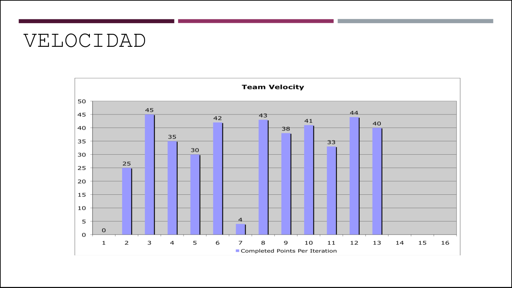

> **Cómo memorizarlo**: la velocidad es como el **pulso de un paciente**: un pico aislado no significa nada, pero una **tendencia sostenida** (subiendo o bajando) sí. Un **salto como del sprint 7 al 8** es una señal de alerta para investigar.

### 6.2. Capacidad

> **Capacidad**: la cantidad de **trabajo que el equipo es capaz de comprometerse** a hacer en un sprint.

- **Sí se puede estimar** para determinar cuánto comprometernos.
- Se puede medir en **horas** (equipos nuevos) o en **puntos de historia** (equipos maduros, que ya tienen historia).

#### Tabla de cálculo de capacidad (del apunte, págs. 146-147)

| Persona | Días disponibles | Días para otras actividades | Horas por día | Horas de esfuerzo disponibles |
|---|---|---|---|---|
| Jorge | 10 | 2 | 4-7 | 32-56 |
| Betty | 8 | 2 | 5-6 | 30-36 |
| Simón | 8 | 2 | 4-6 | 24-36 |
| Pedro | 9 | 2 | 2-3 | 14-21 |
| Raúl | 10 | 2 | 5-6 | 40-48 |
| **Total** | | | | **140-197 horas** |

- **Días disponibles (sin tiempo personal)**: ej. 10 = 14 días del mes - 4 findes - fiestas.
- **Días para otras actividades Scrum**: 2 (daily, planning, review, retrospective, grooming, etc).
- **Horas por día**: lo que cada persona puede dedicar al proyecto (varía si tiene otras responsabilidades).
- **Horas de esfuerzo disponibles**: días disponibles × horas por día.

> El equipo tiene entre **140 y 197 horas** de esfuerzo. Esta es la **capacidad** del equipo para el sprint.

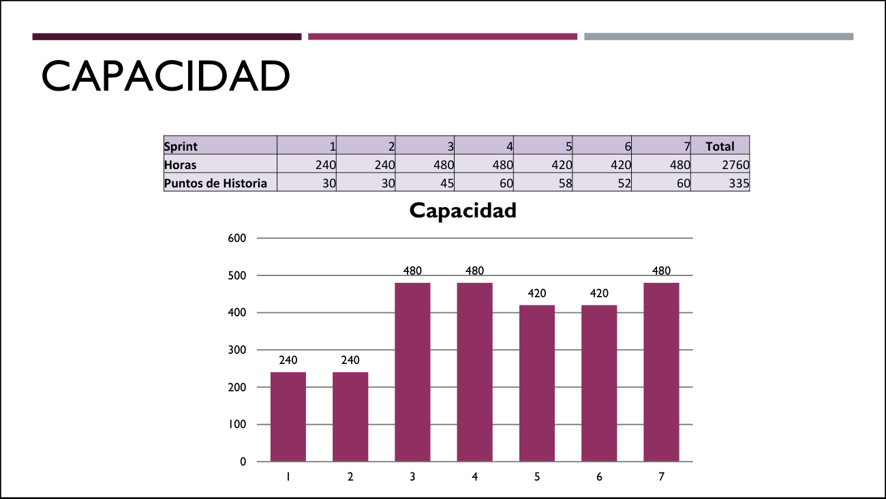

> **Ejemplo propio**: en la tabla, los sprints 1 y 2 tienen 240 horas de capacidad (equipo base), los sprints 3 y 4 suben a 480 horas (se sumó alguien o hubo más horas por día), los sprints 5 y 6 bajan a 420 (alguien se fue de vacaciones), y el sprint 7 vuelve a 480. Total: 2760 horas, 335 puntos de historia.
>
> **Cómo memorizarlo**: la capacidad es como la **cantidad de combustible en el tanque**: sabés cuánto podés recorrer. La velocidad es **cuánto realmente recorriste** (puede ser menos si había embotellamientos).

### 6.3. RTF (Running Tested Features)

> **RTF**: cantidad de **features probadas y funcionando** que se entregan por iteración.

- Es la métrica que **mejor refleja el progreso real** (no el trabajo en curso).
- Se utiliza en Scrum para representar el **trabajo terminado** en términos de **valor de negocio**.

#### Ejemplo propio (RTF vs. Velocidad)

> Supongamos que en un sprint:
> - Terminaste 5 historias de 8 puntos cada una → **Velocidad = 40 puntos**.
> - Pero cada historia representa una feature distinta: el carrito, el login, el pago, la búsqueda, el registro.
> - El PO **aceptó 4 de las 5 features** (la de pago no estaba bien testeada) → **RTF = 4**.
>
> **La RTF te dice features reales en producción, no puntos. Es más cercana al valor entregado**.

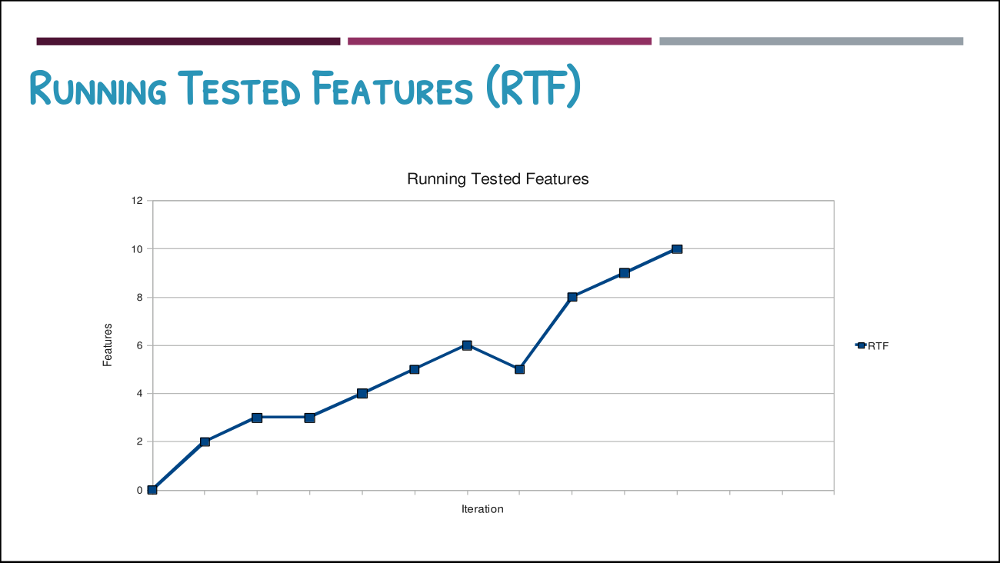

> **Cómo memorizarlo**: la RTF es como el **contador de "funcionalidades que ya pueden usar tus clientes"**. No es cuánto escribiste, sino cuánto **realmente está en producción y andando**.

> **Limitación de RTF**: cuenta features sin tener en cuenta **tamaño ni complejidad**. Es como contar casos de uso sin contar su complejidad. Es un **issue**: "no me dice mucho esta métrica ya que no se tiene en cuenta el tamaño y la complejidad de las características".

---

## 7. Métricas en Kanban (enfoque Lean)

> Pone el foco en **medir la eficiencia del proceso de flujo de trabajo**. Las métricas clave son **Lead Time, Cycle Time, Touch Time y Eficiencia del Ciclo de Proceso**.

> **Ordenadas de la más grande a la más chica** (como pediste):
> 1. **Lead Time** → vista del cliente (lo más grande: desde que pide hasta que recibe).
> 2. **Cycle Time** → vista del equipo (más chica: desde que arranca hasta que termina).
> 3. **Touch Time** → tiempo realmente trabajado (la más chica: solo lo que se trabajó).

### Vista general: el tablero con las 3 métricas

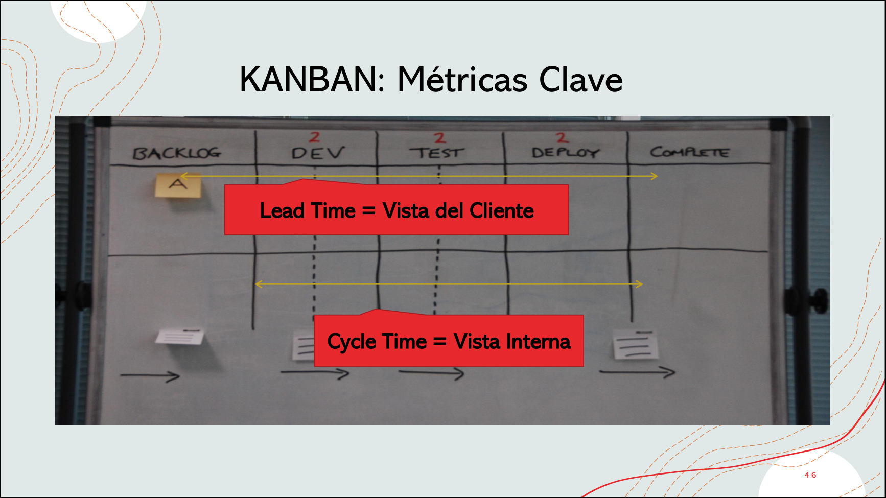

> El tablero real muestra las **dos métricas más grandes** visualizadas con flechas sobre las columnas del flujo:
> - **Lead Time = Vista del Cliente** (flecha superior, de BACKLOG a COMPLETE): lo que el cliente ve.
> - **Cycle Time = Vista Interna** (flecha inferior, de DEV a COMPLETE): lo que el equipo controla.
>
> El **Lead Time incluye al Cycle Time + el tiempo de espera en cola** (la zona gris de la izquierda, antes de que el equipo arranque a trabajar).

---

### 7.1. Lead Time (Tiempo de entrega) — LA MÁS GRANDE

> **Lead Time**: métrica que registra el tiempo entre el momento en el que se **pide un ítem** (entra al backlog) y el momento de su **entrega** (el final del proceso). Se suele medir en **días de trabajo**.

- **¿Qué mide?** → **Ritmo de entrega al cliente** (cuánto tarda el cliente en ver el resultado).
- **Vista del cliente**: el cliente **mide Lead Time** porque es lo que él ve (pidió algo y lo recibió).
- **Es la métrica más grande** porque incluye TODO: la espera en cola + el trabajo del equipo + la entrega.

#### Ejemplo propio (Lead Time en el café)

> El cliente pide un café a las **10:00** y se lo entregan a las **10:15**.
> - **Lead Time = 15 minutos** (todo lo que el cliente esperó).
> - Es la métrica que el cliente percibe como **"cuánto tardó mi pedido"**.

---

### 7.2. Cycle Time (Tiempo de ciclo) — LA INTERMEDIA

> **Cycle Time**: métrica que registra el tiempo entre el **inicio** y el **final del proceso** para un ítem de trabajo dado. Se suele medir en **días de trabajo o esfuerzo**.

- **¿Qué mide?** → **Ritmo de terminación al cliente** (cuánto tarda el equipo en terminar).
- **Vista del equipo**: el equipo **mide Cycle Time** porque es lo que él controla (cuánto tardó en producirlo).
- **Es más chica que Lead Time** porque **no incluye la espera en cola** (supone que el equipo arrancó apenas lo tomó).

#### Ejemplo propio (Cycle Time en el café)

> El barista arrancó a preparar el café a las **10:05** (5 minutos después de que el cliente pidió, porque estaba en cola) y lo terminó a las **10:12**.
> - **Cycle Time = 7 minutos** (10:05 → 10:12).
> - El barista **no cuenta** los 5 minutos de cola: eso es **Lead Time - Cycle Time = espera en cola**.

#### Relación entre Lead Time y Cycle Time

- **Lead Time = Cycle Time + espera en cola** (o trabajo en otro lado).
- **Cycle Time** es lo que el equipo controla.
- **Lead Time** es lo que el cliente sufre.

---

### 7.3. Touch Time (Tiempo de tocado) — LA MÁS CHICA

> **Touch Time**: el tiempo en el cual un ítem fue **realmente trabajado** (o "tocado") por el equipo, **dentro del cycle time**. Cuántos días hábiles pasó este ítem en columnas de "trabajo en curso", en oposición con columnas de cola/buffer/estado.

- **Es la métrica más chica** porque **solo cuenta el tiempo activo** sobre el ítem.
- El resto del Cycle Time (lo que no es Touch) es **espera dentro del proceso**: bloqueos, esperas de review, esperas de build, etc.

#### La regla clave: Touch ≤ Cycle ≤ Lead

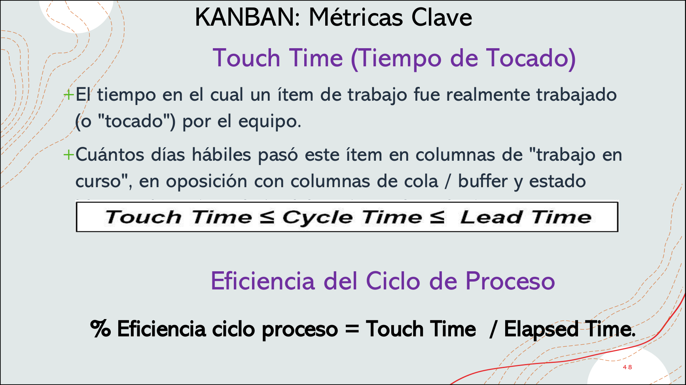

> La diapositiva de la cátedra muestra la **desigualdad clave**:
> - **Touch Time ≤ Cycle Time ≤ Lead Time**.
> - Cuanto más nos acerquemos al **Lead Time**, más **espera** hay acumulada.
> - Cuanto más nos acerquemos al **Touch Time**, más **eficiente** es el proceso.
>
> Debajo, la fórmula de **Eficiencia del Ciclo de Proceso**: `% Eficiencia = Touch Time / Elapsed Time`.

---

### 7.4. Eficiencia del Ciclo de Proceso

> **% Eficiencia ciclo proceso = Touch Time / Elapsed Time**

#### Ejemplo propio (eficiencia de un ítem)

> Un ítem estuvo **25 días en el sistema**, pero solo **2 de esos 25 fue activamente trabajado** (los otros 23 estuvo en cola o esperando):
> - **Lead Time = 25 días** (el cliente esperó 25).
> - **Cycle Time = 25 días** (suponiendo que se trabajó apenas entró al sistema).
> - **Touch Time = 2 días** (el equipo solo lo trabajó 2 días).
> - **Eficiencia = 2/25 = 8%** → **el 92% del tiempo fue desperdicio (espera)**.
>
> **Cómo memorizarlo**: el cycle time es el **tiempo que el ítem está en la máquina**; el touch time es **el tiempo que el operario lo está tocando**. La diferencia es **espera** (desperdicio).

### Definiciones formales de la cátedra

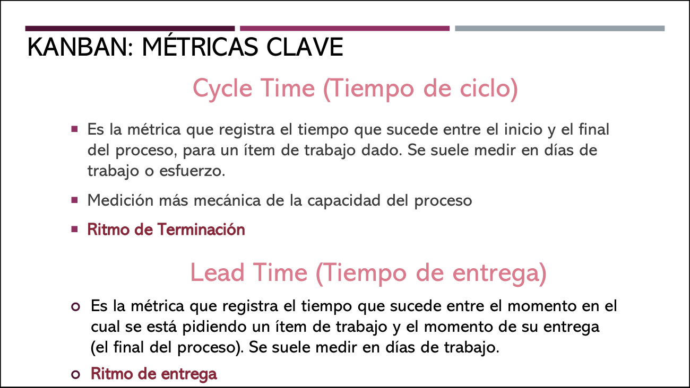

> La diapositiva de la cátedra muestra las definiciones de Cycle Time ("Medición más mecánica de la capacidad del proceso — **Ritmo de Terminación**") y Lead Time ("**Ritmo de entrega** al cliente").

---

## 8. Métricas orientadas a servicio

> Son métricas que miden el **servicio** que el sistema le entrega al cliente.

- **Expectativa de nivel de servicio**: lo que los clientes esperan.
- **Capacidad del nivel de servicio**: lo que el sistema puede entregar.
- **Acuerdo de nivel de servicio (SLA)**: lo que se acordó con el cliente.
- **Umbral de la adecuación del servicio**: el nivel **por debajo del cual el servicio es inaceptable**.

> Si el **tiempo real de entrega** supera el **umbral**, el servicio es inaceptable, aunque esté dentro del SLA. **Hay que estar siempre dentro del umbral**.

#### Ejemplo propio (el SLA del banco)

> Un banco tiene una **app de transferencias**:
> - **SLA**: las transferencias se procesan en **menos de 24 horas**.
> - **Umbral**: si una transferencia tarda **más de 1 hora**, el cliente la considera **inaceptable** (aunque esté dentro del SLA).
>
> El banco tiene que estar **siempre por debajo de 1 hora**, no de 24.

---

## 9. Atributos de calidad y "epifenómenos"

> Ni la **calidad** ni la **usabilidad** se pueden medir de forma directa. No podemos medir *"litros de usabilidad"*. Hay que recurrir a **epifenómenos**: medir **atributos internos o derivados** que son **cuantificables** y que se **correlacionan** con el atributo externo que queremos predecir.

> Esto está alineado con **Sommerville y Pressman**: los atributos de calidad externos son **subjetivos** y sólo pueden **predecirse indirectamente**.

### Epifenómenos típicos para medir usabilidad

| Epifenómeno | Por qué se correlaciona con usabilidad |
|---|---|
| **Cantidad de clics para terminar una tarea** | Menos clics = más fácil. |
| **Tiempo que tarda un usuario nuevo en completar una tarea** | Más rápido = más intuitivo. |
| **Cantidad de errores del usuario** (no del sistema) | Menos errores = más usable. |
| **Horas de capacitación necesarias** | Menos capacitación = más usable. |
| **Tasa de abandono en un flujo** | Más abandono = menos usable. |

#### Ejemplo propio (medir la usabilidad de un formulario)

> Quiero medir la usabilidad de un **formulario de registro** de mi app.
> - **No puedo medir "usabilidad"** directamente.
> - Mido **epifenómenos**:
>   - Cantidad de usuarios que completan el registro vs. abandonan: **tasa de éxito = 70%**.
>   - Tiempo promedio de completado: **3 minutos**.
>   - Cantidad de errores por usuario: **2.3**.
>   - Cantidad de veces que piden ayuda al chat de soporte: **15 por día**.
> - Estos números **no son "usabilidad"**, pero me dan una **señal** de cómo está yendo.

---

## 10. DRE — Eficiencia en la Remoción del Defecto

> **DRE (Defect Removal Efficiency)**: porcentaje de defectos que se **detectan y eliminan antes de llegar al cliente** (en producción).

> **DRE = (Defectos encontrados antes de release / Total de defectos encontrados) × 100**

#### Ejemplo propio (calcular el DRE)

> Un sistema se libera y, en los primeros 3 meses de producción, se encuentran **20 defectos**.
> Antes del release, durante el testing, se habían encontrado **80 defectos**.
>
> - **DRE = 80 / (80 + 20) × 100 = 80%**.
>
> Eso significa que el equipo **detectó el 80% de los defectos antes de que llegaran al cliente**. El 20% se escapó.
>
> **Cómo memorizarlo**: el DRE es como un **colador**: si dejás pasar mucho (20%), el colador tiene agujeros. Si pasás poco (5%), el colador está apretado. **Organizaciones de calidad alta (CMMI 5) tienen DRE > 95%**.

---

## 11. Resumen visual de métricas por enfoque

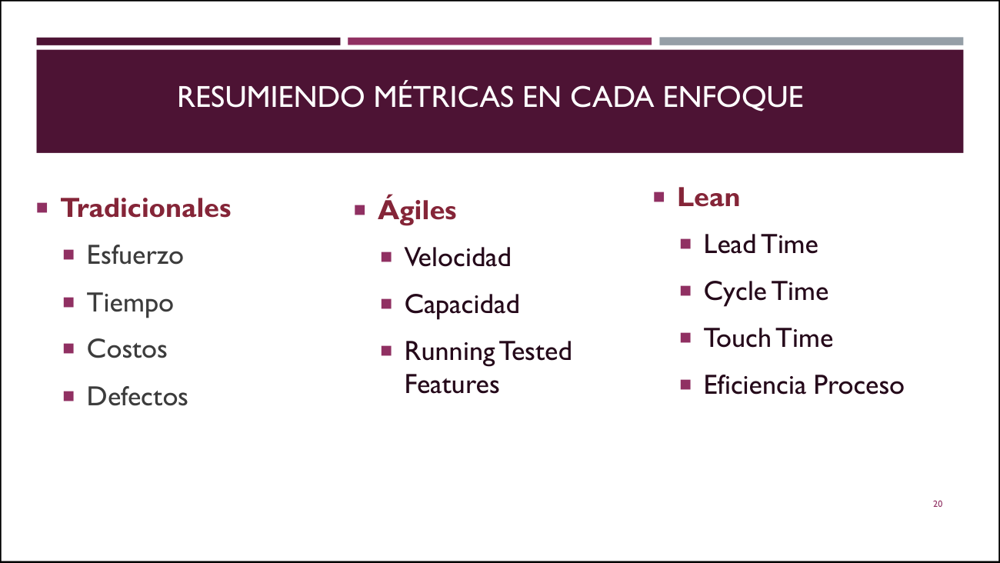

> La diapositiva final de la cátedra muestra las **3 columnas** (Tradicional / Ágil / Lean) con sus métricas:

| Tradicional | Ágil | Lean (Kanban) |
|---|---|---|
| Esfuerzo | Velocidad | Lead Time |
| Tiempo | Capacidad | Cycle Time |
| Costos | Running Tested Features | Touch Time |
| Defectos | | Eficiencia del Proceso |

---

## 12. Métricas para producto software

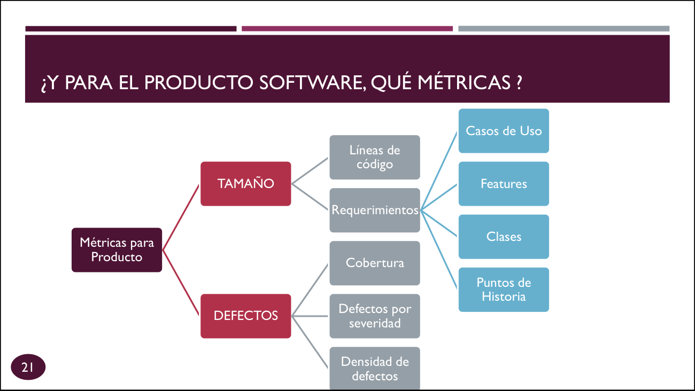

> La diapositiva muestra un **mapa conceptual** de las métricas de producto:
> - **Tamaño**: Líneas de código, Requerimientos (que se subdividen en Casos de Uso, Features, Clases, Puntos de Historia).
> - **Defectos**: Cobertura, Defectos por severidad, Densidad de defectos.

---

## 13. Tabla maestra: comparación general de métricas

| Métrica | Qué mide | Quién la usa | Tipo |
|---|---|---|---|
| **LOC** | Líneas de código. | Tradicional. | Producto. |
| **Puntos de Función (PF)** | Tamaño funcional. | Tradicional. | Producto. |
| **Esfuerzo** | Horas-persona. | Tradicional. | Proyecto. |
| **Tiempo calendario** | Duración del proyecto. | Tradicional. | Proyecto. |
| **Costos** | Presupuesto ejecutado. | Tradicional. | Proyecto. |
| **Defectos** | Bugs por severidad. | Tradicional/Ágil/Lean. | Producto. |
| **Densidad de defectos** | Defectos por KLOC. | Tradicional. | Producto. |
| **DRE** | % defectos pre-release. | Tradicional/Ágil. | Proceso. |
| **Story Points** | Tamaño relativo. | Ágil (Scrum). | Producto. |
| **Velocity** | Puntos aceptados por sprint. | Ágil (Scrum). | Proyecto. |
| **Capacidad** | Trabajo posible por sprint. | Ágil (Scrum). | Proyecto. |
| **RTF** | Features funcionando. | Ágil (Scrum). | Producto. |
| **Burndown** | Puntos restantes. | Ágil (Scrum). | Proyecto. |
| **Burnup** | Puntos completados. | Ágil/Kanban. | Proyecto. |
| **Lead Time** | Vista del cliente. | Lean (Kanban). | Proceso. |
| **Cycle Time** | Vista interna. | Lean (Kanban). | Proceso. |
| **Touch Time** | Tiempo realmente trabajado. | Lean (Kanban). | Proceso. |
| **Eficiencia de flujo** | Touch / Elapsed. | Lean (Kanban). | Proceso. |
| **WIP** | Trabajo en curso. | Lean (Kanban). | Proceso. |
| **SLA** | Acuerdo de nivel de servicio. | Servicio. | Producto. |

---

## 14. Reglas mnemotécnicas para el oral

### Regla 1: 4 dominios = 4 cubetas
> **P**roceso / **P**royecto / **P**roducto / **P**ersonas. Los cuatro ejes donde caen las métricas.

### Regla 2: Por enfoque = 3 estrellas
> - **Tradicional**: Esfuerzo + Tiempo + Costos + Defectos (las 4 básicas).
> - **Ágil**: **V**elocidad + **C**apacidad + **R**TF.
> - **Lean (Kanban)**: **L**ead + **C**ycle + **T**ouch + **E**ficiencia.

### Regla 3: Touch ≤ Cycle ≤ Lead
> Toca más chico que Cycle, Cycle más chico que Lead. Si lo decís de corrido suena a trabalenguas y no se te olvida.

### Regla 4: Lead = cliente, Cycle = equipo
> El **cliente ve Lead Time** (todo el tiempo desde que pidió). El **equipo mide Cycle Time** (lo que él trabajó). El equipo controla Cycle, el cliente sufre Lead.

### Regla 5: La velocidad NO se estima, se calcula
> Es histórica. Es el pulso del equipo. No es una promesa a futuro.
### Regla 6: GQM = Goal → Question → Metric

> Primero el goal, después las preguntas, después las métricas. Si la métrica no responde una pregunta que responde el goal, no sirve.

### Regla 7: Métrica vs. Indicador

> **Métrica = el dato** (el número crudo: "30 defectos"). **Indicador = la alarma** (el dato con contexto: "30 vs. 10 esperados → 200% → ROJO"). La métrica se mide, el indicador **informa para decidir**.

### Regla 8: Estimación vs. Métrica

> **Estimación = pronóstico** (antes: "va a llover 20mm"). **Métrica = realidad** (después: "llovió 35mm"). **Indicador = desvío** ("llovió 75% más → alerta"). Las métricas **mejoran las próximas estimaciones**: si siempre mediste 25% más de lo estimado, ajustás el próximo proyecto.

---

## 15. Chivo para el oral

### Bloque 1: Conceptos fundamentales

1. **¿Por qué medir?** Porque no se puede controlar lo que no se mide. La métrica es un **número objetivo** que da **visibilidad** para **tomar decisiones**.
2. **3 dominios + 1**: **Proceso** (estratégico, largo plazo, despersonalizado), **Proyecto** (táctico, corto plazo), **Producto** (características del software), **Personas** (cuarto eje, agregado en clase).
3. **GQM**: derivar métricas de un **Goal** a través de **Questions**. Si la métrica no responde una pregunta, no sirve.
3.5. **Mantenerlo simple** (de la unidad 1): *"si estás a millas de distancia, no tiene sentido medir en milímetros"*. Antes de tomar una métrica: ¿da más información? ¿es de beneficio práctico? ¿dice lo que queremos saber? Si alguna es no, **descartala**.

### Bloque 2: Métricas básicas

4. **4 métricas básicas de proyecto**: **Tamaño** (LOC/PF/reqs), **Esfuerzo** (horas-persona), **Tiempo** (calendario), **Defectos** (por severidad).
5. **PF (Puntos de Función)**: tamaño funcional, agnóstico al lenguaje, se puede estimar antes de codificar. **LOC** depende del lenguaje y es difícil de estimar upfront.
6. **Defectos por severidad**: bloqueante, grave, menor, cosmético. **Contar sin severidad no sirve**.

### Bloque 3: Métricas por enfoque

7. **Tradicional**: Esfuerzo, Tiempo, Costos, Defectos.
8. **Ágil**:
   - **Velocidad**: puntos de historia **aceptados** por el PO. **No se estima, se calcula**. Es histórica. **Cuidado**: el equipo puede tener oscilaciones grandes (ej. sprint 7 = 4 puntos, sprint 8 = 43). Hay que investigar por qué.
   - **Capacidad**: trabajo que el equipo **puede comprometerse** a hacer. **Sí se estima** (en horas o puntos, según madurez).
   - **RTF**: features **probadas y funcionando**. Es el progreso real.
9. **Lean (Kanban)**: **Lead Time** (vista del cliente), **Cycle Time** (vista del equipo), **Touch Time** (trabajo real), **Eficiencia = Touch / Elapsed**.

### Bloque 4: Diferencias y relaciones

10. **Touch ≤ Cycle ≤ Lead**.
11. **Lead incluye Cycle + espera en cola**.
12. **Velocity mide producto aceptado; Capacity mide producto posible**.
13. **El sueño del pibe**: cada nivel mira sus métricas. Dev = unit tests/cobertura. Equipo = staffing/tareas. Organización = presupuesto/defectos en release.
13.5. **Brooks (de la unidad 1)**: *"los proyectos se retrasan de a un día por vez"*. Las métricas sirven para **detectar el desvío temprano** y corregir antes de que sea tarde — concepto que aplica también a la **oscilación de la velocidad** en ágil.

### Bloque 5: Conceptos avanzados

14. **Epifenómenos**: la calidad y la usabilidad no se miden directo. Medimos **clics, tiempo de tarea, errores de usuario, capacitación** como proxies.
15. **DRE** = defectos pre-release / total. **DRE alto = colador apretado**. Organizaciones de calidad alta tienen DRE > 95%.
16. **SLA vs. Umbral**: el SLA es lo que acordaste, el **umbral es lo que el cliente considera aceptable**. Hay que estar **siempre dentro del umbral**.

### Bloque 6: Frase de cierre

17. *"Las métricas de software no son números fríos en un tablero: son el mecanismo fundamental para entender el impacto de nuestras decisiones. Midiendo proceso, proyectos y productos, una organización aprende de sus errores, optimiza su esfuerzo y garantiza software de alta calidad."*

---

## 16. Respuestas modelo para preguntas frecuentes

> **Si te preguntan "¿qué es una métrica?"** → Una **medida cuantitativa** del grado en el que un sistema, componente o proceso posee un atributo. Es un **número objetivo** que da **visibilidad** para tomar decisiones. Ejemplo: defectos por severidad, velocidad, lead time.

> **Si te preguntan "¿cuál es la diferencia entre métrica e indicador?"** → La **métrica** es el **dato crudo** (ej. "30 defectos"). El **indicador** es la **señal accionable** que se construye aplicando contexto: comparación con un umbral, con el plan, con la tendencia o un ratio (ej. "30 defectos vs. 10 esperados → desvío del 200% → ROJO"). **Métrica = dato. Indicador = alarma con significado y acción**. Analogía médica: la métrica es la presión arterial (120/80); el indicador es saber si es normal o alta según los valores de referencia.

> **Si te preguntan "¿por qué se estima y se mide lo mismo (tamaño, esfuerzo, tiempo)?"** → **No es lo mismo**, aunque el objeto sea el mismo. La **estimación** se hace **antes** (predicción subjetiva: "va a llevar 200 horas"). La **métrica** se hace **después** (medición real: "llevó 250 horas"). Se conectan por el **desvío** `(Real - Planificado) / Planificado × 100`, que es un **indicador**. Y las métricas **mejoran las próximas estimaciones**: si siempre mediste 25% más, el próximo proyecto estimás con un colchón del 25%. Analogía: estimación = pronóstico del tiempo, métrica = lo que llovió, indicador = desvío.

> **Si te preguntan "¿cuál es la diferencia entre métrica de proceso y de proyecto?"** → La de **proyecto** es táctica, de corto plazo, atribuida a un proyecto (ej. "este proyecto tuvo 5 defectos graves"). La de **proceso** es estratégica, de largo plazo, **despersonalizada** y pública (ej. "la organización tiene 3 defectos por millón de LOC en sus productos"). Las de proyecto se **consolidan** para crear las de proceso.

> **Si te preguntan "¿qué es la velocidad?"** → Es la **cantidad de puntos de historia aceptados por el PO en un sprint**. **No se estima, se calcula**. Es histórica, no predictiva. **Cuidado con asumir que es constante**: el equipo puede tener grandes oscilaciones (sprint 7 = 4 puntos, sprint 8 = 43) por historias no terminadas, no aceptadas, o cerca de terminarse.

> **Si te preguntan "¿qué es la capacidad?"** → La cantidad de **trabajo que el equipo puede comprometerse a hacer** en un sprint. **Sí se estima** (en horas o puntos según madurez). Se calcula con la tabla de **días disponibles × horas por día - días de actividades Scrum** (140-197 horas en el ejemplo del apunte).

> **Si te preguntan "¿qué es RTF?"** → **Running Tested Features**: cantidad de **features probadas y funcionando** que se entregan por iteración. Es la métrica que mejor refleja el **progreso real** (no el trabajo en curso). Limitación: cuenta features sin considerar tamaño ni complejidad (igual que contar casos de uso sin contar complejidad).

> **Si te preguntan "¿Lead Time vs. Cycle Time?"** → **Lead Time** = vista del **cliente**, desde que pide el ítem hasta que lo recibe (incluye espera en cola). **Cycle Time** = vista **interna** del equipo, desde que arranca a trabajar hasta que lo termina. **Lead ≥ Cycle**. Ejemplo del café: Lead = 15 min (cliente), Cycle = 7 min (barista), cola = 5 min.

> **Si te preguntan "¿qué es el Touch Time?"** → El tiempo en que el ítem fue **realmente trabajado** dentro del Cycle Time. Es lo opuesto a **espera**. Si un ítem estuvo 25 días en el sistema pero solo 2 fue trabajado, su Touch = 2. **Eficiencia = Touch / Elapsed = 2/25 = 8%**.

> **Si te preguntan "¿qué es GQM?"** → **Goal-Question-Metric**: técnica para **derivar métricas desde un objetivo de negocio**. Primero el **Goal**, después las **Questions** que ayudan a ver si lo alcanzamos, después las **Metrics** que responden esas preguntas. Si una métrica no responde una pregunta que sirve al goal, no sirve.

> **Si te preguntan "¿qué es el DRE?"** → **Defect Removal Efficiency**: porcentaje de defectos **detectados antes del release**. DRE = (defectos pre-release / total defectos) × 100. Si en testing se encontraron 80 y en producción 20, DRE = 80%. **Organizaciones de calidad alta tienen DRE > 95%**.

> **Si te preguntan "¿cómo se mide la usabilidad?"** → **No se mide directamente**. La usabilidad es un **atributo de calidad externo** subjetivo. Se miden **epifenómenos**: cantidad de clics para una tarea, tiempo de completado, errores del usuario, horas de capacitación, tasa de abandono. Esos números **se correlacionan** con usabilidad.

> **Si te preguntan "¿por qué no usar LOC?"** → Porque es **difícil de estimar** antes de codificar y depende del **lenguaje** (el mismo sistema en Java puede ser 50.000 LOC y en Python 20.000). Mejor usar **Puntos de Función** (agnósticos al lenguaje) o **Puntos de Historia** (en ágil).

> **Si te preguntan "¿el SLA y el umbral son lo mismo?"** → **No**. El **SLA** es lo que acordaste con el cliente (ej. entrega en 24h). El **umbral** es lo que el cliente considera **aceptable** (ej. si tarda más de 1h es inaceptable). Aunque estés dentro del SLA, si superás el umbral, el servicio es inaceptable. **Hay que estar siempre dentro del umbral**.

