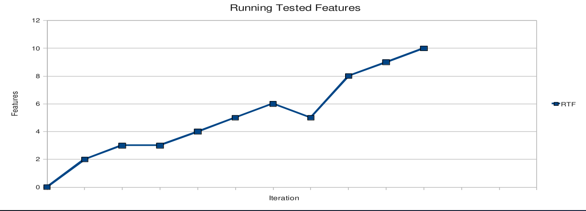
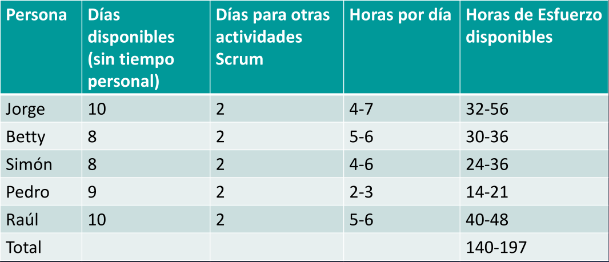

# 12 — Métricas Ágiles y de Proceso

> Págs. 138-148 del apunte. Cubre las métricas ágiles: RTF, lead/cycle/touch time, y tablas de esfuerzo. Cierra con métricas orientadas a servicio.

## Métricas de proceso en Scrum

### Running Tested Features (RTF)

> **RTF**: cantidad de **features probadas y funcionando** que se entregan por iteración.

- Es la métrica que mejor refleja el progreso real (no el trabajo en curso).
- Se utiliza en Scrum para representar el trabajo terminado.



> El gráfico muestra cómo las features probadas van **acumulándose** con cada iteración. Es una variante del burnup, pero más **orientada al valor de negocio** (no a story points).

### Cálculo del esfuerzo disponible (Capacity)

> Para saber cuánto trabajo entra en un sprint, hay que calcular el **esfuerzo disponible** de cada persona.



| Persona | Días disponibles (sin tiempo personal) | Días para otras actividades Scrum | Horas por día | Horas de esfuerzo disponibles |
|---|---|---|---|---|
| Jorge | 10 | 2 | 4-7 | 32-56 |
| Betty | 8 | 2 | 5-6 | 30-36 |
| Simón | 8 | 2 | 4-6 | 24-36 |
| Pedro | 9 | 2 | 2-3 | 14-21 |
| Raúl | 10 | 2 | 5-6 | 40-48 |
| **Total** | | | | **140-197** |

- **Días disponibles (sin tiempo personal)**: ej. 10 = 14 del mes - 4 findes - fiestas.
- **Días para otras actividades Scrum**: 2 (daily, planning, review, retrospective, grooming, etc).
- **Horas por día**: lo que cada persona puede dedicar al proyecto (4-7 según si tiene otras responsabilidades).
- **Horas de esfuerzo disponibles**: días disponibles × horas por día.

> El equipo tiene entre **140 y 197 horas** de esfuerzo. Esta es la **capacidad** del equipo para el sprint.

---

## Métricas en Kanban

> Kanban se enfoca en **métricas de flujo**, no de esfuerzo.

### Cycle Time (Tiempo de ciclo)

> Es la métrica que registra el tiempo que sucede entre el **inicio** y el **final** del proceso, para un ítem de trabajo dado.

- Se suele medir en **días de trabajo o esfuerzo**.
- **Medición más mecánica** de la capacidad del proceso.
- **¿Qué mide?** → **Ritmo de terminación al cliente** (cuánto tarda el equipo en terminar).

### Lead Time (Tiempo de entrega)

> Es la métrica que registra el tiempo que sucede entre el momento en el cual se está **pidiendo un ítem** (entra al backlog) y el momento de su **entrega** (el final del proceso).

- Se suele medir en **días de trabajo**.
- **¿Qué mide?** → **Ritmo de entrega al cliente** (cuánto tarda el cliente en ver el resultado).

### Touch Time (Tiempo de tocado)

> El tiempo en el cual un ítem fue **realmente trabajado** (o "tocado") por el equipo **dentro del cycle time**.

- Si un ítem estuvo 25 días en ciclo pero solo 2 de esos 25 fue activamente trabajado, su Touch Time es 2.
- **¿Cuántos días hábiles pasó este ítem en columnas de "trabajo en curso"** en oposición con columnas de cola/buffer/estado.

> **Touch Time ≤ Cycle Time ≤ Lead Time**

### Eficiencia del ciclo de proceso

```
% Eficiencia ciclo proceso = Touch Time / Elapsed Time
```

- Si un ítem estuvo 25 días en el sistema pero solo 2 fue trabajado, su eficiencia es 2/25 = **8%**.
- Es una métrica útil para detectar **tiempo desperdiciado en esperas**.

---

## Lead Time vs. Cycle Time (vista del cliente vs. vista interna)

> **Lead Time** es la **vista del cliente**: cuánto tarda desde que pidió el ítem hasta que lo recibe.

> **Cycle Time** es la **vista interna**: cuánto tarda el equipo en producirlo (sin contar el tiempo de espera en cola).

- **Lead Time** incluye el **Cycle Time** + el tiempo de espera en cola.

> *Ejemplo*: si un cliente pide una feature y tarda 10 días en llegar al equipo + 5 días en hacerse + 3 días en entregarse al cliente, el **Lead Time = 18 días** y el **Cycle Time = 8 días**.

---

## Métricas orientadas a servicio

> Son métricas que miden el **servicio** que el sistema le entrega al cliente.

- **Expectativa de nivel de servicio** que los clientes esperan.
- **Capacidad del nivel de servicio** al que el sistema puede entregar.
- **Acuerdo de nivel de servicio (SLA)** que es acordado con el cliente.
- **Umbral de la adecuación del servicio**: el nivel por debajo del cual el servicio es **inaceptable** para el cliente.

> Si el **tiempo real de entrega** supera el **umbral**, el servicio es inaceptable, aunque esté dentro del SLA. Hay que estar siempre dentro del **umbral**.

---

## Comparación general de métricas

| Métrica | Qué mide | Quién la usa |
|---|---|---|
| **Story Points** | Tamaño relativo de las historias. | Scrum. |
| **Velocity** | Story points completados por sprint. | Scrum. |
| **RTF** | Features probadas y funcionando. | Scrum. |
| **Burndown** | Story points restantes. | Scrum. |
| **Burnup** | Story points completados. | Scrum/Kanban. |
| **Lead Time** | Tiempo desde que se pide hasta que se entrega. | Kanban. |
| **Cycle Time** | Tiempo desde que se empieza a trabajar hasta que se termina. | Kanban. |
| **Touch Time** | Tiempo realmente trabajado. | Kanban. |
| **Capacidad** | Esfuerzo disponible del equipo. | Scrum (planning). |
| **WIP** | Trabajo en curso. | Kanban. |

---

## Chivo para el oral

1. **Métricas Scrum**:
   - **Story Points**: tamaño relativo (no absoluto).
   - **Velocity**: **se calcula**, no se estima. Permite predecir duración.
   - **RTF** (Running Tested Features): features probadas y funcionando. Métrica de **valor entregado**.
   - **Burndown** vs **Burnup**: restantes vs completados.
   - **Capacidad**: horas disponibles del equipo (140-197 en el ejemplo).
2. **Métricas Kanban**:
   - **Lead Time** = vista del cliente (pide → recibe).
   - **Cycle Time** = vista del equipo (empieza → termina).
   - **Touch Time** = tiempo realmente trabajado.
   - **Eficiencia** = Touch / Elapsed.
3. **Relación**: Touch ≤ Cycle ≤ Lead.
4. **Métricas de servicio**: expectativa, capacidad, SLA, umbral. Hay que estar siempre **dentro del umbral**.
5. **Cerrá con la idea**: cada framework tiene sus métricas. Scrum mide **trabajo completado por sprint**; Kanban mide **tiempo de flujo** (cycle/lead time). La clave es medir lo que refleja **valor para el cliente**.

> **Si te preguntan "¿qué es la capacidad de un equipo?"** → la cantidad de **horas de esfuerzo disponibles** en un sprint, calculadas a partir de los días disponibles × horas por día, descontando el tiempo para actividades Scrum.
