# 13 — Test Driven Development (TDD)

> Presentación "Test Driven Development (TDD)" (págs. 721-736 del merge). Judith Meles & Laura Covaro & Cecilia Massano. **Tema central de prácticas ágiles**.

---

## 1. ¿Qué es TDD?

> **TDD** (*Test Driven Development*) es una **técnica avanzada** de desarrollo de software que **involucra otras dos prácticas**: **Escribir las pruebas primero** (*Test First Development*) y **Refactorización** (*Refactoring*). Se utilizan generalmente **pruebas unitarias**.

> *"El acto de diseñar tests es uno de los mecanismos conocidos más efectivos para prevenir errores... El proceso mental que debe desarrollarse para crear tests útiles puede descubrir y eliminar problemas en todas las etapas del desarrollo"* — **B. Beizer**

> **Referencia**: *"Test-Driven Development": By Example* de **Kent Beck** (el padre de XP).

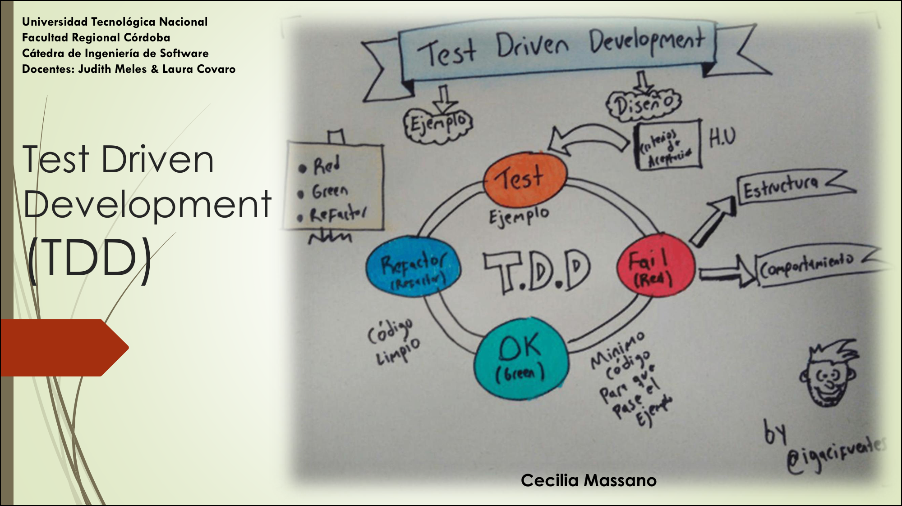

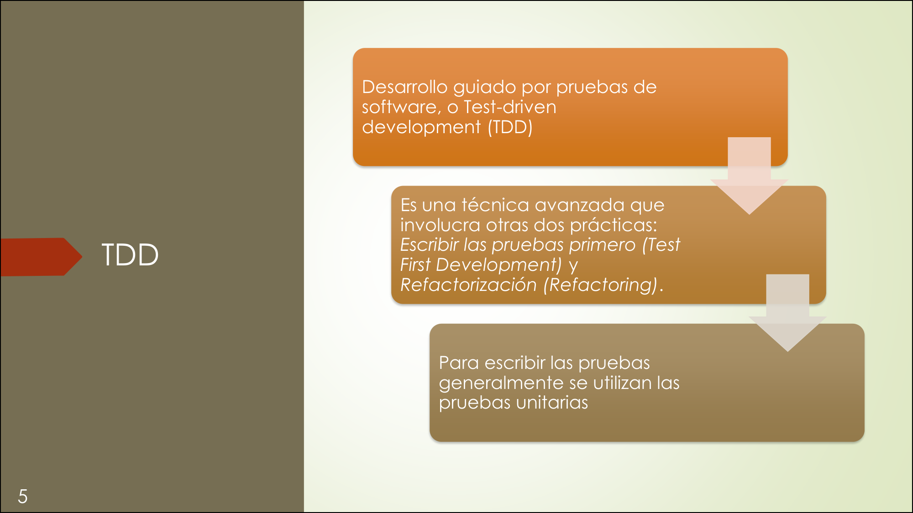

---

## 2. Desarrollo tradicional vs. TDD

| | **Desarrollo Tradicional** | **TDD** |
|---|---|---|
| **Orden** | Diseñar → Desarrollar → Probar | Diseñar → **Probar** → Desarrollar |
| **Pruebas** | Se escriben **después** del código. | Se escriben **antes** del código. |
| **Aseguramiento de calidad** | **Reactivo** (se prueba al final). | **Proactivo** (se previenen errores desde el inicio). |
| **Feedback** | Tarde (cuando ya está todo hecho). | Inmediato (cada paso se verifica). |

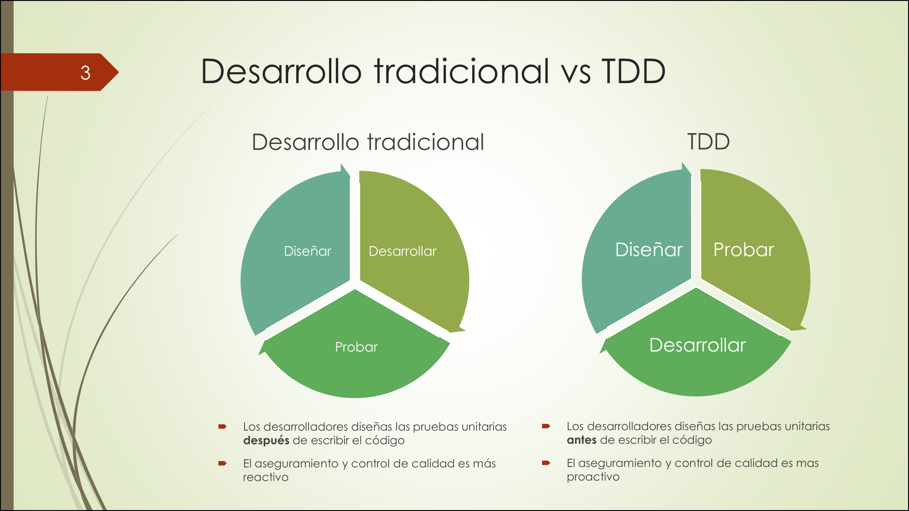

> **La diferencia clave**: en TDD **no escribís una línea de código sin antes tener un test que falle**. El test te dice qué hacer; el código es la respuesta.

---

## 3. El Corazón de TDD: Red → Green → Refactor

> Es el **ciclo fundamental** de TDD. Cada iteración es **muy corta** (minutos, no horas).

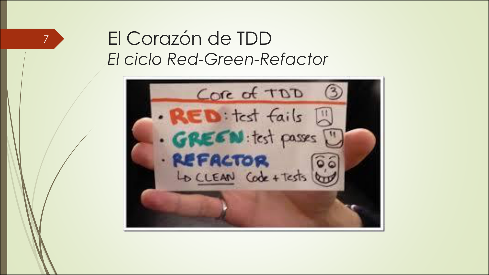

### Paso a paso

| Paso | Color | Qué hacés | Estado del test |
|---|---|---|---|
| **1. RED** | Rojo | Escribís un **test que falla** (porque la funcionalidad aún no existe). | El test **falla**. |
| **2. GREEN** | Verde | Escribís el **código mínimo** necesario para que el test pase. | El test **pasa**. |
| **3. REFACTOR** | Azul | **Mejorás el código** sin cambiar su comportamiento (eliminar duplicación, mejorar legibilidad). | Todos los tests **siguen pasando**. |

> **Regla de oro**: en **GREEN**, escribí el **mínimo código posible** para que pase. No escribas más de lo necesario. Si el test pasa, el código **ya existe**.

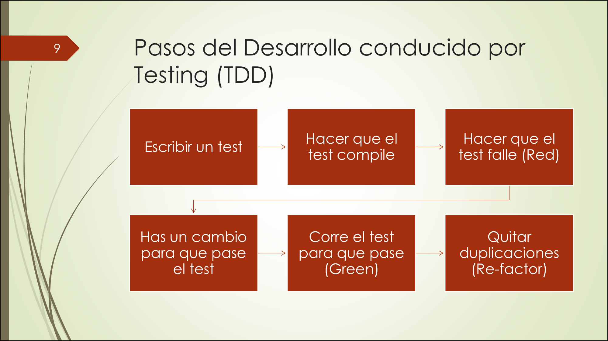

### Los 6 pasos de TDD (detallado)

1. **Escribir un test** → qué debe hacer.
2. **Hacer que el test compile** → que el código exista pero falle.
3. **Hacer que el test falle (RED)** → verificar que el test detecta el problema.
4. **Hacer un cambio para que pase (GREEN)** → escribir el código mínimo.
5. **Correr el test para que pase** → verificar que el código funciona.
6. **Quitar duplicaciones (REFACTOR)** → mejorar el código sin romper nada.

---

## 4. Las 3 leyes de TDD (Robert C. Martin — "Uncle Bob")

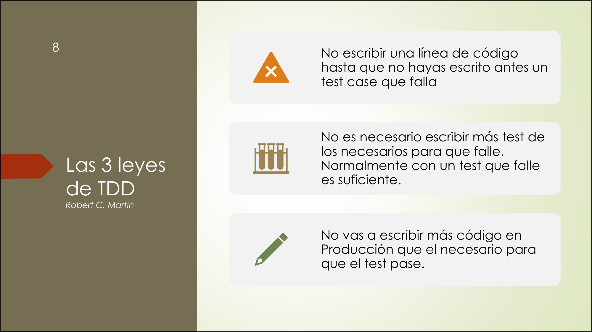

| Ley | Regla |
|---|---|
| **1. No escribir código sin test que falle** | No escribís una línea de código hasta que no hayas escrito antes un **test case que falle**. |
| **2. No escribir más test del necesario** | No es necesario escribir más test de los necesarios para que falle. Normalmente **con un test que falle es suficiente**. |
| **3. No escribir más código del necesario** | No vas a escribir más código en producción que el **necesario para que el test pase**. |

> **Mnemotecnia**: **"No test → No code. No fail → No more test. No pass → No more code."** (Sin test no hay código. Sin falla no hay más test. Sin pase no hay más código.)

---

## 5. Beneficios de TDD


### Beneficios clave

- **Código robusto**: más predecible y limpio; sabés **cuándo el código está terminado**.
- **Código tolerable al cambio**: con los tests escritos, es más fácil entender y modificar.
- **Código más seguro**: cada cambio se verifica automáticamente.
- **Menos duplicación**: si el test pasa, el código ya existe (no escribís de más).
- **Más barato de mantener**: código más entendible = menos costo de mantenimiento.
- **Acelera el desarrollo**: con práctica, la velocidad aumenta y permite despliegue continuo.
- **Cobertura de prueba asegurada**: calidad garantizada por diseño.
- **Mejor diseño de API**: obligás a pensar en **cómo usar el componente** antes de escribirlo.
- **Alta cohesión y bajo acoplamiento**: los tests fuerzan un diseño modular.

> **Beneficio más importante para el oral**: TDD te obliga a **pensar antes de codear**. Escribir el test primero te fuerza a definir **qué** debe hacer el código antes de preocuparte por **cómo** hacerlo.

---

## 6. Patrones de TDD

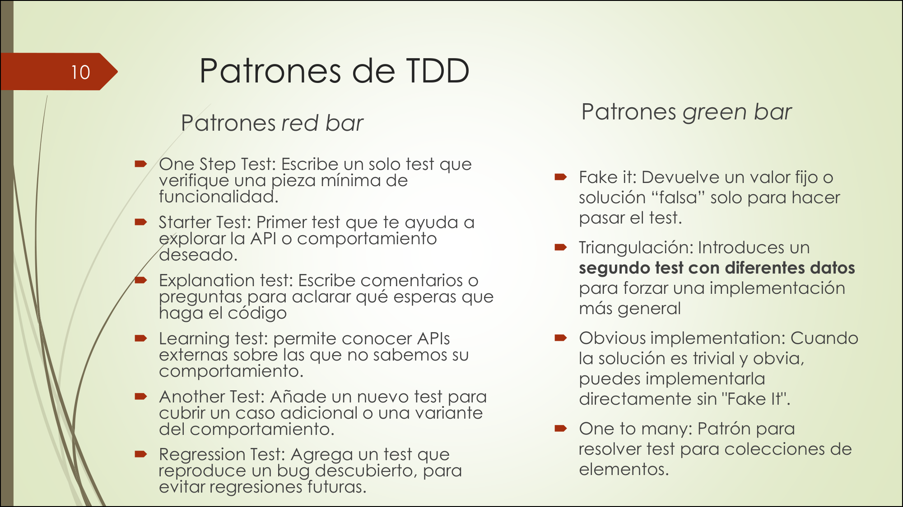

### Patrones Red Bar (escribir el test)

| Patrón | Qué hace |
|---|---|
| **One Step Test** | Escribir un **solo test** que verifique una pieza mínima de funcionalidad. |
| **Starter Test** | Primer test que te ayuda a **explorar la API** o comportamiento deseado. |
| **Explanation Test** | Escribir comentarios o preguntas para **aclarar qué esperás** que haga el código. |
| **Learning Test** | Permite **conocer APIs externas** sobre las que no sabemos su comportamiento. |
| **Another Test** | Agregar un **nuevo test** para cubrir un caso adicional o variante. |
| **Regression Test** | Agregar un test que **reproduce un bug descubierto**, para evitar regresiones futuras. |

### Patrones Green Bar (hacer que pase)

| Patrón | Qué hace |
|---|---|
| **Fake It** | Devolver un **valor fijo** o solución "falsa" solo para hacer pasar el test. |
| **Triangulación** | Introducir un **segundo test con diferentes datos** para forzar una implementación más general. |
| **Obvious Implementation** | Cuando la solución es **trivial y obvia**, podés implementarla directamente sin "Fake It". |
| **One to Many** | Patrón para resolver tests para **colecciones de elementos**. |

### Otros patrones

- **Patrones de testing**.
- **Patrones de diseño**.
- **xUnit Patterns**.

---

## 7. Refactoring

> **Refactoring** es una **forma disciplinada** de introducir cambios reduciendo la posibilidad de introducir defectos. Es una **transformación del software** que:
> - **Preserva la estructura externa** (comportamiento observable no cambia).
> - **Mejora la estructura interna** (código más limpio).

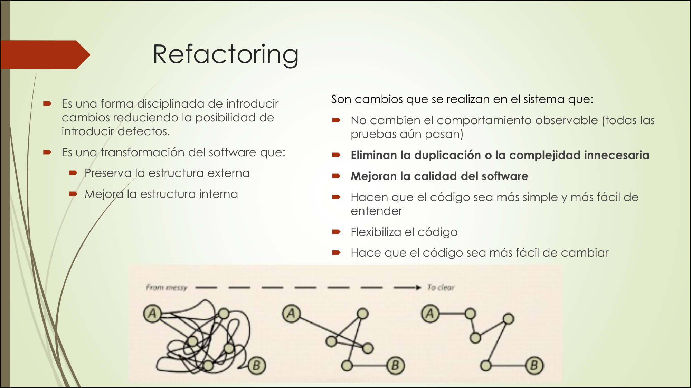

### Características del Refactoring

- **No cambian el comportamiento observable** (todas las pruebas aún pasan).
- **Eliminan la duplicación** o la complejidad innecesaria.
- **Mejoran la calidad del software**.
- **Hacen que el código sea más simple y fácil de entender**.
- **Flexibilizan el código** (más fácil de cambiar).

### ¿Por qué es necesario hacer Refactoring?

- Evitar el **"deterioro del diseño"**.
- **Limpiar desorden** en el código.
- **Simplificar** el código.
- Incrementar la **legibilidad y comprensibilidad**.
- **Encontrar errores**.
- **Reducir el tiempo de depuración**.
- **Incorporar el aprendizaje** que hacemos sobre la aplicación.
- **Rehacer las cosas es fundamental** en todo proceso creativo.

### ¿Cómo hacer Refactoring?

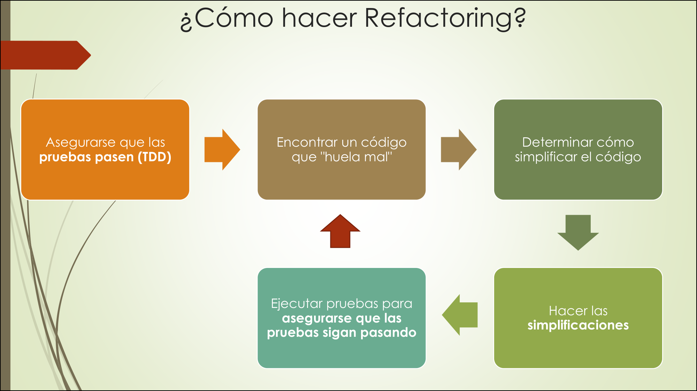

> **El proceso**:
> 1. **Asegurarse que las pruebas pasen** (TDD).
> 2. **Encontrar un código que "huela mal"** (code smell).
> 3. **Determinar cómo simplificar** el código.
> 4. **Hacer las simplificaciones**.
> 5. **Ejecutar pruebas** para asegurarse que sigan pasando.
>
> **Regla**: si un test falla durante el refactor, **no estás refactorizando, estás cambiando comportamiento**. Volvé al paso anterior.

---

## 8. TDD, ATDD y BDD: la relación

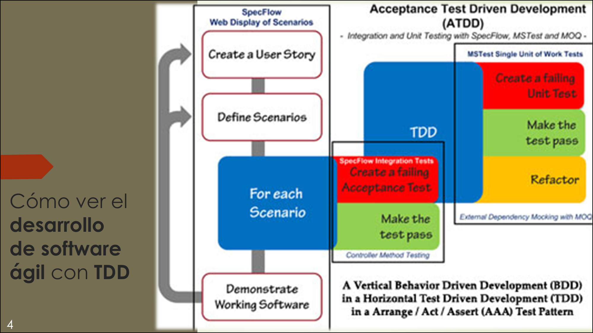

> **TDD no trabaja solo**. Se combina con otras prácticas:

| Práctica | Nivel | Qué hace | Quién participa |
|---|---|---|---|
| **ATDD** (Acceptance Test Driven Development) | **Negocio** | Tests de aceptación que validan que la funcionalidad cumple con los requisitos del negocio. | PO + equipo. |
| **BDD** (Behavior Driven Development) | **Comportamiento** | Tests que describen el comportamiento esperado en lenguaje natural (Given-When-Then). | Todo el equipo. |
| **TDD** (Test Driven Development) | **Técnico** | Tests unitarios que validan el funcionamiento interno del código. | Desarrolladores. |

> **Relación**: **BDD está dentro de ATDD, y TDD está dentro de BDD**. Se trabaja en **capas concéntricas**: primero los tests de aceptación (ATDD), luego los de comportamiento (BDD), y finalmente los unitarios (TDD).

### El flujo completo

```
User Story → Define Scenarios (BDD) → For each Scenario:
  → Create a failing Acceptance Test (ATDD)
  → Make the test pass (TDD cycle: Red → Green → Refactor)
  → Refactor
→ Demonstrate Working Software
```

> **"A Vertical BDD in a Horizontal TDD in an Arrange/Act/Assert (AAA) Test Pattern"** — se trabaja en vertical (por capas de funcionalidad) pero con TDD horizontal (por cada componente).

---

## 9. Resumen visual

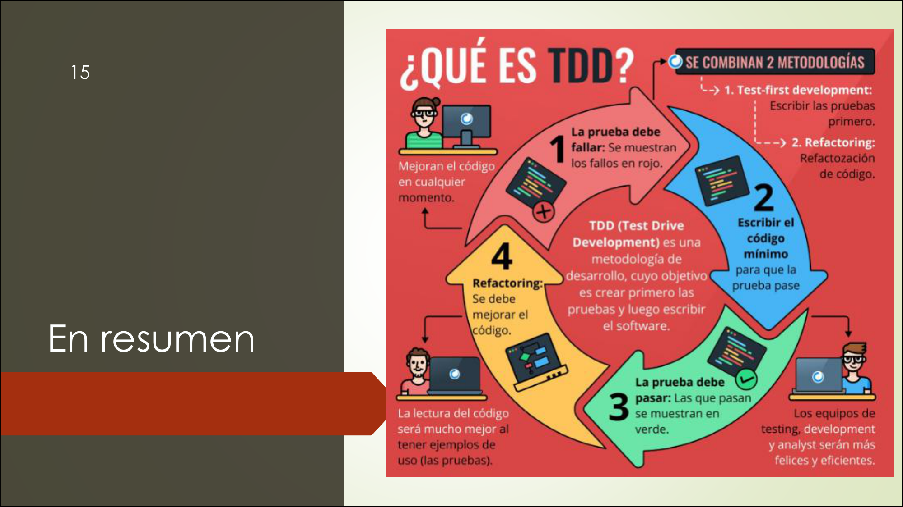

> **TDD combina 2 metodologías**:
> 1. **Test-First Development**: escribir las pruebas primero.
> 2. **Refactoring**: refactorización de código.

### El ciclo en 4 pasos

| Paso | Acción |
|---|---|
| **1** | La prueba debe **fallar** (rojo). Se muestran los fallos. |
| **2** | Escribir el **código mínimo** para que la prueba pase. |
| **3** | La prueba debe **pasar** (verde). Las que pasan se muestran en verde. |
| **4** | **Refactoring**: mejorar el código sin cambiar comportamiento. |

---

## Chivo para el oral

1. **Qué es TDD**: técnica que combina **Test First Development** (escribir pruebas primero) + **Refactoring**. Las pruebas son **unitarias**. Referencia: **Kent Beck** (XP).

2. **Diferencia con desarrollo tradicional**:
   - Tradicional: diseñar → desarrollar → probar (pruebas **después**, QA **reactivo**).
   - TDD: diseñar → **probar** → desarrollar (pruebas **antes**, QA **proactivo**).

3. **Ciclo Red-Green-Refactor** (el corazón de TDD):
   - **RED**: escribís un test que **falla**.
   - **GREEN**: escribís el **código mínimo** para que pase.
   - **REFACTOR**: **mejorás el código** sin cambiar comportamiento. Tests siguen pasando.

4. **Las 3 leyes de Uncle Bob**:
   - No escribís código sin un **test que falle**.
   - No escribís **más test** del necesario para que falle.
   - No escribís **más código** del necesario para que pase.

5. **Beneficios clave**: código robusto, tolerable al cambio, seguro, menos duplicación, más barato de mantener, acelera desarrollo, cobertura asegurada, mejor diseño de API, alta cohesión y bajo acoplamiento. **Te obliga a pensar antes de codear**.

6. **Refactoring**: transformación que **preserva estructura externa** y **mejora estructura interna**. No cambia comportamiento (tests siguen pasando). **Si un test falla durante refactor, no es refactor**.

7. **Relación TDD-ATDD-BDD**: **BDD dentro de ATDD, TDD dentro de BDD**. Capas concéntricas. ATDD = negocio, BDD = comportamiento, TDD = técnico. Flujo: User Story → BDD (escenarios) → ATDD (tests de aceptación) → TDD (tests unitarios) → Working Software.

8. **Cerrá con**: *"TDD no es solo escribir tests. Es una disciplina que te obliga a pensar en qué debe hacer el código antes de escribirlo. El test es la especificación; el código es la implementación."*

---

## Respuestas modelo para preguntas frecuentes

### ¿Qué es TDD?
> TDD es una técnica avanzada que combina **Test First Development** (escribir las pruebas primero) y **Refactoring**. El ciclo es **Red-Green-Refactor**: escribís un test que falla, escribís el código mínimo para que pase, y mejorás el código sin cambiar comportamiento. Referencia: Kent Beck.

### ¿Cuál es la diferencia entre TDD y desarrollo tradicional?
> En desarrollo tradicional se escriben las pruebas **después** del código (QA reactivo). En TDD se escriben **antes** (QA proactivo). El orden cambia: diseñar → probar → desarrollar vs. diseñar → desarrollar → probar. TDD previene errores desde el inicio.

### ¿Cuáles son las 3 leyes de TDD?
> 1) No escribir código sin un test que falle. 2) No escribir más test del necesario para que falle. 3) No escribir más código del necesario para que pase. Son de Robert C. Martin (Uncle Bob).

### ¿Qué es Refactoring?
> Es una transformación del software que **preserva la estructura externa** (comportamiento no cambia, tests siguen pasando) y **mejora la estructura interna** (código más limpio). Elimina duplicación, mejora legibilidad, flexibiliza el código. Si un test falla durante refactor, no es refactor.

### ¿Cómo se relaciona TDD con ATDD y BDD?
> **BDD está dentro de ATDD, y TDD está dentro de BDD**. ATDD es a nivel de negocio (tests de aceptación), BDD es a nivel de comportamiento (Given-When-Then), TDD es a nivel técnico (tests unitarios). Se trabaja en capas concéntricas: primero ATDD, luego BDD, finalmente TDD.

### ¿Cuál es el beneficio más importante de TDD?
> **Te obliga a pensar antes de codear**. Escribir el test primero te fuerza a definir **qué** debe hacer el código antes de preocuparte por **cómo** hacerlo. Además, genera código robusto, seguro, con cobertura asegurada, y mejora el diseño de API.
