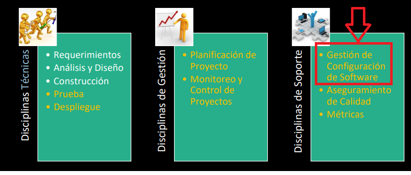

# 01 — SCM: Introducción

> Págs. 150-151 del apunte. Cubre el concepto de SCM, su propósito, los problemas típicos del manejo de componentes y el plan de SCM.

## Concepto

> **SCM** (*Software Configuration Management*) es la **disciplina de soporte** de la Ingeniería de Software. Es una **actividad paraguas, transversal a todo el proyecto**, relevante para el producto a lo largo de su **ciclo de vida**.

> Recordá: la IS tiene 3 disciplinas (técnicas, de gestión, de soporte). **SCM es la de soporte**.

### ¿Qué nos permite?

- **Identificar** características técnicas y funcionales de ítems de configuración.
- **Documentar** estas características.
- **Controlar cambios** de dichas características.
- **Registrar y reportar** estos cambios.
- **Verificar trazabilidad de los requerimientos**: rastrear un requerimiento a lo largo de todo el ciclo de vida.

### Origen

- Tiene sus orígenes a **mediados de 1950**, como **CM** (*Configuration Management*), originalmente utilizado para **desarrollo de hardware** y control de producción.
- Luego fue adaptado al desarrollo de software.

---

## ¿Por qué gestionar la configuración del software?

> Su propósito es **establecer y mantener la integridad** de los productos de software a lo largo de su ciclo de vida.

> La **integridad** es el medio por el cual podemos garantizar que el producto a entregar tiene la **calidad** correspondiente. Y nos garantiza un **nivel mínimo de confiabilidad**.

### ¿Cuándo se mantiene la integridad?

Decimos que se mantiene la integridad de un producto de software cuando:

- **Satisface las necesidades de los usuarios**.
- Permite cumplir con las expectativas de **costos** y de **performance**.
- Permite que el software sea **completamente rastreado** durante su ciclo de vida.

---

## Problemas típicos del manejo de componentes

Sin SCM, en cualquier proyecto medianamente serio, aparecen:

- **Pérdida de un componente**: *¿dónde está este componente?!*
- **Pérdida de cambios**: *esta no es la última versión, otra vez se perdió*.
- **Sincronía fuente - objeto - ejecutable**: el código compilado no coincide con la fuente.
- **Regresión de fallas**: arreglar un bug introduce otros.
- **Doble mantenimiento**: mantener dos versiones del mismo componente.
- **Superposición de cambios**: dos personas editando lo mismo.
- **Cambios no válidos**: cambios que rompen otras partes.

> La SCM **previene** todos estos problemas.

---

## ¿Qué se incluye en un plan de SCM?

Un **plan de SCM** es un documento que establece las reglas y procedimientos para gestionar la configuración en el proyecto. Incluye:

- **Reglas de nombrado** de los ítems de configuración.
- **Herramientas** a utilizar para SCM.
- **Roles e integrantes** del comité.
- **Procedimiento formal de cambios**.
- **Plantillas de formularios**.
- **Cómo se lleva a cabo la auditoría**.

### Reglas de nombrado (ejemplos)

> Las reglas de nombrado son normas predefinidas que indican cómo se deben nombrar los elementos versionados.

| Tipo | Ejemplo |
|---|---|
| Archivos fuente | `login.component.ts` |
| Ramas | `feature/login-ui` |
| Tags o etiquetas de versión | `v1.2.3` |
| Builds | `build_20250801_001` |
| Releases | `release-customer-portal-v2` |
| Directorios | `/docs/arquitectura/v1/` |

---

## SCM como actividad transversal

> SCM atraviesa **todo el ciclo de vida** del software: no es algo que se hace al inicio ni al final. Aplica a:

- Requerimientos (trazabilidad).
- Diseño.
- Codificación (ramas, versiones).
- Pruebas.
- Despliegue.
- Mantenimiento.

---

## Chivo para el oral

1. **Concepto**: SCM es la **disciplina de soporte** de la IS. Es **transversal** a todo el proyecto, durante todo el ciclo de vida.
2. **Permite**: identificar, documentar, controlar cambios, registrar y reportar, verificar trazabilidad.
3. **Propósito**: **mantener la integridad** del producto → calidad + confiabilidad.
4. **Problemas que resuelve**: pérdida de componentes, de cambios, sincronía fuente/objeto/ejecutable, regresión, doble mantenimiento, superposición, cambios inválidos.
5. **Plan de SCM**: reglas de nombrado, herramientas, roles, procedimiento de cambios, plantillas, auditoría.
6. **Cerrá con la idea**: sin SCM, los proyectos de software caen en caos de versiones. SCM **es la garantía de que lo que entregamos es lo que acordamos**.

> **Si te preguntan "¿por qué SCM es transversal?"** → porque cualquier artefacto del proyecto (código, docs, planes, builds) puede necesitar ser cambiado, versionado, auditado, **en cualquier momento del ciclo de vida**.
