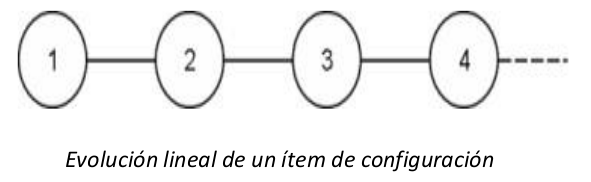
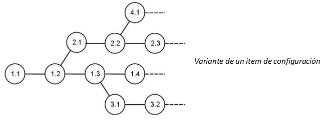
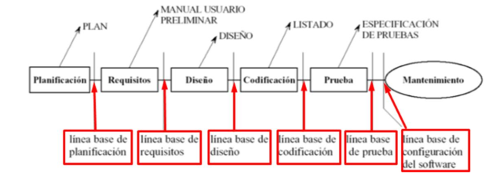
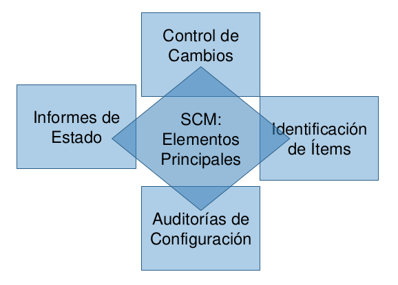
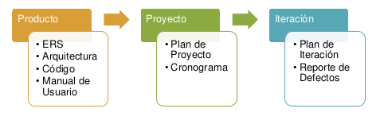

# 02 — Ítems de Configuración

> Págs. 152-159 del apunte. Cubre SCI, versión, variante, repositorio, ramas, líneas base, y configuración de software.

## Ítem de Configuración de Software (SCI)

> Se llama **ítem de configuración (IC)** a todos y cada uno de los **artefactos** que forman parte del producto o del proyecto, que pueden sufrir cambios o necesitan ser compartidos entre los miembros del equipo y sobre los cuales necesitamos conocer su **estado y evolución**.

> Se correlaciona con el **principio de transparencia** del agilismo: que cualquiera pueda ver y rastrear un IC.

### Ejemplos de SCI

- **Planes**: SCM, Iteración, Integración, Desarrollo, Riesgos.
- **Código fuente**.
- **Gráficos e iconos**.
- **Prototipo de interfaz**.
- **Propuesta de cambio**.
- Documentación técnica, manuales, ERS, etc.

---

## Versión

> Una **versión** se define, desde el punto de vista de la evolución, como la **forma particular de un artefacto en un instante o contexto dado**.

- El control de versiones se refiere a la **evolución de un único IC** o de cada IC por separado.
- La evolución puede representarse gráficamente en forma de **grafo**.

### Evolución lineal de un ítem de configuración

> *Ejemplo*: 1 → 2 → 3 → 4. Cada número es una versión del mismo ítem. Es la **evolución más simple**.

---

## Variante

> Una **variante** es una versión de un ítem de configuración (o de la configuración) que **evoluciona por separado**.

- Las variantes representan **configuraciones alternativas**.
- Un producto puede adoptar distintas configuraciones según el **lugar donde se instale**, la **plataforma** o las **funciones opcionales** que realice.

### Ejemplo: app móvil

- **Ítem de configuración**: `LoginModule.java` (módulo de autenticación).
- **Versiones**:
  - `v1.0`: login con usuario/contraseña.
  - `v1.1`: se agrega validación de email.
  - `v1.2`: incluye autenticación con Google.
- **Variantes**:
  - **Variante A**: `v1.2` para la app estándar con Google.
  - **Variante B**: `v1.2-Corporate` adaptada para un cliente corporativo con autenticación biométrica.

> **Misma versión, distintos despliegues** = variantes.

---

## Repositorio

> Es un **contenedor de ítems de configuración**. Se encarga de mantener la **historia** de cada ítem con sus atributos y relaciones.

- Usado para hacer **evaluaciones de impacto** de los cambios propuestos.
- Puede ser una o varias bases de datos.

### Funcionamiento

Hay **2 acciones básicas** sobre el repositorio fuente:

| Acción | Concepto | Análogo en Git |
|---|---|---|
| **Extracción** (*Check out*) | El desarrollador toma una copia del código fuente desde el repositorio a su entorno local. | `git pull` / `git clone` |
| **Devolución** (*Check in*) | El desarrollador devuelve sus cambios al repositorio. | `git push` |

> Entre medio hay un **`git commit`** (registro local de los cambios antes de hacer push).

### Tipos de repositorio

#### Repositorios centralizados

- Un servidor contiene **todos** los ICs con sus versiones.
- Los administradores tienen mayor control.
- Los desarrolladores **no tienen copia local** de todos los archivos, solo los que están trabajando.
- **Si falla el servidor, estamos al horno**.

#### Repositorios descentralizados

- Cada cliente tiene una **copia exacta** del repositorio completo.
- Si un servidor falla, es solo cuestión de **copiar y pegar** de otro.
- Posibilita otros **workflows** que no están disponibles en el modelo centralizado.

> *Git es un ejemplo clásico de repositorio descentralizado*.

---

## Ramas

> Es un **conjunto de ICs con sus versiones** que permiten **bifurcar el desarrollo** de un software, por varios motivos:

- **Experimentación**.
- **Resolución de errores** en el desarrollo.
- **Desarrollo para diferentes plataformas**.
- **Nueva propuesta**.

### Integración de ramas

- La operación se conoce como **merge**.
- Lleva los cambios a la **rama principal**.
- Pueden surgir **conflictos** (resolverlos con `diff`).
- Todas las ramas deberían eventualmente **integrarse a la principal** o ser **descartadas**.

---

## Línea Base

> La **línea base** es un conjunto de ICs que han sido **construidos y revisados formalmente**. Es una configuración que ha sido revisada formalmente y sobre la que se ha llegado a un acuerdo.

- El conjunto de ICs debe tener una **referencia única** (a través de **tags**).
- Es como una **foto** o screenshot de los ICs en un momento dado.
- Es un **punto de referencia** para:
  - **Rollback** (volver a un estado anterior).
  - **Futuros desarrollos**.
  - **Auditorías al código**.
  - **Lanzamiento** (release).

> **Para cambiar una línea base existe un protocolo formal de control de cambios**, dirigido por el **comité de control de cambios**.

### Tipos de línea base

| Tipo | Qué contiene | Cuándo se crea |
|---|---|---|
| **Operacionales** | Versión de producto cuyo código es ejecutable, que pasó por un control de calidad definido. | A partir del primer release. La **primera línea base operacional** = primer release. |
| **De especificación o documentación** | Documentos de especificación de requerimiento, diseño, etc. No tienen código aún. | En las **fases tempranas** (requisitos, diseño, implementación, pruebas). |

---

## Configuración de Software

> Es un **conjunto de ICs con su correspondiente versión en un momento determinado**.

- Es como una **foto** de los ICs en un instante de tiempo.
- Cada vez que cambia un IC, se genera una nueva configuración.
- Una **línea base** es una configuración **formalmente aprobada**.

---

## SCM: Elementos principales

> Los 4 elementos principales de SCM son:
> 1. **Identificación de Ítems**.
> 2. **Control de Cambios**.
> 3. **Auditorías de Configuración**.
> 4. **Informes de Estado**.

> Estos elementos se desarrollan en el archivo [03-actividades-de-scm.md](03-actividades-de-scm.md).

---

## Tipos de ICs según su ciclo de vida

| Tipo | Ejemplos | Ciclo de vida |
|---|---|---|
| **De producto** | ERS, Arquitectura, Código, Manual de Usuario. | **El más largo**: se mantiene mientras el producto exista. |
| **De proyecto** | Plan de Proyecto, Cronograma. | El del proyecto. |
| **De iteración** | Plan de Iteración, Reporte de Defectos. | El de la iteración. |

---

## Chivo para el oral

1. **SCI (ítem de configuración)**: cualquier artefacto del producto o proyecto (código, docs, planes, íconos).
2. **Versión**: forma particular de un artefacto en un instante. Controla la **evolución**.
3. **Variante**: misma versión, distintos despliegues (ej. app estándar vs. corporate).
4. **Repositorio**: contenedor de ICs con su historia. Centralizado (riesgo) vs. descentralizado (Git).
5. **Ramas**: bifurcan el desarrollo. `merge` las une, pueden surgir conflictos.
6. **Línea base**: configuración **formalmente aprobada**, con tag único. Sirve para rollback, releases, auditorías. Tipos: **operacionales** (código ejecutable) y **de especificación** (docs).
7. **Configuración**: foto de los ICs en un momento. Una línea base es una configuración aprobada.
8. **Cerrá con la idea**: SCM se asegura de que siempre sepamos **qué versión de qué cosa está en qué lugar**, y que los cambios sean **rastreables y reversibles**.

> **Si te preguntan "¿qué diferencia hay entre versión y variante?"** → la **versión** es una forma del artefacto en un momento dado (v1.0, v1.1, v1.2); la **variante** es una versión que **evoluciona por separado** para un contexto distinto (mismo código, distinto cliente/plataforma).
