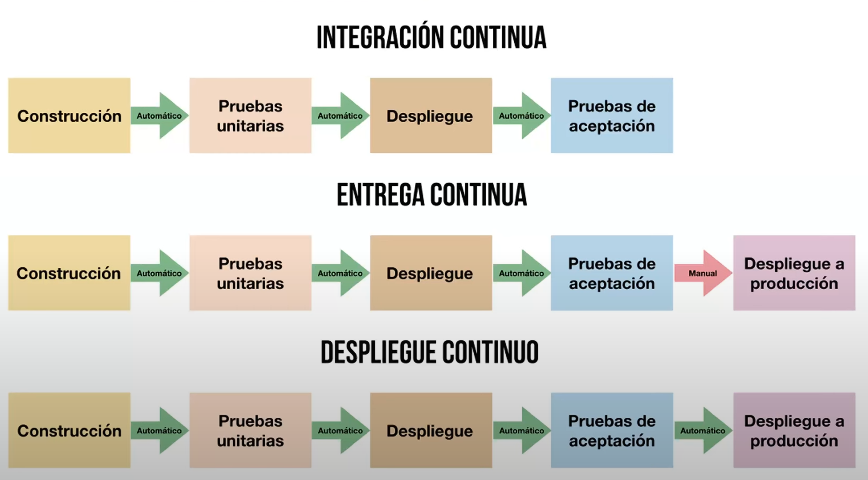

# 05 — Prácticas Continuas (CI / CD)

> Págs. 164-166 del apunte. Cubre la Integración Continua, la Entrega Continua, el Despliegue Continuo y las estrategias de despliegue (Blue-Green, Canary).

## Introducción

> Las **prácticas continuas** vienen a ser como una **evolución de SCM**, que ya apuntan a una **automatización completa**.

> Las 3 prácticas continuas son: **Integración Continua**, **Entrega Continua** y **Despliegue Continuo**.

---

## 1. Integración Continua (CI)

> Práctica de desarrollo que promueve que los desarrolladores adopten la costumbre de **integrar su código a un repositorio compartido varias veces al día**.

- Cada integración es verificada por **pruebas automatizadas**.
- Permite al equipo **detectar problemas de manera temprana** (al integrar frecuentemente, es más fácil detectar y corregir errores).

### Flujo

1. Cada desarrollador realiza **pruebas unitarias** en su entorno local (idealmente automatizadas, idealmente con TDD).
2. Cuando sabe que su código funciona, lo sube al **repositorio de integración**.
3. La versión del producto queda en condiciones de ir a las **pruebas de aceptación de usuario** sin problemas.

> **TDD** + **CI** = combinación natural: escribís el test, lo hacés pasar, subís el código, los tests de CI verifican la integración.

---

## 2. Entrega Continua (Continuous Delivery)

> Disciplina en la que el software se construye de tal manera que **puede ser liberado en producción en cualquier momento**.

- Hay una serie de pruebas que verifican que el código subido se integra correctamente al sistema.
- **No implica que se libere** cada vez que hay un cambio.
- Solo ocurre si el **responsable de negocio** (PO) **decide pasar a producción**: hay un **componente humano** en la decisión.
- Pero **en cualquier caso, la versión está lista** de inmediato.

> **Diferencia clave con CI**: en CI solo se verifica que el código se integra. En entrega continua, además se garantiza que la versión está **lista para producción** (aunque no se despliegue).

---

## 3. Despliegue Continuo (Continuous Deployment)

> Consiste en **poner en producción** el producto directamente. A diferencia de la entrega continua, **no existe la intervención humana** para desplegar.

- Se utilizan **pipelines** que contienen una serie de **pasos en un orden determinado** para que la instalación sea satisfactoria.
- Si los tests pasan, el código va a producción automáticamente.

### Pipeline

```
[Construcción] → [Tests unitarios] → [Despliegue] → [Tests de aceptación] → [Producción]
```

---

## Comparación visual: CI / Entrega Continua / Despliegue Continuo



| Práctica | Construcción | Tests unitarios | Despliegue (entorno) | Tests de aceptación | **Producción** |
|---|---|---|---|---|---|
| **CI** | Automático | Automático | Automático | Automático | **No incluido** |
| **Entrega continua** | Automático | Automático | Automático | Automático | **Manual** (decisión de negocio) |
| **Despliegue continuo** | Automático | Automático | Automático | Automático | **Automático** |

> La diferencia es **qué pasa con el último paso**: en CI no se llega a producción, en entrega continua se llega pero con decisión humana, en despliegue continuo se llega sin intervención.

### Regla mnemotécnica

> **CI** = "cada commit se integra".
> **Entrega Continua** = "la versión siempre está lista".
> **Despliegue Continuo** = "la versión va sola a producción".

---

## Estrategias de despliegue continuo

### 1. Blue-Green Deployment

> Técnica donde mantenes **dos entornos de producción idénticos**:

- **Blue**: la versión actual en producción.
- **Green**: la nueva versión que quieres desplegar.

**Funcionamiento**:
- Desplegás la nueva versión en Green.
- Hacés todas las pruebas que necesites en Green sin afectar a los usuarios.
- Cuando estás listo, **redireccionás el tráfico** del entorno Blue al Green por medio de un **balanceador de cargas**.
- Si hay problemas, volvés a apuntar el balanceador a Blue (**rollback instantáneo**).

> **Ventaja**: rollback trivial, sin downtime.

### 2. Canary Deployment

> La nueva versión del producto se va **liberando de manera gradual** a un subconjunto de usuarios, como un **lanzamiento por etapas**.

**Funcionamiento**:
1. La nueva versión (v2) es desplegada a solo el **5%** de los usuarios.
2. Observamos cómo se comporta: errores, rendimiento, feedback.
3. Si va bien, incrementamos el porcentaje: **25% → 50% → 100%**.
4. Si hay problemas, podemos **detener o revertir** el despliegue fácilmente.

> **Ventaja**: permite ir obteniendo **feedback de manera gradual** y **monitorear** cómo funciona. Si hay problemas, se hace rollback antes de que afecte a todos los usuarios.

### Comparación

| Estrategia | Cambio | Rollback | Audiencia |
|---|---|---|---|
| **Blue-Green** | Instantáneo (cambio de balanceador). | Instantáneo. | 100% de los usuarios. |
| **Canary** | Gradual (% incremental). | Rápido (parar despliegue). | Subconjunto creciente. |

---

## Relación con SCM y agile

Las prácticas continuas son la **materialización** del agilismo en la ingeniería de software:

- **CI** = **integración frecuente** + tests automatizados → elimina el "integration hell".
- **Entrega Continua** = la versión **siempre está lista** → reduce la latencia del feedback.
- **Despliegue Continuo** = automatización completa → minimiza el riesgo y el tiempo al mercado.

> Conectar con la **Pirámide de Testing** de la unidad 4: las prácticas continuas permiten correr muchos tests en poco tiempo porque están automatizados.

---

## Chivo para el oral

1. **3 prácticas continuas**: CI, Entrega Continua, Despliegue Continuo. Son una **evolución de SCM** hacia la automatización completa.
2. **CI (Integración Continua)**: integrar al repositorio compartido **varias veces al día**. Cada commit verificado por tests automatizados. **No incluye producción**.
3. **Entrega Continua**: la versión **siempre está lista** para producción, pero el paso a producción es **decisión humana** (PO).
4. **Despliegue Continuo**: la versión va a producción **automáticamente** (pipelines).
5. **Estrategias**:
   - **Blue-Green**: dos entornos idénticos, redireccionás el tráfico. **Rollback instantáneo**.
   - **Canary**: despliegue gradual a un % de usuarios. **Feedback incremental**.
6. **Cerrá con la idea**: las prácticas continuas son el **eslabón final** entre el agilismo y la operación real. Permiten entregar valor al usuario de forma **frecuente, segura y automatizada**.

> **Si te preguntan "¿cuál es la diferencia entre CI y Entrega Continua?"** → en **CI** solo se valida que el código se integra con el resto (tests automatizados al integrar). En **Entrega Continua**, además, se garantiza que la versión está **lista para ir a producción** en cualquier momento, aunque todavía se requiere decisión humana para desplegar.
