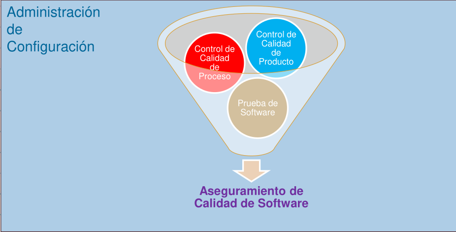

# 01 — Fundamentos de Testing

> Págs. 167-170 del apunte + transcripción de clase de testing. Cubre el concepto de testing, la visión tradicional, los principios, y la diferencia entre error y defecto.

## Contexto: dónde encaja el testing en la calidad

El testing es **una de las tareas del Aseguramiento de Calidad de Software**, junto con el control de calidad del proceso y del producto. La calidad se obtiene a lo largo de todo el desarrollo, y una buena SCM (administración de configuración) es el puntapié inicial.

---

## Concepto

> Proceso mediante el cual se somete a un software o un componente a condiciones específicas con el fin de determinar y demostrar si el mismo es válido o no en función de los requerimientos especificados.

---

## Visión del testing (la apropiada)

- Es un proceso **destructivo**: se busca encontrar defectos (cuya presencia se asume) en el código.
- Hay que ir con **actitud negativa**, intentando demostrar que algo es incorrecto.
- **Testing exitoso** = el que encuentra defectos.
- Representa entre el **30% y el 50%** del costo del producto.
- El testing **NO asegura** que el producto sea de calidad (ni la agrega), ni que el proceso por el que se desarrolló sea de calidad.

> Aclaremos: el testing no es calidad de producto ni de proceso; solo garantiza que el producto sea **confiable**.

### El juego de palabras de la profe (muy preguntable)

> - **Un test es exitoso cuando ENCUENTRA defectos** (no cuando todo pasa).
> - Dicho al revés: **un desarrollo exitoso nos conduce a un test NO exitoso** (porque no encuentra defectos).
>
> No es una contradicción: el objetivo del testing **no es verificar que el software funciona**, es **encontrar defectos**, porque **asumimos que los defectos existen**.

### ¿Qué significa la "actitud negativa"?

> No es probar solamente que el software **hace lo que debe hacer**, sino también **ver qué pasa si quiero hacer con el software algo que NO debería hacer**. El tester indaga el **mal uso** del sistema. "Negativo" es en el sentido de ir contra el software, no de criticar al programador (los defectos se asumen, nadie escribe código perfecto).

### Dónde encaja el testing (contexto de la clase)

> El testing está **en el contexto del aseguramiento de la calidad**, pero **no es** ni control de calidad de procesos ni control de calidad de producto: **es un tema en sí mismo**, bajo el paraguas de la gestión de configuración (SCM).

---

## ¿Cuánto testing es suficiente?

El **testing exhaustivo es imposible** por la cantidad de tiempo que requiere. El momento de dejar de testear depende del **nivel de riesgo o costo** asociado al proyecto. Los riesgos permiten definir prioridades: qué se testea primero y con qué esfuerzo.

> **Ejemplo de la clase**: un sitio con apenas **20 pantallas**, 3 menús de 3 opciones y 1 menú de 4 opciones ya genera una cantidad de combinaciones tal que probarlas todas llevaría un **tiempo astronómico**. Si el testing ya cuesta el 30-50% del software SIN ser exhaustivo, imaginá lo que costaría probándolo todo: **inviable, más caro que la construcción misma**.

> **El riesgo define el esfuerzo**: no es lo mismo testear un sistema que **dosifica medicamentos a un paciente** que una **app de citas**. El nivel de riesgo y los costos asociados determinan cuánto testing es suficiente.

El **Criterio de Aceptación** resuelve cuándo una fase de testing se considera completada. Se **acuerda con el cliente** y se puede definir en términos de:

- Costos (cuando se consumen las horas dedicadas a testing, se acabó).
- % de test corridos sin fallas.
- No hay defectos de una determinada severidad (ej. hasta que no haya más defectos **bloqueantes ni críticos**).

---

## Relación con el ciclo de vida

Lo ideal es testear **lo más temprano posible** para abaratar costos. No hace falta tener código para empezar a testear: con la historia de usuario o los requerimientos ya alcanza.

> **Beneficio extra del testing temprano (de la clase)**: definir los casos de prueba con los requisitos en la mano te obliga a **bajarlos a tierra** — y ahí pueden aparecer **cosas que faltan aclarar u omisiones en la historia de usuario**. El testing temprano no solo encuentra defectos: **mejora los requerimientos**.

> Hay modelos (como cascada) que lo implementan en fases tardías, con consecuencias negativas.

---

## Mitos sobre el testing

- "El testing es una etapa que comienza al terminar de codificar." ❌
- "El testing es probar que el software funciona." ❌
- "Testing = Calidad de producto." ❌
- "Testing = Calidad de proceso." ❌
- "El tester es el enemigo del programador." ❌

> Aunque hagas un testing excelente, con 0 errores, el producto puede seguir teniendo fallas de calidad porque la calidad es **subjetiva** y depende de varios factores, como la experiencia de usuario.

---

## Principios del Testing

| # | Principio | Explicación |
|---|---|---|
| 1 | El testing muestra la **presencia** de defectos | El propósito es encontrar defectos, no probar que el software está libre de ellos. |
| 2 | El testing **exhaustivo** es imposible | No se pueden probar todas las combinaciones de entradas, condiciones y resultados. |
| 3 | **Testing temprano** | Debe comenzar lo antes posible (idealmente en la fase de requisitos). Detectar temprano reduce costos. |
| 4 | **Principio de Pareto** | Los defectos se concentran en pocos módulos o áreas (regla 80/20). |
| 5 | **Paradoja del pesticida** | Si se usan siempre los mismos tests, con el tiempo dejarán de encontrar nuevos defectos. |
| 6 | **Dependiente del contexto** | Las técnicas dependen del tipo de sistema (un sistema bancario requiere pruebas más rigurosas que uno de entretenimiento). |
| 7 | **Falacia de la ausencia de errores** | Aunque no se encuentren errores, el software puede no satisfacer las necesidades del cliente. |
| 8 | **Evitar probar el propio código** | Los programadores tienen sesgo personal hacia su trabajo. |

---

## Errores y defectos

La diferencia está en el **momento en que se detectan** y se solucionan:

- **Error**: se descubre en la misma etapa en la que se está trabajando.
- **Defecto**: es un error que **no se descubrió en su etapa** y se trasladó a etapas posteriores.

> Lo que el testing busca son **defectos**.

> **Ejemplo de la clase**: si estoy **escribiendo código** y en esa misma etapa hago una **revisión de código** y encuentro un problema → eso es un **error**. Si ese problema no se detectó y llegó a la etapa de testing → es un **defecto**. Por eso es mejor encontrar errores que defectos: **queremos encontrar errores y no trasladarlos** a etapas posteriores, donde se convierten en defectos.

### Clasificación de defectos

| Dimensión | Categorías |
|---|---|
| **Severidad** (gravedad) | Bloqueante · Crítico · Mayor · Menor · Cosmético |
| **Prioridad** (urgencia) | Urgente · Alta · Media · Baja |

> **Ojo**: severidad ≠ prioridad. Un defecto cosmético (ej. error de ortografía) puede tener **alta prioridad** para la empresa (no quiere quedar como analfabeta en su web).

---

## Chivo para el oral

1. **Concepto + visión**: arrancá con la definición y dejá claro que es un proceso **destructivo** y que un testing exitoso es el que **encuentra defectos**.
2. **El juego de palabras**: "un test exitoso encuentra defectos; un desarrollo exitoso produce un test no exitoso". El objetivo NO es verificar que funciona, es encontrar defectos (que se asumen).
3. **Actitud negativa**: no solo probar que hace lo que debe, sino ver qué pasa si lo uso **mal**.
4. **Aclaración clave**: el testing **no es calidad**, solo garantiza confiabilidad.
5. **Principios**: nombrá los 7-8 más importantes (exhaustivo imposible, temprano, pareto, falacia, contexto).
6. **Error vs. defecto**: la diferencia es **cuándo se descubre** (ejemplo de la revisión de código). El testing busca defectos.
7. **Cerrá con severidad ≠ prioridad** (ejemplo de la ortografía) — un clásico de pregunta trampa.

> Si te preguntan **"¿el testing asegura calidad?"** → no, y agregá por qué: la calidad es subjetiva, depende del usuario, de las expectativas, etc.

> Si te preguntan **"¿cuándo un test es exitoso?"** → cuando **encuentra defectos**. Y rematá con el juego de palabras: un desarrollo perfecto produce tests que no encuentran nada, por eso el testing exitoso parece contradictorio pero no lo es.

> Si te preguntan **"¿cuánto testing es suficiente?"** → depende del **nivel de riesgo** (no es lo mismo un sistema que dosifica medicamentos que una app de citas) y del **criterio de aceptación** acordado con el cliente (costos, % sin fallas, sin defectos bloqueantes/críticos).
