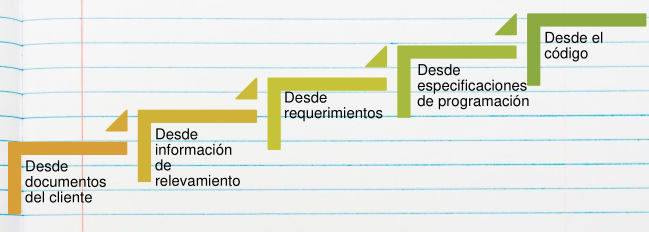

# 02 — Casos de Prueba

> Págs. 171-174 del apunte + transcripción de clase de testing. Cubre la definición, las partes, un ejemplo, y las técnicas de derivación (clases de equivalencia y valores límite).

## Definición

> Un **caso de prueba** es un conjunto de condiciones o variables que permiten determinar si el software (o una parte) está funcionando correctamente.

## Partes de un caso de prueba

| Parte | Qué define |
|---|---|
| **Objetivo** | La característica del sistema a comprobar. |
| **Datos de entrada y de ambiente** | Datos a introducir al sistema, con el sistema en condiciones preestablecidas. |
| **Comportamiento esperado** | La salida o acción esperada, según los requerimientos. |

### Punto clave de la clase: los datos son CONCRETOS, no genéricos

> En el caso de prueba **no decís** "ingreso un usuario, ingreso una clave". Establecés **qué variable** vas a usar y **qué dato concreto** va a tener, porque de eso depende el resultado esperado.

**Ejemplo (login, de la clase)**:
- Paso 1: seleccionar "iniciar sesión".
- Paso 2: ingresar usuario `jperez` y clave `12345`.
- **Resultado esperado**: si `jperez` existe y `12345` es su clave → el sistema deja iniciar sesión. Si uso `jperez` con clave `xx9` → espero "contraseña incorrecta".

> Si ejecuto el caso y el sistema dice "usuario no existe" cuando `jperez` sí existe → **encontré un defecto**: el resultado real difiere del esperado.

### Condiciones de prueba

> Las **condiciones de prueba** son el **contexto del sistema** que hay que tener en cuenta para poder ejecutar la prueba (características de la entrada). Se definen **antes** del caso de prueba: primero las condiciones, después el caso. Ejemplo: para el caso de login exitoso, la **condición** es que el usuario `jperez` **exista** y esté registrado con la clave `12345`.

### Regla de oro: la reproducibilidad

> **"Si el defecto no se puede reproducir, el defecto no se puede corregir."**

- El caso de prueba bien definido (pasos + datos concretos) permite **reproducir el defecto** ejecutándolo de la misma manera.
- Si reportás un defecto y el programador te pregunta "¿cómo lo reproduzco?" y no podés responderlo, el defecto **no se puede arreglar**: la única forma de identificar dónde está el problema es pudiendo reproducirlo.

---

## Ejemplo de caso de prueba

| ID | Prioridad | Nombre | Precondiciones | Pasos | Resultado esperado |
|---|---|---|---|---|---|
| 1 | Media | Taxis libres filtrados por barrio | · Usuario "Carlos" registrado y logueado con perfil de administrador. · Software configurado con ubicación, radio en Córdoba. · Barrios de Córdoba cargados (Nueva Córdoba, El Cerro, Alta Córdoba, etc). · Hay taxis conectados, libres, en Alta Córdoba, patente AF925ED. | 1. El admin selecciona "ver mapa de taxis". 2. Selecciona el barrio "Alta Córdoba". 3. Selecciona filtro de estado "libre". | El sistema muestra un mapa de Córdoba con zoom en Alta Córdoba, visualizando el taxi libre con patente AF925ED. |

---

## El problema: ¿cuántos casos de prueba defino?

> No se puede identificar o definir casos de prueba de manera infinita, ni de manera exploratoria o según lo que se me ocurra. Se necesita un mecanismo que permita **definir la menor cantidad de casos cubriendo el testing de forma holística**.

---

## Clases de equivalencia y valores límite

Los **bugs se esconden en las esquinas y se congregan en los límites**.

> **Ejemplo**: en una compra con valor mínimo $0 y máximo $100.000, conviene aprobar con valores esquina: **$100.000, $0, $1, $100.001, $100.000,32**. **No tiene sentido** probar $43.534.

### Partición de equivalencias

Se identifican **clases de equivalencia** (de entrada y de salida) que definen subconjuntos de datos válidos o no. Luego se toman representantes de cada clase.

> **Ejemplo (de la imagen del apunte)**: para un campo "Duración" con rango 10-25 y fracciones 0,5 ó 0:

| Condición | Clase | Casos |
|---|---|---|
| ≥10 y ≤25 con fracción 0, 5 ó 0 | Válida | 10, 20, 25 |
| ≥10 y ≤25 con fracción **distinta** de 0, 5 ó 0 | Inválida | 10,3 |
| Entero <10 o >25 | Inválida | 11 |
| Otro valor | Inválida | 12 |
| No ingresa valor | Inválida | 13 |

### Análisis de valores límite

Es una herramienta **dentro** de la partición de equivalencias: usar los **bordes** de cada clase para definir los casos de prueba (mínimo, mínimo-1, máximo, máximo+1).

---

## De dónde derivar los casos de prueba

> Cuanto más documentado está el software, más fácil es derivar un caso de prueba. Si el proyecto tiene puro código y casi nada escrito en la ERS, derivar casos se complica.

Los casos se pueden derivar desde:
- Documentos del cliente.
- Información de relevamiento.
- Requerimientos.
- Especificaciones de programación.
- El código mismo.

> **De la clase**: si tenés una **especificación de requerimientos detallada** (ej. caso de uso completo), la derivación de casos de prueba es **casi automática**. Si los requerimientos son vagos, lo que no especificaste ahí lo vas a tener que especificar al escribir los casos. Y si no hay requerimientos, te queda derivar los casos **del código**.

> **Curiosidad mencionada en clase**: existe una metodología en la que en lugar de especificar requerimientos se **escriben directamente los casos de prueba**, que sirven **a la vez** como especificación de requerimientos y como casos de prueba.

---

## Ciclo de Prueba

> Es la **ejecución de un conjunto de casos de prueba en una versión determinada** del producto. Generalmente se tienen **2 ciclos**; el primero se llama **ciclo 0**. El ciclo 0 siempre es **manual** (allí se configura todo) y a partir del **ciclo 1** ya se pueden automatizar las pruebas.

### Cómo funciona la secuencia de ciclos (de la clase)

1. Ejecutás **todos** los casos de prueba en una versión → termina el **ciclo 1**.
2. Analizás **cuáles fallaron** y se **corrigen los defectos**.
3. Nuevo ciclo: **volver a probar todos los casos** en la **nueva versión** (con las correcciones).
4. Se repite hasta cumplir el **criterio de aceptación** acordado con el cliente (ej. "no quedan defectos bloqueantes ni críticos", o "se ejecutaron N ciclos").

> **No podemos probar hasta que no haya defectos**: asumimos que siempre va a haber. Por eso el fin lo marca el criterio de aceptación, no la ausencia de fallas.

---

## Regresión

> Al concluir un ciclo de pruebas y reemplazarse la versión del sistema, debe realizarse una **verificación total de la nueva versión**, a fin de prevenir la introducción de nuevos defectos al intentar solucionar los detectados.

> "Volve a revisar todo antes de realizar un nuevo ciclo de test, ya que al solucionar un error es probable que hayan aparecido 1 o dos más."

### La regla de la clase: corregir 1 defecto introduce 2 o 3 más

> La teoría dice que **cuando corregimos un defecto, normalmente se introducen 2 o 3 defectos más** producto de esa corrección.

- Por eso **no alcanza** con que en el nuevo ciclo pruebes solo los casos que antes fallaron: la corrección puede haber roto un caso que **antes pasaba**.
- **Pero ojo con el matiz de la clase**: no siempre se hace regresión total. **No es lo mismo corregir un defecto cosmético que uno bloqueante**. Hay que evaluar el riesgo de cada corrección para decidir cuánta regresión aplicar.

---

## Chivo para el oral

1. **Definí qué es un caso de prueba** y sus 3 partes (objetivo, datos, comportamiento esperado). **Acentuá que los datos son CONCRETOS** (ejemplo del login: `jperez`/`12345`, no "un usuario cualquiera").
2. **Condiciones de prueba**: el contexto previo que debe cumplirse (el usuario existe). Se definen **antes** del caso.
3. **Regla de oro**: *"si el defecto no se puede reproducir, no se puede corregir"*. El caso bien definido permite reproducir.
4. **Mostrá el ejemplo** de la tabla (Taxis / Alta Córdoba / AF925ED) — es muy gráfico.
5. **Explicá el problema**: no se puede probar infinito, hay que derivar con criterio.
6. **Conectá con clases de equivalencia y valores límite**: los bugs están en los bordes. Mencioná la tabla del campo Duración.
7. **Ciclos**: ejecutar todos los casos → corregir → nuevo ciclo con la nueva versión → hasta cumplir el criterio de aceptación.
8. **Cerrá con regresión**: corregir 1 defecto introduce 2-3 más; por eso se re-prueba todo (con matiz según severidad).

> **Tip**: si te preguntan "¿por qué los valores límite?" → porque la mayoría de los errores de programación (off-by-one, comparaciones con `<` en vez de `<=`, etc.) caen en los bordes de los rangos válidos.

> **Si te preguntan "¿qué pasa si un defecto no se puede reproducir?"** → no se puede corregir. La única forma de ubicar el problema es reproducirlo; por eso el caso de prueba debe tener pasos y datos concretos.
