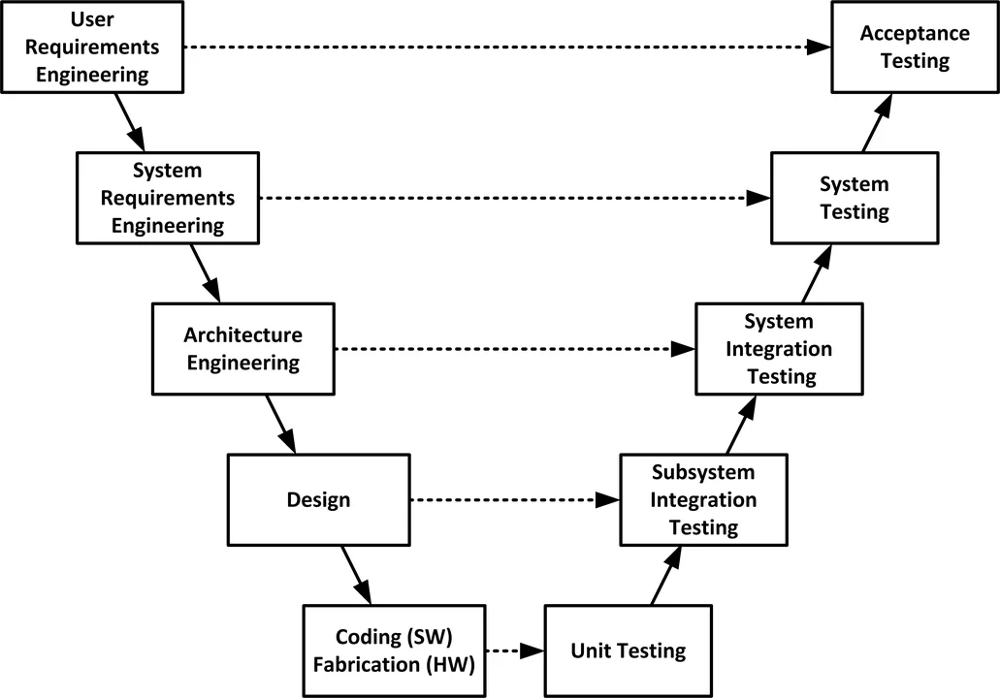

# 03 — Niveles y Ambientes de Prueba

> Págs. 174-179 del apunte. Cubre los 4 niveles de prueba, el modelo en V, y los 4 ambientes.

## Niveles de Prueba

### 1. Testing Unitario

- Se prueba **cada componente** tras su realización/construcción.
- De forma **individual** e **independiente**.
- Con **acceso al código** bajo pruebas y con apoyo del entorno de desarrollo (framework de unit tests, debugger).
- Los errores se reparan **tan pronto se encuentran**, sin constancia oficial de incidentes.

```javascript
// Función a probar
function sumar(a, b) {
  return a + b;
}

// Test unitario
test('Suma 2 + 3 debe ser 5', () => {
  expect(sumar(2, 3)).toBe(5);
});
```

> Notación `test`, `expect`, `toBe` propia del framework **Jest**.

### 2. Testing de Integración

- Verifica que las partes que funcionan bien **aisladamente** también lo hagan **en conjunto**.
- Cualquier estrategia debe ser **incremental**. Existen 2 esquemas:

| Estrategia | Dirección | Cuándo se usa |
|---|---|---|
| **Top-down** | De alto nivel → bajo nivel | Se comienza por la UI o módulos principales, avanzando hacia submódulos. |
| **Bottom-up** | De bajo nivel → alto nivel | Se inicia con módulos base, librerías, servicios. |

> **Lo ideal es una combinación de ambos**. Considerar que los **módulos críticos** deben probarse lo más tempranamente posible.

**Puntos clave del test de integración**:
- Conectar de a poco las partes más complejas.
- Minimizar la necesidad de programas auxiliares (*stubs* y *drivers*).

### 3. Testing de Sistema

- Es la prueba realizada cuando la aplicación funciona como un **todo** (prueba de la construcción final).
- Realizada sobre un **incremento** (en Scrum) o sobre un **producto** (en cascada).
- Determina si el sistema en su globalidad opera satisfactoriamente (recuperación de fallas, seguridad, stress, performance, etc.).
- Se suelen usar **casos de prueba**.
- El entorno debe asemejarse al **entorno real** donde se ejecutará el sistema.
- Investiga **requerimientos funcionales y no funcionales**.

### 4. Testing de Aceptación

- Lo realiza el **usuario** para determinar si la aplicación se ajusta a sus necesidades.
- La meta es establecer **confianza** en el sistema (no encontrar defectos, que es lo que hacen los otros niveles).
- Tiene dos variantes:

| Tipo | Quién | Dónde | Ejemplo |
|---|---|---|---|
| **Alfa** | Usuario en ambiente de testing | Ambiente de testing | Una empresa desarrolla un ERP y, antes de entregarlo, invita a un grupo reducido de usuarios clave a probarlo en el entorno interno. |
| **Beta** | Usuario en ambiente **real** | Producción | Una app móvil lanza una versión Beta pública para que un grupo de usuarios la use en sus teléfonos y reporten errores antes del lanzamiento oficial. |

---

## Modelo en V



El modelo en V es una **variante del modelo en cascada** que vincula cada fase de desarrollo (granularidad fina → gruesa) con un nivel de testing equivalente.

- **Enfoque descendente (izquierda)**: granularidad alta → fina. Se establece un proceso de **verificación** ("¿estamos construyendo el producto correctamente?").
- **Enfoque ascendente (derecha)**: se mapea cada actividad con un nivel de testing. Se establece un proceso de **validación** ("¿estamos construyendo el producto correcto?").

> **Verificación vs. validación**: las dos preguntas claves de la ingeniería de software, que se profundizan en el archivo [11-revisiones-tecnicas.md](11-revisiones-tecnicas.md).

---

## Ambientes del Testing

Los ambientes son los **lugares donde se trabaja** en la construcción de software. Cada nivel de prueba se asocia típicamente con uno o más ambientes.

| Ambiente | Qué es | Qué pruebas se hacen | Notas |
|---|---|---|---|
| **Desarrollo** | Hardware y software (librerías, IDEs, compiladores) para desarrollar y desplegar. | Pruebas **unitarias**. | Acceso total al código. |
| **Pruebas (testing)** | Ambiente que usan los testers; los **desarrolladores no deben tener acceso**. | Pruebas de **integración**. | Garantiza independencia. |
| **Preproducción** | Réplica del ambiente productivo (hardware, software, datos). | Pruebas de **sistema y aceptación**. | Costoso de mantener; a veces es difícil replicar concurrencia y configs únicas. |
| **Producción** | Configuración real que usan los usuarios finales. | **No se realizan pruebas** (el producto ya cumplió el DoD). | "Probar acá tiene grandes consecuencias". |

> **Preproducción puede no ser 100% igual a producción** por costo (hardware), seguridad o arquitectura. Esto es importante porque algunos defectos solo se ven en producción.

---

## Chivo para el oral

1. **Arrancá por los 4 niveles en orden**: unitario → integración → sistema → aceptación. Para cada uno, quién, sobre qué, qué se busca.
2. **Diferenciá alfa vs. beta** con un ejemplo (el del ERP / la app móvil del apunte).
3. **Mencioná el Modelo en V** y la diferencia entre **verificación** (construir bien) y **validación** (construir lo correcto).
4. **Recorré los 4 ambientes** de menor a mayor: desarrollo → testing → preproducción → producción, y qué pruebas se hacen en cada uno.
5. **Cerrá con la idea clave**: "los desarrolladores no deben tener acceso al ambiente de pruebas" — apunta a la independencia.

> **Pregunta típica**: "¿en qué ambiente se hace la prueba de sistema?" → **preproducción**. "¿Y la de aceptación?" → también preproducción (o aceptación alfa). La beta ya es en producción.
