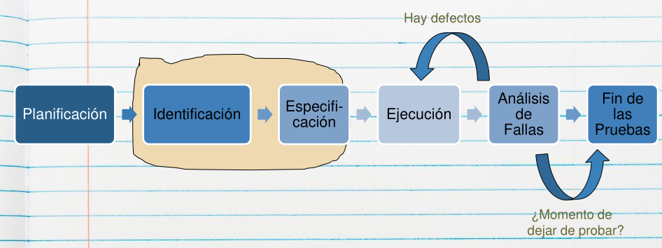

# 04 — Proceso de Pruebas

> Págs. 179-181 del apunte + transcripción de clase de testing. Cubre las 4 etapas: planificación, diseño, ejecución, evaluación y reporte.

> Al hablar de "proceso de pruebas" nos situamos en el contexto de un **proceso definido**.

> **Matiz de la clase (tradicional vs. ágil)**: el **plan de pruebas** formal es propio de un **proyecto tradicional** — en un proyecto gestionado con **Scrum no hay plan de pruebas** como documento. Pero la **identificación y especificación de casos de prueba se hacen igual** en ambos contextos, y la ejecución también.

---

## 1. Planificación

Acá se realiza el **Plan de Pruebas**, que contiene:

- **Riesgos y objetivos** del testing.
- **Estrategia** de testing.
- **Recursos**.
- **Criterio de aceptación**.

> El plan responde a: ¿qué voy a probar?, ¿con qué riesgo?, ¿con qué recursos?, ¿cuándo paro?

---

## 2. Diseño (Identificación y Especificación)

- Se identifican los **datos necesarios** para diseñar y priorizar los casos de prueba.
- Se **diseña el entorno de pruebas**.
- Se evalúa la **testeabilidad** de los requerimientos y el sistema.
- Se analiza si se utilizará **regresión** o no.

---

## 3. Ejecución

- Se ejecutan los **casos de prueba**.
- Se crean **conjuntos de pruebas** (test sets) para organizar la ejecución eficiente (ciclos de prueba).
- Se **automatiza** lo que sea necesario.
- Se **registra el resultado** de la ejecución y la **identidad y versión** del software en las herramientas de testing.
- Se **comparan los resultados reales con los esperados**.

> **De la clase**: la ejecución puede ser **manual, automatizada o una combinación de ambas**.

---

## 4. Evaluación y Reporte

- Se identifican y corrigen los defectos encontrados hasta cerrar **todos** los casos de prueba.
- Para el análisis se recurre a los **criterios de aceptación**.
- Se confecciona un **informe de reportes**.

> **El loop (de la clase)**: ejecución → **análisis de fallas** → corrección → nueva ejecución. El círculo se repite **las veces que sea necesario** hasta cumplir el **criterio de aceptación**, que es lo que determina el **fin** del testing.

---

## Chivo para el oral

1. **Contextualizá**: "Es el proceso definido que se sigue para hacer testing en una organización".
2. **Recorré las 4 etapas en orden**: Planificación → Diseño → Ejecución → Evaluación/Reporte. Para cada una, mencioná las salidas concretas (plan de pruebas, casos diseñados, resultados, informe).
3. **Detenete en el Plan de Pruebas**: riesgos, estrategia, recursos, criterio de aceptación. Es lo más preguntable.
4. **Cerrá con la idea del loop**: si hay defectos, se corrigen y se vuelve a evaluar; cuando se cumplen los criterios, recién se cierra el proceso.

> **Si te preguntan "¿cuándo se deja de probar?"** → cuando se cumplen los **criterios de aceptación** definidos en la planificación (costos, % sin fallas, no hay defectos de cierta severidad).
