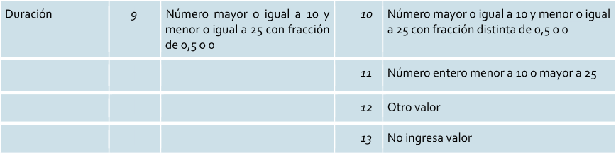
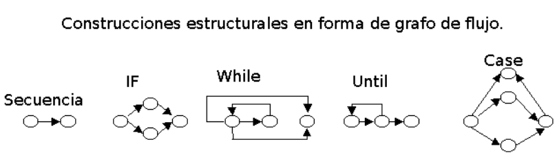
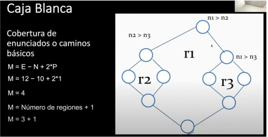
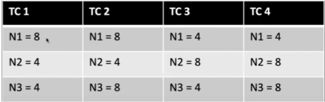

# 05 — Estrategias de Testing (Caja Negra y Caja Blanca)

> Págs. 181-186 del apunte + transcripción de clase de testing. Cubre las técnicas basadas en especificaciones (partición de equivalencias, valores límite) y basadas en experiencia, más las coberturas de caja blanca y la complejidad ciclomática.

> **Consejo de la clase** (igual que con las estimaciones): **no uses una sola técnica, combínalas**. Las distintas técnicas atacan distintos problemas; la combinación es la que maximiza la cobertura con el menor esfuerzo (el objetivo siempre es: **mayor cobertura posible con el menor esfuerzo**, porque presupuesto y tiempo son limitados).

## Caja Negra

> En esta estrategia **no se dispone de la estructura interna** de la implementación; se analizan las funcionalidades como una caja negra, en términos de **entradas y salidas**.

El proceso: ingresar datos a la "caja", comparar los resultados con los esperados.



### Métodos basados en especificaciones

Se ejecutan utilizando la documentación de especificaciones del producto.

- **Partición de equivalencias**: se identifican las **clases de equivalencia** (de entrada y salida) que definen subconjuntos de datos válidos o no. Luego se toman representantes de cada clase.
  - *Ver ejemplo de la imagen*: campo "Duración" con clases válidas e inválidas (10, 11, 12, 13).
  - El último paso del método es **identificar los casos de prueba** que cubran esas clases.
- **Análisis de valores límite**: herramienta que se usa **dentro** de la partición de equivalencias. Se toman los **bordes** de cada clase (mínimo, mínimo-1, máximo, máximo+1).

### Métodos basados en experiencia

- **Adivinanza de defectos**: enfoque basado en la **intuición y experiencia** del tester. Se elabora una lista de defectos posibles o situaciones propensas a error y se prueban.
  - *Ejemplo*: en formularios, es común que falte validación del `@` en emails → empezar por ahí.
- **Testing exploratorio**: el tester, mientras va probando, **va aprendiendo** a manejar el sistema y, junto con su experiencia y creatividad, **genera nuevas pruebas** sobre la marcha.

---

## Caja Blanca

> El tester tiene **acceso al código fuente, pseudocódigo o diagramas de flujo** y diseña casos de prueba basados en la **estructura interna**. El objetivo es verificar la **lógica, los flujos de control y los datos internos**.

### Cobertura de caminos básicos

- **Objetivo**: encontrar todos los **caminos independientes** de una funcionalidad que deben recorrerse (testearse) al menos una vez.
- Permite obtener la **complejidad ciclomática (M)**, que representa la cantidad de caminos independientes y da un **límite inferior** para el número de casos de prueba necesarios para ejecutar todas las instrucciones al menos una vez.
- **Mientras más alto es M, más riesgo** representa para el software (menos estable).

#### Construcciones en grafo de flujo



- **Secuencia**: dos nodos encadenados.
- **IF**: bifurcación verdadera/falsa.
- **While**: iteración con condición al inicio.
- **Until**: iteración con condición al final.
- **Case**: switch de múltiples caminos.

#### Procedimiento

1. **Representar** la funcionalidad con un grafo/diagrama de flujo (se excluyen algoritmos recursivos).
2. **Calcular M** con una de las dos fórmulas:

   **a)** `M = E - N + 2P`
   - M = complejidad ciclomática.
   - E = número de **aristas** del grafo.
   - N = número de **nodos** del grafo.
   - P = número de **componentes conexos** o nodos de salida.

   **b)** `M = número de regiones cerradas + 1`.

   

3. **Definir el conjunto mínimo de caminos independientes** (asignando valores que provoquen ir tomando cada camino). **No son casos de prueba** todavía, sino los caminos que después se traducen a test cases.

   

   - Cada columna es un **Test Case** distinto.
   - Cada test case tiene el conjunto de valores que lo activa (ej. TC1 se activa con `N1=8, N2=4, N3=4`).

### Cobertura de sentencias

- **Sentencia**: cualquier instrucción que involucre acciones (asignación de variables, operaciones numéricas, invocación de métodos, etc.).
- **Objetivo**: encontrar la **cantidad mínima de casos de prueba** que permitan ejecutar cada **línea de código al menos una vez**.

```python
if x > 0:
    print("Positivo")
print("Fin")
```

> Para `x = 1` y `x = -1`, se logra cobertura de sentencias.

### Cobertura de decisión (branches)

- Garantiza que se evalúe **cada rama** de las estructuras de control (`if`, `while`, `for`) al menos una vez como **verdadera y falsa**.
- **Limitación**: no evalúa condiciones internas dentro de decisiones compuestas.

```python
if x > 0 and y < 5:
    print("Caso 1")
else:
    print("Caso 2")
```

- `x = 1, y = 3` → verdadera.
- `x = -1, y = 6` → falsa.

### Cobertura de condición

- Asegura que **cada condición individual** dentro de una decisión compuesta se evalúe como verdadera y falsa.

```python
if x > 0 and y < 5:
    print("Cumple")
```

- `x > 0` como verdadero y falso.
- `y < 5` como verdadero y falso.

> **Nota**: existe la **cobertura de decisión/condición** combinada, que evidentemente cubre ambos aspectos.

---

## Comparación rápida

| Estrategia | Lo que prueba | Lo que necesita |
|---|---|---|
| **Caja Negra** | Funcionalidad (entradas/salidas) | Especificaciones, experiencia |
| **Caja Blanca** | Estructura interna, flujos de control | Código fuente, grafos |

---

## Chivo para el oral

1. **Abrí con el objetivo**: máxima cobertura con el menor esfuerzo (tiempo y presupuesto limitados). Por eso **las técnicas se combinan** — cada una ataca problemas distintos.
2. **Caja Negra**: "No veo el código, solo entradas y salidas". Métodos basados en especificaciones (equivalencias + valores límite) y basados en experiencia (adivinanza + exploratoria).
3. **Caja Blanca**: "Veo el código, me interesa la estructura". Construyo el grafo de flujo, calculo **M** (complejidad ciclomática) y defino los **caminos independientes**.
4. **Las 3 coberturas en orden**: sentencias (cada línea) → decisión (cada rama V y F) → condición (cada operando V y F). Cada una es **más estricta** que la anterior.
5. **Cerrá con la idea**: la cobertura de condición es la más completa, pero también la más costosa. En la práctica se usan combinaciones.

> **Si te piden la fórmula de M** → `M = E - N + 2P` (o cantidad de regiones cerradas + 1). Asegurate de tener un ejemplo a mano (el del apunte con M=4 y M=3+1 sirve).
