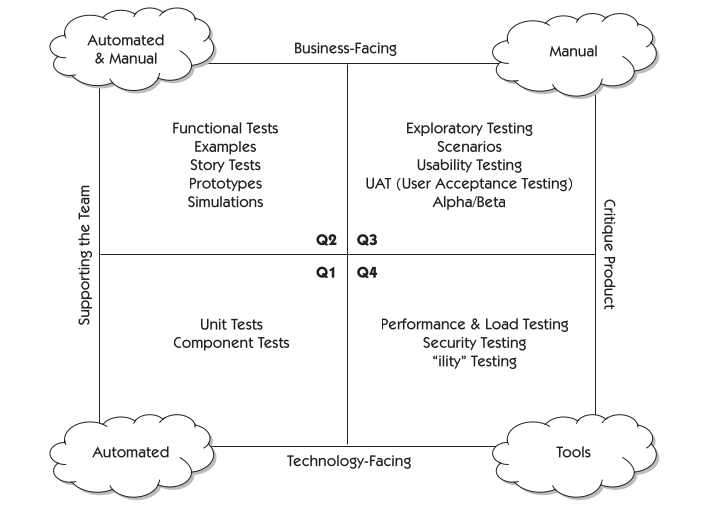
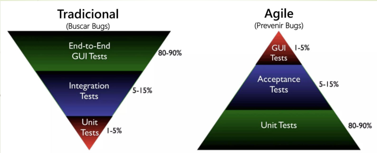

# Testing Ágil

> Basado en el libro *Agile Testing* de **Lisa Crispin** y **Janet Gregory**. Se cruza con el Manifiesto Ágil y con la práctica de TDD/ATDD ya vistas en unidades anteriores.

---

## Diferencias con el testing tradicional

| Aspecto | Tradicional | Ágil |
|---|---|---|
| Ciclo de vida | Testing como fase al final | Testing durante todo el desarrollo |
| Quién testea | Tester separado del equipo | Todo el equipo es responsable de la calidad |
| Automatización | Opcional, al final | Promovida desde el inicio |
| Feedback | Tardío, costoso de corregir | Temprano y continuo |

---

## Manifiesto del Testing Ágil

### Valores

1. Testing **a lo largo del proceso** y no al final.
2. **Prevenir** bugs en lugar de buscarlos.
3. Construir el **mejor sistema** en lugar de romperlo.
4. **Todo el equipo** es responsable de la calidad (no solo el tester) → se conecta con Scrum, donde "desarrollador" es cualquiera que aporta valor.
5. **Entender** el testing en lugar de solo chequear la funcionalidad.

### Principios

1. El testing se mueve hacia adelante en el proyecto.
2. El testing **no es una fase**.
3. Todos hacen testing.
4. Reducir la latencia del feedback.
5. Las pruebas representan **expectativas**.
6. Mantener el código limpio, corregir defectos rápido.
7. Reducir la sobrecarga de documentación de pruebas.
8. Las pruebas son parte del **Definition of Done**.
9. En lugar de probar al final se utiliza **TDD**.

---

## Prácticas concretas

1. **Pruebas unitarias y de integración automatizadas.**
2. **Pruebas de regresión automatizadas** a nivel de sistema (verifican que los cambios no rompan lo que ya funcionaba).
3. **Pruebas exploratorias**: no planificadas, manuales, basadas en la creatividad del tester.
4. **TDD** (Test Driven Development).
5. **ATDD** (Acceptance Test Driven Development): a partir de una user story se definen los criterios de aceptación con el PO/cliente, en lenguaje natural con **Gherkin** (Given / When / Then). Frameworks como **Cucumber** los traducen a tests ejecutables.
6. **Control de versión de las pruebas** junto al código (Git).

### Ejemplo ATDD con Gherkin

```
Given el usuario está logueado
When agrega un producto al carrito
Then el carrito debe mostrar 1 producto
And el total debe ser 100
```

```java
@Given("el usuario está logueado")
public void elUsuarioEstaLogueado() {
    usuario = new Usuario("Juan", true);
}
```

---

## Roles en el equipo ágil

**Tester**
- Prepara y mantiene el ambiente de pruebas.
- Define casos de prueba a partir de las historias de usuario.
- Valida el Definition of Done.
- Registra y notifica bugs.
- Acepta la historia con el PO.
- Lleva métricas de calidad.

**Product Owner**
- Desarrolla las historias con sus criterios de aceptación.
- Entiende el dominio del negocio.
- Identifica dependencias.

**Developers**
- Definen estrategias de prueba.
- Automatizan las ATDD.
- Detectan y notifican bugs.
- Dan feedback temprano de las historias.
- Sugieren mejoras funcionales y de usabilidad.

---

## Cambios culturales

Implementar todo esto implica un cambio cultural fuerte:

- **Equipos**: se pasa de control gerencial estricto a autonomía y autogestión. Genera resistencia en líderes acostumbrados a jerarquías rígidas.
- **Roles**: los roles tradicionales (jefe de proyecto) se transforman o desaparecen; aparecen Scrum Master y Product Owner. Puede generar confusión o resistencia por pérdida de estatus.

---

## Cuadrantes del Testing Ágil

Modelo original de **Brian Marick**, popularizado por Lisa Crispin y Janet Gregory. No es una simple lista, sino una matriz **2×2** que clasifica los tipos de prueba cruzando dos dimensiones fundamentales. Entender estos ejes es clave para saber qué, cómo y para quién estamos probando:

- **Eje Y (vertical) → El Foco: ¿A quién están orientadas?**
  - *Business-facing (Arriba):* Orientado al negocio. Pruebas descritas en el lenguaje del usuario o del cliente.
  - *Technology-facing (Abajo):* Orientado a la tecnología. Pruebas en lenguaje técnico, enfocadas en cómo está construido el sistema por dentro.
- **Eje X (horizontal) → El Propósito: ¿Para qué hacemos la prueba?**
  - *Supporting the team (Izquierda):* Soporte al equipo. Guían el desarrollo y ayudan a construir bien (se hacen *mientras* se programa).
  - *Critique the product (Derecha):* Crítica al producto. Lo cuestionan. Evalúan el producto una vez que ya hay una versión funcional para encontrar defectos o mejoras.



### Q1 – Tecnología · Soporte al equipo
> **Pregunta clave:** *"¿El código hace exactamente lo que el programador quiso que hiciera?"*

- Es la base técnica del software, responde a la automatización pura y dura para guiar el desarrollo.
- **Prácticas:** **TDD** (Test Driven Development).
- **Tipos de prueba:** Pruebas **unitarias** (validan pequeños objetos o métodos) y pruebas de **componentes** (validan un conjunto de clases que brindan un servicio).
- **Método:** Estrictamente **automáticas**, escritas y ejecutadas por el equipo de desarrollo.

### Q2 – Negocio · Soporte al equipo
> **Pregunta clave:** *"¿Estamos construyendo las funcionalidades que el cliente pidió?"*

- Traduce los requerimientos del cliente en pruebas ejecutables, expresando las condiciones de satisfacción del negocio.
- **Prácticas:** **ATDD** (Acceptance Test Driven Development). Derivan directamente de las historias de usuario y sus criterios de aceptación.
- **Tipos de prueba:** Pruebas **funcionales** y de **aceptación**, ejemplos y prototipos.
- **Método:** Generalmente **automáticas**, utilizando frameworks como **Cucumber** (con lenguaje **Gherkin**).

### Q3 – Negocio · Crítica al producto
> **Pregunta clave:** *"¿El sistema es útil, intuitivo y resuelve el problema del usuario final en la vida real?"*

- Aquí dejamos de probar si el sistema cumple los requisitos escritos y pasamos a evaluar cómo se siente usarlo (cuestionamos el producto).
- **Tipos de prueba:**
  - **Pruebas de usabilidad:** focus groups, observación, entrevistas.
  - **Pruebas exploratorias:** usar la creatividad del tester para romper el sistema probando flujos no planeados.
  - **Pruebas alfa:** grupo selecto interno (equipo de desarrollo u otros miembros de la empresa) en ambiente de testing.
  - **Pruebas beta:** grupo externo de usuarios reales, en ambiente cercano a producción.
- **Método:** Eminentemente **manuales**, ya que requieren intuición y criterio humano.

### Q4 – Tecnología · Crítica al producto
> **Pregunta clave:** *"¿El sistema es robusto, seguro y rápido bajo estrés?"*

- Aquí se evalúan los Requisitos No Funcionales y se cuestionan los atributos de calidad externos del sistema una vez construido.
- **Tipos de prueba:**
  - **Performance**, carga y estrés.
  - **Security** (seguridad).
  - Pruebas de *"ilidades"*: **Availability** (disponibilidad), **Maintainability** (mantenibilidad), portabilidad, etc.
- **Método:** Depende de **herramientas específicas automatizadas** (como JMeter, OWASP ZAP, etc.), ya que un humano no puede simular condiciones críticas (ej. 10.000 usuarios conectados a la vez).
---

## Pirámide de Testing: Tradicional vs Ágil



### Tradicional (cono de helado invertido)
- Muchas pruebas **end-to-end / GUI**, pocas unitarias.
- Pruebas **lentas y costosas**, sobre una versión ya "pulida".
- Bugs detectados al final → caros de arreglar.

### Ágil (pirámide correcta)
- **80-90%** pruebas unitarias, 5-15% de aceptación, 1-5% de GUI.
- Pruebas **rápidas y baratas**, integradas al desarrollo.
- Bugs **prevenidos** desde el desarrollo.

### Conclusión

El enfoque ágil **invierte la pirámide**. Prioriza la automatización de pruebas de bajo nivel (unitarias, de componentes) por su velocidad y bajo costo, y reserva las pruebas de UI/end-to-end solo para los flujos críticos.

Esto se alinea con:
- El **Manifiesto del Testing Ágil**: testing a lo largo del proceso, no solo al final; prevenir bugs en lugar de buscarlos.
- Las prácticas de **CI/CD** (integración y despliegue continuos), donde la batería de tests corre en cada cambio.

---

## Chivo para el oral

1. **Arrancá por el modelo**: "Es una matriz 2×2 de Marick / Crispin & Gregory que cruza a quién está orientada la prueba con qué propósito tiene."
2. **Recorré los ejes**: vertical = tecnología vs. negocio; horizontal = soporte al equipo vs. crítica al producto.
3. **Cuadrante por cuadrante**, con el ejemplo típico (TDD en Q1, ATDD/Cucumber en Q2, usabilidad y beta en Q3, performance/seguridad en Q4).
4. **Cerrá con la pirámide**: tradicional = muchas GUI, ágil = muchas unitarias (80-90%). Conectá con el Manifiesto de Testing Ágil y con CI/CD.

> **"¿Por qué importa?"** → te obliga a no confundir niveles de prueba con tipos de prueba, y asegura cobertura tanto funcional como no funcional, técnica y de negocio, sin duplicar esfuerzos.
