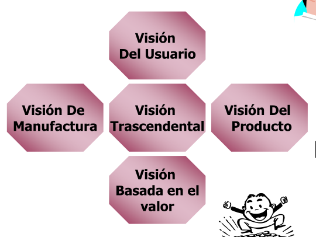
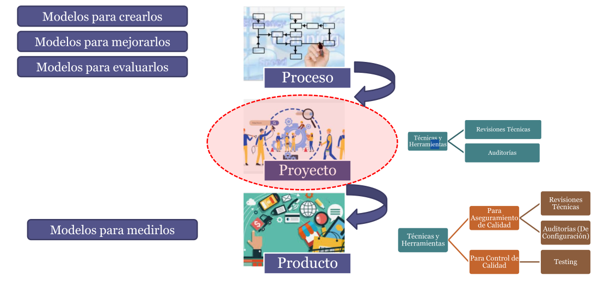
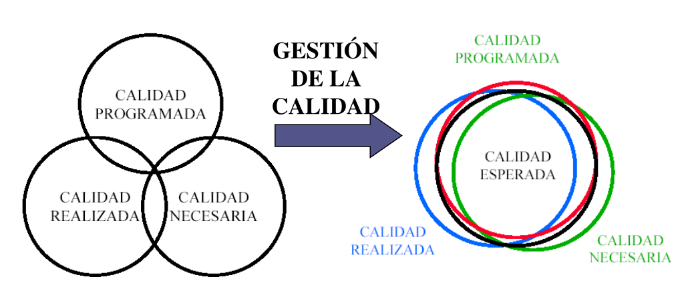
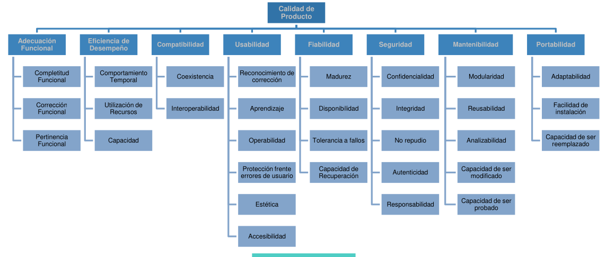
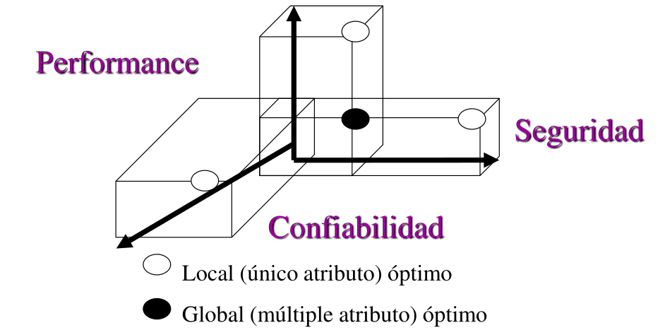
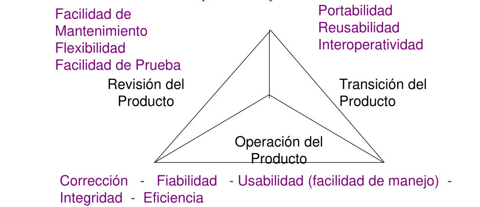

# 08 — PPQA: Aseguramiento de la Calidad (Quality Assurance)

> Págs. 197-207 del apunte. Cubre el concepto de calidad, sus principios fundamentales, las 5 visiones y los 3 modelos principales para evaluar la calidad del producto de software.

---

## 1. El Concepto de Calidad

> Se define como el conjunto de propiedades y características de un producto o servicio que le confieren la **habilidad de satisfacer necesidades explícitas o implícitas**.

La calidad no es un valor absoluto; es **relativa** y subjetiva. Depende directamente de las personas que interactúan con el software, su edad, el contexto de uso, las circunstancias de trabajo y el paso del tiempo.

### ¿Qué dimensiones abarca la calidad en el desarrollo de software?
Para lograr un producto de calidad, se deben alinear múltiples perspectivas:
- Las expectativas del **cliente** (quien paga por el sistema).
- Las expectativas del **usuario final** (quien opera el sistema día a día).
- Las necesidades de la **gerencia** (tiempos, presupuestos, alineación estratégica).
- Las necesidades del **equipo de desarrollo y mantenimiento** (código limpio, mantenibilidad, infraestructura).
- Los intereses de otros **stakeholders** involucrados.

### Síntomas de un proyecto sin enfoque en la calidad
Cuando la calidad no se gestiona, los proyectos sufren patologías claras:
- Atrasos crónicos en las entregas y costos excedidos.
- Requerimientos ambiguos o mal definidos ("el software no hace lo que tiene que hacer").
- Incumplimiento sistemático de compromisos y horas extras no planificadas.
- **La regla del 90-90 (Ley de Tom Cargill):** "El primer 90% del código consume el 90% del tiempo de desarrollo. El 10% restante del código consume el otro 90% del tiempo".
- Fallas en la Gestión de la Configuración (SCM): pérdida de versiones, componentes desactualizados o caos en los repositorios.

---

## 2. Principios Fundamentales de la Calidad

> **Regla de oro: La calidad no se inyecta al final, se embebe desde el principio.** 
> No es una capa de pintura que se añade en la etapa de testing; debe ser **concebida desde el momento cero** (levantamiento de requerimientos).

Para implementar una cultura de calidad, hay que entender que:
- **Es transversal (Embebida):** Pertenece a las actividades de la disciplina de soporte de la ingeniería de software. Acompaña a todo el ciclo de vida.
- **Es un esfuerzo colectivo:** No es responsabilidad exclusiva del tester; involucra a todo el equipo.
- **Las personas son el motor:** Depende de la capacidad técnica, por lo que la **capacitación** es innegociable.
- **Requiere apoyo gerencial:** Aunque las iniciativas pueden nacer "desde abajo", necesitan el respaldo de la dirección y líderes que prediquen con el ejemplo.
- **Exige medición:** **No se puede gestionar ni mejorar lo que no se mide** → el uso de métricas es obligatorio.
- **El exceso de testing no es sinónimo de calidad:** Aumentar las pruebas encuentra más errores, pero no previene que se sigan cometiendo. La calidad nace en la prevención.
- **Debe ser pragmática:** Empezar por la simplicidad y asegurar que los procesos sean razonables y rentables para el negocio.

---

## 3. Las 5 Visiones de la Calidad

Existen diferentes formas de percibir y evaluar la calidad dependiendo de dónde nos paremos:

| Visión | Enfoque principal |
|---|---|
| **Del Usuario** | Evalúa si el producto satisface las expectativas prácticas y reales de quien lo usa. Es la más subjetiva y difícil de medir porque reside "en la cabeza" del usuario. El agilismo ataca esta visión promoviendo la validación y comunicación continua. |
| **De Manufactura (Proceso)** | Se enfoca en "cómo" se hace. Evalúa si el proceso de desarrollo utilizado es el **correcto** y estándar. Un buen proceso debe aportar valor en cada paso y minimizar los desperdicios. |
| **Del Producto** | Se centra en las características internas del software. Mide el **nivel de cumplimiento** de los requerimientos técnicos y especificaciones particulares. |
| **Basada en el Valor** | Busca el equilibrio en la relación **costo-beneficio**. El objetivo es entregar el mayor valor posible al cliente garantizando, al mismo tiempo, la rentabilidad del proyecto. |
| **Trascendental** | Es una visión **utópica e idealista** (ej. "cero defectos"). Aunque es inalcanzable, sirve como un norte filosófico que impulsa la mejora continua. |

---

## 4. Calidad: Proceso vs. Proyecto

Es fundamental distinguir entre el proceso de la organización y el proyecto en sí:

- **El Proceso (El mapa):** Es la guía teórica y estandarizada que define cómo la organización desarrolla software ("el camino desde A hasta B"). Existen **modelos de mejora de procesos** (como CMMI, IDEAL, SPICE) y **modelos de evaluación/auditoría** (como ISO 9001) para medir el nivel de madurez de una empresa.
- **El Proyecto (El viaje):** Es la **instanciación** de ese proceso en la realidad. Al ejecutar un proyecto, se adaptan las actividades del proceso para construir un producto específico bajo restricciones de tiempo y costo.

> **Nota conceptual:** Marcos como Kanban funcionan bajo la filosofía **Lean** (gestión de flujo de valor), mientras que modelos como IDEAL o SPICE se enmarcan en la gestión de **procesos definidos**.

---

## 5. Gestión de la Calidad del Producto

> A diferencia de los procesos (donde existen estándares globales como CMMI), **no existe una plantilla universal para la calidad del producto**. Evaluar si un producto es "bueno" depende enteramente de su contexto de uso, por lo que los modelos son **teóricos** y deben adaptarse.

La gestión de calidad de un producto busca encontrar el punto óptimo entre tres dimensiones:

- **Calidad Programada:** Lo que se planificó hacer (el alcance y las especificaciones documentadas).
- **Calidad Necesaria:** Lo que el cliente o usuario *realmente* necesita para resolver su problema (las expectativas reales).
- **Calidad Realizada:** Lo que el equipo de desarrollo efectivamente construyó y entregó.

> **La Calidad Esperada** se encuentra en la intersección (el equilibrio) de estas tres esferas. Cualquier desarrollo que quede fuera de esa intersección representa un **desperdicio** (esfuerzo inútil) o genera **insatisfacción** (requerimiento no cubierto).

---

## 6. Modelos de Calidad del Producto

Para estructurar la evaluación técnica del software, la industria utiliza diferentes modelos basados en **Requerimientos No Funcionales (RNF)**. Los RNF dictan **cómo** debe comportarse el sistema (su arquitectura, rendimiento, seguridad) en lugar de **qué** debe hacer (reglas de negocio).

### 6.1. Modelo ISO/IEC 25000 (SQuaRE)
Es el estándar internacional más actual y completo. Descompone la calidad en **8 características principales**:

| Característica | ¿Qué evalúa? |
|---|---|
| **Adecuación Funcional** | Capacidad del sistema para proporcionar funciones que satisfagan las necesidades declaradas. Básicamente: "que haga lo que promete hacer". |
| **Eficiencia de Desempeño** | Comportamiento del sistema bajo carga. Evalúa tiempos de respuesta y optimización en el uso de recursos (CPU, RAM). |
| **Compatibilidad** | Capacidad de coexistir e interactuar de forma fluida con otros sistemas en el mismo entorno. |
| **Usabilidad** | Nivel de facilidad para ser comprendido, aprendido y utilizado. Incluye la **accesibilidad** (diseño inclusivo para daltonismo, etc.) y la protección contra errores del usuario. |
| **Fiabilidad** | Capacidad de mantener un nivel de rendimiento bajo ciertas condiciones. Se mide por el tiempo que el sistema opera sin presentar fallos de ejecución. |
| **Seguridad** | Capacidad de proteger información. Sub-atributos: **Confidencialidad** (acceso exclusivo a autorizados), **Integridad** (prevención de alteraciones), **Disponibilidad** (acceso cuando se requiere), **No repudio**, y **Autenticidad**. |
| **Mantenibilidad** | Grado de facilidad para que el código sea modificado, actualizado o reparado por el equipo de desarrollo. |
| **Portabilidad** | Facilidad para transferir el software de un entorno a otro (ej. de Windows a Linux, o adaptar un diseño web a móvil). |

### 6.2. Modelo de Barbacci
Propone que la calidad es un juego de compensaciones (*trade-offs*). 

Busca equilibrar tres vértices críticos: **Performance**, **Confiabilidad** y **Seguridad**.
> *Aclaración vital: Confiabilidad no es Seguridad. Confiabilidad es que el sistema "no se caiga ni falle"; Seguridad es que el sistema "no sea vulnerado desde el exterior".*

Al diseñar la arquitectura, se deben tomar decisiones:
- **Puntos locales:** Optimizar agresivamente un solo atributo (ej. cifrado de grado militar absoluto, pero que sacrifica velocidad/performance).
- **Puntos globales:** Decisiones de diseño que logran un balance garantizando un nivel aceptable y conjunto en múltiples atributos simultáneamente.

### 6.3. Modelo de McCall
Es uno de los modelos pioneros. En lugar de listar características aisladas, agrupa la calidad según la perspectiva del ciclo de vida del producto en **3 áreas principales**:

| Área | Enfoque | Atributos que incluye |
|---|---|---|
| **Operación del producto** | Aspectos inmediatos que percibe el usuario al interactuar con el sistema en ejecución. | Fiabilidad, usabilidad, integridad (seguridad) y eficiencia (performance). |
| **Revisión del producto** | Perspectiva técnica sobre la capacidad del código para soportar correcciones y evoluciones. | Facilidad de mantenimiento, flexibilidad arquitectónica y facilidad de prueba (testability). |
| **Transición del producto** | Capacidad del software para adaptarse a nuevos ecosistemas de hardware o integrarse a otros flujos. | Portabilidad, reusabilidad (usar módulos en proyectos futuros) e interoperabilidad. |

---

## 🎯 Chivo para el oral (Resumen de alto impacto)

1. **Definición precisa:** "Calidad es el grado en que un sistema satisface necesidades explícitas e implícitas". Aclará siempre que es un concepto **relativo** (depende del stakeholder).
2. **El principio de oro:** La calidad **no se inyecta al final** con testing, **se embebe** transversalmente desde el levantamiento de requerimientos.
3. **Las 5 Visiones:** Recordá nombrar: Usuario, Manufactura (Procesos), Producto, Valor y Trascendental. *Tip: Mencioná que la visión del usuario es la más crítica y difícil de medir.*
4. **La intersección perfecta:** Explicá que la **Calidad Esperada** nace del equilibrio entre lo que se programó, lo que se construyó (realizada) y lo que el cliente de verdad precisaba (necesaria).
5. **Dominá los 3 Modelos:**
   - **ISO 25000:** Es el estándar actual. Son 8 características (Adecuación, Eficiencia, Compatibilidad, Usabilidad, Fiabilidad, Seguridad, Mantenibilidad, Portabilidad).
   - **Barbacci:** Modelo de *trade-offs* (equilibrio entre Performance, Confiabilidad y Seguridad).
   - **McCall:** Modelo de las 3 fases (Operación, Revisión y Transición).
6. **El concepto de RNF:** Si te preguntan "¿Qué son los Requerimientos No Funcionales?", respondé seguro: *"Son los atributos de calidad. No definen QUÉ hace el sistema, sino CÓMO lo hace (qué tan rápido, qué tan seguro, qué tan escalable). Son tan críticos como los funcionales."*

