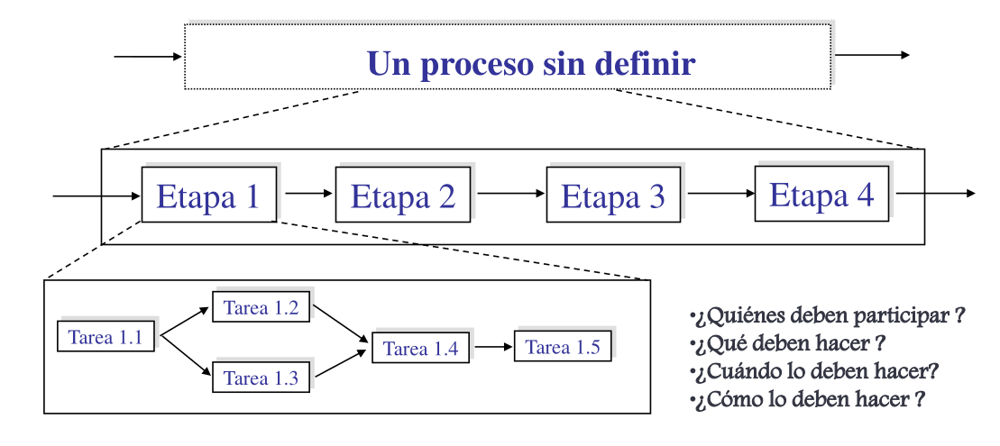
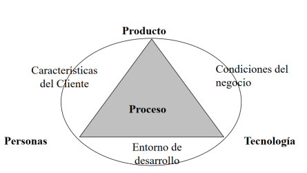

# 09 — Calidad de Proceso y Administración de la Calidad

> Págs. 207-212 del apunte. Cubre procesos definidos vs. empíricos, la administración de calidad, y el GAC (Grupo de Aseguramiento de Calidad).

## Calidad del Proceso: Definidos vs. Empíricos

### Procesos definidos

> Se considera que **el proceso es el único factor controlable**. La mejora continua se realiza sobre el proceso. Si el proceso tiene calidad, entonces el producto será de calidad.

- **Todos los modelos de calidad están basados en procesos definidos** (CMMI, SPICE, ISO 9001).
- Asumen que la calidad del producto se obtiene **si se tiene un proceso de calidad** para construirlo.

> En la práctica esto **no resulta tan así**.

### Procesos empíricos

> Si el producto tiene éxito, la razón principal **no es tanto un buen proceso sino el equipo**.

- Están basados en la **experiencia**; no consideran que la calidad del proceso determine la calidad del producto.
- **No están de acuerdo con las auditorías** (creen que los equipos son autoorganizados).
- La calidad se logra mediante **revisiones técnicas**, **inspección** y **adaptación constante** del trabajo.
- Mientras las personas hagan lo que tienen que hacer, el producto va a tener calidad.

### ¿Por qué insistir en la calidad del proceso?

Porque es el **único factor controlable** para mejorar la calidad del software:

- La **tecnología** avanza y no la podés controlar.
- Las **personas / equipo** no se pueden controlar a voluntad.
- El **producto / cliente** tampoco se controla directamente.

> En cambio, sí podés definir, documentar, medir y mejorar el **proceso**.

---

## Definición de Procesos

Lo primero para tener un proceso de calidad es **definirlo explícitamente** y comunicarlo a todo el equipo. Se deben definir:

- **Etapas y subetapas**.
- **Roles** (quiénes participan).
- **Qué** se debe hacer.
- **Cuándo** se debe hacer.
- **Cómo** se debe hacer.

Además de las etapas técnicas (Ingeniería de Requerimientos, Análisis, Diseño, Implementación, Prueba, Despliegue), hay que **incorporar las disciplinas de gestión y soporte** vistas en unidades anteriores.

> El proceso definido debe **aportar valor al producto** y ser **adaptado** en cada proyecto. Lo único no negociable es que el testing **no se puede eliminar** del proceso.

---

## Administración de la Calidad de Software

> Concerniente con **asegurar que se alcancen los niveles requeridos de calidad** para el producto/proceso de software.

- Implica la **definición de estándares y procesos** apropiados y asegurar que sean respetados.
- Debería ayudar a desarrollar una **cultura de calidad** donde la calidad es vista como **responsabilidad de todos y cada uno**.
- **Hacer calidad**: insertar en cada actividad acciones tendientes a **detectar lo más temprano posible** oportunidades de mejora sobre producto y proceso.

> **La administración de la calidad debe estar separada de la administración de proyectos** para asegurar independencia.

---

## GAC: Grupo de Aseguramiento de Calidad

> Equipo **especializado e independiente** dentro de la organización que verifica **objetivamente** que el software y los procesos de desarrollo cumplan con los estándares de calidad definidos.

### Reporte del GAC

- **NO** debe reportar al gerente de proyectos (le quita independencia y libertad).
  - "Es muy croto decirle a tu jefe 'mira, hicimos todo mal', porque nos va a sacar el bono".
- El reporte de calidad tiene que ser **independiente** del reporte del proyecto.
- **No debería haber más de una posición** entre la gerencia de primer nivel y el GAC.
- El GAC debería reportar a alguien **realmente interesado en la calidad** del software.

### Actividades de la administración de calidad

#### Aseguramiento de la calidad

> Define **estándares, procesos, procedimientos y modelos** sobre los cuales se van a realizar las comparaciones.

Si vas a hacer auditorías o revisiones técnicas (de producto o proceso), necesitás **algo con qué comparar** (un requerimiento, un proceso definido).

Funciones del aseguramiento de calidad:
- Evaluación del plan del proyecto de software.
- Evaluación del proceso de diseño de software.
- Evaluación de los requerimientos.
- Evaluación de las prácticas de programación.

#### Planificación de la calidad

> Selecciona los **procedimientos y estándares aplicables** para un proyecto particular y los modifica en caso necesario.

#### Control de calidad

> Es la **ejecución de lo planificado**; se revisa en qué situación está el proyecto. Asegura que los procedimientos y estándares son respetados por el equipo.

Dos enfoques para garantizar el control de calidad:

**1) Revisiones de calidad** (principal método de validación):
- Un grupo examina parte de un proceso o producto y su documentación.
- Tipos:
  - Inspecciones para remoción de defectos (producto).
  - Revisiones para evaluación de progreso (producto y proceso).
  - Revisiones de calidad (producto y estándares).

**2) Evaluaciones de Software Automáticas y mediciones** (con herramientas).

---

## Chivo para el oral

1. **Definidos vs. empíricos**: los primeros creen que la calidad viene del proceso; los empíricos (como ágil) creen que viene del equipo.
2. **¿Por qué el proceso?** Porque es el único factor **controlable** (la tecnología, las personas y el cliente no lo son).
3. **GAC**: equipo independiente que reporta **fuera** del proyecto. Si reporta al jefe de proyecto, pierde independencia.
4. **Aseguramiento vs. control**: el aseguramiento **define** los estándares; el control **verifica** que se cumplan.
5. **Cerrá con la idea**: la calidad se planifica, se mide, y se mejora continuamente. El proceso es nuestra mejor herramienta.

> **Si te preguntan "¿por qué separar GAC del proyecto?"** → para garantizar **objetividad**. Si el GAC depende del mismo gerente, hay presión para no reportar problemas. La independencia permite que el reporte refleje la realidad aunque sea incómoda.
