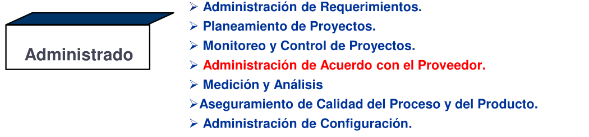
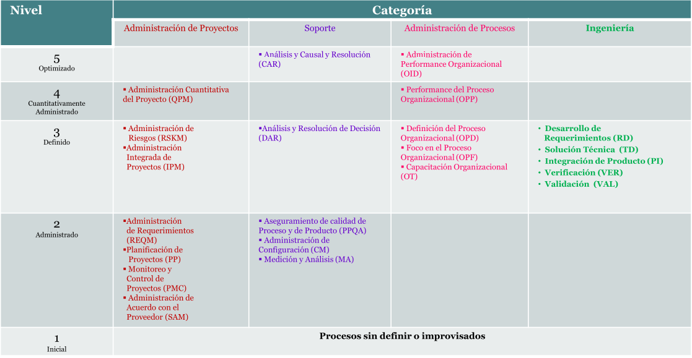
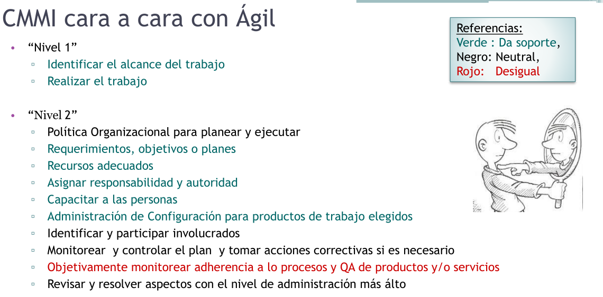

# 10 — Modelos de Mejora y Evaluación de Procesos

> Págs. 212-225 del apunte. Cubre SPICE / ISO 15504, IDEAL, y CMMI con sus niveles, constelaciones y áreas de proceso.

## Modelos de Mejora de Procesos

> La **mejora continua de procesos** significa comprender los procesos existentes y cambiarlos para **incrementar la calidad del producto** o **reducir costos y tiempo** de desarrollo. Los procesos definidos están de acuerdo con esta definición.

- Los modelos **NO te dicen cómo hacer las cosas**. Son modelos **descriptivos**.
- El propósito es **analizar el proceso que tiene la organización** y armar un **proyecto cuyo resultado, en lugar de ser un producto, es un proceso (definido) mejorado** que se vuelca de nuevo a la organización.
- Todos parten de la filosofía: **si tengo un proceso mejorado, el producto es de calidad**.

### Procesos con calidad

> El proceso se define, se desarrolla el producto, se evalúa la calidad. Si la calidad es OK, se **estandariza** y se distribuye. Si no, se **mejora** el proceso y se vuelve a intentar.

Una vez estandarizado, se distribuye a la organización para que todos los equipos lo usen. **Acá es donde difiere ágil con los empíricos**, que dicen que la experiencia no es extrapolable.

---

## Modelo IDEAL

> Da el contexto para crear un **proyecto cuyo resultado va a ser un proceso definido**. Es un modelo **cíclico** que mejora el proceso existente en una organización. Su nombre se debe a las **5 fases** que lo componen.

> Es uno de los modelos en los que más se hace **incapié en cátedra**.

### Fases

| Fase | Qué hace | Notas |
|---|---|---|
| **I — Inicialización** | Se reconocen las necesidades de cambio, las razones para iniciar, las metas buscadas. | Clave: **sponsoreo o aval de la alta gerencia**. Sin esto, siempre hay "algo más importante" antes. |
| **D — Diagnóstico** | Establecer la **madurez actual** de la organización y los riesgos asociados al proceso de mejora. | Acá entra el modelo **SPICE**, que ayuda a determinar el nivel de madurez. Se usan **auditorías y métricas**. |
| **E — Establecimiento** | Se elabora un **plan de acción detallado** con acciones específicas, entregables y responsabilidades. Se definen **prioridades y estrategias**. | |
| **A — Acción** | Efectuar los cambios y reunir información para aprender. Se implementa en un **proyecto piloto** (no en toda la organización). Si la solución es satisfactoria, se implanta en la empresa. | |
| **L — Aprendizaje (Leveraging)** | Garantizar que el próximo ciclo sea más efectivo. Se revisa toda la información recolectada y se evalúan logros y objetivos. Se **extrapola la mejora** al resto de proyectos en caso de éxito, o se hacen **correcciones** si el piloto fracasó. | |

---

## Modelo SPICE (ISO 15504)

> Modelo para la **mejora y evaluación de los procesos de desarrollo, mantenimiento de sistemas de información y productos de software**.

Tiene una arquitectura basada en **dos dimensiones**: la de **procesos** y la de **capacidad**.

### Dimensión de procesos

Categorías de procesos:

| Categoría | Procesos | Código |
|---|---|---|
| **Primarios** | Cliente | ACQ |
| | Proveedor | SPL |
| | Ingeniería | ENG |
| | Operación | OPE |
| **De soporte** | Soporte | SUP |
| **De organización** | Gestión | MAN |
| | Recursos humanos | REU |
| | Infraestructura | RIN |
| | Mejora de procesos | PIM |

### Dimensión de capacidad

Evalúa la capacidad de los procesos en **6 niveles**:

| Nivel | Nombre |
|---|---|
| 0 | Incompleto |
| 1 | Realizado |
| 2 | Gestionado |
| 3 | Establecido |
| 4 | Predictable |
| 5 | En optimización |

Para cada nivel existen **atributos de proceso estándar** que ayudan a evaluar.

---

## CMMI — Capability Maturity Model Integration

> **Modelo Integrado de Capacidad y Madurez** para la **mejora y evaluación de procesos** de una organización.

- Desarrollado por el **Software Engineering Institute (SEI)**.
- Es un **marco de referencia** descriptivo: **no te dice cómo hacer las cosas**, sino qué deberías lograr.
- CMMI **no certifica empresas** como la ISO 9001. **Evalúa la madurez de los procesos** mediante una *Appraisal* (evaluación formal) y la organización obtiene un **nivel de madurez del 1 al 5**.

### SCAMPI

> *Standard CMMI Appraisal Method for Process Improvement*: método oficial para evaluar según CMMI. Determina el nivel de madurez o capacidad de la organización.

- Propone **3 tipos de evaluación (A, B, C)** que van de muy rigurosas a menos rigurosas.

### Constelaciones

> Existen 3 constelaciones o modelos de negocio. Cubren los modelos de CMMI. **El más usado en la cátedra es el DEV**.

| Constelación | Qué hace | Ejemplo |
|---|---|---|
| **CMMI-DEV (Desarrollo)** | Mide, monitorea y administra procesos de desarrollo. Tiene dos representaciones: por **etapas** y **continua**. | Desarrollo de software interno. |
| **CMMI-ACQ (Adquisición)** | Permite seleccionar, administrar y adquirir productos y servicios de otra empresa. | Cuando la empresa contrata gente que haga el trabajo (no es subcontratación de personal). |
| **CMMI-SVC (Servicios)** | Guía para entregar servicios externos o internos. | Una compañía telefónica certifica su proceso de atención al cliente. |

---

## CMMI-DEV: Representación por Etapas

CMM (el antecesor) se basaba mucho en etapas: dividía a las organizaciones en **maduras** (niveles 2-5) e **inmaduras** (nivel 1). A mayor madurez, mayor capacidad de lograr objetivos y menor riesgo.

> **Importante**: para ser de un nivel, se debe cumplir con los requisitos de **ese nivel y los anteriores**. **Nosotros hacemos foco en el nivel 2**.

| Nivel | Nombre | Descripción |
|---|---|---|
| 1 | **Inicial** | Procesos **ad hoc** y caóticos. No hay prácticas consistentes ni estructura. El éxito depende de "héroes". No se usan métricas. |
| 2 | **Administrado (gestionado)** | Procesos caracterizados por proyectos, gestionables de forma básica. Foco en requerimientos, planificación y seguimiento. Empiezan a usarse métricas básicas. Sigue siendo **reactivo**. |
| 3 | **Definido** | Procesos **estandarizados y documentados** consistentes en toda la organización. Capacitación, técnicas más detalladas, métricas avanzadas, **revisiones entre pares** para prevenir errores. Empiezan las verificaciones y validaciones. |
| 4 | **Cuantitativamente Administrado** | Métricas significativas de calidad y productividad, usadas sistemáticamente para toma de decisiones y gestión de riesgos. Se usan **datos estadísticos históricos** para una calidad **predictiva** (no solo se corrigen errores, se **evita que aparezcan**). |
| 5 | **Optimizado** | Mejora continua del rendimiento mediante **innovación tecnológica**. Se ataca la **causa raíz** de los problemas. Se establecen objetivos cuantitativos de mejora revisados continuamente. |

> A medida que subimos de nivel pasamos de un proceso **reactivo** (resolver sobre la marcha) a uno **proactivo** (anticipar problemas con planes detallados).

### Área de proceso (Nivel 2)

Las áreas de proceso del nivel 2 son 7 (la última es opcional):

- Administración de Requerimientos (REQM).
- Planeamiento de Proyectos (PP).
- Monitoreo y Control de Proyectos (PMC).
- Administración de Acuerdo con el Proveedor (SAM) — *opcional*.
- Medición y Análisis (MA).
- Aseguramiento de Calidad del Proceso y del Producto (PPQA).
- Administración de Configuración (CM).

> **SAM es necesaria solo si se contrata a un proveedor externo**, para verificar que cumpla con el nivel de calidad interno.

### Tabla completa de áreas de proceso

En total existen **22 áreas de proceso** distribuidas en los 5 niveles. **16 son comunes a todas las constelaciones** CMMI.

---

## CMMI-DEV: Representación Continua

> El objetivo es **acreditar la capacidad de la organización ante cada una de las áreas de proceso de forma individual**. En lugar de medir la madurez de toda la organización, mide la **capacidad de un proceso en particular**.

- **Procesos de nivel 0** son los que no se ejecutan. (Ej: si le preguntás a una empresa si hace gestión de configuración y te dice que no, es **nivel 0** en esa área).
- Apunta a **mejorar las áreas que uno elige**. Una organización puede obtener la certificación para un área específica en un nivel de capacidad dado.

> Si en una evaluación por etapas todas las áreas que presentás son del mismo nivel, te dan **2 acreditaciones**: la del nivel de madurez y la de la capacidad de los procesos.

---

## CMMI vs. Ágil

> **¿Por qué no coinciden a medida que subimos de nivel?**

- CMMI dice que **tenés que definir un proceso y después cumplirlo** (lo verifica con auditorías).
- Ágil **nunca evalúa que hayas seguido el proceso que definiste**.
- CMMI a partir de nivel 3-4 plantea **métricas/estadísticas**; ágil plantea que **la experiencia no es extrapolable** a otros proyectos.

### Comparación por nivel

- **Nivel 1**: ágil lo cubre naturalmente (identificar alcance, realizar el trabajo).
- **Nivel 2**: la mayoría de las prácticas de CMMI **tienen soporte en ágil** (política, planificación, recursos, responsabilidades, capacitación, configuración, etc.). La diferencia principal es la **adherencia objetiva a procesos y QA de productos** (en rojo), que ágil no exige igual.

- **Nivel 3**: ágil da soporte al "mantener un proceso definido", pero **no mide la performance del proceso** (CMMI sí).
- **Nivel 4**: ágil **no establece objetivos cuantitativos** ni estabiliza performance de subprocessos.
- **Nivel 5**: ágil da soporte a la mejora continua, pero la **identificación y corrección de causa raíz** es desigual.

---

## Chivo para el oral

1. **Distinguí mejora vs. evaluación**: IDEAL/SPICE son de **mejora**; SCAMPI/CMMI son de **evaluación**.
2. **IDEAL**: las 5 fases (I-D-E-A-L). Hacé énfasis en **Inicialización** (sponsoreo gerencial) y **Diagnóstico** (acá entra SPICE).
3. **SPICE**: 2 dimensiones (procesos y capacidad), 6 niveles (0 al 5).
4. **CMMI**: 5 niveles (1 al 5), 3 constelaciones (DEV, ACQ, SVC), 2 representaciones (etapas y continua). Nosotros hacemos foco en **nivel 2**.
5. **Etapas vs. continua**: por etapas mide la madurez de toda la organización; continua mide la capacidad de procesos individuales.
6. **CMMI vs. Ágil**: coinciden en niveles bajos, se separan en niveles altos (métricas, causa raíz, objetivos cuantitativos).
7. **Cerrá con la idea**: CMMI es **procesos definidos**; ágil es **empírico**. Distinta filosofía, distintos mecanismos.

> **Si te preguntan "¿en qué nivel estamos?"** → **Nivel 2**, el de la cátedra. Y podés dar los ejemplos: PPQA, REQM, PP, PMC, CM, MA.
