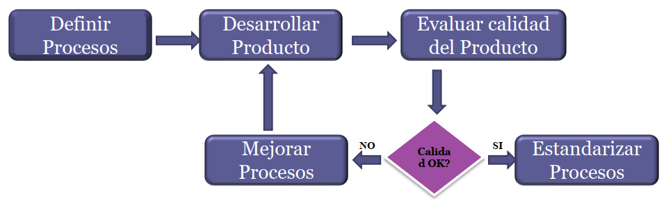
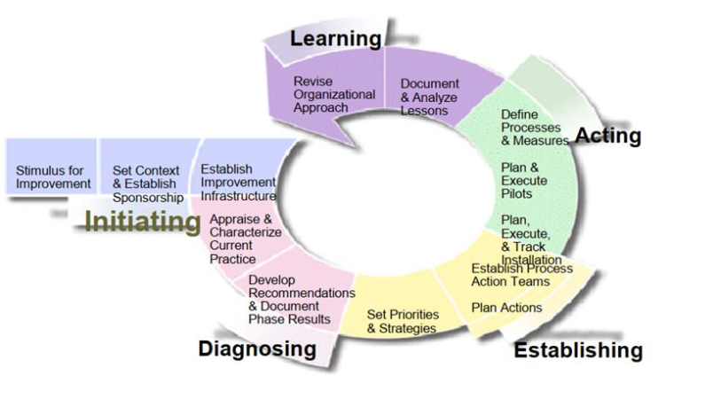
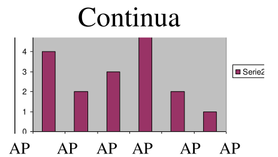
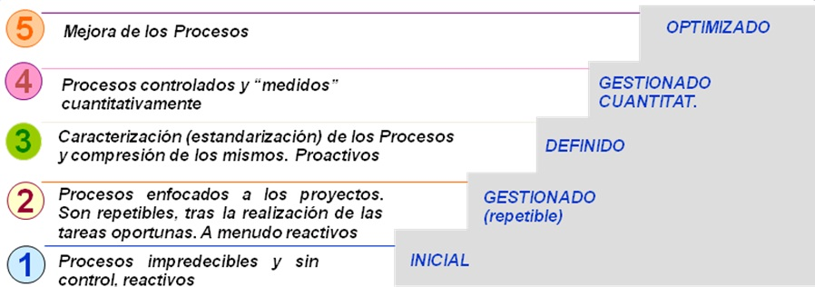
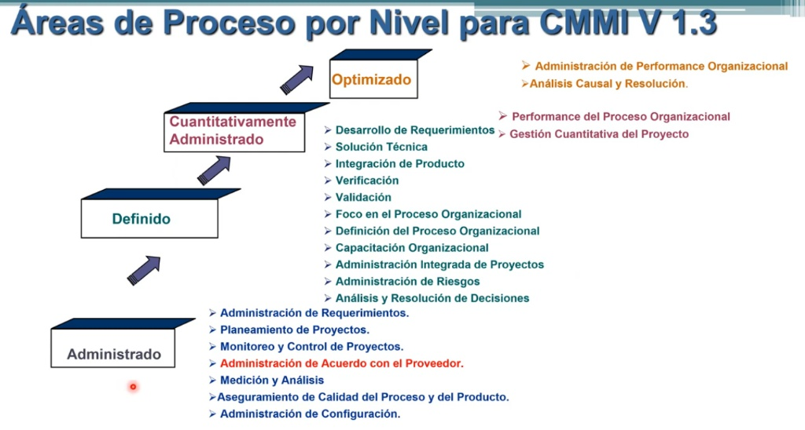
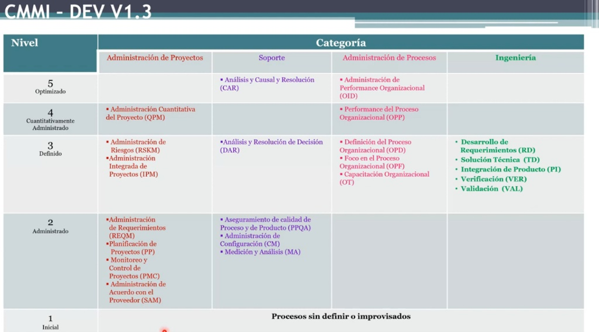
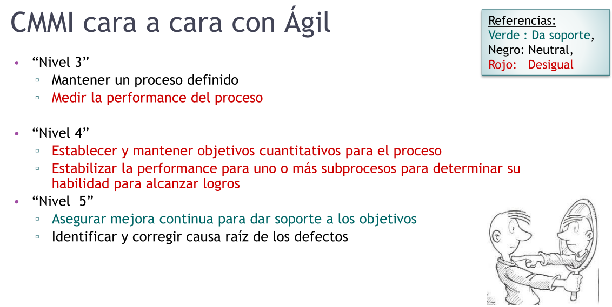

# 10 — Modelos de Mejora y Evaluación de Procesos

> Págs. 212-225 del apunte. Cubre SPICE (ISO 15504), IDEAL y CMMI (niveles, constelaciones y áreas de proceso), incluyendo su relación con metodologías ágiles y el proceso de auditoría.

## 1. Introducción a la Mejora de Procesos

> La **mejora continua de procesos** consiste en comprender cómo trabaja la organización actualmente y modificar esos procesos para **incrementar la calidad del producto**, o bien **reducir costos y tiempos** de desarrollo. 

- Estos modelos **NO te dicen cómo programar ni cómo hacer tu trabajo** (no son metodologías). Son marcos de referencia **descriptivos**.
- Su objetivo es tratar a la mejora como un proyecto en sí mismo: **un proyecto cuyo resultado no es un software, sino un proceso definido y mejorado** que se devuelve a la organización para que todos lo utilicen.
- La filosofía base es simple: **si el proceso es maduro y de calidad, el producto resultante también lo será**.

### La Diferencia Clave: ¿IDEAL o CMMI?
Es muy común confundir para qué sirve cada uno. La regla es simple:
* **IDEAL es el Modelo de Mejora:** Te dice *cómo* llevar adelante un proyecto de mejora (los pasos a seguir).
* **CMMI es el Modelo de Calidad:** Te dice *qué* objetivos debes alcanzar con ese proceso.

### El Ciclo de Calidad en los Procesos

1. El proceso se **define**.
2. Se **desarrolla** el producto usando ese proceso.
3. Se **evalúa** la calidad resultante.
4. Si la calidad es buena, el proceso se **estandariza** y se distribuye. Si no, se ajusta y se vuelve a iterar.

> **Choque de filosofías:** Al estandarizar un proceso, la organización asume que la experiencia exitosa de un equipo sirve para los demás. **El agilismo (basado en el control empírico) difiere aquí**, argumentando que cada equipo y proyecto es un ecosistema único y la experiencia rígidamente estandarizada no siempre es extrapolable.

---

## 2. ⚠️ Aclaración clave: ¿Certificar o Evaluar/Acreditar?

Para el examen oral, es vital que no uses estos verbos como sinónimos:

* **Certificar (Ej. ISO 9001):** Un ente externo (auditor) revisa tu empresa y dictamina si cumplís o no con una norma estándar. Es un resultado binario: **Aprobás o no aprobás**.
* **Evaluar / Acreditar / *Appraisal* (Ej. CMMI, SPICE):** No hay un "aprobado/reprobado". Un evaluador analiza tus procesos y **determina en qué nivel estás**. No te dan un "certificado", sino que te **acreditan un nivel de madurez o capacidad**.

---

## 3. Comparativa de los Modelos Principales

| Modelo | Propósito Principal | Enfoque Estructural | ¿Certifica o Evalúa? | ¿Cómo se relacionan? |
|---|---|---|---|---|
| **IDEAL** | Guía de implementación. | Fases de un proyecto de mejora cíclica. | **Ninguno.** Es un método de trabajo para aplicar mejoras. | Es el "vehículo" o la hoja de ruta que usa la empresa para mejorar. |
| **SPICE (ISO 15504)** | Evaluación de capacidad. | 2 Dimensiones (Procesos y Capacidad). | **Evalúa** (determina capacidad del 0 al 5). | Se utiliza dentro de la fase "D" (Diagnóstico) del modelo IDEAL. |
| **CMMI** | Evaluación de madurez organizacional o capacidad de procesos. | Áreas de proceso distribuidas en niveles (1 al 5). | **Acredita / Evalúa** (mediante el método SCAMPI). | Es el estándar de madurez más robusto y utilizado en la industria del software. |

---

## 4. Modelo IDEAL

> IDEAL es un marco de trabajo cíclico para gestionar programas de mejora de procesos. Se llama así por las siglas de sus **5 fases**. *(Nota: Muy tomado en la cátedra).*

| Fase | Descripción | Punto Crítico |
|---|---|---|
| **I — Inicialización** | Se reconocen las necesidades de cambio y se definen las metas. | Requiere el **patrocinio (sponsorship) de la alta gerencia**. Sin apoyo directivo la mejora muere, porque los proyectos de clientes siempre parecen "más urgentes" y la gente no le dedica tiempo. |
| **D — Diagnóstico** | Determina dónde está parada la organización hoy (*gap analysis*). | Aquí es donde se aplican modelos de evaluación como **SPICE** o **CMMI** para ver qué nos falta. |
| **E — Establecimiento** | Se elabora el **plan de acción detallado** (entregables, métricas, responsables). | Se priorizan las áreas más críticas para el negocio. |
| **A — Acción** | Se ejecuta el plan. Generalmente se implementa en un **proyecto piloto** controlado. | Permite ajustar la solución antes del despliegue masivo. |
| **L — Aprendizaje (*Leveraging*)** | Se analiza el resultado del piloto. Si funcionó, se **estandariza y extrapola**. Si falló, se documentan las lecciones aprendidas. | Garantiza la mejora continua. |

---

## 5. Modelo SPICE (ISO/IEC 15504)

> Es un estándar internacional para la **evaluación de la capacidad de los procesos**. Se estructura como una matriz de **dos dimensiones cruzadas**:

1. **Dimensión de Procesos (El "Qué"):** Agrupa los procesos que la organización debe ejecutar (Primarios, De soporte, De organización).
2. **Dimensión de Capacidad (El "Cómo de bien"):** Evalúa la ejecución de un proceso particular en **6 niveles**:
   - 0: Incompleto / 1: Realizado / 2: Gestionado / 3: Establecido / 4: Predecible / 5: En optimización.

---

## 6. CMMI (Capability Maturity Model Integration)

> No te dice cómo programar, sino **qué áreas de proceso (PA)** debes dominar para que tu desarrollo sea predecible. 

**¿Qué significa "Grupo" en CMMI?**
Cuando el modelo exige que exista un "Grupo de SQA" o "Grupo de SCM", no pide un departamento de 15 personas. Se refiere a que exista **el rol y la responsabilidad formalmente asignada**, aunque sea una sola persona a tiempo parcial.

### SCAMPI y los Tipos de Evidencia
SCAMPI es el método oficial para evaluar/acreditar CMMI. Para que el evaluador dicte un nivel, necesita cruzar **dos tipos de evidencias**:
1. **Evidencia Subjetiva:** Las entrevistas (lo que la gente *dice* que hace).
2. **Evidencia Objetiva:** Documentos y repositorios (la *prueba* de que lo hicieron). *Ej: Si el líder dice en la entrevista que hace planes de calidad, el auditor pedirá ver el PDF en el repositorio.*

### Las 3 Constelaciones de CMMI
1. **CMMI-DEV (Desarrollo):** Para empresas que construyen productos de software. *(Foco de la materia).*
2. **CMMI-ACQ (Adquisición):** Para empresas que tercerizan y compran software.
3. **CMMI-SVC (Servicios):** Para empresas que entregan servicios (soporte, salud, educación).

---

## 7. CMMI-DEV: Las Dos Representaciones

### A. Representación Continua (Foco en el Proceso)

- **Objetivo:** Acreditar la capacidad de **áreas de proceso individuales** (del 0 al 3/5).
- Ideal si una empresa solo quiere certificar "Gestión de Requerimientos" pero no le interesa certificar "Gestión de Proveedores".

### B. Representación por Etapas (Foco en la Organización)

- **Objetivo:** Acreditar la **madurez global** de toda la organización.
- **La regla del castillo de naipes:** Para subir a un nivel, la empresa debe cumplir obligatoriamente TODAS las áreas de ese nivel y de los anteriores. Si fallas en un área de Nivel 2, automáticamente toda la organización pasa a ser Nivel 1.

#### Los 5 Niveles de Madurez

| Nivel | Nombre | Características en la práctica |
|---|---|---|
| **1** | **Inicial (Inmaduro)** | Apagan incendios. El éxito se logra gracias al sacrificio de **"héroes"** individuales que trabajan fines de semana. Estado puramente reactivo y de alto riesgo. |
| **2** | **Gestionado** | *(Foco de la cátedra).* El proyecto se administra. Hay planificación, requerimientos y SQA. La empresa da los recursos para no depender de actos heroicos. |
| **3** | **Definido** | Procesos estandarizados a nivel organizacional. Todo está documentado. Aparecen las revisiones entre pares (Peer Reviews). |
| **4** | **Gestionado Cuantitativamente** | Se usan métricas estadísticas para predecir calidad y rendimiento. El entorno pasa de ser reactivo a **predictivo**. |
| **5** | **Optimizado** | Mejora continua proactiva y ataque a la **causa raíz** sistémica de los defectos. |

### Análisis de las Áreas de Proceso (CMMI-DEV v1.3)

El modelo CMMI se compone de **22 áreas de proceso (PA)**. La profesora en clase explicó cómo estas áreas se distribuyen lógicamente para atacar primero el descontrol de la gestión y luego, en niveles más altos, la madurez de la ingeniería y la predicción estadística.

**El enfoque en el Nivel 2 (Gestionado):**
Como se observa en el gráfico, **el Nivel 2 no contiene áreas de "Ingeniería del Producto"**. Esto es porque cuando se creó CMMI, se advirtió que las empresas inmaduras (Nivel 1) pasaban el 80% de su tiempo programando para apagar incendios y no tenían visibilidad ni control.
Por ende, el objetivo del Nivel 2 es incorporar **capacidad de gestión y soporte** antes de meterse con el código. Las 7 áreas que debes dominar para ser Nivel 2 son:
1. **REQM:** Administración de Requerimientos. (Gestionarlos y trazarlos, no desarrollarlos).
2. **PP:** Planeamiento del Proyecto.
3. **PMC:** Monitoreo y Control del Proyecto.
4. **MA:** Medición y Análisis.
5. **PPQA:** Aseguramiento de la Calidad (Proceso y Producto).
6. **CM:** Administración de la Configuración.
7. **SAM:** Administración de Acuerdos con Proveedores *(Opcional, solo aplica si la empresa subcontrata partes del desarrollo).*

#### Clasificación por Categorías de Proceso
Otra forma de entender CMMI es agrupar las áreas según su naturaleza funcional, en lugar de su nivel de madurez:

1. **Gestión de Proyectos (Project Management):** Contiene todas las actividades de planificación, monitoreo de riesgos y gestión de proveedores. Comienza en el Nivel 2.
2. **Soporte (Support):** Son las disciplinas transversales (Calidad, Configuración, Métricas). Es el foco principal de las materias de la cátedra durante el cuatrimestre (Nivel 2).
3. **Ingeniería (Engineering):** Recién aparece en el **Nivel 3**. Se enfoca puramente en el producto de software: diseño, arquitectura, integración, validación y verificación. 
4. **Gestión de Procesos (Process Management):** Aparecen fuerte en los Niveles 4 y 5. Son áreas diseñadas para tener capacidad instalada de gente que mide, evalúa estadísticamente y busca la causa raíz de los defectos para optimizar la organización. Es típico en software de misión crítica (ej. industria aeroespacial o defensa).

---

## 8. CMMI vs. Marcos Ágiles (El Choque Cultural)

Para que Ágil y CMMI convivan (lo cual es posible, especialmente en Nivel 2), **ambos deben ceder**:
- **CMMI cede burocracia:** Acepta que un *Product Backlog* reemplace documentos formales de requerimientos o que no haya actas de reuniones diarias (Dailies).
- **Ágil cede independencia:** Debe aceptar someterse a **auditorías objetivas e independientes** (PPQA), algo que choca con la filosofía de equipos 100% autogestionados.

**El divorcio en los Niveles 4 y 5:** Aquí se separan drásticamente. CMMI exige medir la performance estadística y extrapolar la experiencia entre proyectos. Ágil sostiene que cada iteración y equipo es único, por lo que **la experiencia empírica no es extrapolable** matemáticamente.

---

## 9. Auditorías (El brazo armado de la Calidad)

La auditoría es una revisión **objetiva e independiente**. El auditor debe ser externo al proyecto evaluado (generalmente pertenece al grupo de Aseguramiento de la Calidad, SQA).

### Tipos de Auditorías
1. **FCA (Funcional):** Verifica que el producto haga lo que se pidió (que cumpla los requerimientos).
2. **PCA (Física):** Verifica que la documentación técnica coincida con el código construido.
3. **Auditoría de Proyecto:** Verifica el **cumplimiento del proceso**. *(Ej: Si el equipo dijo que usaría Scrum, el auditor verifica que realmente estén haciendo las retrospectivas).*

### Proceso y Tipos de Resultados
Las auditorías se planifican en conjunto (no son visitas sorpresa). El auditor usa un *Checklist* (guía de preguntas mínimas). Al finalizar, genera un reporte con 3 posibles resultados:

1. **Buenas Prácticas:** Actividades superadoras. *(Ej: Armar una herramienta propia para automatizar métricas. Ojo: "Tener un plan" no es buena práctica, es lo mínimo exigido).*
2. **Desviaciones:** Incumplimientos del proceso. Pueden ser "No adecuado" (todo mal) o "Necesita mejora" (se hace a medias).
3. **Observaciones:** Prácticas que cumplen el proceso pero son **altamente riesgosas**. 
   - *Ejemplo de clase:* Si un equipo estima el esfuerzo del proyecto "tirando 3 dados sobre la mesa" y lo tiene documentado así, *no es una desviación* (porque cumplen su propio proceso), pero el auditor deja una observación advirtiendo que es una pésima técnica.

---

## 🎯 Chivo para el oral (Resumen de alto impacto)

1. **La triada conceptual:** IDEAL es el *cómo* mejoro (las 5 fases). CMMI es el *qué* debo alcanzar (modelo de madurez). SCAMPI es *cómo me evalúan* (evidencia objetiva y subjetiva).
2. **No digas "Certificar":** CMMI y SPICE no certifican (como ISO 9001), sino que **acreditan o evalúan** niveles de capacidad/madurez.
3. **El Sponsor es vital:** En el modelo IDEAL, la fase clave es la "I" (Inicialización), porque sin apoyo gerencial la mejora de procesos muere frente a las urgencias de los clientes.
4. **Dominá CMMI Nivel 2:** Es el foco de la materia. Mencioná que es el estado "Gestionado" donde la empresa sale de los "héroes apaga-incendios" (Nivel 1). Recordá áreas clave como PP, REQM y PPQA. 
5. **La regla del Nivel (Por Etapas):** Aclaralo bien: si fallás en UN área de Nivel 2, se cae todo el castillo y pasás a ser Nivel 1, sin importar si cumplís cosas de Nivel 5.
6. **El choque con Ágil:** Ágil y CMMI conviven bien en Nivel 2 si ambos ceden (Ágil acepta ser auditado, CMMI acepta menos documentos). Pero en Nivel 4 y 5 chocan porque Ágil rechaza la estandarización estadística extrapolable.
7. **Las Auditorías:** Recordá que requieren independencia y que arrojan Desviaciones (incumplimiento de las reglas) u Observaciones (cumplen la regla, pero es riesgoso o mejorable).