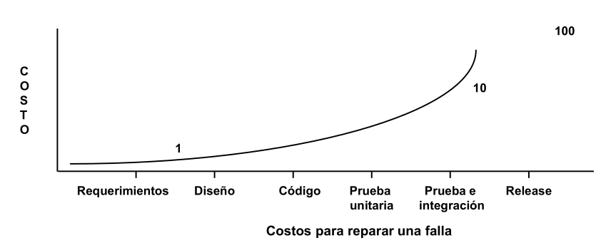
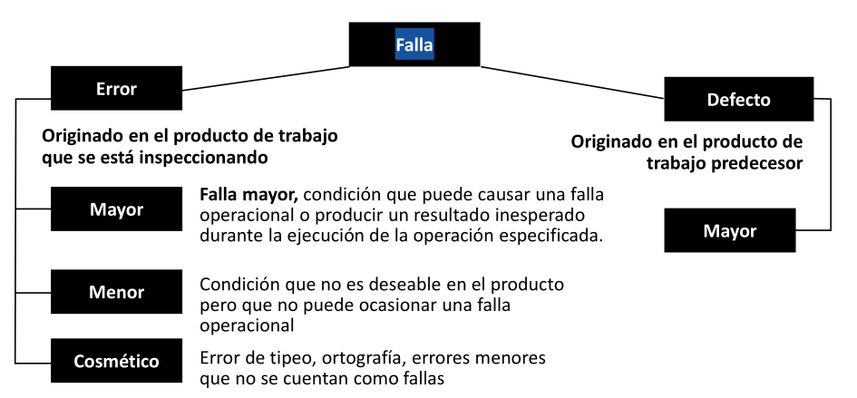
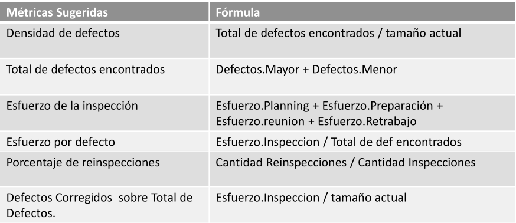
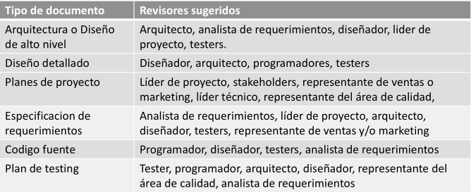

# 11 — Revisiones Técnicas (Peer Review)

> Págs. 225-233 del apunte. Cubre verificación y validación, walkthrough, inspecciones formales (Fagan), roles y etapas.

## Verificación y Validación

> Es un **proceso de ciclo de vida completo**. Inicia con las revisiones de los requerimientos y continúa con las revisiones del diseño, inspecciones del código, hasta la prueba.

### Conceptos clave

| Concepto | Significado |
|---|---|
| **Validación** | ¿Estamos construyendo el **producto correcto**? |
| **Verificación** | ¿Estamos construyendo el producto **correctamente**? |
| **Falla** | Error en un producto de trabajo. |
| **Producto de trabajo** | Salida de cualquier actividad del ciclo de vida del desarrollo. |

> **Acordate**: si el error se detecta en la misma etapa en que se origina, es un **error**; si se detecta en una etapa posterior, es un **defecto**.

### ¿Por qué es importante planificarlo?

- Es un proceso **caro**.
- Se debe **comenzar en etapas tempranas**.
- En la etapa de requerimientos **no se puede hacer testing** (no hay código). Lo que se hace es **revisiones técnicas**, que son una forma de hacer verificación y validación.

> Cuanto más tarde se detecta una falla, **más cuesta arreglarla**. Pasamos de costo 1 (en requerimientos) a 10 (en prueba e integración) hasta 100 (en release).

---

## Clasificación de Fallas

| Tipo | Origen | Detalle |
|---|---|---|
| **Falla** | — | Término genérico. |
| **Error** | Originado en el producto de trabajo que se está inspeccionando. | Se detecta en la misma etapa. |
| **Defecto** | Originado en el **producto de trabajo predecesor**. | Se traslada a etapas posteriores. |

### Severidad de la falla

- **Mayor**: condición que puede causar una falla operacional o producir un resultado inesperado.
- **Menor**: condición no deseable pero que **no ocasiona una falla operacional**.
- **Cosmético**: errores de tipeo, ortografía, que no se cuentan como fallas.

---

## Principios de las Revisiones Técnicas

- La **prevención** es mejor que la cura.
- **Evitar** es más efectivo que **eliminar**.
- La **retroalimentación** enseña efectivamente.
- **Priorizar** lo rentable.
- **Olvidarse de la perfección**, no se puede conseguir.
- **Enseñar a pescar**, en lugar de dar el pescado.

---

## Diferencia clave: Revisiones Técnicas vs. Testing

> Es normal confundirlas porque **ambas buscan errores y defectos**. La diferencia fundamental es **cómo y cuándo** los buscan.

Para entenderlo mejor, se pueden clasificar los enfoques de calidad en dos categorías:

| Enfoque | Tipo | ¿Ejecuta el código? |
|---|---|---|
| **Revisiones técnicas** | **Análisis estático** | **No** |
| **Testing / Pruebas** | **Análisis dinámico** | **Sí** |

### 1. Revisiones Técnicas (Análisis Estático)

> Son evaluaciones que se hacen **antes o sin necesidad de ejecutar el software**.

- **No se ejecuta el código**: es un proceso **estático** de validación y verificación. La palabra "estático" significa que no se ejecuta el código, sino que se analiza por partes o fragmentos de manera visual (leyéndolo).
- **Abarca cualquier artefacto**: no solo se revisa el código fuente. Se aplican a lo largo de todo el ciclo de vida para revisar **requerimientos, diseños, arquitectura, riesgos, estimaciones**, etc.
- **Enfoque preventivo y económico**: su objetivo es detectar problemas de manera temprana (por ejemplo, ambigüedades en los requerimientos o mala interacción entre componentes). Encontrar una falla en esta etapa sale **muchísimo más barato** que encontrarla cuando el sistema ya está en producción o en la etapa de pruebas.
- **Cultura de equipo**: durante estas revisiones (como las peer reviews o inspecciones) **nunca se pone en juicio al autor**, sino únicamente al artefacto.

### 2. Testing / Pruebas de Software (Análisis Dinámico)

> El testing entra en juego cuando **ya tenemos algo construido que se puede poner a funcionar**.

- **Se ejecuta el código**: es un proceso **dinámico**. Se somete al software (o a un componente del mismo) a condiciones específicas, ingresando datos y variables para ver cómo se comporta en la realidad.
- **Enfoque destructivo**: la visión más apropiada del testing es que es un proceso destructivo en el que se trata de encontrar defectos **asumiendo que ya están ahí**. Se debe tener una **actitud negativa** para demostrar que el comportamiento del programa es incorrecto.
- **Fases posteriores**: por lo general, se realiza sobre el código ya implementado, probando **unidades, la integración de las partes, o el sistema como un todo** funcionando.

### Resumen: estático vs. dinámico

| Aspecto | Revisiones Técnicas (Estático) | Testing (Dinámico) |
|---|---|---|
| **¿Ejecuta el código?** | No. | Sí. |
| **¿Cuándo se aplica?** | A lo largo de todo el ciclo de vida (incluso en requerimientos). | Cuando ya hay código para ejecutar. |
| **¿Qué artefactos revisa?** | Cualquier artefacto (requerimientos, diseño, código, planes). | El software funcionando. |
| **Enfoque** | Preventivo, económico. | Destructivo, actitud negativa. |
| **Actitud del revisor** | Mejorar el producto, no juzgar al autor. | Asumir que hay defectos y buscarlos. |
| **Costo de encontrar fallas** | Bajo (1x). | Alto (10x-100x). |

> **Ambas técnicas son complementarias**: las revisiones **limpian el camino temprano** para que el testing sea **mucho más eficiente después**. En etapas tempranas (como requerimientos) no se puede hacer testing, pero sí revisiones.

### Analogía rápida

> **Revisión técnica** = leer la receta antes de cocinar, para ver si tiene sentido.
> **Testing** = cocinar la receta y probar si quedó bien.

---

## Revisiones Técnicas (Peer Review)

> Actividad realizada por un **colega** cuyo propósito es mejorar la calidad del software mediante la **detección temprana de errores** en cualquier artefacto (código, requerimientos, diseño, arquitectura, riesgos, estimaciones, planes, etc.).

- Es un **proceso estático de validación y verificación**; **no corrige errores**.
  - **Estático** = no se ejecuta el código, se analiza por partes o fragmentos de manera visual.
- **Nunca se pone en juicio al autor**, solo el artefacto. Es necesario que se revelen todos los errores entre los miembros del equipo.
- Trascendió cualquier metodología; **ágil lo usa para transformar las auditorías en peer reviews**, evitando traer a alguien externo.

### Revisiones a lo largo del ciclo de vida

- **En requerimientos**: revisar que no haya ambigüedades.
- **En diseño**: revisar la interacción entre componentes.
- **En código**: revisar el cumplimiento de patrones de diseño (ej. un Jr que le pide review a un Sr sobre un patrón arquitectónico).

### Ventajas

- Pueden descubrirse **muchos errores**.
- Pueden inspeccionarse **versiones incompletas**.
- Pueden considerarse **otros atributos de calidad**.

### Desventajas

- Es **difícil introducir** las inspecciones formales.
- **Sobrecargan al inicio** los costos; el ahorro llega después de adquirir experiencia.
- Requieren **tiempo** y parecen **ralentizar** el proceso.

### Costos

- **Infraestructura**: entrenamiento, plantillas, guías de lectura, herramientas de soporte, programas de medición.
- **Operacionales**: tiempo individual y grupal, completar informes.
- **Adicionales**: preparar material, arreglar calendario, recolectar datos.

---

## Tipos de Revisiones

| Tipo | Proceso | Roles | Métricas |
|---|---|---|---|
| **Formales (inspecciones)** | Definido | Sí (autor, moderador, anotador, lector, inspector) | Sí (checklist, reporte) |
| **Informales (walkthrough)** | No definido | No formales | No |

---

## Walkthrough o Recorrido (Informal)

> No existe un proceso formal. Consiste en reuniones informales de colegas donde se debaten las correcciones a aplicar al producto. **No hay control del proceso**.

- Los participantes formulan preguntas y hacen comentarios sobre posibles errores, violación de estándares y otros problemas.

### Objetivos

- **Mínima sobrecarga**: que la revisión no entorpezca el trabajo.
- **Capacitación de los desarrolladores**: aprender sobre la marcha de los errores que se van cometiendo.
- **Rápido retorno**.

> Esta técnica **no obtiene métricas** para aprender ni deja registros. Sin embargo, es **una de las más elegidas en los enfoques ágiles**. Hay una junta de revisión entre colegas **después de cada iteración**, exponiendo conflictos y problemas de calidad.

---

## Inspecciones (Formales)

> Tienen un **proceso formal** y un conjunto de roles. Es necesaria la utilización de un **checklist** que ayuda a la memoria para saber qué cosas controlar. Se toman **métricas** y se realiza un **reporte** al final.

### Objetivos

- Detección de errores.
- Hacer tus proyectos más manejables.
- Verificar que el software alcanza ciertos requisitos.

Son procesos **time boxing** y exigen **alto esfuerzo intelectual**.

### Roles

| Rol | Responsabilidad |
|---|---|
| **Autor** | Creador o encargado del producto. Inicia el proceso eligiendo al moderador. Entrega el producto al moderador. |
| **Moderador** | Planifica y lidera la revisión. Trabaja con el autor para elegir los demás roles. Entrega el producto al inspector **2 días antes** de la reunión. Coordina la reunión (evita conductas inapropiadas). Hace seguimiento de los defectos. |
| **Anotador** | Registra los hallazgos de la inspección. Usualmente termina el reporte. |
| **Lector** | Lee el producto a inspeccionar. Necesario para que los participantes no se dispersen. |
| **Inspector** | Encargado de examinar el producto. **Todos pueden asumir este rol**. |

> **Importante**: cada integrante tiene una copia del producto para estar al tanto.

### Etapas del proceso de inspección (PPIC)

1. **Planificación**: el moderador, a pedido del autor, planifica la inspección definiendo lugar, tiempo y roles. La reunión **no debe superar las 2 horas** (alto esfuerzo intelectual).
2. **Preparación**: cada rol adquiere una copia del producto, lo lee y analiza para encontrar potenciales defectos. Permite que la reunión fluya más eficientemente.
3. **Inspección**: el equipo analiza para recolectar los potenciales defectos previos y descartar falsos positivos. El lector lee el producto y los inspectores comparten los defectos encontrados, registrados por el anotador. La reunión finaliza con una **conclusión** (se acepta o no el producto). Se realiza un **informe** detallando qué se revisó, por quién, qué se descubrió y qué se concluyó.
4. **Corrección**: finalizada la reunión, el **autor** realiza las correcciones de los defectos encontrados.

> Si los errores son muy graves, puede ser necesaria una **segunda inspección**.

---

## Métricas Sugeridas

| Métrica | Fórmula |
|---|---|
| Densidad de defectos | Total de defectos encontrados / tamaño actual |
| Total de defectos encontrados | Defectos.Mayor + Defectos.Menor |
| Esfuerzo de la inspección | Esfuerzo.Planning + Esfuerzo.Preparación + Esfuerzo.reunión + Esfuerzo.Retrabajo |
| Esfuerzo por defecto | Esfuerzo.Inspección / Total de defectos encontrados |
| Porcentaje de reinspecciones | Cantidad de reinspecciones / Cantidad de inspecciones |
| Defectos corregidos sobre total | Esfuerzo.Inspección / tamaño actual |

---

## Revisores Sugeridos por Tipo de Documento

| Tipo de documento | Revisores sugeridos |
|---|---|
| Arquitectura o diseño de alto nivel | Arquitecto, analista de requerimientos, diseñador, líder de proyecto, testers. |
| Diseño detallado | Diseñador, arquitecto, programadores, testers. |
| Planes de proyecto | Líder de proyecto, stakeholders, marketing, líder técnico, área de calidad. |
| Especificación de requerimientos | Analista de requerimientos, líder de proyecto, arquitecto, diseñador, testers, marketing. |
| Código fuente | Programador, diseñador, testers, analista de requerimientos. |
| Plan de testing | Tester, programador, arquitecto, diseñador, área de calidad, analista de requerimientos. |

---

## Chivo para el oral

1. **Verificación vs. validación**: verificación = construir correctamente; validación = construir el producto correcto. Es la pregunta clásica.
2. **Costo de las fallas**: a mayor avance del proyecto, mayor costo de arreglar. Mostrá el gráfico (1 → 10 → 100).
3. **Revisiones vs. testing (la pregunta clave)**: ambos buscan errores, pero las revisiones son **análisis estático** (no se ejecuta el código, sirve en cualquier etapa) y el testing es **análisis dinámico** (se ejecuta el código, solo en etapas tardías). Las revisiones son más baratas y preventivas.
4. **Definí peer review**: actividad de un colega para detectar errores temprano, sobre cualquier artefacto. **No corrige**, solo detecta. **Estático** = no se ejecuta el código.
5. **Diferenciá walkthrough vs. inspección**: el primero es informal, sin roles, sin métricas; el segundo es formal, con roles definidos y checklist. Ágil prefiere walkthrough.
6. **Roles de la inspección**: autor, moderador, anotador, lector, inspector. Cada uno con su función clara.
7. **Etapas PPIC**: Planificación → Preparación → Inspección → Corrección. La reunión no dura más de 2 horas.
8. **Cerrá con la cultura**: "no se juzga al autor, se juzga el producto". Es clave para que la gente reporte errores sin miedo.

> **Si te preguntan "¿qué diferencia hay entre revisiones técnicas y testing?"** → Las dos buscan errores, pero las **revisiones son estáticas** (no se ejecuta el código, se lee/analiza el artefacto) y sirven en **cualquier etapa** (incluso requerimientos). El **testing es dinámico** (se ejecuta el software) y solo se puede hacer cuando hay código. Las revisiones son más **baratas y preventivas**; el testing es más **tardío y costoso** pero necesario. Son **complementarias**.

> **Si te preguntan "¿qué es estático?"** → no se ejecuta el producto; se analiza el código, diseño o documentación de manera visual o por fragmentos. Por eso sirve en etapas tempranas, antes de tener software funcional.
