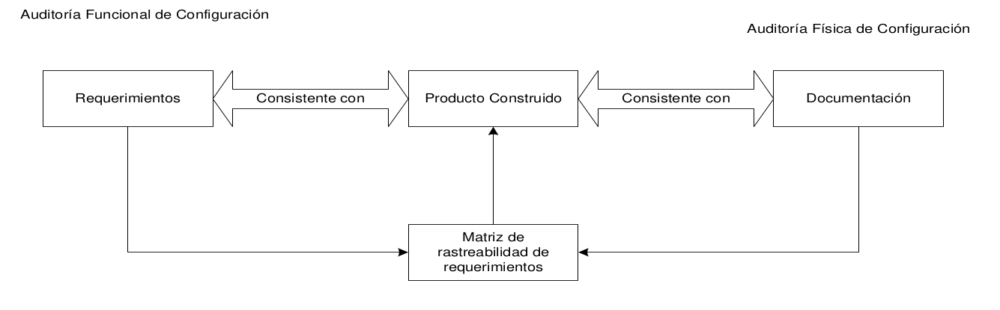
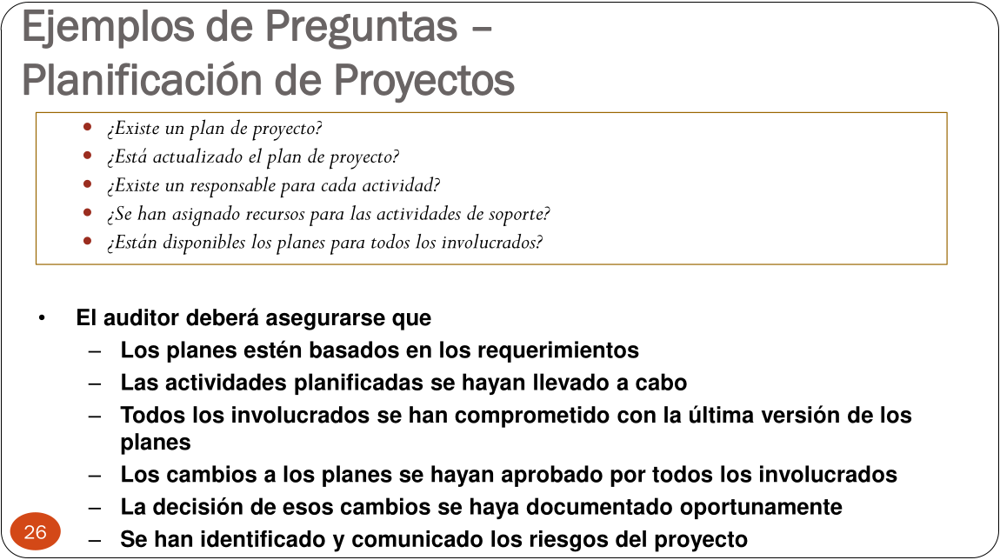

# 12 — Auditorías de Software

> Págs. 233-240 del apunte. Cubre el concepto, los tipos (PCA, FCA, de Proyecto), el proceso, las técnicas y las métricas.

## Concepto

> Las auditorías son **evaluaciones independientes** (realizadas por un grupo de personas **ajenas al equipo** de trabajo) de los productos o procesos de software, para asegurar el cumplimiento con estándares, lineamientos, especificaciones y procedimientos, basada en un **criterio objetivo**.

> A diferencia de las revisiones técnicas, las auditorías buscan la **máxima objetividad**, lograda cuando la evaluación la realiza alguien que **no pertenece al proyecto**.

Son un instrumento para el **Aseguramiento de la Calidad en el Software**.

> Las auditorías se pueden realizar tanto a nivel de **producto** como de **proyecto** (revisiones técnicas también).

---

## Tipos de Auditorías

### 1. Auditoría Física de Configuración (PCA)

- Asegura que lo indicado para cada **ítem de configuración** (IC) en la **línea base** se haya alcanzado según el plan de configuración, contra lo que tengo en el repositorio.
- Con respecto al código, se compara al mismo con la **documentación de soporte**.
- **Nivel general**: se compara el código con la documentación de soporte y se verifica que sea consistente.
- **Verificación**: asegura que el producto cumple con los objetivos preestablecidos definidos en la documentación de líneas base. Todas las funciones son llevadas a cabo con éxito y los test cases tengan status "ok" o consten como "problemas reportados" en la nota de release.

### 2. Auditoría Funcional de Configuración (FCA)

> Evaluación independiente de los productos de software, controlando que la **funcionalidad y performance reales** de cada IC sean consistentes con la **especificación de requerimientos**.

- **Valida** que el producto a construir sea consistente con los requerimientos identificados en la ERS.
- Se usa una **matriz de rastreabilidad** para encontrar dónde se implementa cada requerimiento.
- **Validación**: el problema es resuelto de manera apropiada de manera que el usuario obtenga el producto correcto.

> La **FCA** valida que el producto construido cumple los **requerimientos** (usando la matriz de rastreabilidad). La **PCA** valida que el producto construido es consistente con la **documentación** (código vs. docs).

### 3. Auditorías de Proyecto

- **Valida el cumplimiento del proceso de desarrollo**. Verifica que el proyecto se ha ejecutado con el proceso que se dijo que se iba a ejecutar.
- ¿Dónde está definido qué proceso voy a usar? → En el **plan del proyecto** (o en una **wiki / metodología ágil** si el equipo trabaja con Scrum, Kanban, etc.).
- Se llevan a cabo de acuerdo al **PACS** (Plan de Aseguramiento de Calidad de Software).
- El PACS debería indicar quién es el responsable de realizarlas.
- Las inspecciones de software y las revisiones de la documentación de diseño y prueba deberían incluirse en esta auditoría.
- El objetivo es **verificar objetivamente la consistencia del producto** a medida que evoluciona a lo largo del proceso de desarrollo.

> **Punto clave**: si el equipo documentó que va a hacer *Daily Meetings* y Retrospectivas, la auditoría de proyecto verifica que efectivamente las hagan. No audita contra un proceso "tradicional" rígido, sino contra **el proceso que el propio equipo se comprometió a seguir**.

> Esta auditoría es la que **une verificación y validación**: verifica que se hizo lo planeado (proceso) y valida que el producto sea el correcto.

#### Ejemplo: proyecto con metodología tradicional (waterfall o modelo en V)

Se auditan los **roles**:
- ¿Quién es el líder del proyecto?
- ¿El líder hace lo que tiene que hacer?
- ¿Cuáles son los roles definidos?

Se audita la **documentación**:
- Requerimientos → ERS.
- Diseño → SDD (Software Design Document).
- ¿Cada requisito de la ERS tiene **trazabilidad** hacia el diseño, código y pruebas?

#### Ejemplo: proyecto con metodología ágil (Scrum)

Se audita el cumplimiento de las **prácticas ágiles** comprometidas:
- ¿Se hacen las *Dailies* todos los días?
- ¿Hay *Sprint Review* y *Retrospectiva* al final de cada sprint?
- ¿El *Product Backlog* está actualizado y priorizado?
- ¿El equipo tiene un *Definition of Done*?

---

## Roles de la Auditoría

### Gerente de SQA
- Prepara el plan de auditorías.
- Calcula el costo.
- Asigna recursos.
- Es responsable de **resolver las no-conformidades**.

### Auditor
- Acuerda la fecha de la auditoría.
- Comunica el **alcance**.
- Recolecta y analiza la **evidencia objetiva** relevante y suficiente para tomar conclusiones.
- Realiza la auditoría.
- Prepara el reporte.
- Realiza el **seguimiento** de los planes de acción acordados con el auditado.

### Auditado
- Suele ser el **líder del proyecto**.
- Acuerda la fecha.
- Participa en la auditoría.
- **Proporciona evidencia** al auditor.
- Contesta al reporte.
- Propone el **plan de acción** para las deficiencias citadas.
- Comunica el cumplimiento del plan de acción.

---

## Proceso de Auditoría

> **Importante**: las auditorías **no son sorpresas**. Se planifican de forma conjunta entre el auditor y el auditado, y el **líder de proyecto** suele ser quien las convoca.

1. **Planificación y Preparación**: el auditado solicita la auditoría (generalmente el líder de proyecto), se coordina fecha, participantes y se proporciona documentación preliminar.
2. **Ejecución**: el auditor hace preguntas, el auditado responde, el auditor solicita evidencia. Se completa un **checklist** en paralelo. El auditor recolecta dos tipos de evidencia:
   - **Evidencia objetiva**: documentación, registros, artefactos (lo que está escrito).
   - **Evidencia subjetiva**: entrevistas a los miembros del equipo sobre qué hacen y cómo lo hacen (la práctica real).
3. **Generación de Reporte**: se analizan resultados y se genera un **reporte preliminar** (después se entrega el final en una fecha determinada).
4. **Seguimiento**: se analizan las desviaciones y el auditor genera un **plan de acción** para corregirlas.

---

## Técnicas Utilizadas en Auditorías

### Checklists

> El contenido general de un checklist incluye:

- Fecha de auditoría.
- Lista de auditados.
- Nombre del auditor.
- Nombre del proyecto.
- Fase actual del proyecto (si aplica).
- Objetivo y alcance de la auditoría.
- Lista de preguntas.

### Muestreo

> Consiste en seleccionar una **muestra representativa** de los productos y/o procesos a auditar.

### Revisión de registros

Análisis de los registros documentales del proyecto.

### Herramientas automatizadas

Software que facilita la auditoría (análisis estático, métricas, etc.).

---

## Análisis y Reporte de Resultados

### Contenido del reporte

- Identificación de la auditoría.
- Fecha de la auditoría.
- Auditor.
- Auditados.
- Nombre del proyecto auditado.
- Fase actual del proyecto.
- Lista de resultados.
- Comentarios.
- **Solicitud de planes de acción**.

### Tipos de resultados

| Resultado | Significado | Acción |
|---|---|---|
| **Buenas prácticas** | Práctica/procedimiento/instrucción que se ha desarrollado **mucho mejor** de lo esperado. | Reservar para cuando el auditado: (1) estableció un sistema efectivo, (2) desarrolló alto grado de conocimiento y cooperación interna, (3) adoptó una práctica superior a cualquier otra. |
| **Desviaciones** | Requieren **plan de acción** por parte del auditado. | Cualquier disconformidad del producto respecto de sus requerimientos, falta de control para satisfacerlos, o desviación al proceso definido que cause incertidumbre sobre la calidad. |
| **Observaciones** | Condiciones que **deberían mejorarse** pero **no requieren plan de acción**. | Opinión sobre condición incumplida, práctica a mejorar, condición que puede devenir en desviación futura. |

#### Ejemplo: los tres dados (para entender Observaciones)

> La profesora usó este ejemplo en clase: si un equipo documentó que para estimar "**tiran tres dados**" y el auditor verifica que efectivamente lo hacen, **no es una desviación** (porque cumplen su propio proceso documentado), pero **sí es una observación** de riesgo porque la técnica es poco seria o inefectiva.

La clave es:

- **No es lo que el auditor haría**, sino **lo que el equipo se comprometió a hacer**.
- Si cumplen lo que documentaron, no hay desviación.
- Pero el auditor puede marcarlo como **observación** si considera que la práctica puede devenir en problema.

#### Consejo para el reporte

> **Siempre empezar el informe por las buenas noticias** (buenas prácticas) para preparar al equipo anímicamente antes de tratar las desviaciones. Esto baja la defensividad y abre el diálogo.

### Ejemplos de preguntas para auditoría de planificación

- ¿Existe un plan de proyecto?
- ¿Está actualizado?
- ¿Existe un responsable para cada actividad?
- ¿Se han asignado recursos para las actividades de soporte?
- ¿Están disponibles los planes para todos los involucrados?

El auditor debe asegurarse de que:
- Los planes estén basados en los requerimientos.
- Las actividades planificadas se hayan llevado a cabo.
- Todos los involucrados estén comprometidos con la última versión de los planes.
- Los cambios a los planes se hayan aprobado por todos los involucrados.
- La decisión de esos cambios se haya documentado oportunamente.
- Se hayan identificado y comunicado los **riesgos** del proyecto.

---

## Métricas de Auditoría

> Cada organización deberá establecer las métricas más apropiadas. Algunos ejemplos:

- **Esfuerzo por auditoría**.
- **Cantidad de desviaciones**.
- **Duración de auditoría**.
- **Cantidad de desviaciones clasificadas por área de proceso de CMMI**.

---

## Diferencia clave: Revisiones vs. Auditorías

| Aspecto | Revisión técnica (peer review) | Auditoría |
|---|---|---|
| **Foco** | Detectar **errores** (en artefactos) | Verificar **cumplimiento** (proceso/estándares) |
| **Independencia** | Baja (entre colegas) | **Alta** (debe ser alguien externo al proyecto) |
| **Quién** | Colegas del equipo | Personas **externas** al equipo |
| **Objetividad** | Alta | **Máxima** (la independencia es el valor central) |
| **Frecuencia** | Continua (diaria, por iteración) | Programada (periódica, **no es sorpresa**) |
| **Proceso** | Formal o informal | Siempre formal |
| **Rol del líder** | Participante activo / revisor | **Auditado** (principal responsable) |
| **Artefactos** | Cualquier artefacto | Productos, procesos, documentación |
| **Resultado** | Lista de hallazgos para corregir | Reporte formal con **no-conformidades** |
| **Métricas** | Recomendadas (en formales) | Siempre |
| **Cultura** | "No se juzga al autor" | Independiente y objetiva |

> En ágil se prefieren las **revisiones técnicas** para evitar traer auditores externos, que pueden chocar con la autoorganización del equipo. Pero si el equipo ágil decide auditarse, el auditor debe tener la **flexibilidad** de evaluar el cumplimiento de las prácticas ágiles (Dailies, Retrospectivas) y no forzar una burocracia tradicional innecesaria.

---

## Chivo para el oral

1. **Concepto**: evaluaciones **independientes** (personas ajenas al equipo) de productos o procesos, con criterio objetivo.
2. **Tres tipos**:
   - **PCA** (física): compara producto con documentación.
   - **FCA** (funcional): compara producto con requerimientos (matriz de rastreabilidad).
   - **De proyecto**: verifica cumplimiento del proceso definido en el plan (o en la metodología ágil del equipo).
3. **No son sorpresa**: las convoca el **líder de proyecto** y se planifican en conjunto con el auditor.
4. **Evidencia**: el auditor junta dos tipos: **objetiva** (docs, registros) y **subjetiva** (entrevistas al equipo sobre la práctica real).
5. **Roles**: gerente de SQA (planifica), auditor (evalúa), auditado (generalmente el líder del proyecto, proporciona evidencia).
6. **Proceso**: Planificación → Ejecución → Reporte → Seguimiento.
7. **Resultados**: buenas prácticas (elogio, van primero en el reporte), **desviaciones** (requieren plan de acción), observaciones (sugerencia, sin plan).
8. **Ejemplo de los tres dados**: si el equipo documentó que estima "tirando tres dados" y lo hace, **no es desviación** (cumplen su proceso), pero **sí es observación** (la técnica es riesgosa).
9. **Diferencia con peer review**: la auditoría es **externa e independiente**; la revisión es entre colegas. Ágil prefiere la segunda.
10. **Auditor en ágil**: debe ser **flexible** y evaluar el cumplimiento de las prácticas ágiles (Dailies, Retros), no forzar una burocracia tradicional.
11. **Cerrá con la idea**: la auditoría es el instrumento de **máxima objetividad** porque la realiza alguien sin compromiso con el proyecto. Es la que **une verificación y validación**.

> **Si te preguntan "¿qué es una no-conformidad?"** → una **desviación** que resulta en disconformidad del producto respecto de sus requerimientos, o falta de control para satisfacerlos. Requiere plan de acción.

> **Si te preguntan "¿la auditoría de proyecto qué une?"** → une **verificación** (¿se hizo lo que se planeó?) con **validación** (¿es el producto correcto?). Por eso es clave: garantiza que el proceso y el producto van de la mano.
